# バックエンド設計ドキュメント (UML)

本ドキュメントは go_trumpcards バックエンドシステムの設計をMermaid記法で可視化したものです。

## 目次

- [1. クラス図](#1-クラス図)
  - [1.1 コアドメイン (カード・プレイヤー)](#11-コアドメイン-カードプレイヤー)
  - [1.2 ゲームドメイン (全31ゲーム)](#12-ゲームドメイン-全31ゲーム)
  - [1.3 ユースケース層 (Interactor・Presenter)](#13-ユースケース層-interactorpresenter)
  - [1.4 アダプタ層 (Controller・Presenter実装)](#14-アダプタ層-controllerpresenter実装)
  - [1.5 インフラストラクチャ層](#15-インフラストラクチャ層)
- [2. シーケンス図](#2-シーケンス図)
  - [2.1 CUIゲーム実行フロー](#21-cuiゲーム実行フロー)
  - [2.2 Web APIゲーム実行フロー](#22-web-apiゲーム実行フロー)
  - [2.3 セッション管理フロー](#23-セッション管理フロー)
  - [2.4 VideoPoker ベット・ホールドフロー](#24-videopoker-ベットホールドフロー)
  - [2.5 ThreeCard ベット・プレイフロー](#25-threecard-ベットプレイフロー)
  - [2.6 OhHell ビッド・トリックフロー](#26-ohhell-ビッドトリックフロー)
  - [2.7 Bridge オークション・トリックフロー](#27-bridge-オークショントリックフロー)
  - [2.8 Pineapple ディスカードフロー](#28-pineapple-ディスカードフロー)
- [3. ステートマシン図](#3-ステートマシン図)
  - [3.1 BlackJack フェーズ遷移](#31-blackjack-フェーズ遷移)
  - [3.2 Poker フェーズ遷移](#32-poker-フェーズ遷移)
  - [3.3 Texas Hold'em フェーズ遷移](#33-texas-holdem-フェーズ遷移)
  - [3.4 Hearts フェーズ遷移](#34-hearts-フェーズ遷移)
  - [3.5 Spades フェーズ遷移](#35-spades-フェーズ遷移)
  - [3.6 Doubt フェーズ遷移](#36-doubt-フェーズ遷移)
  - [3.7 Memory フェーズ遷移](#37-memory-フェーズ遷移)
  - [3.8 Klondike / FreeCell / Spider / Pyramid / TriPeaks フェーズ遷移](#38-klondike--freecell--spider--pyramid--tripeaks-フェーズ遷移)
  - [3.9 CrazyEights フェーズ遷移](#39-crazyeights-フェーズ遷移)
  - [3.10 GinRummy フェーズ遷移](#310-ginrummy-フェーズ遷移)
  - [3.11 Baccarat フェーズ遷移](#311-baccarat-フェーズ遷移)
  - [3.12 Napoleon フェーズ遷移](#312-napoleon-フェーズ遷移)
  - [3.13 IndianPoker フェーズ遷移](#313-indianpoker-フェーズ遷移)
  - [3.14 VideoPoker フェーズ遷移](#314-videopoker-フェーズ遷移)
  - [3.15 Euchre フェーズ遷移](#315-euchre-フェーズ遷移)
  - [3.16 Cribbage フェーズ遷移](#316-cribbage-フェーズ遷移)
  - [3.17 ShortDeck フェーズ遷移](#317-shortdeck-フェーズ遷移)
  - [3.18 ThreeCard フェーズ遷移](#318-threecard-フェーズ遷移)
  - [3.19 OhHell フェーズ遷移](#319-ohhell-フェーズ遷移)
  - [3.20 Bridge フェーズ遷移](#320-bridge-フェーズ遷移)
  - [3.21 Pineapple フェーズ遷移](#321-pineapple-フェーズ遷移)

---

## 1. クラス図

### 1.1 コアドメイン (カード・プレイヤー)

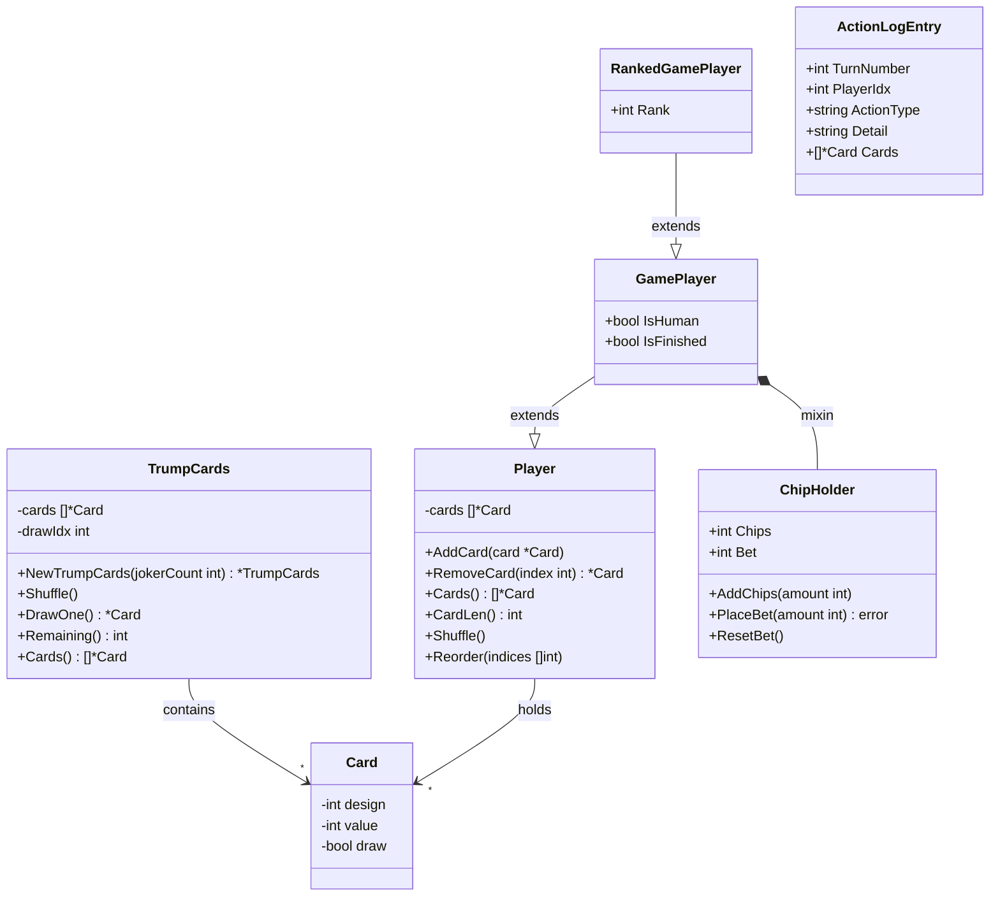
```mermaid
classDiagram
    class Card {
        -int design
        -int value
        -bool draw
    }

    class TrumpCards {
        -cards []*Card
        -drawIdx int
        +NewTrumpCards(jokerCount int) *TrumpCards
        +Shuffle()
        +DrawOne() *Card
        +Remaining() int
        +Cards() []*Card
    }

    class Player {
        -cards []*Card
        +AddCard(card *Card)
        +RemoveCard(index int) *Card
        +Cards() []*Card
        +CardLen() int
        +Shuffle()
        +Reorder(indices []int)
    }

    class GamePlayer {
        +bool IsHuman
        +bool IsFinished
    }

    class RankedGamePlayer {
        +int Rank
    }

    class ChipHolder {
        +int Chips
        +int Bet
        +AddChips(amount int)
        +PlaceBet(amount int) error
        +ResetBet()
    }

    class ActionLogEntry {
        +int TurnNumber
        +int PlayerIdx
        +string ActionType
        +string Detail
        +[]*Card Cards
    }

    TrumpCards --> "*" Card : contains
    Player --> "*" Card : holds
    GamePlayer --|> Player : extends
    RankedGamePlayer --|> GamePlayer : extends
    GamePlayer *-- ChipHolder : mixin
```

### 1.2 ゲームドメイン (全31ゲーム)

#### ベッティング系ゲーム

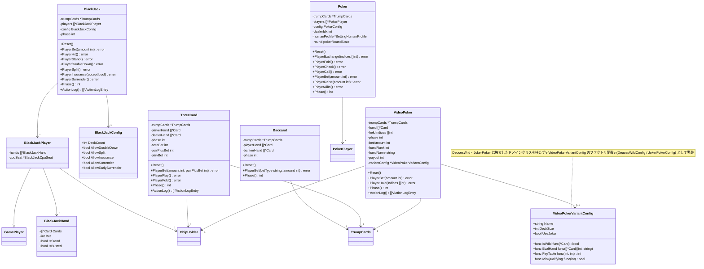
```mermaid
classDiagram
    class BlackJack {
        -trumpCards *TrumpCards
        -players []*BlackJackPlayer
        -config BlackJackConfig
        -phase int
        +Reset()
        +PlayerBet(amount int) error
        +PlayerHit() error
        +PlayerStand() error
        +PlayerDoubleDown() error
        +PlayerSplit() error
        +PlayerInsurance(accept bool) error
        +PlayerSurrender() error
        +Phase() int
        +ActionLog() []*ActionLogEntry
    }

    class BlackJackPlayer {
        -hands []*BlackJackHand
        -cpuSeat *BlackJackCpuSeat
    }

    class BlackJackHand {
        +[]*Card Cards
        +int Bet
        +bool IsStand
        +bool IsBusted
    }

    class BlackJackConfig {
        +int DeckCount
        +bool AllowDoubleDown
        +bool AllowSplit
        +bool AllowInsurance
        +bool AllowSurrender
        +bool AllowEarlySurrender
    }

    class Poker {
        -trumpCards *TrumpCards
        -players []*PokerPlayer
        -config PokerConfig
        -dealerIdx int
        -humanProfile *BettingHumanProfile
        -round pokerRoundState
        +Reset()
        +PlayerExchange(indices []int) error
        +PlayerFold() error
        +PlayerCheck() error
        +PlayerCall() error
        +PlayerBet(amount int) error
        +PlayerRaise(amount int) error
        +PlayerAllIn() error
        +Phase() int
    }

    class Baccarat {
        -trumpCards *TrumpCards
        -playerHand []*Card
        -bankerHand []*Card
        -phase int
        +Reset()
        +PlayerBet(betType string, amount int) error
        +Phase() int
    }

    class VideoPoker {
        -trumpCards *TrumpCards
        -hand []*Card
        -heldIndices []int
        -phase int
        -betAmount int
        -handRank int
        -handName string
        -payout int
        -variantConfig *VideoPokerVariantConfig
        +Reset()
        +PlayerBet(amount int) error
        +PlayerHold(indices []int) error
        +Phase() int
        +ActionLog() []*ActionLogEntry
    }

    class VideoPokerVariantConfig {
        +string Name
        +int DeckSize
        +bool UseJoker
        +func IsWild func(*Card) bool
        +func EvalHand func([]*Card) (int, string)
        +func PayTable func(int, int) int
        +func MinQualifying func(int) bool
    }

    BlackJack --> "*" BlackJackPlayer
    BlackJack --> "1" BlackJackConfig
    BlackJackPlayer --|> GamePlayer
    BlackJackPlayer --> "*" BlackJackHand
    BlackJackPlayer --> "1" ChipHolder
    Poker --> "*" PokerPlayer
    class ThreeCard {
        -trumpCards *TrumpCards
        -playerHand []*Card
        -dealerHand []*Card
        -phase int
        -anteBet int
        -pairPlusBet int
        -playBet int
        +Reset()
        +PlayerBet(amount int, pairPlusBet int) error
        +PlayerPlay() error
        +PlayerFold() error
        +Phase() int
        +ActionLog() []*ActionLogEntry
    }

    Baccarat --> "1" TrumpCards
    ThreeCard --> "1" TrumpCards
    ThreeCard --> "1" ChipHolder
    VideoPoker --> "1" TrumpCards
    VideoPoker --> "1" ChipHolder
    VideoPoker --> "0..1" VideoPokerVariantConfig

    note for VideoPokerVariantConfig "DeucesWild・JokerPoker は独立したドメインクラスを持たず\nVideoPokerVariantConfig のファクトリ関数\n(DeucesWildConfig / JokerPokerConfig) として実装"
```

#### トリックテイキング系ゲーム

```mermaid
classDiagram
    class Hearts {
        -trumpCards *TrumpCards
        -players []*HeartsPlayer
        -config HeartsConfig
        -phase HeartsPhase
        -trickCards []*HeartsTrickCard
        +Reset()
        +PassCards(indices []int) error
        +PlayCard(index int) error
        +NextTrick() error
        +NextRound() error
        +Hint() *HeartsHint
        +Phase() HeartsPhase
    }

    class Spades {
        -trumpCards *TrumpCards
        -players []*SpadesPlayer
        -config SpadesConfig
        -phase SpadesPhase
        -trickCards []*SpadesTrickCard
        +Reset()
        +Bid(amount int) error
        +PlayCard(index int) error
        +NextTrick() error
        +NextRound() error
        +Hint() *SpadesHint
        +Phase() SpadesPhase
    }

    class HeartsTrickCard {
        +int PlayerIdx
        +*Card Card
    }

    class SpadesTrickCard {
        +int PlayerIdx
        +*Card Card
    }

    class Napoleon {
        -trumpCards *TrumpCards
        -players []*NapoleonPlayer
        -config NapoleonConfig
        -round napoleonRoundState
        +Reset()
        +Bid(amount int) error
        +DeclareTrump(suit int) error
        +Exchange(indices []int) error
        +PlayCard(index int) error
        +NextTrick() error
        +NextRound() error
        +Hint() *NapoleonHint
        +Phase() NapoleonPhase
    }

    class NapoleonTrickCard {
        +int PlayerIdx
        +*Card Card
    }

    class Euchre {
        -trumpCards *TrumpCards
        -players []*EuchrePlayer
        -config EuchreConfig
        -phase EuchrePhase
        -trickCards []*EuchreTrickCard
        -turnedUpCard *Card
        -trumpSuit int
        -dealerIdx int
        +Reset()
        +OrderUp(alone bool) error
        +Pass() error
        +CallTrump(suit int, alone bool) error
        +Discard(index int) error
        +PlayCard(index int) error
        +NextTrick() error
        +NextRound() error
        +Hint() *EuchreHint
        +Phase() EuchrePhase
    }

    class EuchreTrickCard {
        +int PlayerIdx
        +*Card Card
    }

    class OhHell {
        -trumpCards *TrumpCards
        -players []*OhHellPlayer
        -config OhHellConfig
        -phase OhHellPhase
        -trickCards []*OhHellTrickCard
        -trumpCard *Card
        -trumpSuit int
        -handSize int
        +Reset()
        +PlayerBid(bid int) error
        +PlayerPlay(cardIndex int) error
        +NextTrick()
        +NextRound()
        +ScoreRound()
        +GetHint() *OhHellHint
        +GetPhase() OhHellPhase
    }

    class OhHellTrickCard {
        +int PlayerIdx
        +*Card Card
    }

    class Bridge {
        -trumpCards *TrumpCards
        -players []*BridgePlayer
        -config BridgeConfig
        -phase BridgePhase
        -trickCards []*BridgeTrickCard
        -trumpSuit int
        -contractLevel int
        -contractSuit int
        -declarerIdx int
        -dummyIdx int
        -vulnerability [2]bool
        +Reset()
        +Bid(bidType int, level int, suit int) error
        +PlayCard(index int) error
        +NextTrick() error
        +NextRound() error
        +Hint() *BridgeHint
        +Phase() BridgePhase
    }

    class BridgeTrickCard {
        +int PlayerIdx
        +*Card Card
    }

    Hearts --> "4" HeartsPlayer
    Hearts --> "*" HeartsTrickCard
    Spades --> "4" SpadesPlayer
    Spades --> "*" SpadesTrickCard
    Napoleon --> "4" NapoleonPlayer
    Napoleon --> "*" NapoleonTrickCard
    Euchre --> "4" EuchrePlayer
    Euchre --> "*" EuchreTrickCard
    OhHell --> "4" OhHellPlayer
    OhHell --> "*" OhHellTrickCard
    Bridge --> "4" BridgePlayer
    Bridge --> "*" BridgeTrickCard
    HeartsPlayer --|> GamePlayer
    SpadesPlayer --|> GamePlayer
    NapoleonPlayer --|> GamePlayer
    EuchrePlayer --|> GamePlayer
    OhHellPlayer --|> GamePlayer
    BridgePlayer --|> GamePlayer
```

#### ホールデム系ゲーム

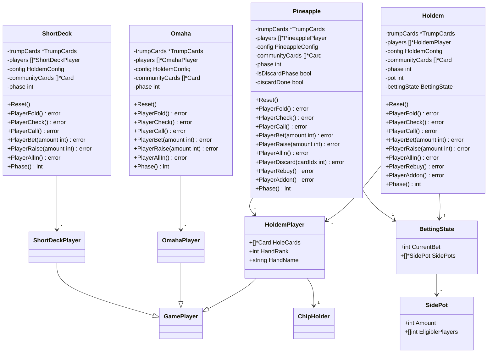
```mermaid
classDiagram
    class Holdem {
        -trumpCards *TrumpCards
        -players []*HoldemPlayer
        -config HoldemConfig
        -communityCards []*Card
        -phase int
        -pot int
        -bettingState BettingState
        +Reset()
        +PlayerFold() error
        +PlayerCheck() error
        +PlayerCall() error
        +PlayerBet(amount int) error
        +PlayerRaise(amount int) error
        +PlayerAllIn() error
        +PlayerRebuy() error
        +PlayerAddon() error
        +Phase() int
    }

    class Omaha {
        -trumpCards *TrumpCards
        -players []*OmahaPlayer
        -config HoldemConfig
        -communityCards []*Card
        -phase int
        +Reset()
        +PlayerFold() error
        +PlayerCheck() error
        +PlayerCall() error
        +PlayerBet(amount int) error
        +PlayerRaise(amount int) error
        +PlayerAllIn() error
        +Phase() int
    }

    class HoldemPlayer {
        +[]*Card HoleCards
        +int HandRank
        +string HandName
    }

    class BettingState {
        +int CurrentBet
        +[]*SidePot SidePots
    }

    class SidePot {
        +int Amount
        +[]int EligiblePlayers
    }

    Holdem --> "*" HoldemPlayer
    Holdem --> "1" BettingState
    BettingState --> "*" SidePot
    HoldemPlayer --|> GamePlayer
    HoldemPlayer --> "1" ChipHolder
    Omaha --> "*" OmahaPlayer
    OmahaPlayer --|> GamePlayer

    class ShortDeck {
        -trumpCards *TrumpCards
        -players []*ShortDeckPlayer
        -config HoldemConfig
        -communityCards []*Card
        -phase int
        +Reset()
        +PlayerFold() error
        +PlayerCheck() error
        +PlayerCall() error
        +PlayerBet(amount int) error
        +PlayerRaise(amount int) error
        +PlayerAllIn() error
        +Phase() int
    }

    ShortDeck --> "*" ShortDeckPlayer
    ShortDeckPlayer --|> GamePlayer

    class Pineapple {
        -trumpCards *TrumpCards
        -players []*PineapplePlayer
        -config PineappleConfig
        -communityCards []*Card
        -phase int
        -isDiscardPhase bool
        -discardDone bool
        +Reset()
        +PlayerFold() error
        +PlayerCheck() error
        +PlayerCall() error
        +PlayerBet(amount int) error
        +PlayerRaise(amount int) error
        +PlayerAllIn() error
        +PlayerDiscard(cardIdx int) error
        +PlayerRebuy() error
        +PlayerAddon() error
        +Phase() int
    }

    Pineapple --> "*" HoldemPlayer
    Pineapple --> "1" BettingState
```

#### インディアンポーカー

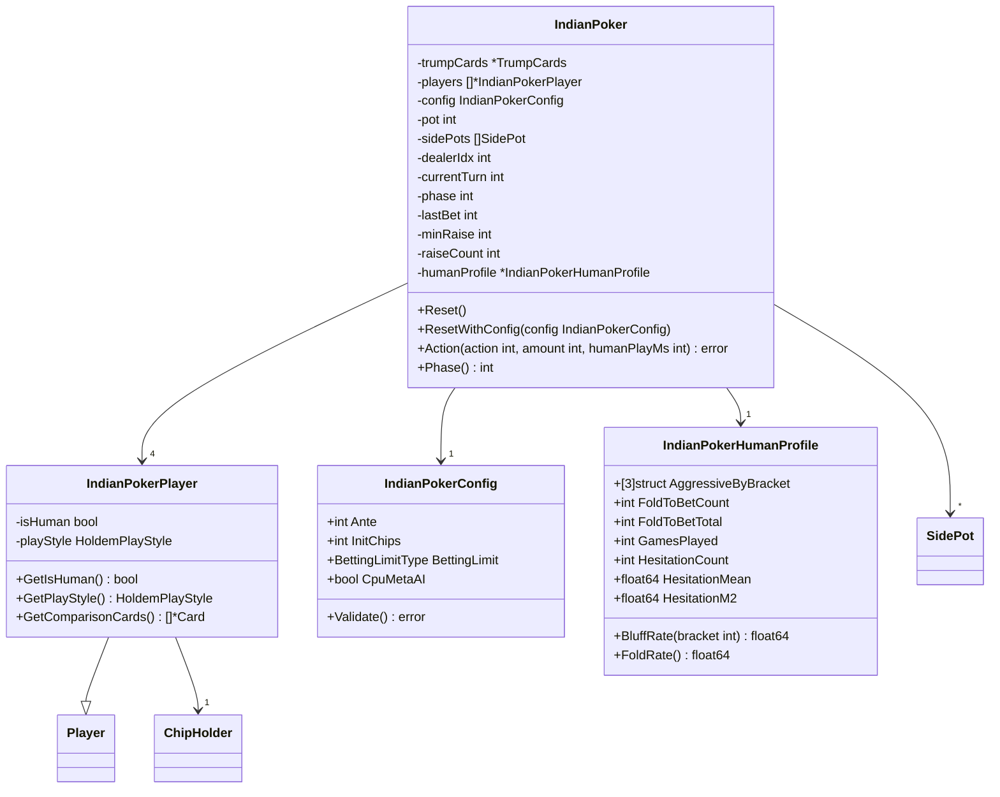
```mermaid
classDiagram
    class IndianPoker {
        -trumpCards *TrumpCards
        -players []*IndianPokerPlayer
        -config IndianPokerConfig
        -pot int
        -sidePots []SidePot
        -dealerIdx int
        -currentTurn int
        -phase int
        -lastBet int
        -minRaise int
        -raiseCount int
        -humanProfile *IndianPokerHumanProfile
        +Reset()
        +ResetWithConfig(config IndianPokerConfig)
        +Action(action int, amount int, humanPlayMs int) error
        +Phase() int
    }

    class IndianPokerPlayer {
        -isHuman bool
        -playStyle HoldemPlayStyle
        +GetIsHuman() bool
        +GetPlayStyle() HoldemPlayStyle
        +GetComparisonCards() []*Card
    }

    class IndianPokerConfig {
        +int Ante
        +int InitChips
        +BettingLimitType BettingLimit
        +bool CpuMetaAI
        +Validate() error
    }

    class IndianPokerHumanProfile {
        +[3]struct AggressiveByBracket
        +int FoldToBetCount
        +int FoldToBetTotal
        +int GamesPlayed
        +int HesitationCount
        +float64 HesitationMean
        +float64 HesitationM2
        +BluffRate(bracket int) float64
        +FoldRate() float64
    }

    IndianPoker --> "4" IndianPokerPlayer
    IndianPoker --> "1" IndianPokerConfig
    IndianPoker --> "*" SidePot
    IndianPoker --> "1" IndianPokerHumanProfile
    IndianPokerPlayer --|> Player
    IndianPokerPlayer --> "1" ChipHolder
```

#### 手札系ゲーム

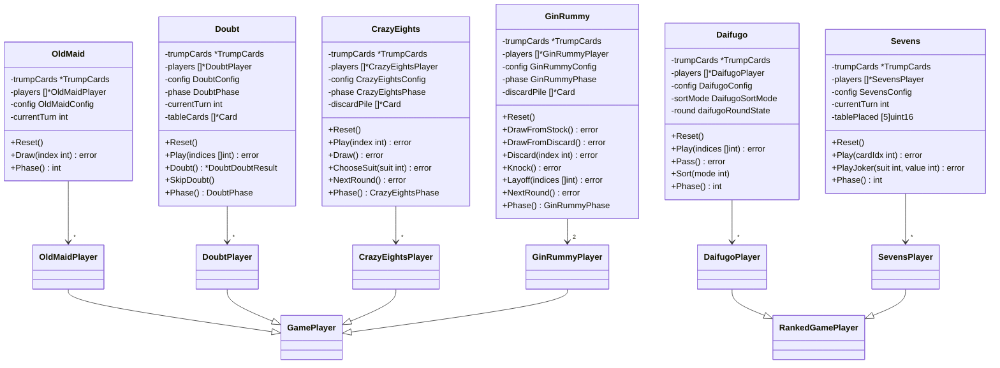
```mermaid
classDiagram
    class OldMaid {
        -trumpCards *TrumpCards
        -players []*OldMaidPlayer
        -config OldMaidConfig
        -currentTurn int
        +Reset()
        +Draw(index int) error
        +Phase() int
    }

    class Daifugo {
        -trumpCards *TrumpCards
        -players []*DaifugoPlayer
        -config DaifugoConfig
        -sortMode DaifugoSortMode
        -round daifugoRoundState
        +Reset()
        +Play(indices []int) error
        +Pass() error
        +Sort(mode int)
        +Phase() int
    }

    class Sevens {
        -trumpCards *TrumpCards
        -players []*SevensPlayer
        -config SevensConfig
        -currentTurn int
        -tablePlaced [5]uint16
        +Reset()
        +Play(cardIdx int) error
        +PlayJoker(suit int, value int) error
        +Phase() int
    }

    class Doubt {
        -trumpCards *TrumpCards
        -players []*DoubtPlayer
        -config DoubtConfig
        -phase DoubtPhase
        -currentTurn int
        -tableCards []*Card
        +Reset()
        +Play(indices []int) error
        +Doubt() *DoubtDoubtResult
        +SkipDoubt()
        +Phase() DoubtPhase
    }

    class CrazyEights {
        -trumpCards *TrumpCards
        -players []*CrazyEightsPlayer
        -config CrazyEightsConfig
        -phase CrazyEightsPhase
        -discardPile []*Card
        +Reset()
        +Play(index int) error
        +Draw() error
        +ChooseSuit(suit int) error
        +NextRound() error
        +Phase() CrazyEightsPhase
    }

    class GinRummy {
        -trumpCards *TrumpCards
        -players []*GinRummyPlayer
        -config GinRummyConfig
        -phase GinRummyPhase
        -discardPile []*Card
        +Reset()
        +DrawFromStock() error
        +DrawFromDiscard() error
        +Discard(index int) error
        +Knock() error
        +Layoff(indices []int) error
        +NextRound() error
        +Phase() GinRummyPhase
    }

    OldMaid --> "*" OldMaidPlayer
    Daifugo --> "*" DaifugoPlayer
    Sevens --> "*" SevensPlayer
    Doubt --> "*" DoubtPlayer
    CrazyEights --> "*" CrazyEightsPlayer
    GinRummy --> "2" GinRummyPlayer
    OldMaidPlayer --|> GamePlayer
    DaifugoPlayer --|> RankedGamePlayer
    SevensPlayer --|> RankedGamePlayer
    DoubtPlayer --|> GamePlayer
    CrazyEightsPlayer --|> GamePlayer
    GinRummyPlayer --|> GamePlayer
```

#### ソリティア系ゲーム

```mermaid
classDiagram
    class Klondike {
        -trumpCards *TrumpCards
        -tableau [7][]*KlondikeTableauCard
        -foundation [4][]*Card
        -stock []*Card
        -waste []*Card
        -config KlondikeConfig
        -phase KlondikePhase
        -history []*klondikeSnapshot
        +Reset()
        +Draw() error
        +Move(from string, fromCol int, fromIdx int, to string, toCol int) error
        +Hint() *KlondikeHint
        +Undo() error
        +Autocomplete() error
        +GiveUp()
        +Phase() KlondikePhase
    }

    class FreeCell {
        -trumpCards *TrumpCards
        -tableau [8][]*Card
        -foundation [4][]*Card
        -freeCells [4]*Card
        -phase FreeCellPhase
        -history []*freeCellSnapshot
        +Reset()
        +Move(from string, fromCol int, fromIdx int, to string, toCol int) error
        +Hint() *FreeCellHint
        +Undo() error
        +Autocomplete() error
        +GiveUp()
        +Phase() FreeCellPhase
    }

    class Spider {
        -trumpCards *TrumpCards
        -tableau [10][]*SpiderTableauCard
        -foundation [][]*Card
        -stock []*Card
        -config SpiderConfig
        -phase SpiderPhase
        -history []*spiderSnapshot
        +Reset()
        +Deal() error
        +Move(fromCol int, fromIdx int, toCol int) error
        +Hint() *SpiderHint
        +Undo() error
        +Autocomplete() error
        +GiveUp()
        +Phase() SpiderPhase
    }

    class Pyramid {
        -trumpCards *TrumpCards
        -pyramid [7][]*PyramidCard
        -stock []*Card
        -waste []*Card
        -phase PyramidPhase
        -history []*pyramidSnapshot
        +Reset()
        +Draw() error
        +RemovePair(row1 int, col1 int, row2 int, col2 int) error
        +RemoveKing(row int, col int) error
        +RemoveWithWaste(row int, col int) error
        +RemoveWasteKing() error
        +GetHint() *PyramidHint
        +Undo() error
        +GiveUp()
        +Phase() PyramidPhase
    }

    class TriPeaks {
        -trumpCards *TrumpCards
        -tableau [4][]*TriPeaksCard
        -stock []*Card
        -waste []*Card
        -phase TriPeaksPhase
        -history []*tripeaksSnapshot
        +Reset()
        +Draw() error
        +Remove(row int, col int) error
        +GetHint() *TriPeaksHint
        +Undo() error
        +GiveUp()
        +Phase() TriPeaksPhase
    }

    class Cribbage {
        -trumpCards *TrumpCards
        -players []*CribbagePlayer
        -config CribbageConfig
        -phase CribbagePhase
        -crib []*Card
        -starter *Card
        -pegCount int
        -pegPlayedCards []*Card
        +Reset()
        +Discard(indices []int) error
        +Peg(cardIdx int) error
        +Go() error
        +ShowNext() error
        +NextRound() error
        +Phase() CribbagePhase
    }

    class Memory {
        -trumpCards *TrumpCards
        -board []*MemoryBoardCard
        -players []*MemoryPlayer
        -config MemoryConfig
        -phase MemoryPhase
        +Reset()
        +Flip(position int) error
        +Next() error
        +Phase() MemoryPhase
    }

    class KlondikeTableauCard {
        +*Card Card
        +bool FaceUp
    }

    class SpiderTableauCard {
        +*Card Card
        +bool FaceUp
    }

    class PyramidCard {
        +*Card Card
        +bool Removed
    }

    class TriPeaksCard {
        +*Card Card
        +bool Removed
    }

    class MemoryBoardCard {
        +*Card Card
        +bool FaceUp
        +bool Matched
    }

    Klondike --> "*" KlondikeTableauCard
    FreeCell --> "*" Card
    Spider --> "*" SpiderTableauCard
    Pyramid --> "*" PyramidCard
    TriPeaks --> "*" TriPeaksCard
    Cribbage --> "*" CribbagePlayer
    Memory --> "*" MemoryBoardCard
    Memory --> "*" MemoryPlayer
    MemoryPlayer --|> GamePlayer
```

### 1.3 ユースケース層 (Interactor・Presenter)

```mermaid
classDiagram
    class GamePresenter~G~ {
        <<interface>>
        +Output(game G, lastErr error) string
        +ActionLogOutput(game G) string
    }

    class BlackJackInteractor {
        -game BlackJackGame
        -presenter BlackJackPresenter
        +Reset() string
        +Hit() string
        +Stand() string
        +Bet(amount int) string
        +DoubleDown() string
        +Split() string
        +Insurance(accept bool) string
        +Surrender() string
        +ActionLog() string
    }

    class PokerPresenter {
        <<interface>>
        +Output(game PokerGame, lastErr error) string
        +ActionLogOutput(game PokerGame) string
        +OddsOutput(game PokerGame) string
    }

    class HeartsPresenter {
        <<interface>>
        +Output(game HeartsGame, lastErr error) string
        +ActionLogOutput(game HeartsGame) string
        +HintOutput(game HeartsGame) string
    }

    class KlondikePresenter {
        <<interface>>
        +Output(game KlondikeGame, lastErr error) string
        +ActionLogOutput(game KlondikeGame) string
        +HintOutput(game KlondikeGame) string
    }

    BlackJackInteractor ..> GamePresenter : uses
    BlackJackInteractor ..> BlackJackGame : uses

    note for GamePresenter "各ゲームの Presenter は\nGamePresenter[G] の型エイリアス\nまたは拡張インターフェース"
```

**Interactor パターン (全30ゲーム共通)**

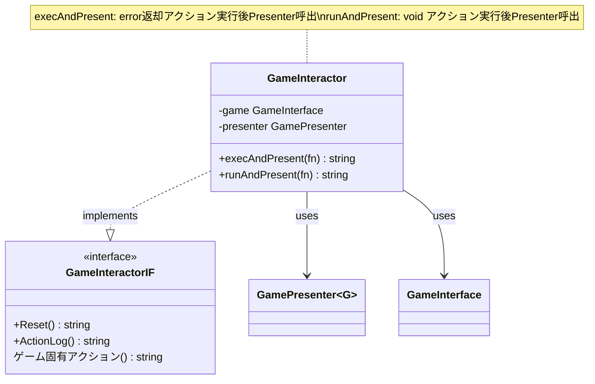
```mermaid
classDiagram
    class GameInteractorIF {
        <<interface>>
        +Reset() string
        +ActionLog() string
        ゲーム固有アクション() string
    }

    class GameInteractor {
        -game GameInterface
        -presenter GamePresenter
        +execAndPresent(fn) string
        +runAndPresent(fn) string
    }

    GameInteractor ..|> GameInteractorIF : implements
    GameInteractor --> GamePresenter~G~ : uses
    GameInteractor --> GameInterface : uses

    note for GameInteractor "execAndPresent: error返却アクション実行後Presenter呼出\nrunAndPresent: void アクション実行後Presenter呼出"
```

### 1.4 アダプタ層 (Controller・Presenter実装)

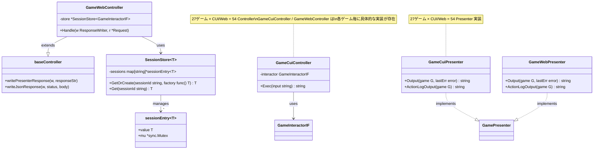
```mermaid
classDiagram
    class baseController {
        +writePresenterResponse(w, responseStr)
        +writeJsonResponse(w, status, body)
    }

    class SessionStore~T~ {
        -sessions map[string]*sessionEntry~T~
        +GetOrCreate(sessionId string, factory func() T) T
        +Get(sessionId string) T
    }

    class sessionEntry~T~ {
        +value T
        +mu *sync.Mutex
    }

    class GameCuiController {
        -interactor GameInteractorIF
        +Exec(input string) string
    }

    class GameWebController {
        -store *SessionStore~GameInteractorIF~
        +Handle(w ResponseWriter, r *Request)
    }

    class GameCuiPresenter {
        +Output(game G, lastErr error) string
        +ActionLogOutput(game G) string
    }

    class GameWebPresenter {
        +Output(game G, lastErr error) string
        +ActionLogOutput(game G) string
    }

    GameWebController --|> baseController : extends
    GameWebController --> SessionStore : uses
    SessionStore --> "*" sessionEntry : manages
    GameCuiController --> GameInteractorIF : uses
    GameCuiPresenter ..|> GamePresenter : implements
    GameWebPresenter ..|> GamePresenter : implements

    note for GameCuiController "27ゲーム × CUI/Web = 54 Controller\nGameCuiController / GameWebController は\n各ゲーム毎に具体的な実装が存在"
    note for GameCuiPresenter "27ゲーム × CUI/Web = 54 Presenter 実装"
```

### 1.5 インフラストラクチャ層

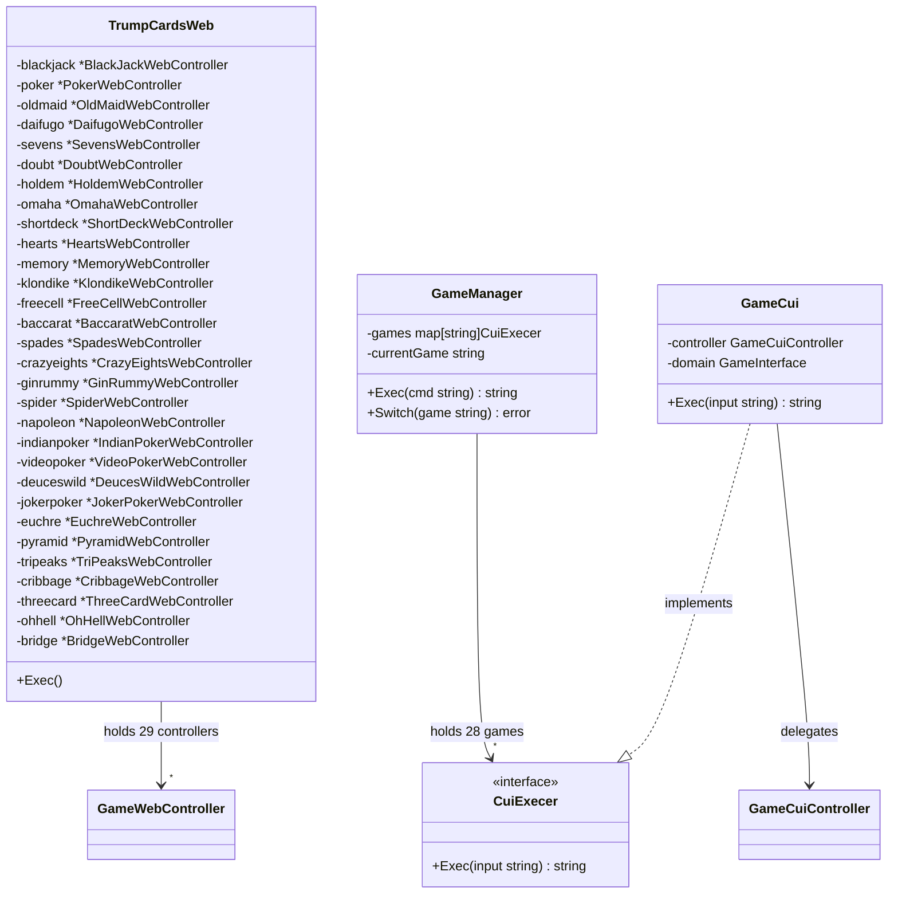
```mermaid
classDiagram
    class TrumpCardsWeb {
        -blackjack *BlackJackWebController
        -poker *PokerWebController
        -oldmaid *OldMaidWebController
        -daifugo *DaifugoWebController
        -sevens *SevensWebController
        -doubt *DoubtWebController
        -holdem *HoldemWebController
        -omaha *OmahaWebController
        -shortdeck *ShortDeckWebController
        -hearts *HeartsWebController
        -memory *MemoryWebController
        -klondike *KlondikeWebController
        -freecell *FreeCellWebController
        -baccarat *BaccaratWebController
        -spades *SpadesWebController
        -crazyeights *CrazyEightsWebController
        -ginrummy *GinRummyWebController
        -spider *SpiderWebController
        -napoleon *NapoleonWebController
        -indianpoker *IndianPokerWebController
        -videopoker *VideoPokerWebController
        -deuceswild *DeucesWildWebController
        -jokerpoker *JokerPokerWebController
        -euchre *EuchreWebController
        -pyramid *PyramidWebController
        -tripeaks *TriPeaksWebController
        -cribbage *CribbageWebController
        -threecard *ThreeCardWebController
        -ohhell *OhHellWebController
        -bridge *BridgeWebController
        +Exec()
    }

    class GameManager {
        -games map[string]CuiExecer
        -currentGame string
        +Exec(cmd string) string
        +Switch(game string) error
    }

    class CuiExecer {
        <<interface>>
        +Exec(input string) string
    }

    class GameCui {
        -controller GameCuiController
        -domain GameInterface
        +Exec(input string) string
    }

    TrumpCardsWeb --> "*" GameWebController : holds 29 controllers
    GameManager --> "*" CuiExecer : holds 28 games
    GameCui ..|> CuiExecer : implements
    GameCui --> GameCuiController : delegates
```

---

## 2. シーケンス図

### 2.1 CUIゲーム実行フロー

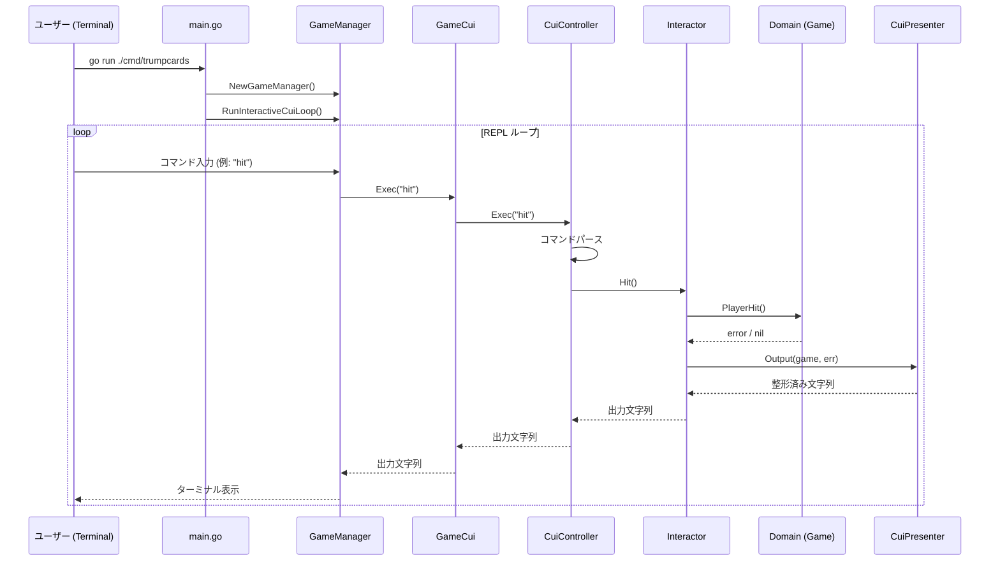
```mermaid
sequenceDiagram
    participant User as ユーザー (Terminal)
    participant Main as main.go
    participant GM as GameManager
    participant Cui as GameCui
    participant Ctrl as CuiController
    participant Interactor as Interactor
    participant Domain as Domain (Game)
    participant Pres as CuiPresenter

    User->>Main: go run ./cmd/trumpcards
    Main->>GM: NewGameManager()
    Main->>GM: RunInteractiveCuiLoop()

    loop REPL ループ
        User->>GM: コマンド入力 (例: "hit")
        GM->>Cui: Exec("hit")
        Cui->>Ctrl: Exec("hit")
        Ctrl->>Ctrl: コマンドパース
        Ctrl->>Interactor: Hit()
        Interactor->>Domain: PlayerHit()
        Domain-->>Interactor: error / nil
        Interactor->>Pres: Output(game, err)
        Pres-->>Interactor: 整形済み文字列
        Interactor-->>Ctrl: 出力文字列
        Ctrl-->>Cui: 出力文字列
        Cui-->>GM: 出力文字列
        GM-->>User: ターミナル表示
    end
```

### 2.2 Web APIゲーム実行フロー

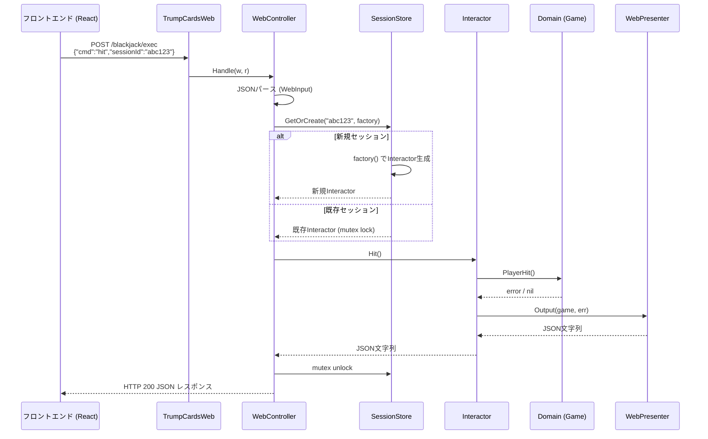
```mermaid
sequenceDiagram
    participant Client as フロントエンド (React)
    participant Server as TrumpCardsWeb
    participant WebCtrl as WebController
    participant Store as SessionStore
    participant Interactor as Interactor
    participant Domain as Domain (Game)
    participant Pres as WebPresenter

    Client->>Server: POST /blackjack/exec<br/>{"cmd":"hit","sessionId":"abc123"}
    Server->>WebCtrl: Handle(w, r)
    WebCtrl->>WebCtrl: JSONパース (WebInput)

    WebCtrl->>Store: GetOrCreate("abc123", factory)
    alt 新規セッション
        Store->>Store: factory() でInteractor生成
        Store-->>WebCtrl: 新規Interactor
    else 既存セッション
        Store-->>WebCtrl: 既存Interactor (mutex lock)
    end

    WebCtrl->>Interactor: Hit()
    Interactor->>Domain: PlayerHit()
    Domain-->>Interactor: error / nil
    Interactor->>Pres: Output(game, err)
    Pres-->>Interactor: JSON文字列
    Interactor-->>WebCtrl: JSON文字列
    WebCtrl->>Store: mutex unlock
    WebCtrl-->>Client: HTTP 200 JSON レスポンス
```

### 2.3 セッション管理フロー

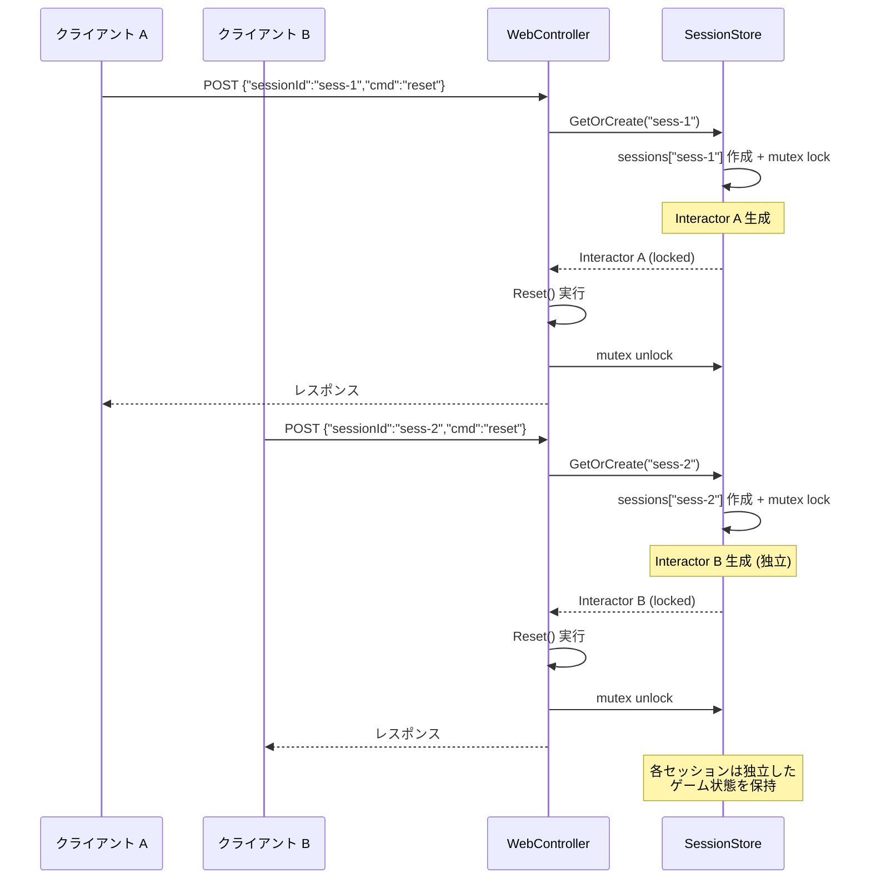
```mermaid
sequenceDiagram
    participant C1 as クライアント A
    participant C2 as クライアント B
    participant WebCtrl as WebController
    participant Store as SessionStore

    C1->>WebCtrl: POST {"sessionId":"sess-1","cmd":"reset"}
    WebCtrl->>Store: GetOrCreate("sess-1")
    Store->>Store: sessions["sess-1"] 作成 + mutex lock
    Note over Store: Interactor A 生成
    Store-->>WebCtrl: Interactor A (locked)
    WebCtrl->>WebCtrl: Reset() 実行
    WebCtrl->>Store: mutex unlock
    WebCtrl-->>C1: レスポンス

    C2->>WebCtrl: POST {"sessionId":"sess-2","cmd":"reset"}
    WebCtrl->>Store: GetOrCreate("sess-2")
    Store->>Store: sessions["sess-2"] 作成 + mutex lock
    Note over Store: Interactor B 生成 (独立)
    Store-->>WebCtrl: Interactor B (locked)
    WebCtrl->>WebCtrl: Reset() 実行
    WebCtrl->>Store: mutex unlock
    WebCtrl-->>C2: レスポンス

    Note over Store: 各セッションは独立した<br/>ゲーム状態を保持
```

### 2.4 VideoPoker ベット・ホールドフロー

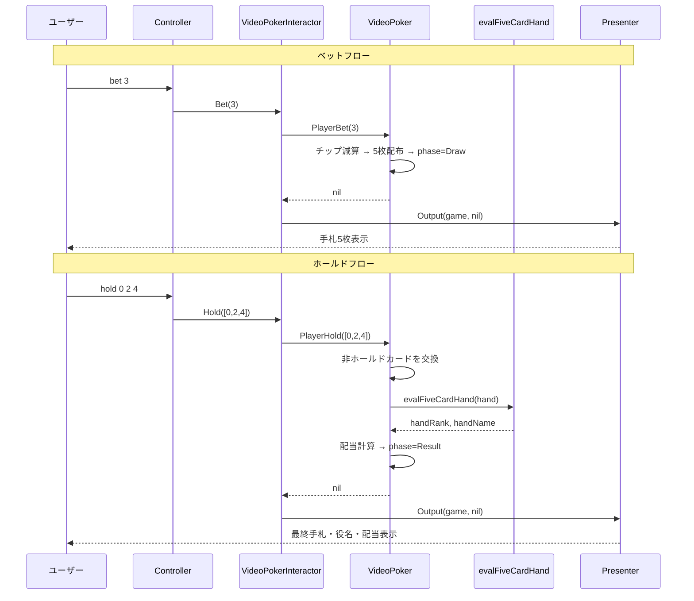
```mermaid
sequenceDiagram
    participant User as ユーザー
    participant Ctrl as Controller
    participant Interactor as VideoPokerInteractor
    participant Domain as VideoPoker
    participant Eval as evalFiveCardHand
    participant Pres as Presenter

    Note over User,Pres: ベットフロー
    User->>Ctrl: bet 3
    Ctrl->>Interactor: Bet(3)
    Interactor->>Domain: PlayerBet(3)
    Domain->>Domain: チップ減算 → 5枚配布 → phase=Draw
    Domain-->>Interactor: nil
    Interactor->>Pres: Output(game, nil)
    Pres-->>User: 手札5枚表示

    Note over User,Pres: ホールドフロー
    User->>Ctrl: hold 0 2 4
    Ctrl->>Interactor: Hold([0,2,4])
    Interactor->>Domain: PlayerHold([0,2,4])
    Domain->>Domain: 非ホールドカードを交換
    Domain->>Eval: evalFiveCardHand(hand)
    Eval-->>Domain: handRank, handName
    Domain->>Domain: 配当計算 → phase=Result
    Domain-->>Interactor: nil
    Interactor->>Pres: Output(game, nil)
    Pres-->>User: 最終手札・役名・配当表示
```

### 2.5 ThreeCard ベット・プレイフロー

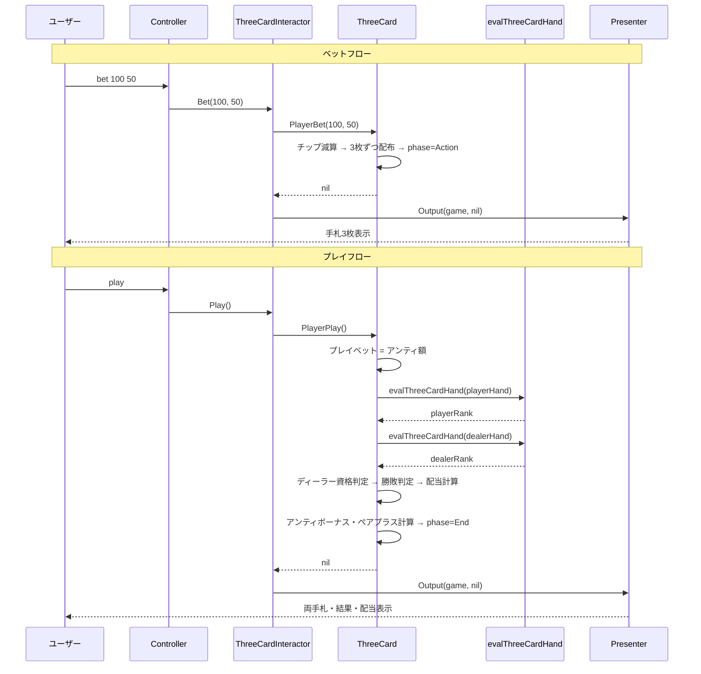
```mermaid
sequenceDiagram
    participant User as ユーザー
    participant Ctrl as Controller
    participant Interactor as ThreeCardInteractor
    participant Domain as ThreeCard
    participant Eval as evalThreeCardHand
    participant Pres as Presenter

    Note over User,Pres: ベットフロー
    User->>Ctrl: bet 100 50
    Ctrl->>Interactor: Bet(100, 50)
    Interactor->>Domain: PlayerBet(100, 50)
    Domain->>Domain: チップ減算 → 3枚ずつ配布 → phase=Action
    Domain-->>Interactor: nil
    Interactor->>Pres: Output(game, nil)
    Pres-->>User: 手札3枚表示

    Note over User,Pres: プレイフロー
    User->>Ctrl: play
    Ctrl->>Interactor: Play()
    Interactor->>Domain: PlayerPlay()
    Domain->>Domain: プレイベット = アンティ額
    Domain->>Eval: evalThreeCardHand(playerHand)
    Eval-->>Domain: playerRank
    Domain->>Eval: evalThreeCardHand(dealerHand)
    Eval-->>Domain: dealerRank
    Domain->>Domain: ディーラー資格判定 → 勝敗判定 → 配当計算
    Domain->>Domain: アンティボーナス・ペアプラス計算 → phase=End
    Domain-->>Interactor: nil
    Interactor->>Pres: Output(game, nil)
    Pres-->>User: 両手札・結果・配当表示
```

### 2.6 OhHell ビッド・トリックフロー

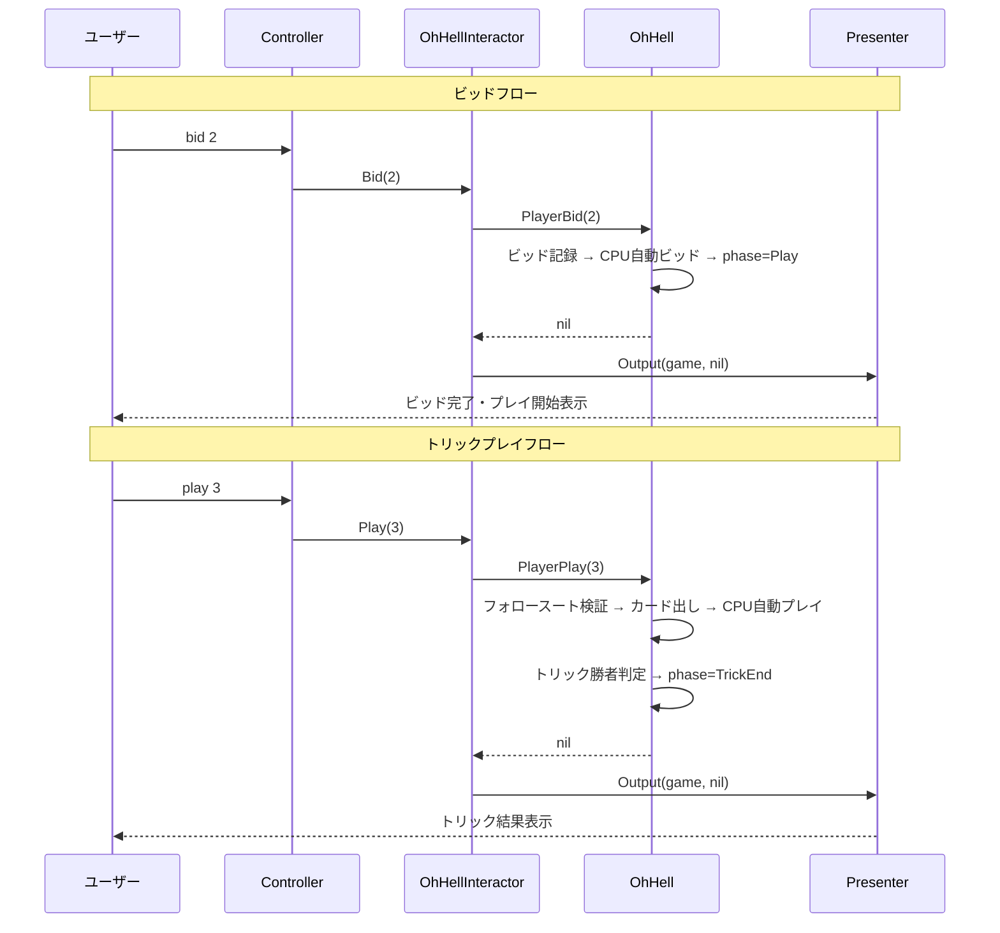
```mermaid
sequenceDiagram
    participant User as ユーザー
    participant Ctrl as Controller
    participant Interactor as OhHellInteractor
    participant Domain as OhHell
    participant Pres as Presenter

    Note over User,Pres: ビッドフロー
    User->>Ctrl: bid 2
    Ctrl->>Interactor: Bid(2)
    Interactor->>Domain: PlayerBid(2)
    Domain->>Domain: ビッド記録 → CPU自動ビッド → phase=Play
    Domain-->>Interactor: nil
    Interactor->>Pres: Output(game, nil)
    Pres-->>User: ビッド完了・プレイ開始表示

    Note over User,Pres: トリックプレイフロー
    User->>Ctrl: play 3
    Ctrl->>Interactor: Play(3)
    Interactor->>Domain: PlayerPlay(3)
    Domain->>Domain: フォロースート検証 → カード出し → CPU自動プレイ
    Domain->>Domain: トリック勝者判定 → phase=TrickEnd
    Domain-->>Interactor: nil
    Interactor->>Pres: Output(game, nil)
    Pres-->>User: トリック結果表示
```

### 2.7 Bridge オークション・トリックフロー

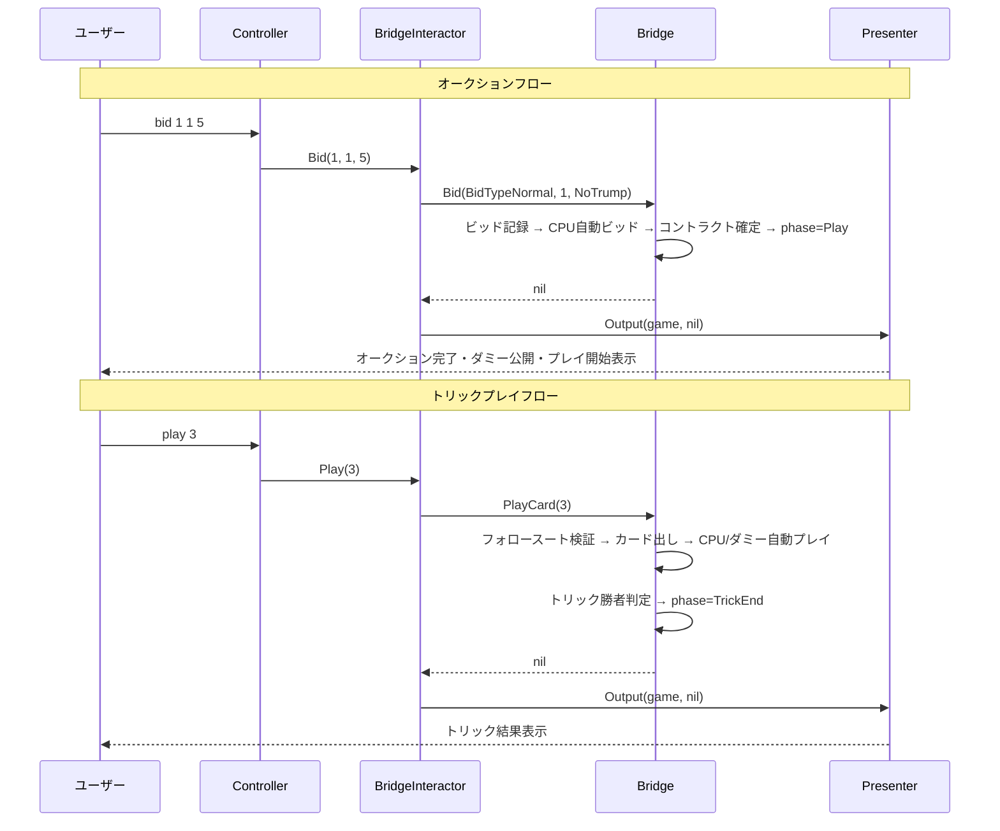
```mermaid
sequenceDiagram
    participant User as ユーザー
    participant Ctrl as Controller
    participant Interactor as BridgeInteractor
    participant Domain as Bridge
    participant Pres as Presenter

    Note over User,Pres: オークションフロー
    User->>Ctrl: bid 1 1 5
    Ctrl->>Interactor: Bid(1, 1, 5)
    Interactor->>Domain: Bid(BidTypeNormal, 1, NoTrump)
    Domain->>Domain: ビッド記録 → CPU自動ビッド → コントラクト確定 → phase=Play
    Domain-->>Interactor: nil
    Interactor->>Pres: Output(game, nil)
    Pres-->>User: オークション完了・ダミー公開・プレイ開始表示

    Note over User,Pres: トリックプレイフロー
    User->>Ctrl: play 3
    Ctrl->>Interactor: Play(3)
    Interactor->>Domain: PlayCard(3)
    Domain->>Domain: フォロースート検証 → カード出し → CPU/ダミー自動プレイ
    Domain->>Domain: トリック勝者判定 → phase=TrickEnd
    Domain-->>Interactor: nil
    Interactor->>Pres: Output(game, nil)
    Pres-->>User: トリック結果表示
```

### 2.8 Pineapple ディスカードフロー

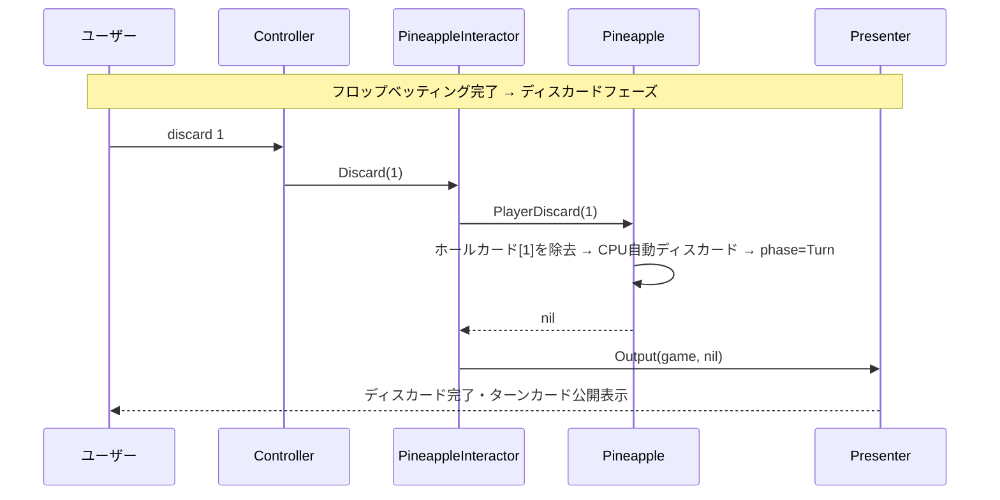
```mermaid
sequenceDiagram
    participant User as ユーザー
    participant Ctrl as Controller
    participant Interactor as PineappleInteractor
    participant Domain as Pineapple
    participant Pres as Presenter

    Note over User,Pres: フロップベッティング完了 → ディスカードフェーズ
    User->>Ctrl: discard 1
    Ctrl->>Interactor: Discard(1)
    Interactor->>Domain: PlayerDiscard(1)
    Domain->>Domain: ホールカード[1]を除去 → CPU自動ディスカード → phase=Turn
    Domain-->>Interactor: nil
    Interactor->>Pres: Output(game, nil)
    Pres-->>User: ディスカード完了・ターンカード公開表示
```

---

## 3. ステートマシン図

### 3.1 BlackJack フェーズ遷移

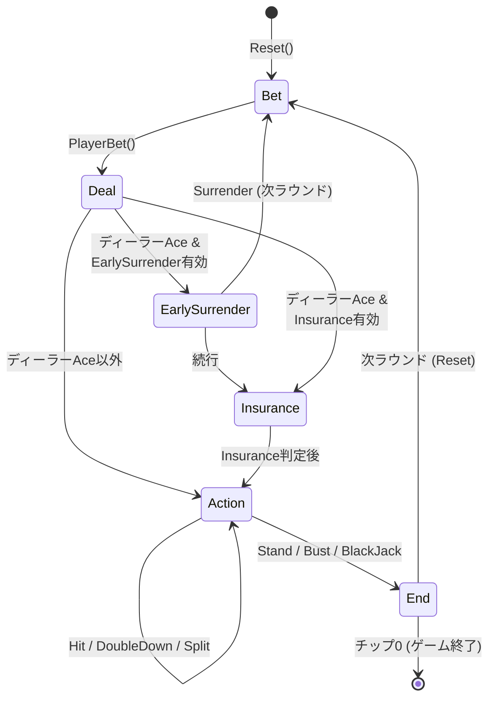
```mermaid
stateDiagram-v2
    [*] --> Bet : Reset()
    Bet --> Deal : PlayerBet()
    Deal --> EarlySurrender : ディーラーAce &<br/>EarlySurrender有効
    EarlySurrender --> Bet : Surrender (次ラウンド)
    EarlySurrender --> Insurance : 続行
    Deal --> Insurance : ディーラーAce &<br/>Insurance有効
    Deal --> Action : ディーラーAce以外
    Insurance --> Action : Insurance判定後
    Action --> Action : Hit / DoubleDown / Split
    Action --> End : Stand / Bust / BlackJack
    End --> Bet : 次ラウンド (Reset)
    End --> [*] : チップ0 (ゲーム終了)
```

### 3.2 Poker フェーズ遷移

```mermaid
stateDiagram-v2
    [*] --> Init : Reset()
    Init --> Deal : カード配布 + 第1ベッティング
    Deal --> Exchange : プレイヤーのベット完了
    Exchange --> SecondBet : カード交換完了
    SecondBet --> End : 第2ベッティング完了 / Fold
    End --> Init : 次ラウンド (Reset)
    End --> [*] : チップ0 (ゲーム終了)
```

### 3.3 Texas Hold'em フェーズ遷移

Omaha Hold'em および Short Deck Hold'em も同一のフェーズ遷移を共有します。

```mermaid
stateDiagram-v2
    [*] --> Init : Reset()
    Init --> PreFlop : ブラインド + ホールカード配布
    PreFlop --> Flop : ベッティング完了
    PreFlop --> Showdown : 1人以外 Fold
    Flop --> Turn : ベッティング完了
    Flop --> Showdown : 1人以外 Fold
    Turn --> River : ベッティング完了
    Turn --> Showdown : 1人以外 Fold
    River --> Showdown : ベッティング完了
    Showdown --> End : 勝者決定
    End --> Rebuy : リバイ/アドオン有効
    End --> Init : 次ラウンド (Reset)
    Rebuy --> Init : リバイ/アドオン完了
    End --> [*] : ゲーム終了
```

### 3.4 Hearts フェーズ遷移

```mermaid
stateDiagram-v2
    [*] --> Pass : Reset()
    Pass --> Play : カード交換完了<br/>(または交換なしラウンド)
    Play --> TrickEnd : 4人全員カード出し完了
    TrickEnd --> Play : 次トリック開始
    TrickEnd --> RoundEnd : 13トリック完了
    RoundEnd --> Pass : 次ラウンド開始
    RoundEnd --> GameEnd : 目標点到達
    GameEnd --> [*]
```

### 3.5 Spades フェーズ遷移

```mermaid
stateDiagram-v2
    [*] --> Bid : Reset()
    Bid --> Play : 4人全員ビッド完了
    Play --> TrickEnd : 4人全員カード出し完了
    TrickEnd --> Play : 次トリック開始
    TrickEnd --> RoundEnd : 13トリック完了
    RoundEnd --> Bid : 次ラウンド開始
    RoundEnd --> GameEnd : 目標点到達
    GameEnd --> [*]
```

### 3.6 Doubt フェーズ遷移

```mermaid
stateDiagram-v2
    [*] --> Play : Reset()
    Play --> DoubtPhase : カードを出す
    DoubtPhase --> Play : ダウトスキップ → 次プレイヤー
    DoubtPhase --> Play : ダウト実行 → ペナルティ処理 → 次プレイヤー
    DoubtPhase --> End : ダウト成功 & 全カード消化
    Play --> End : 手札0枚 (勝利)
    End --> [*]
```

### 3.7 Memory フェーズ遷移

```mermaid
stateDiagram-v2
    [*] --> Flip1 : Reset()
    Flip1 --> Flip2 : 1枚目めくり
    Flip2 --> Result : 2枚目めくり
    Result --> Flip1 : Next() → 次プレイヤーのターン
    Result --> GameEnd : 全ペアマッチ
    GameEnd --> [*]

    note right of Flip1 : MemoryPhaseFlip1 = 0
    note right of Flip2 : MemoryPhaseFlip2 = 1
    note right of Result : MemoryPhaseResult = 2
```

### 3.8 Klondike / FreeCell / Spider / Pyramid / TriPeaks フェーズ遷移

5つのソリティア系ゲームは共通のフェーズ構造を持ちます。

```mermaid
stateDiagram-v2
    [*] --> Playing : Reset()
    Playing --> Playing : Move / Draw / Deal / Remove / Undo
    Playing --> GameClear : 全カードをFoundation/Pyramid/Tableau除去完了
    Playing --> GameClear : Autocomplete成功 (Klondike/FreeCell/Spider のみ)
    Playing --> GameOver : GiveUp
    GameClear --> [*]
    GameOver --> [*]

    note right of Playing : Klondike/FreeCell/Spider/Pyramid/TriPeaks 共通 Phase = 0
    note right of GameClear : Phase = 1
    note right of GameOver : Phase = 2
```

Pyramid 固有のアクション: `Draw` / `RemovePair` / `RemoveKing` / `RemoveWithWaste` / `RemoveWasteKing` / `Undo`。クリア条件はピラミッドの28枚全除去。

TriPeaks 固有のアクション: `Draw` / `Remove` / `Undo`。除去条件はウェイストトップ±1ランク（K-Aラップ）。クリア条件はタブローの28枚全除去。

各ゲームのフェーズ定数名: `KlondikePhasePlaying` / `FreeCellPhasePlaying` / `SpiderPhasePlaying` / `PyramidPhasePlaying` / `TriPeaksPhasePlaying` = 0、`…GameClear` = 1、`…GameOver` = 2。

### 3.9 CrazyEights フェーズ遷移

```mermaid
stateDiagram-v2
    [*] --> Play : Reset()
    Play --> Play : カードを出す / ドローする
    Play --> ChooseSuit : 8を出す
    ChooseSuit --> Play : スート選択完了
    Play --> RoundEnd : 手札0枚 (勝ち上がり)
    RoundEnd --> Play : NextRound()
    RoundEnd --> GameEnd : 目標点到達
    GameEnd --> [*]
```

### 3.10 GinRummy フェーズ遷移

```mermaid
stateDiagram-v2
    [*] --> Draw : Reset()
    Draw --> Discard : カードを引く (山札 or 捨て札)
    Discard --> Draw : カードを捨てる → 次プレイヤー
    Discard --> Layoff : ノック宣言
    Discard --> RoundEnd : ジン宣言
    Layoff --> RoundEnd : レイオフ完了
    RoundEnd --> Draw : NextRound()
    RoundEnd --> GameEnd : 目標点到達
    GameEnd --> [*]
```

### 3.11 Baccarat フェーズ遷移

```mermaid
stateDiagram-v2
    [*] --> Bet : Reset()
    Bet --> End : ベット → 自動カード配布 → 結果判定
    End --> Bet : 次ラウンド (Reset)
    End --> [*] : チップ0 (ゲーム終了)
```

### 3.12 Napoleon フェーズ遷移

```mermaid
stateDiagram-v2
    [*] --> Bid : Reset()
    Bid --> Trump : ナポレオン決定
    Trump --> Exchange : 切り札宣言 + 副官指名
    Exchange --> Play : キティ交換完了
    Play --> TrickEnd : 4人全員カード出し完了
    TrickEnd --> Play : 次トリック開始
    TrickEnd --> RoundEnd : 13トリック完了
    RoundEnd --> Bid : 次ラウンド開始
    RoundEnd --> GameEnd : 目標点到達
    GameEnd --> [*]
```

### 3.13 IndianPoker フェーズ遷移

```mermaid
stateDiagram-v2
    [*] --> Init : 初期状態
    Init --> Ante : Reset()
    Ante --> Betting : アンティ投入・カード配布
    Betting --> Showdown : 全員アクション完了
    Betting --> Showdown : 1人以外全員フォールド
    Showdown --> Ante : 次ハンド開始
    Showdown --> End : プレイヤーのチップが0
    End --> [*]
```

### 3.14 VideoPoker フェーズ遷移

```mermaid
stateDiagram-v2
    [*] --> Bet : Reset()
    Bet --> Draw : ベット(1-5コイン)
    Draw --> Result : ホールド選択 → カード交換 → 役判定
    Result --> Bet : 次ラウンド (Reset)
    Result --> [*] : チップ0 (ゲーム終了)

    note right of Bet : VideoPokerPhaseBet = 1
    note right of Draw : VideoPokerPhaseDraw = 2
    note right of Result : VideoPokerPhaseResult = 3
```

### 3.15 Euchre フェーズ遷移

```mermaid
stateDiagram-v2
    [*] --> PickUp : Reset()
    PickUp --> CallTrump : 全員パス
    PickUp --> Discard : オーダーアップ(ディーラーが拾う)
    CallTrump --> Discard : トランプ宣言(ディーラーが拾う)
    CallTrump --> PickUp : 全員パス(ディーラー強制コール)
    Discard --> Play : ディーラーが1枚捨てる
    Play --> TrickEnd : 参加者全員カード出し完了
    TrickEnd --> Play : 次トリック開始
    TrickEnd --> RoundEnd : 5トリック完了
    RoundEnd --> PickUp : 次ラウンド開始
    RoundEnd --> GameEnd : 目標点到達
    GameEnd --> [*]

    note right of PickUp : EuchrePhasePickUp = 0
    note right of CallTrump : EuchrePhaseCallTrump = 1
    note right of Discard : EuchrePhaseDiscard = 2
    note right of Play : EuchrePhasePlay = 3
    note right of TrickEnd : EuchrePhaseTrickEnd = 4
    note right of RoundEnd : EuchrePhaseRoundEnd = 5
    note right of GameEnd : EuchrePhaseGameEnd = 6
```

### 3.16 Cribbage フェーズ遷移

```mermaid
stateDiagram-v2
    [*] --> Discard : Reset()
    Discard --> Cut : 両プレイヤーが2枚ずつクリブに捨てる
    Cut --> Pegging : スターターカード公開
    Pegging --> Pegging : Peg / Go (ペギング継続)
    Pegging --> Show : 全カード使用済み
    Show --> Show : ShowNext (次のスコア表示)
    Show --> RoundEnd : 全スコア表示完了
    RoundEnd --> Discard : NextRound (次のラウンド)
    RoundEnd --> GameEnd : 121点到達
    Pegging --> GameEnd : ペギング中に121点到達
    Show --> GameEnd : ショー中に121点到達

    note right of Discard : CribbagePhaseDiscard = 0
    note right of Cut : CribbagePhaseCut = 1
    note right of Pegging : CribbagePhasePegging = 2
    note right of Show : CribbagePhaseShow = 3
    note right of RoundEnd : CribbagePhaseRoundEnd = 4
    note right of GameEnd : CribbagePhaseGameEnd = 5
```

### 3.17 ShortDeck フェーズ遷移

Short Deck Hold'em は Texas Hold'em と同一のフェーズ遷移を使用します（[3.3 Texas Hold'em フェーズ遷移](#33-texas-holdem-フェーズ遷移)を参照）。

主な違いはデッキ構成（36枚、2〜5除去）とハンドランキング（フラッシュ > フルハウス、最低ストレート = A-6-7-8-9）のみで、フェーズ遷移ロジックは���通です。

### 3.18 ThreeCard フェーズ遷移

```mermaid
stateDiagram-v2
    [*] --> Bet : Reset()
    Bet --> Action : アンティベット → 3枚配布
    Action --> End : プレイ → ディーラー公開 → 結果判定
    Action --> End : フォールド → ベット没収
    End --> Bet : 次ラウンド (Reset)
    End --> [*] : チップ0 (ゲーム終了)

    note right of Bet : ThreeCardPhaseBet = 1
    note right of Action : ThreeCardPhaseAction = 2
    note right of End : ThreeCardPhaseEnd = 3
```

### 3.19 OhHell フェーズ遷移

```mermaid
stateDiagram-v2
    [*] --> Bid : Reset()
    Bid --> Play : 4人全員ビッド完了
    Play --> TrickEnd : 4人全員カード出し完了
    TrickEnd --> Play : 次トリック開始
    TrickEnd --> RoundEnd : 全トリック完了
    RoundEnd --> Bid : 次ラウンド開始
    RoundEnd --> GameEnd : 全ラウンド完了
    GameEnd --> [*]

    note right of Bid : OhHellPhaseBid = 0
    note right of Play : OhHellPhasePlay = 1
    note right of TrickEnd : OhHellPhaseTrickEnd = 2
    note right of RoundEnd : OhHellPhaseRoundEnd = 3
    note right of GameEnd : OhHellPhaseGameEnd = 4
```

### 3.20 Bridge フェーズ遷移

```mermaid
stateDiagram-v2
    [*] --> Bid : Reset()
    Bid --> Play : コントラクト確定(3連続パス) → ダミー公開
    Play --> TrickEnd : 4人全員カード出し完了
    TrickEnd --> Play : 次トリック開始
    TrickEnd --> RoundEnd : 13トリック完了
    RoundEnd --> Bid : 次ラウンド開始
    RoundEnd --> GameEnd : ラバー完了(2ゲーム先勝)
    Bid --> RoundEnd : 4人全員パス(パスアウト)
    GameEnd --> [*]

    note right of Bid : BridgePhaseBid = 0
    note right of Play : BridgePhasePlay = 1
    note right of TrickEnd : BridgePhaseTrickEnd = 2
    note right of RoundEnd : BridgePhaseRoundEnd = 3
    note right of GameEnd : BridgePhaseGameEnd = 4
```

### 3.21 Pineapple フェーズ遷移

```mermaid
stateDiagram-v2
    [*] --> Init : Reset()
    Init --> PreFlop : ブラインド + ホールカード3枚配布
    PreFlop --> Flop : ベッティング完了
    PreFlop --> Showdown : 1人以外 Fold
    Flop --> Discard : ベッティング完了
    Flop --> Showdown : 1人以外 Fold
    Discard --> Turn : 全員ディスカード完了
    Turn --> River : ベッティング完了
    Turn --> Showdown : 1人以外 Fold
    River --> Showdown : ベッティング完了
    Showdown --> End : 勝者決定
    End --> Rebuy : リバイ/アドオン有効
    End --> Init : 次ラウンド (Reset)
    Rebuy --> Init : リバイ/アドオン完了
    End --> [*] : ゲーム終了

    note right of Init : PineapplePhaseInit = 0
    note right of PreFlop : PineapplePhasePreFlop = 1
    note right of Flop : PineapplePhaseFlop = 2
    note right of Discard : PineapplePhaseDiscard = 3
    note right of Turn : PineapplePhaseTurn = 4
    note right of River : PineapplePhaseRiver = 5
    note right of Showdown : PineapplePhaseShowdown = 6
    note right of End : PineapplePhaseEnd = 7
    note right of Rebuy : PineapplePhaseRebuy = 8
```

**注:** OldMaid・Daifugo・Sevens は明示的なフェーズ定数を持たず、ターン制で進行します (currentTurn が巡回し、全プレイヤーの手札が0枚またはランク確定で終了)。
