# バックエンド設計ドキュメント (UML)

本ドキュメントは go_trumpcards バックエンドシステムの設計をMermaid記法で可視化したものです。

## 目次

- [1. クラス図](#1-クラス図)
  - [1.1 コアドメイン (カード・プレイヤー)](#11-コアドメイン-カードプレイヤー)
  - [1.2 ゲームドメイン (全17ゲーム)](#12-ゲームドメイン-全17ゲーム)
  - [1.3 ユースケース層 (Interactor・Presenter)](#13-ユースケース層-interactorpresenter)
  - [1.4 アダプタ層 (Controller・Presenter実装)](#14-アダプタ層-controllerpresenter実装)
  - [1.5 インフラストラクチャ層](#15-インフラストラクチャ層)
- [2. シーケンス図](#2-シーケンス図)
  - [2.1 CUIゲーム実行フロー](#21-cuiゲーム実行フロー)
  - [2.2 Web APIゲーム実行フロー](#22-web-apiゲーム実行フロー)
  - [2.3 セッション管理フロー](#23-セッション管理フロー)
- [3. ステートマシン図](#3-ステートマシン図)
  - [3.1 BlackJack フェーズ遷移](#31-blackjack-フェーズ遷移)
  - [3.2 Poker フェーズ遷移](#32-poker-フェーズ遷移)
  - [3.3 Texas Hold'em フェーズ遷移](#33-texas-holdem-フェーズ遷移)
  - [3.4 Hearts フェーズ遷移](#34-hearts-フェーズ遷移)
  - [3.5 Spades フェーズ遷移](#35-spades-フェーズ遷移)
  - [3.6 Doubt フェーズ遷移](#36-doubt-フェーズ遷移)
  - [3.7 Memory フェーズ遷移](#37-memory-フェーズ遷移)
  - [3.8 Klondike / FreeCell / Spider フェーズ遷移](#38-klondike--freecell--spider-フェーズ遷移)
  - [3.9 CrazyEights フェーズ遷移](#39-crazyeights-フェーズ遷移)
  - [3.10 GinRummy フェーズ遷移](#310-ginrummy-フェーズ遷移)
  - [3.11 Baccarat フェーズ遷移](#311-baccarat-フェーズ遷移)

---

## 1. クラス図

### 1.1 コアドメイン (カード・プレイヤー)

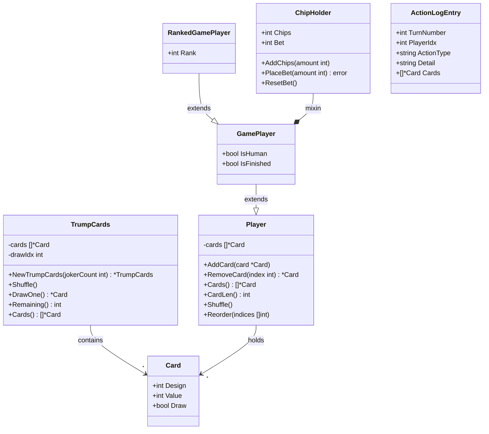
```mermaid
classDiagram
    class Card {
        +int Design
        +int Value
        +bool Draw
    }

    class TrumpCards {
        -cards []*Card
        -drawIdx int
        +NewTrumpCards(jokerCount int) *TrumpCards
        +Shuffle()
        +DrawOne() *Card
        +Remaining() int
        +Cards() []*Card
    }

    class Player {
        -cards []*Card
        +AddCard(card *Card)
        +RemoveCard(index int) *Card
        +Cards() []*Card
        +CardLen() int
        +Shuffle()
        +Reorder(indices []int)
    }

    class GamePlayer {
        +bool IsHuman
        +bool IsFinished
    }

    class RankedGamePlayer {
        +int Rank
    }

    class ChipHolder {
        +int Chips
        +int Bet
        +AddChips(amount int)
        +PlaceBet(amount int) error
        +ResetBet()
    }

    class ActionLogEntry {
        +int TurnNumber
        +int PlayerIdx
        +string ActionType
        +string Detail
        +[]*Card Cards
    }

    TrumpCards --> "*" Card : contains
    Player --> "*" Card : holds
    GamePlayer --|> Player : extends
    RankedGamePlayer --|> GamePlayer : extends
    ChipHolder --* GamePlayer : mixin
```

### 1.2 ゲームドメイン (全17ゲーム)

#### ベッティング系ゲーム

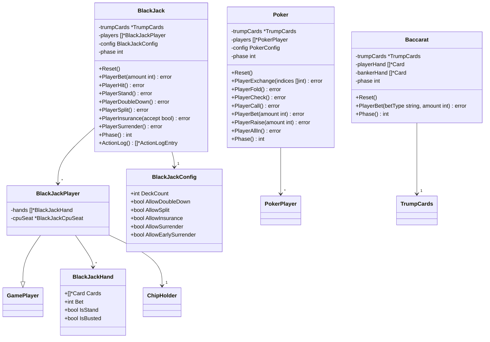
```mermaid
classDiagram
    class BlackJack {
        -trumpCards *TrumpCards
        -players []*BlackJackPlayer
        -config BlackJackConfig
        -phase int
        +Reset()
        +PlayerBet(amount int) error
        +PlayerHit() error
        +PlayerStand() error
        +PlayerDoubleDown() error
        +PlayerSplit() error
        +PlayerInsurance(accept bool) error
        +PlayerSurrender() error
        +Phase() int
        +ActionLog() []*ActionLogEntry
    }

    class BlackJackPlayer {
        -hands []*BlackJackHand
        -cpuSeat *BlackJackCpuSeat
    }

    class BlackJackHand {
        +[]*Card Cards
        +int Bet
        +bool IsStand
        +bool IsBusted
    }

    class BlackJackConfig {
        +int DeckCount
        +bool AllowDoubleDown
        +bool AllowSplit
        +bool AllowInsurance
        +bool AllowSurrender
        +bool AllowEarlySurrender
    }

    class Poker {
        -trumpCards *TrumpCards
        -players []*PokerPlayer
        -config PokerConfig
        -phase int
        +Reset()
        +PlayerExchange(indices []int) error
        +PlayerFold() error
        +PlayerCheck() error
        +PlayerCall() error
        +PlayerBet(amount int) error
        +PlayerRaise(amount int) error
        +PlayerAllIn() error
        +Phase() int
    }

    class Baccarat {
        -trumpCards *TrumpCards
        -playerHand []*Card
        -bankerHand []*Card
        -phase int
        +Reset()
        +PlayerBet(betType string, amount int) error
        +Phase() int
    }

    BlackJack --> "*" BlackJackPlayer
    BlackJack --> "1" BlackJackConfig
    BlackJackPlayer --|> GamePlayer
    BlackJackPlayer --> "*" BlackJackHand
    BlackJackPlayer --> "1" ChipHolder
    Poker --> "*" PokerPlayer
    Baccarat --> "1" TrumpCards
```

#### トリックテイキング系ゲーム

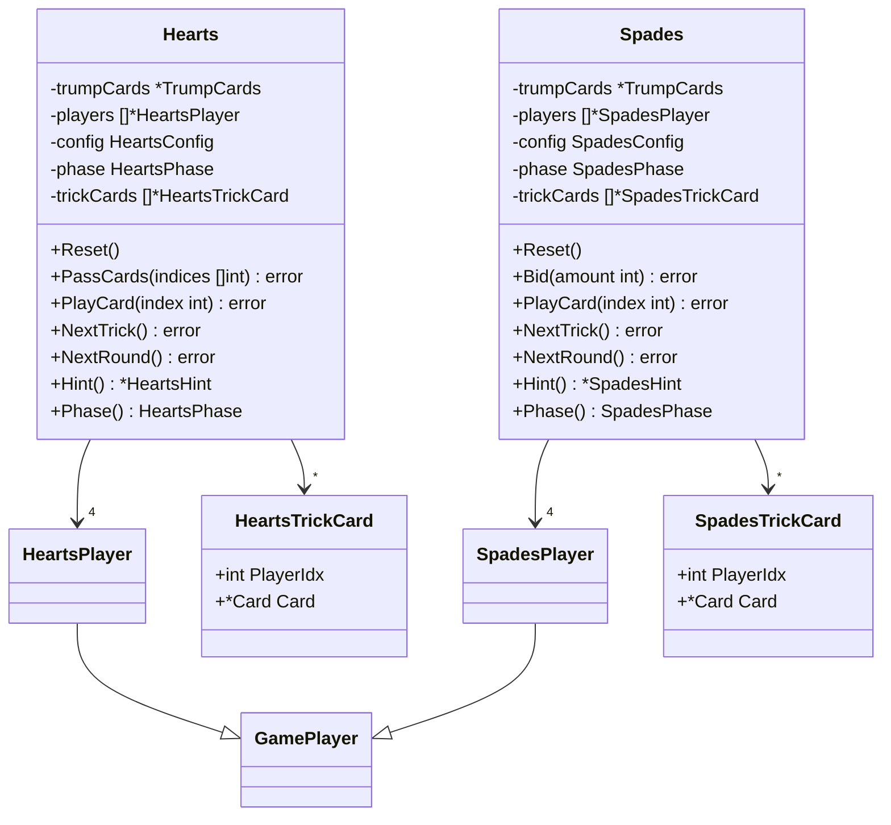
```mermaid
classDiagram
    class Hearts {
        -trumpCards *TrumpCards
        -players []*HeartsPlayer
        -config HeartsConfig
        -phase HeartsPhase
        -trickCards []*HeartsTrickCard
        +Reset()
        +PassCards(indices []int) error
        +PlayCard(index int) error
        +NextTrick() error
        +NextRound() error
        +Hint() *HeartsHint
        +Phase() HeartsPhase
    }

    class Spades {
        -trumpCards *TrumpCards
        -players []*SpadesPlayer
        -config SpadesConfig
        -phase SpadesPhase
        -trickCards []*SpadesTrickCard
        +Reset()
        +Bid(amount int) error
        +PlayCard(index int) error
        +NextTrick() error
        +NextRound() error
        +Hint() *SpadesHint
        +Phase() SpadesPhase
    }

    class HeartsTrickCard {
        +int PlayerIdx
        +*Card Card
    }

    class SpadesTrickCard {
        +int PlayerIdx
        +*Card Card
    }

    Hearts --> "4" HeartsPlayer
    Hearts --> "*" HeartsTrickCard
    Spades --> "4" SpadesPlayer
    Spades --> "*" SpadesTrickCard
    HeartsPlayer --|> GamePlayer
    SpadesPlayer --|> GamePlayer
```

#### ホールデム系ゲーム

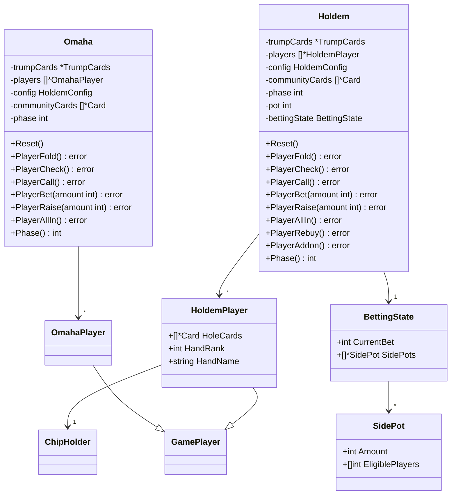
```mermaid
classDiagram
    class Holdem {
        -trumpCards *TrumpCards
        -players []*HoldemPlayer
        -config HoldemConfig
        -communityCards []*Card
        -phase int
        -pot int
        -bettingState BettingState
        +Reset()
        +PlayerFold() error
        +PlayerCheck() error
        +PlayerCall() error
        +PlayerBet(amount int) error
        +PlayerRaise(amount int) error
        +PlayerAllIn() error
        +PlayerRebuy() error
        +PlayerAddon() error
        +Phase() int
    }

    class Omaha {
        -trumpCards *TrumpCards
        -players []*OmahaPlayer
        -config HoldemConfig
        -communityCards []*Card
        -phase int
        +Reset()
        +PlayerFold() error
        +PlayerCheck() error
        +PlayerCall() error
        +PlayerBet(amount int) error
        +PlayerRaise(amount int) error
        +PlayerAllIn() error
        +Phase() int
    }

    class HoldemPlayer {
        +[]*Card HoleCards
        +int HandRank
        +string HandName
    }

    class BettingState {
        +int CurrentBet
        +[]*SidePot SidePots
    }

    class SidePot {
        +int Amount
        +[]int EligiblePlayers
    }

    Holdem --> "*" HoldemPlayer
    Holdem --> "1" BettingState
    BettingState --> "*" SidePot
    HoldemPlayer --|> GamePlayer
    HoldemPlayer --> "1" ChipHolder
    Omaha --> "*" OmahaPlayer
    OmahaPlayer --|> GamePlayer
```

#### 手札系ゲーム

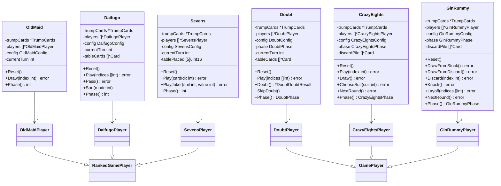
```mermaid
classDiagram
    class OldMaid {
        -trumpCards *TrumpCards
        -players []*OldMaidPlayer
        -config OldMaidConfig
        -currentTurn int
        +Reset()
        +Draw(index int) error
        +Phase() int
    }

    class Daifugo {
        -trumpCards *TrumpCards
        -players []*DaifugoPlayer
        -config DaifugoConfig
        -currentTurn int
        -tableCards []*Card
        +Reset()
        +Play(indices []int) error
        +Pass() error
        +Sort(mode int)
        +Phase() int
    }

    class Sevens {
        -trumpCards *TrumpCards
        -players []*SevensPlayer
        -config SevensConfig
        -currentTurn int
        -tablePlaced [5]uint16
        +Reset()
        +Play(cardIdx int) error
        +PlayJoker(suit int, value int) error
        +Phase() int
    }

    class Doubt {
        -trumpCards *TrumpCards
        -players []*DoubtPlayer
        -config DoubtConfig
        -phase DoubtPhase
        -currentTurn int
        -tableCards []*Card
        +Reset()
        +Play(indices []int) error
        +Doubt() *DoubtDoubtResult
        +SkipDoubt()
        +Phase() DoubtPhase
    }

    class CrazyEights {
        -trumpCards *TrumpCards
        -players []*CrazyEightsPlayer
        -config CrazyEightsConfig
        -phase CrazyEightsPhase
        -discardPile []*Card
        +Reset()
        +Play(index int) error
        +Draw() error
        +ChooseSuit(suit int) error
        +NextRound() error
        +Phase() CrazyEightsPhase
    }

    class GinRummy {
        -trumpCards *TrumpCards
        -players []*GinRummyPlayer
        -config GinRummyConfig
        -phase GinRummyPhase
        -discardPile []*Card
        +Reset()
        +DrawFromStock() error
        +DrawFromDiscard() error
        +Discard(index int) error
        +Knock() error
        +Layoff(indices []int) error
        +NextRound() error
        +Phase() GinRummyPhase
    }

    OldMaid --> "*" OldMaidPlayer
    Daifugo --> "*" DaifugoPlayer
    Sevens --> "*" SevensPlayer
    Doubt --> "*" DoubtPlayer
    CrazyEights --> "*" CrazyEightsPlayer
    GinRummy --> "2" GinRummyPlayer
    OldMaidPlayer --|> RankedGamePlayer
    DaifugoPlayer --|> RankedGamePlayer
    SevensPlayer --|> RankedGamePlayer
    DoubtPlayer --|> GamePlayer
    CrazyEightsPlayer --|> GamePlayer
    GinRummyPlayer --|> GamePlayer
```

#### ソリティア系ゲーム

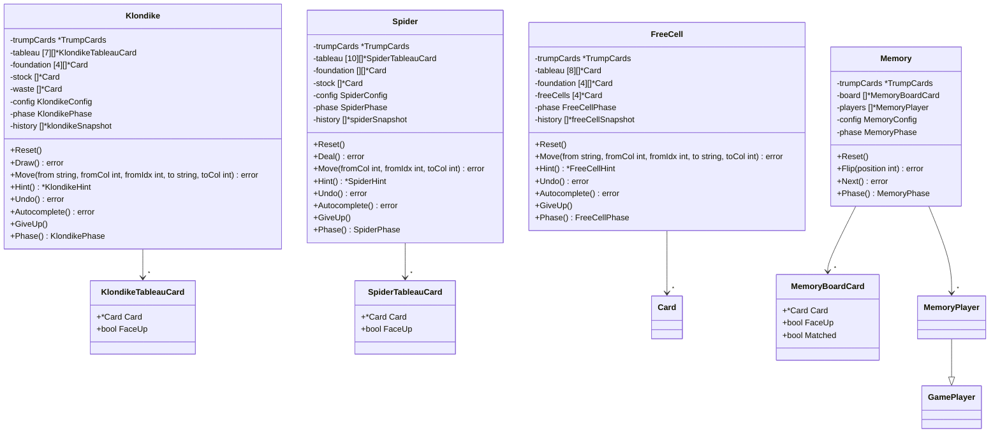
```mermaid
classDiagram
    class Klondike {
        -trumpCards *TrumpCards
        -tableau [7][]*KlondikeTableauCard
        -foundation [4][]*Card
        -stock []*Card
        -waste []*Card
        -config KlondikeConfig
        -phase KlondikePhase
        -history []*klondikeSnapshot
        +Reset()
        +Draw() error
        +Move(from string, fromCol int, fromIdx int, to string, toCol int) error
        +Hint() *KlondikeHint
        +Undo() error
        +Autocomplete() error
        +GiveUp()
        +Phase() KlondikePhase
    }

    class FreeCell {
        -trumpCards *TrumpCards
        -tableau [8][]*Card
        -foundation [4][]*Card
        -freeCells [4]*Card
        -phase FreeCellPhase
        -history []*freeCellSnapshot
        +Reset()
        +Move(from string, fromCol int, fromIdx int, to string, toCol int) error
        +Hint() *FreeCellHint
        +Undo() error
        +Autocomplete() error
        +GiveUp()
        +Phase() FreeCellPhase
    }

    class Spider {
        -trumpCards *TrumpCards
        -tableau [10][]*SpiderTableauCard
        -foundation [][]*Card
        -stock []*Card
        -config SpiderConfig
        -phase SpiderPhase
        -history []*spiderSnapshot
        +Reset()
        +Deal() error
        +Move(fromCol int, fromIdx int, toCol int) error
        +Hint() *SpiderHint
        +Undo() error
        +Autocomplete() error
        +GiveUp()
        +Phase() SpiderPhase
    }

    class Memory {
        -trumpCards *TrumpCards
        -board []*MemoryBoardCard
        -players []*MemoryPlayer
        -config MemoryConfig
        -phase MemoryPhase
        +Reset()
        +Flip(position int) error
        +Next() error
        +Phase() MemoryPhase
    }

    class KlondikeTableauCard {
        +*Card Card
        +bool FaceUp
    }

    class SpiderTableauCard {
        +*Card Card
        +bool FaceUp
    }

    class MemoryBoardCard {
        +*Card Card
        +bool FaceUp
        +bool Matched
    }

    Klondike --> "*" KlondikeTableauCard
    FreeCell --> "*" Card
    Spider --> "*" SpiderTableauCard
    Memory --> "*" MemoryBoardCard
    Memory --> "*" MemoryPlayer
    MemoryPlayer --|> GamePlayer
```

### 1.3 ユースケース層 (Interactor・Presenter)

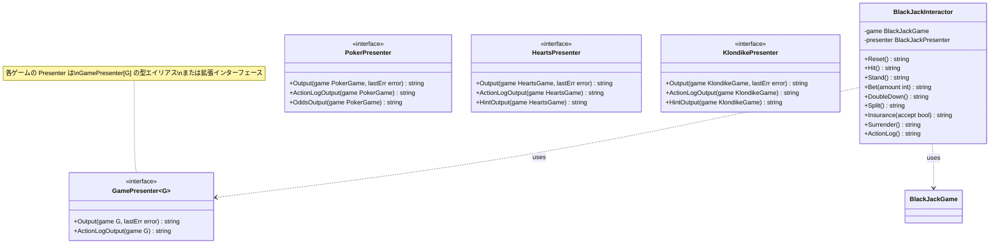
```mermaid
classDiagram
    class GamePresenter~G~ {
        <<interface>>
        +Output(game G, lastErr error) string
        +ActionLogOutput(game G) string
    }

    class BlackJackInteractor {
        -game BlackJackGame
        -presenter BlackJackPresenter
        +Reset() string
        +Hit() string
        +Stand() string
        +Bet(amount int) string
        +DoubleDown() string
        +Split() string
        +Insurance(accept bool) string
        +Surrender() string
        +ActionLog() string
    }

    class PokerPresenter {
        <<interface>>
        +Output(game PokerGame, lastErr error) string
        +ActionLogOutput(game PokerGame) string
        +OddsOutput(game PokerGame) string
    }

    class HeartsPresenter {
        <<interface>>
        +Output(game HeartsGame, lastErr error) string
        +ActionLogOutput(game HeartsGame) string
        +HintOutput(game HeartsGame) string
    }

    class KlondikePresenter {
        <<interface>>
        +Output(game KlondikeGame, lastErr error) string
        +ActionLogOutput(game KlondikeGame) string
        +HintOutput(game KlondikeGame) string
    }

    BlackJackInteractor ..> GamePresenter : uses
    BlackJackInteractor ..> BlackJackGame : uses

    note for GamePresenter "各ゲームの Presenter は\nGamePresenter[G] の型エイリアス\nまたは拡張インターフェース"
```

**Interactor パターン (全17ゲーム共通)**

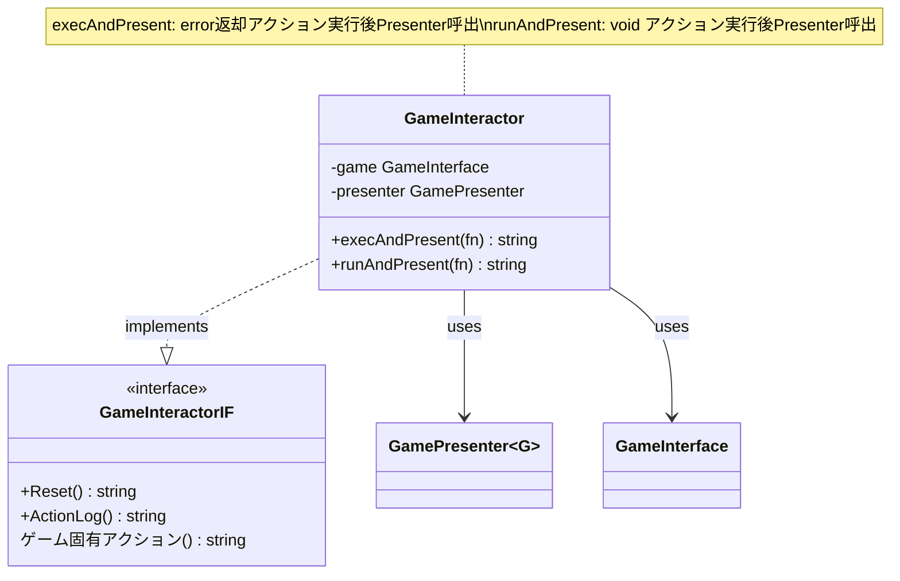
```mermaid
classDiagram
    class GameInteractorIF {
        <<interface>>
        +Reset() string
        +ActionLog() string
        ゲーム固有アクション() string
    }

    class GameInteractor {
        -game GameInterface
        -presenter GamePresenter
        +execAndPresent(fn) string
        +runAndPresent(fn) string
    }

    GameInteractor ..|> GameInteractorIF : implements
    GameInteractor --> GamePresenter~G~ : uses
    GameInteractor --> GameInterface : uses

    note for GameInteractor "execAndPresent: error返却アクション実行後Presenter呼出\nrunAndPresent: void アクション実行後Presenter呼出"
```

### 1.4 アダプタ層 (Controller・Presenter実装)

```mermaid
classDiagram
    class baseController {
        +writePresenterResponse(w, responseStr)
        +writeJsonResponse(w, status, body)
    }

    class SessionStore~T~ {
        -sessions map[string]*sessionEntry~T~
        +GetOrCreate(sessionId string, factory func() T) T
        +Get(sessionId string) T
    }

    class sessionEntry~T~ {
        +value T
        +mu *sync.Mutex
    }

    class GameCuiController {
        -interactor GameInteractorIF
        +Exec(input string) string
    }

    class GameWebController {
        -store *SessionStore~GameInteractorIF~
        +Handle(w ResponseWriter, r *Request)
    }

    class GameCuiPresenter {
        +Output(game G, lastErr error) string
        +ActionLogOutput(game G) string
    }

    class GameWebPresenter {
        +Output(game G, lastErr error) string
        +ActionLogOutput(game G) string
    }

    GameWebController --|> baseController : extends
    GameWebController --> SessionStore : uses
    SessionStore --> "*" sessionEntry : manages
    GameCuiController --> GameInteractorIF : uses
    GameCuiPresenter ..|> GamePresenter : implements
    GameWebPresenter ..|> GamePresenter : implements

    note for GameCuiController "17ゲーム × CUI/Web = 34 Controller\nGameCuiController / GameWebController は\n各ゲーム毎に具体的な実装が存在"
    note for GameCuiPresenter "17ゲーム × CUI/Web = 34 Presenter 実装"
```

### 1.5 インフラストラクチャ層

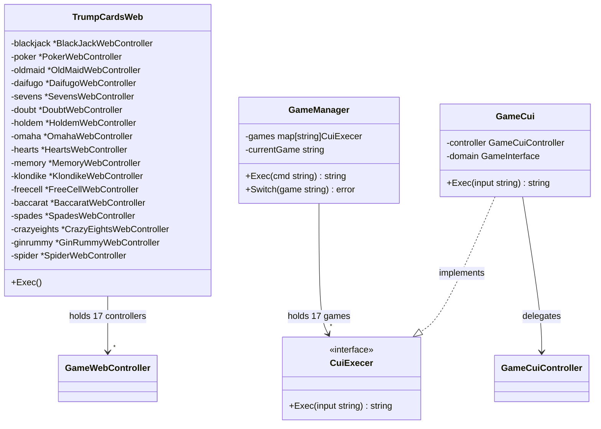
```mermaid
classDiagram
    class TrumpCardsWeb {
        -blackjack *BlackJackWebController
        -poker *PokerWebController
        -oldmaid *OldMaidWebController
        -daifugo *DaifugoWebController
        -sevens *SevensWebController
        -doubt *DoubtWebController
        -holdem *HoldemWebController
        -omaha *OmahaWebController
        -hearts *HeartsWebController
        -memory *MemoryWebController
        -klondike *KlondikeWebController
        -freecell *FreeCellWebController
        -baccarat *BaccaratWebController
        -spades *SpadesWebController
        -crazyeights *CrazyEightsWebController
        -ginrummy *GinRummyWebController
        -spider *SpiderWebController
        +Exec()
    }

    class GameManager {
        -games map[string]CuiExecer
        -currentGame string
        +Exec(cmd string) string
        +Switch(game string) error
    }

    class CuiExecer {
        <<interface>>
        +Exec(input string) string
    }

    class GameCui {
        -controller GameCuiController
        -domain GameInterface
        +Exec(input string) string
    }

    TrumpCardsWeb --> "*" GameWebController : holds 17 controllers
    GameManager --> "*" CuiExecer : holds 17 games
    GameCui ..|> CuiExecer : implements
    GameCui --> GameCuiController : delegates
```

---

## 2. シーケンス図

### 2.1 CUIゲーム実行フロー

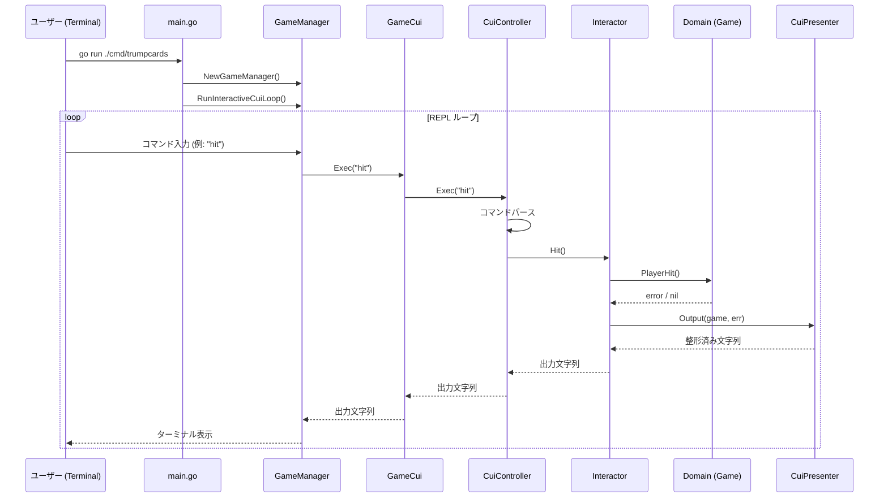
```mermaid
sequenceDiagram
    participant User as ユーザー (Terminal)
    participant Main as main.go
    participant GM as GameManager
    participant Cui as GameCui
    participant Ctrl as CuiController
    participant Interactor as Interactor
    participant Domain as Domain (Game)
    participant Pres as CuiPresenter

    User->>Main: go run ./cmd/trumpcards
    Main->>GM: NewGameManager()
    Main->>GM: RunInteractiveCuiLoop()

    loop REPL ループ
        User->>GM: コマンド入力 (例: "hit")
        GM->>Cui: Exec("hit")
        Cui->>Ctrl: Exec("hit")
        Ctrl->>Ctrl: コマンドパース
        Ctrl->>Interactor: Hit()
        Interactor->>Domain: PlayerHit()
        Domain-->>Interactor: error / nil
        Interactor->>Pres: Output(game, err)
        Pres-->>Interactor: 整形済み文字列
        Interactor-->>Ctrl: 出力文字列
        Ctrl-->>Cui: 出力文字列
        Cui-->>GM: 出力文字列
        GM-->>User: ターミナル表示
    end
```

### 2.2 Web APIゲーム実行フロー

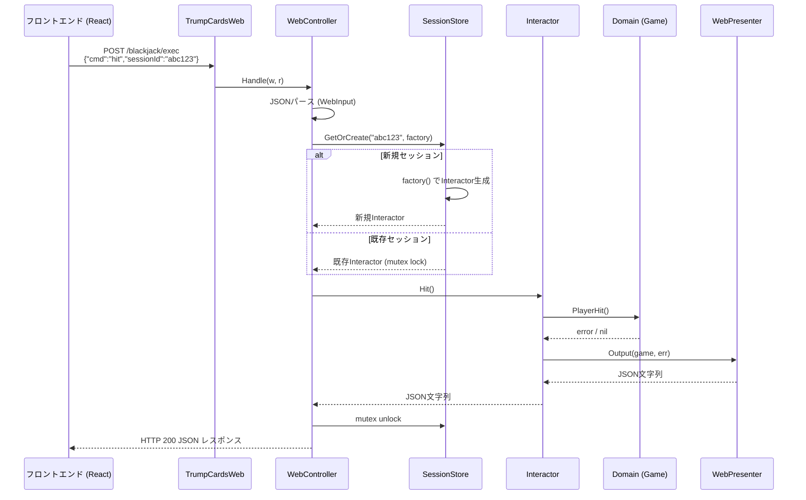
```mermaid
sequenceDiagram
    participant Client as フロントエンド (React)
    participant Server as TrumpCardsWeb
    participant WebCtrl as WebController
    participant Store as SessionStore
    participant Interactor as Interactor
    participant Domain as Domain (Game)
    participant Pres as WebPresenter

    Client->>Server: POST /blackjack/exec<br/>{"cmd":"hit","sessionId":"abc123"}
    Server->>WebCtrl: Handle(w, r)
    WebCtrl->>WebCtrl: JSONパース (WebInput)

    WebCtrl->>Store: GetOrCreate("abc123", factory)
    alt 新規セッション
        Store->>Store: factory() でInteractor生成
        Store-->>WebCtrl: 新規Interactor
    else 既存セッション
        Store-->>WebCtrl: 既存Interactor (mutex lock)
    end

    WebCtrl->>Interactor: Hit()
    Interactor->>Domain: PlayerHit()
    Domain-->>Interactor: error / nil
    Interactor->>Pres: Output(game, err)
    Pres-->>Interactor: JSON文字列
    Interactor-->>WebCtrl: JSON文字列
    WebCtrl->>Store: mutex unlock
    WebCtrl-->>Client: HTTP 200 JSON レスポンス
```

### 2.3 セッション管理フロー

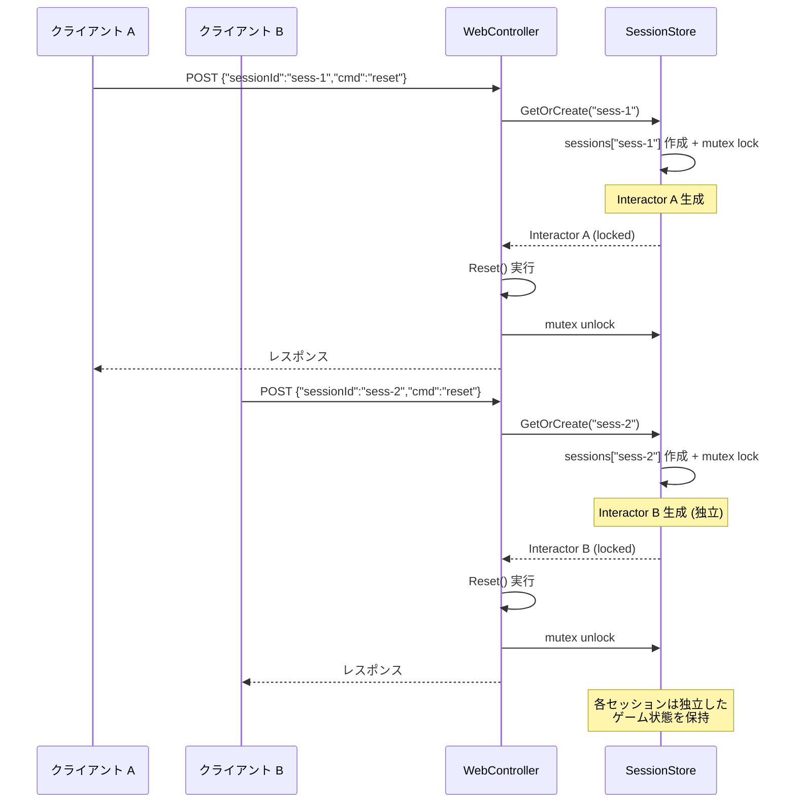
```mermaid
sequenceDiagram
    participant C1 as クライアント A
    participant C2 as クライアント B
    participant WebCtrl as WebController
    participant Store as SessionStore

    C1->>WebCtrl: POST {"sessionId":"sess-1","cmd":"reset"}
    WebCtrl->>Store: GetOrCreate("sess-1")
    Store->>Store: sessions["sess-1"] 作成 + mutex lock
    Note over Store: Interactor A 生成
    Store-->>WebCtrl: Interactor A (locked)
    WebCtrl->>WebCtrl: Reset() 実行
    WebCtrl->>Store: mutex unlock
    WebCtrl-->>C1: レスポンス

    C2->>WebCtrl: POST {"sessionId":"sess-2","cmd":"reset"}
    WebCtrl->>Store: GetOrCreate("sess-2")
    Store->>Store: sessions["sess-2"] 作成 + mutex lock
    Note over Store: Interactor B 生成 (独立)
    Store-->>WebCtrl: Interactor B (locked)
    WebCtrl->>WebCtrl: Reset() 実行
    WebCtrl->>Store: mutex unlock
    WebCtrl-->>C2: レスポンス

    Note over Store: 各セッションは独立した<br/>ゲーム状態を保持
```

---

## 3. ステートマシン図

### 3.1 BlackJack フェーズ遷移

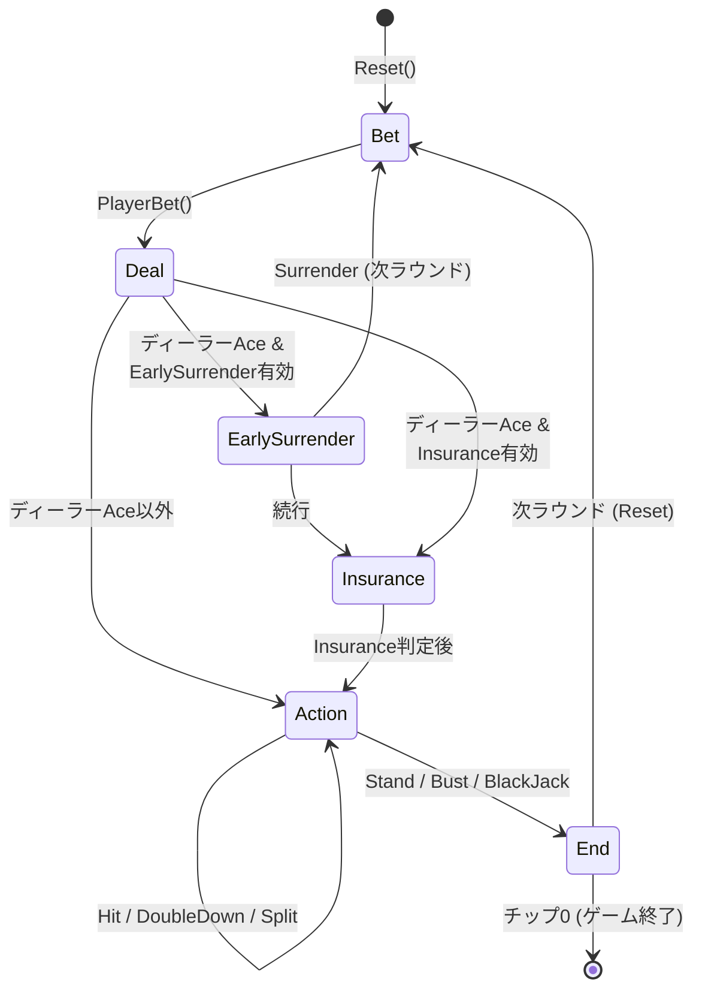
```mermaid
stateDiagram-v2
    [*] --> Bet : Reset()
    Bet --> Deal : PlayerBet()
    Deal --> EarlySurrender : ディーラーAce &<br/>EarlySurrender有効
    EarlySurrender --> Bet : Surrender (次ラウンド)
    EarlySurrender --> Insurance : 続行
    Deal --> Insurance : ディーラーAce &<br/>Insurance有効
    Deal --> Action : ディーラーAce以外
    Insurance --> Action : Insurance判定後
    Action --> Action : Hit / DoubleDown / Split
    Action --> End : Stand / Bust / BlackJack
    End --> Bet : 次ラウンド (Reset)
    End --> [*] : チップ0 (ゲーム終了)
```

### 3.2 Poker フェーズ遷移

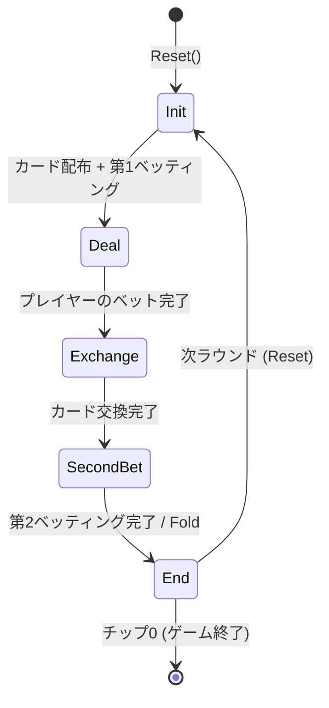
```mermaid
stateDiagram-v2
    [*] --> Init : Reset()
    Init --> Deal : カード配布 + 第1ベッティング
    Deal --> Exchange : プレイヤーのベット完了
    Exchange --> SecondBet : カード交換完了
    SecondBet --> End : 第2ベッティング完了 / Fold
    End --> Init : 次ラウンド (Reset)
    End --> [*] : チップ0 (ゲーム終了)
```

### 3.3 Texas Hold'em フェーズ遷移

Omaha Hold'em も同一のフェーズ遷移を共有します。

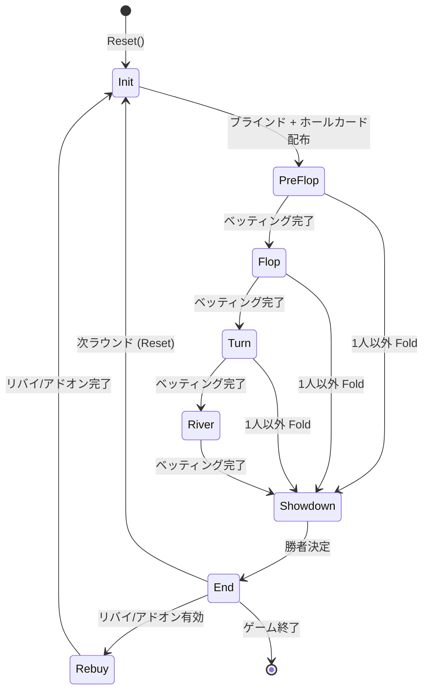
```mermaid
stateDiagram-v2
    [*] --> Init : Reset()
    Init --> PreFlop : ブラインド + ホールカード配布
    PreFlop --> Flop : ベッティング完了
    PreFlop --> Showdown : 1人以外 Fold
    Flop --> Turn : ベッティング完了
    Flop --> Showdown : 1人以外 Fold
    Turn --> River : ベッティング完了
    Turn --> Showdown : 1人以外 Fold
    River --> Showdown : ベッティング完了
    Showdown --> End : 勝者決定
    End --> Rebuy : リバイ/アドオン有効
    End --> Init : 次ラウンド (Reset)
    Rebuy --> Init : リバイ/アドオン完了
    End --> [*] : ゲーム終了
```

### 3.4 Hearts フェーズ遷移

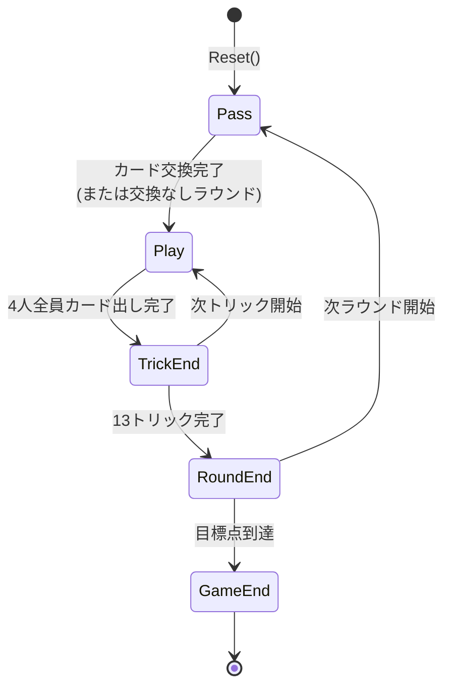
```mermaid
stateDiagram-v2
    [*] --> Pass : Reset()
    Pass --> Play : カード交換完了<br/>(または交換なしラウンド)
    Play --> TrickEnd : 4人全員カード出し完了
    TrickEnd --> Play : 次トリック開始
    TrickEnd --> RoundEnd : 13トリック完了
    RoundEnd --> Pass : 次ラウンド開始
    RoundEnd --> GameEnd : 目標点到達
    GameEnd --> [*]
```

### 3.5 Spades フェーズ遷移

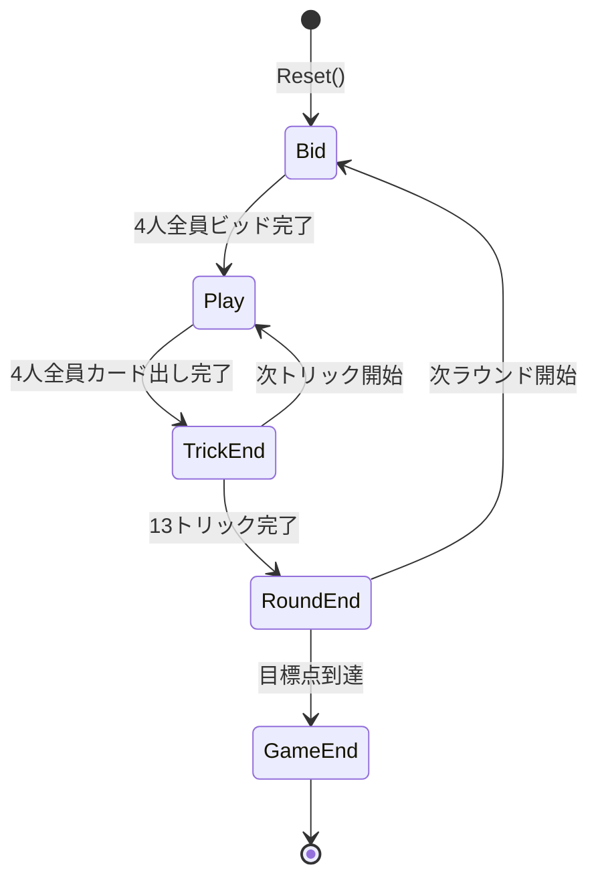
```mermaid
stateDiagram-v2
    [*] --> Bid : Reset()
    Bid --> Play : 4人全員ビッド完了
    Play --> TrickEnd : 4人全員カード出し完了
    TrickEnd --> Play : 次トリック開始
    TrickEnd --> RoundEnd : 13トリック完了
    RoundEnd --> Bid : 次ラウンド開始
    RoundEnd --> GameEnd : 目標点到達
    GameEnd --> [*]
```

### 3.6 Doubt フェーズ遷移

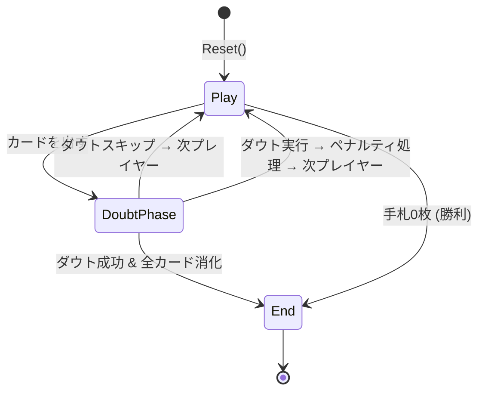
```mermaid
stateDiagram-v2
    [*] --> Play : Reset()
    Play --> DoubtPhase : カードを出す
    DoubtPhase --> Play : ダウトスキップ → 次プレイヤー
    DoubtPhase --> Play : ダウト実行 → ペナルティ処理 → 次プレイヤー
    DoubtPhase --> End : ダウト成功 & 全カード消化
    Play --> End : 手札0枚 (勝利)
    End --> [*]
```

### 3.7 Memory フェーズ遷移

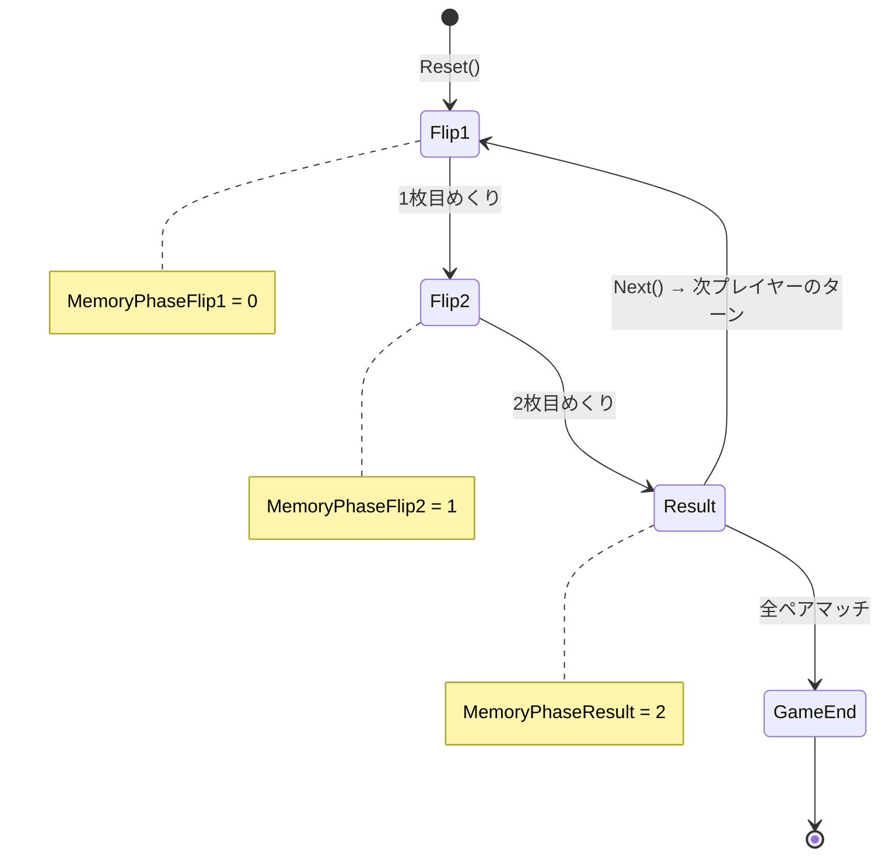
```mermaid
stateDiagram-v2
    [*] --> Flip1 : Reset()
    Flip1 --> Flip2 : 1枚目めくり
    Flip2 --> Result : 2枚目めくり
    Result --> Flip1 : Next() → 次プレイヤーのターン
    Result --> GameEnd : 全ペアマッチ
    GameEnd --> [*]

    note right of Flip1 : MemoryPhaseFlip1 = 0
    note right of Flip2 : MemoryPhaseFlip2 = 1
    note right of Result : MemoryPhaseResult = 2
```

### 3.8 Klondike / FreeCell / Spider フェーズ遷移

3つのソリティア系ゲームは共通のフェーズ構造を持ちます。

```mermaid
stateDiagram-v2
    [*] --> Playing : Reset()
    Playing --> Playing : Move / Draw / Deal / Undo
    Playing --> GameClear : 全カードをFoundationに配置
    Playing --> GameClear : Autocomplete成功
    Playing --> GameOver : GiveUp
    GameClear --> [*]
    GameOver --> [*]
```

### 3.9 CrazyEights フェーズ遷移

```mermaid
stateDiagram-v2
    [*] --> Play : Reset()
    Play --> Play : カードを出す / ドローする
    Play --> ChooseSuit : 8を出す
    ChooseSuit --> Play : スート選択完了
    Play --> RoundEnd : 手札0枚 (勝ち上がり)
    RoundEnd --> Play : NextRound()
    RoundEnd --> GameEnd : 目標点到達
    GameEnd --> [*]
```

### 3.10 GinRummy フェーズ遷移

```mermaid
stateDiagram-v2
    [*] --> Draw : Reset()
    Draw --> Discard : カードを引く (山札 or 捨て札)
    Discard --> Draw : カードを捨てる → 次プレイヤー
    Discard --> Layoff : ノック宣言
    Discard --> RoundEnd : ジン宣言
    Layoff --> RoundEnd : レイオフ完了
    RoundEnd --> Draw : NextRound()
    RoundEnd --> GameEnd : 目標点到達
    GameEnd --> [*]
```

### 3.11 Baccarat フェーズ遷移

```mermaid
stateDiagram-v2
    [*] --> Bet : Reset()
    Bet --> End : ベット → 自動カード配布 → 結果判定
    End --> Bet : 次ラウンド (Reset)
    End --> [*] : チップ0 (ゲーム終了)
```

**注:** OldMaid・Daifugo・Sevens は明示的なフェーズ定数を持たず、ターン制で進行します (currentTurn が巡回し、全プレイヤーの手札が0枚またはランク確定で終了)。
