# バックエンド設計ドキュメント (UML)

本ドキュメントは go_trumpcards バックエンドシステムの設計をMermaid記法で可視化したものです。

## 目次

- [1. クラス図](#1-クラス図)
  - [1.1 コアドメイン (カード・プレイヤー)](#11-コアドメイン-カードプレイヤー)
  - [1.2 ゲームドメイン (全62ゲーム)](#12-ゲームドメイン-全62ゲーム)
  - [1.3 ユースケース層 (Interactor・Presenter)](#13-ユースケース層-interactorpresenter)
  - [1.4 アダプタ層 (Controller・Presenter実装)](#14-アダプタ層-controllerpresenter実装)
  - [1.5 インフラストラクチャ層](#15-インフラストラクチャ層)
- [2. シーケンス図](#2-シーケンス図)
  - [2.1 CUIゲーム実行フロー](#21-cuiゲーム実行フロー)
  - [2.2 Web APIゲーム実行フロー](#22-web-apiゲーム実行フロー)
  - [2.3 セッション管理フロー](#23-セッション管理フロー)
  - [2.4 VideoPoker ベット・ホールドフロー](#24-videopoker-ベットホールドフロー)
  - [2.5 ThreeCard ベット・プレイフロー](#25-threecard-ベットプレイフロー)
  - [2.6 OhHell ビッド・トリックフロー](#26-ohhell-ビッドトリックフロー)
  - [2.7 Bridge オークション・トリックフロー](#27-bridge-オークショントリックフロー)
  - [2.8 Pineapple ディスカードフロー](#28-pineapple-ディスカードフロー)
  - [2.9 Speed プレイフロー](#29-speed-プレイフロー)
  - [2.10 GoFish 要求フロー](#210-gofish-要求フロ���)
  - [2.11 PigsTail ドローフロー](#211-pigstail-ドローフロー)
  - [2.12 FiftyOne 交換フロー](#212-fiftyone-交換フロー)
  - [2.17 Yukon ムーブフロー](#217-yukon-ムーブフロー)
  - [2.13 SevenCardStud ベッティングフロー](#213-sevencardstud-ベッティングフロー)
  - [2.14 Durak アタック・ディフェンスフロー](#214-durak-アタックディフェンスフロー)
  - [2.15 FortyThieves ドロー・ムーブフロー](#215-fortythieves-ドロームーブフロー)
  - [2.16 PaiGow ベット・セットフロー](#216-paigow-ベットセットフロー)
  - [2.17 RedDog ベット・スプレッドフロー](#217-reddog-ベットスプレッドフロー)
- [3. ステートマシン図](#3-ステートマシン図)
  - [3.1 BlackJack フェーズ遷移](#31-blackjack-フェーズ遷移)
  - [3.2 Poker フェーズ遷移](#32-poker-フェーズ遷移)
  - [3.3 Texas Hold'em フェーズ遷移](#33-texas-holdem-フェーズ遷移)
  - [3.4 Hearts フェーズ遷移](#34-hearts-フェーズ遷移)
  - [3.5 Spades フェーズ遷移](#35-spades-フェーズ遷移)
  - [3.5.1 TwoTenJack フェーズ遷移](#351-twotenjack-フェーズ遷移)
  - [3.6 Doubt フェーズ遷移](#36-doubt-フェーズ遷移)
  - [3.7 Memory フェーズ遷移](#37-memory-フェーズ遷移)
  - [3.8 Klondike / FreeCell / Spider / Pyramid / TriPeaks / Golf / ClockSolitaire フェーズ遷移](#38-klondike--freecell--spider--pyramid--tripeaks--golf--clocksolitaire-フェーズ遷移)
  - [3.9 CrazyEights フェーズ遷移](#39-crazyeights-フェーズ遷移)
  - [3.10 GinRummy フェーズ遷移](#310-ginrummy-フェーズ遷移)
  - [3.11 Baccarat フェーズ遷移](#311-baccarat-フェーズ遷移)
  - [3.12 Napoleon フェーズ遷移](#312-napoleon-フェーズ遷移)
  - [3.13 IndianPoker フェーズ遷移](#313-indianpoker-フェーズ遷移)
  - [3.14 VideoPoker フェーズ遷移](#314-videopoker-フェーズ遷移)
  - [3.15 Euchre フェーズ遷移](#315-euchre-フェーズ遷移)
  - [3.16 Cribbage フェーズ遷移](#316-cribbage-フェーズ遷移)
  - [3.17 ShortDeck フェーズ遷移](#317-shortdeck-フェーズ遷移)
  - [3.18 ThreeCard フェーズ遷移](#318-threecard-フェーズ遷移)
  - [3.19 OhHell フェーズ遷移](#319-ohhell-フェーズ遷移)
  - [3.20 Bridge フェーズ遷移](#320-bridge-フェーズ遷移)
  - [3.21 Pineapple フェーズ遷移](#321-pineapple-フェーズ遷移)
  - [3.22 Speed フェーズ遷移](#322-speed-フェーズ遷移)
  - [3.23 GoFish フェーズ遷移](#323-gofish-フェーズ遷移)
  - [3.24 Canasta フェーズ遷移](#324-canasta-フェーズ遷移)
  - [3.25 Pinochle フェーズ遷移](#325-pinochle-フェーズ遷移)
  - [3.26 PigsTail フェーズ遷移](#326-pigstail-フェーズ遷移)
  - [3.27 SevenCardStud フェーズ遷移](#327-sevencardstud-フェーズ遷移)
  - [3.28 Durak フェーズ遷移](#328-durak-フェーズ遷移)
  - [3.29 FortyThieves フェーズ遷移](#329-fortythieves-フェーズ遷移)
  - [3.30 PaiGow フェーズ遷移](#330-paigow-フェーズ遷移)
  - [3.31 FiftyOne フェーズ遷移](#331-fiftyone-フェーズ遷移)
  - [3.32 Yukon フェーズ遷移](#332-yukon-フェーズ遷移)
  - [3.33 Whist フェーズ遷移](#333-whist-フェーズ遷移)
  - [3.34 Canfield フェーズ遷移](#334-canfield-フェーズ遷移)
  - [3.35 CaribbeanStud フェーズ遷移](#335-caribbeanstud-フェーズ遷移)
  - [3.36 War フェーズ遷移](#336-war-フェーズ遷移)
  - [3.37 LetItRide フェーズ遷移](#337-letitride-フェーズ遷移)
  - [3.38 PokerSquares フェーズ遷移](#338-pokersquares-フェーズ遷移)
  - [3.39 RedDog フェーズ遷移](#339-reddog-フェーズ遷移)
  - [3.40 Scorpion フェーズ遷移](#340-scorpion-フェーズ遷移)

---

## 1. クラス図

### 1.1 コアドメイン (カード・プレイヤー)

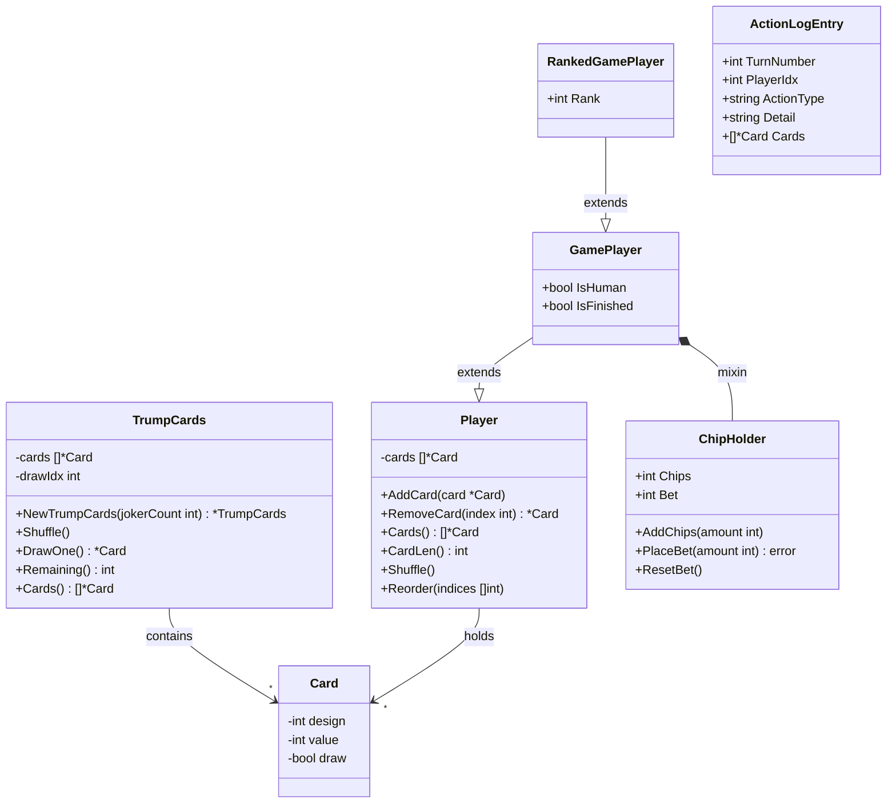
```mermaid
classDiagram
    class Card {
        -int design
        -int value
        -bool draw
    }

    class TrumpCards {
        -cards []*Card
        -drawIdx int
        +NewTrumpCards(jokerCount int) *TrumpCards
        +Shuffle()
        +DrawOne() *Card
        +Remaining() int
        +Cards() []*Card
    }

    class Player {
        -cards []*Card
        +AddCard(card *Card)
        +RemoveCard(index int) *Card
        +Cards() []*Card
        +CardLen() int
        +Shuffle()
        +Reorder(indices []int)
    }

    class GamePlayer {
        +bool IsHuman
        +bool IsFinished
    }

    class RankedGamePlayer {
        +int Rank
    }

    class ChipHolder {
        +int Chips
        +int Bet
        +AddChips(amount int)
        +PlaceBet(amount int) error
        +ResetBet()
    }

    class ActionLogEntry {
        +int TurnNumber
        +int PlayerIdx
        +string ActionType
        +string Detail
        +[]*Card Cards
    }

    TrumpCards --> "*" Card : contains
    Player --> "*" Card : holds
    GamePlayer --|> Player : extends
    RankedGamePlayer --|> GamePlayer : extends
    GamePlayer *-- ChipHolder : mixin
```

### 1.2 ゲームドメイン (全62ゲーム)

#### ベッティング系ゲーム

```mermaid
classDiagram
    class BlackJack {
        -trumpCards *TrumpCards
        -players []*BlackJackPlayer
        -config BlackJackConfig
        -phase int
        +Reset()
        +PlayerBet(amount int) error
        +PlayerHit() error
        +PlayerStand() error
        +PlayerDoubleDown() error
        +PlayerSplit() error
        +PlayerInsurance(accept bool) error
        +PlayerSurrender() error
        +Phase() int
        +ActionLog() []*ActionLogEntry
    }

    class BlackJackPlayer {
        -hands []*BlackJackHand
        -cpuSeat *BlackJackCpuSeat
    }

    class BlackJackHand {
        +[]*Card Cards
        +int Bet
        +bool IsStand
        +bool IsBusted
    }

    class BlackJackConfig {
        +int DeckCount
        +bool AllowDoubleDown
        +bool AllowSplit
        +bool AllowInsurance
        +bool AllowSurrender
        +bool AllowEarlySurrender
    }

    class Poker {
        -trumpCards *TrumpCards
        -players []*PokerPlayer
        -config PokerConfig
        -dealerIdx int
        -humanProfile *BettingHumanProfile
        -round pokerRoundState
        +Reset()
        +PlayerExchange(indices []int) error
        +PlayerFold() error
        +PlayerCheck() error
        +PlayerCall() error
        +PlayerBet(amount int) error
        +PlayerRaise(amount int) error
        +PlayerAllIn() error
        +Phase() int
    }

    class Baccarat {
        -trumpCards *TrumpCards
        -playerHand []*Card
        -bankerHand []*Card
        -phase int
        +Reset()
        +PlayerBet(betType string, amount int) error
        +Phase() int
    }

    class VideoPoker {
        -trumpCards *TrumpCards
        -hand []*Card
        -heldIndices []int
        -phase int
        -betAmount int
        -handRank int
        -handName string
        -payout int
        -variantConfig *VideoPokerVariantConfig
        +Reset()
        +PlayerBet(amount int) error
        +PlayerHold(indices []int) error
        +Phase() int
        +ActionLog() []*ActionLogEntry
    }

    class VideoPokerVariantConfig {
        +string Name
        +int DeckSize
        +bool UseJoker
        +func IsWild func(*Card) bool
        +func EvalHand func([]*Card) (int, string)
        +func PayTable func(int, int) int
        +func MinQualifying func(int) bool
    }

    BlackJack --> "*" BlackJackPlayer
    BlackJack --> "1" BlackJackConfig
    BlackJackPlayer --|> GamePlayer
    BlackJackPlayer --> "*" BlackJackHand
    BlackJackPlayer --> "1" ChipHolder
    Poker --> "*" PokerPlayer
    class ThreeCard {
        -trumpCards *TrumpCards
        -playerHand []*Card
        -dealerHand []*Card
        -phase int
        -anteBet int
        -pairPlusBet int
        -playBet int
        +Reset()
        +PlayerBet(amount int, pairPlusBet int) error
        +PlayerPlay() error
        +PlayerFold() error
        +Phase() int
        +ActionLog() []*ActionLogEntry
    }

    class CaribbeanStud {
        -trumpCards *TrumpCards
        -playerHand []*Card
        -dealerHand []*Card
        -phase int
        -anteBet int
        -jackpotBet int
        -playBet int
        +Reset()
        +Bet(ante int, jackpot int) error
        +Play() error
        +Fold() error
        +GetPhase() int
        +GetActionLog() []*ActionLogEntry
    }

    CaribbeanStud --> "1" TrumpCards
    CaribbeanStud --> "1" ChipHolder

    class LetItRide {
        -trumpCards *TrumpCards
        -playerHand []*Card
        -communityCards []*Card
        -phase int
        -betAmount int
        -bet1Active bool
        -bet2Active bool
        -bet3Active bool
        +Reset()
        +Bet(amount int) error
        +Pull() error
        +LetItRide() error
        +GetPhase() int
        +GetActionLog() []*ActionLogEntry
    }

    LetItRide --> "1" TrumpCards
    LetItRide --> "1" ChipHolder

    class PokerSquares {
        -trumpCards *TrumpCards
        -board [5][5]*Card
        -currentCard *Card
        -placedCount int
        -phase PokerSquaresPhase
        -history []PokerSquaresMove
        +Reset()
        +Place(row int, col int) error
        +Undo() error
        +GiveUp()
        +GetBoard() [5][5]*Card
        +GetCurrentCard() *Card
        +GetPhase() PokerSquaresPhase
        +RowScore(row int) int
        +ColScore(col int) int
        +TotalScore() int
        +CanUndo() bool
        +GetActionLog() []*ActionLogEntry
    }

    PokerSquares --> "1" TrumpCards

    class PaiGow {
        -trumpCards *TrumpCards
        -playerCards []*Card
        -dealerCards []*Card
        -playerHighHand []*Card
        -playerLowHand []*Card
        -dealerHighHand []*Card
        -dealerLowHand []*Card
        -phase int
        -bet int
        +Reset()
        +PlayerBet(amount int) error
        +PlayerSet(low0 int, low1 int) error
        +Phase() int
        +ActionLog() []*ActionLogEntry
    }

    Baccarat --> "1" TrumpCards
    ThreeCard --> "1" TrumpCards
    ThreeCard --> "1" ChipHolder
    PaiGow --> "1" TrumpCards
    PaiGow --> "1" ChipHolder
    VideoPoker --> "1" TrumpCards
    VideoPoker --> "1" ChipHolder
    VideoPoker --> "0..1" VideoPokerVariantConfig

    class RedDog {
        -trumpCards *TrumpCards
        -initialCards []*Card
        -thirdCard *Card
        -chips ChipHolder
        -ante int
        -raise int
        -spread int
        -phase int
        +Reset()
        +Bet(amount int) error
        +ResolveInitial()
        +Raise(amount int) error
        +Stay()
        +ResolveThird()
        +GetPhase() int
        +GetActionLog() []*ActionLogEntry
    }

    RedDog --> "1" TrumpCards
    RedDog --> "1" ChipHolder

    note for VideoPokerVariantConfig "DeucesWild・JokerPoker は独立したドメインクラスを持たず\nVideoPokerVariantConfig のファクトリ関数\n(DeucesWildConfig / JokerPokerConfig) として実装"
```

#### トリックテイキング系ゲーム

```mermaid
classDiagram
    class Hearts {
        -trumpCards *TrumpCards
        -players []*HeartsPlayer
        -config HeartsConfig
        -phase HeartsPhase
        -trickCards []*HeartsTrickCard
        +Reset()
        +PassCards(indices []int) error
        +PlayCard(index int) error
        +NextTrick() error
        +NextRound() error
        +Hint() *HeartsHint
        +Phase() HeartsPhase
    }

    class Spades {
        -trumpCards *TrumpCards
        -players []*SpadesPlayer
        -config SpadesConfig
        -phase SpadesPhase
        -trickCards []*SpadesTrickCard
        +Reset()
        +Bid(amount int) error
        +PlayCard(index int) error
        +NextTrick() error
        +NextRound() error
        +Hint() *SpadesHint
        +Phase() SpadesPhase
    }

    class HeartsTrickCard {
        +int PlayerIdx
        +*Card Card
    }

    class SpadesTrickCard {
        +int PlayerIdx
        +*Card Card
    }

    class Napoleon {
        -trumpCards *TrumpCards
        -players []*NapoleonPlayer
        -config NapoleonConfig
        -round napoleonRoundState
        +Reset()
        +Bid(amount int) error
        +DeclareTrump(suit int) error
        +Exchange(indices []int) error
        +PlayCard(index int) error
        +NextTrick() error
        +NextRound() error
        +Hint() *NapoleonHint
        +Phase() NapoleonPhase
    }

    class NapoleonTrickCard {
        +int PlayerIdx
        +*Card Card
    }

    class Euchre {
        -trumpCards *TrumpCards
        -players []*EuchrePlayer
        -config EuchreConfig
        -phase EuchrePhase
        -trickCards []*EuchreTrickCard
        -turnedUpCard *Card
        -trumpSuit int
        -dealerIdx int
        +Reset()
        +OrderUp(alone bool) error
        +Pass() error
        +CallTrump(suit int, alone bool) error
        +Discard(index int) error
        +PlayCard(index int) error
        +NextTrick() error
        +NextRound() error
        +Hint() *EuchreHint
        +Phase() EuchrePhase
    }

    class EuchreTrickCard {
        +int PlayerIdx
        +*Card Card
    }

    class OhHell {
        -trumpCards *TrumpCards
        -players []*OhHellPlayer
        -config OhHellConfig
        -phase OhHellPhase
        -trickCards []*OhHellTrickCard
        -trumpCard *Card
        -trumpSuit int
        -handSize int
        +Reset()
        +PlayerBid(bid int) error
        +PlayerPlay(cardIndex int) error
        +NextTrick()
        +NextRound()
        +ScoreRound()
        +GetHint() *OhHellHint
        +GetPhase() OhHellPhase
    }

    class OhHellTrickCard {
        +int PlayerIdx
        +*Card Card
    }

    class Bridge {
        -trumpCards *TrumpCards
        -players []*BridgePlayer
        -config BridgeConfig
        -phase BridgePhase
        -trickCards []*BridgeTrickCard
        -trumpSuit int
        -contractLevel int
        -contractSuit int
        -declarerIdx int
        -dummyIdx int
        -vulnerability [2]bool
        +Reset()
        +Bid(bidType int, level int, suit int) error
        +PlayCard(index int) error
        +NextTrick() error
        +NextRound() error
        +Hint() *BridgeHint
        +Phase() BridgePhase
    }

    class BridgeTrickCard {
        +int PlayerIdx
        +*Card Card
    }

    class TwoTenJack {
        -trumpCards *TrumpCards
        -players []*TwoTenJackPlayer
        -config TwoTenJackConfig
        -phase TwoTenJackPhase
        -currentTrick []*TwoTenJackTrickCard
        -declarerIdx int
        -trumpSuit int
        +Reset()
        +PlayerDeclareTrump(suit int) error
        +CpuDeclareTrump()
        +PlayerPlay(cardIndex int) error
        +ResolveTrick()
        +NextTrick()
        +ScoreRound()
        +GetHint() *TwoTenJackHint
        +GetPhase() TwoTenJackPhase
    }

    class TwoTenJackTrickCard {
        +int PlayerIdx
        +*Card Card
    }

    Hearts --> "4" HeartsPlayer
    Hearts --> "*" HeartsTrickCard
    Spades --> "4" SpadesPlayer
    Spades --> "*" SpadesTrickCard
    Napoleon --> "4" NapoleonPlayer
    Napoleon --> "*" NapoleonTrickCard
    Euchre --> "4" EuchrePlayer
    Euchre --> "*" EuchreTrickCard
    OhHell --> "4" OhHellPlayer
    OhHell --> "*" OhHellTrickCard
    Bridge --> "4" BridgePlayer
    Bridge --> "*" BridgeTrickCard
    TwoTenJack --> "4" TwoTenJackPlayer
    TwoTenJack --> "*" TwoTenJackTrickCard
    HeartsPlayer --|> GamePlayer
    SpadesPlayer --|> GamePlayer
    NapoleonPlayer --|> GamePlayer
    EuchrePlayer --|> GamePlayer
    OhHellPlayer --|> GamePlayer
    BridgePlayer --|> GamePlayer
    TwoTenJackPlayer --|> GamePlayer
```

#### ホールデム系ゲーム

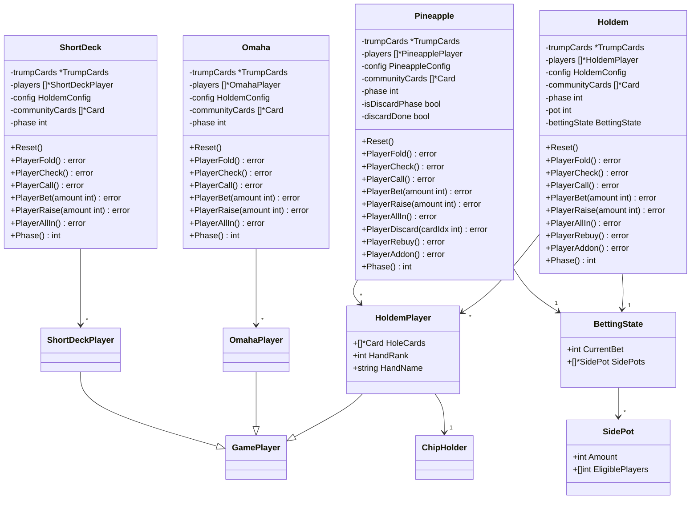
```mermaid
classDiagram
    class Holdem {
        -trumpCards *TrumpCards
        -players []*HoldemPlayer
        -config HoldemConfig
        -communityCards []*Card
        -phase int
        -pot int
        -bettingState BettingState
        +Reset()
        +PlayerFold() error
        +PlayerCheck() error
        +PlayerCall() error
        +PlayerBet(amount int) error
        +PlayerRaise(amount int) error
        +PlayerAllIn() error
        +PlayerRebuy() error
        +PlayerAddon() error
        +Phase() int
    }

    class Omaha {
        -trumpCards *TrumpCards
        -players []*OmahaPlayer
        -config HoldemConfig
        -communityCards []*Card
        -phase int
        +Reset()
        +PlayerFold() error
        +PlayerCheck() error
        +PlayerCall() error
        +PlayerBet(amount int) error
        +PlayerRaise(amount int) error
        +PlayerAllIn() error
        +Phase() int
    }

    class HoldemPlayer {
        +[]*Card HoleCards
        +int HandRank
        +string HandName
    }

    class BettingState {
        +int CurrentBet
        +[]*SidePot SidePots
    }

    class SidePot {
        +int Amount
        +[]int EligiblePlayers
    }

    Holdem --> "*" HoldemPlayer
    Holdem --> "1" BettingState
    BettingState --> "*" SidePot
    HoldemPlayer --|> GamePlayer
    HoldemPlayer --> "1" ChipHolder
    Omaha --> "*" OmahaPlayer
    OmahaPlayer --|> GamePlayer

    class ShortDeck {
        -trumpCards *TrumpCards
        -players []*ShortDeckPlayer
        -config HoldemConfig
        -communityCards []*Card
        -phase int
        +Reset()
        +PlayerFold() error
        +PlayerCheck() error
        +PlayerCall() error
        +PlayerBet(amount int) error
        +PlayerRaise(amount int) error
        +PlayerAllIn() error
        +Phase() int
    }

    ShortDeck --> "*" ShortDeckPlayer
    ShortDeckPlayer --|> GamePlayer

    class Pineapple {
        -trumpCards *TrumpCards
        -players []*PineapplePlayer
        -config PineappleConfig
        -communityCards []*Card
        -phase int
        -isDiscardPhase bool
        -discardDone bool
        +Reset()
        +PlayerFold() error
        +PlayerCheck() error
        +PlayerCall() error
        +PlayerBet(amount int) error
        +PlayerRaise(amount int) error
        +PlayerAllIn() error
        +PlayerDiscard(cardIdx int) error
        +PlayerRebuy() error
        +PlayerAddon() error
        +Phase() int
    }

    Pineapple --> "*" HoldemPlayer
    Pineapple --> "1" BettingState
```

#### インディアンポーカー

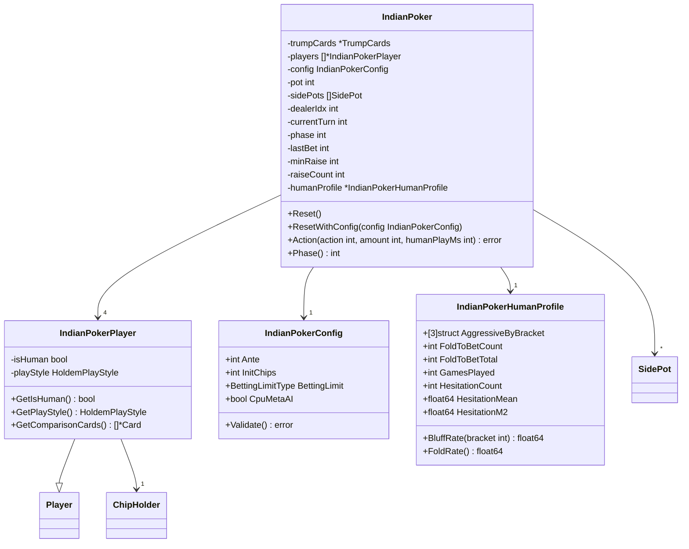
```mermaid
classDiagram
    class IndianPoker {
        -trumpCards *TrumpCards
        -players []*IndianPokerPlayer
        -config IndianPokerConfig
        -pot int
        -sidePots []SidePot
        -dealerIdx int
        -currentTurn int
        -phase int
        -lastBet int
        -minRaise int
        -raiseCount int
        -humanProfile *IndianPokerHumanProfile
        +Reset()
        +ResetWithConfig(config IndianPokerConfig)
        +Action(action int, amount int, humanPlayMs int) error
        +Phase() int
    }

    class IndianPokerPlayer {
        -isHuman bool
        -playStyle HoldemPlayStyle
        +GetIsHuman() bool
        +GetPlayStyle() HoldemPlayStyle
        +GetComparisonCards() []*Card
    }

    class IndianPokerConfig {
        +int Ante
        +int InitChips
        +BettingLimitType BettingLimit
        +bool CpuMetaAI
        +Validate() error
    }

    class IndianPokerHumanProfile {
        +[3]struct AggressiveByBracket
        +int FoldToBetCount
        +int FoldToBetTotal
        +int GamesPlayed
        +int HesitationCount
        +float64 HesitationMean
        +float64 HesitationM2
        +BluffRate(bracket int) float64
        +FoldRate() float64
    }

    IndianPoker --> "4" IndianPokerPlayer
    IndianPoker --> "1" IndianPokerConfig
    IndianPoker --> "*" SidePot
    IndianPoker --> "1" IndianPokerHumanProfile
    IndianPokerPlayer --|> Player
    IndianPokerPlayer --> "1" ChipHolder
```

#### 手札系ゲーム

```mermaid
classDiagram
    class OldMaid {
        -trumpCards *TrumpCards
        -players []*OldMaidPlayer
        -config OldMaidConfig
        -currentTurn int
        +Reset()
        +Draw(index int) error
        +Phase() int
    }

    class Daifugo {
        -trumpCards *TrumpCards
        -players []*DaifugoPlayer
        -config DaifugoConfig
        -sortMode DaifugoSortMode
        -round daifugoRoundState
        +Reset()
        +Play(indices []int) error
        +Pass() error
        +Sort(mode int)
        +Phase() int
    }

    class Sevens {
        -trumpCards *TrumpCards
        -players []*SevensPlayer
        -config SevensConfig
        -currentTurn int
        -tablePlaced [5]uint16
        +Reset()
        +Play(cardIdx int) error
        +PlayJoker(suit int, value int) error
        +Phase() int
    }

    class Doubt {
        -trumpCards *TrumpCards
        -players []*DoubtPlayer
        -config DoubtConfig
        -phase DoubtPhase
        -currentTurn int
        -tableCards []*Card
        +Reset()
        +Play(indices []int) error
        +Doubt() *DoubtDoubtResult
        +SkipDoubt()
        +Phase() DoubtPhase
    }

    class CrazyEights {
        -trumpCards *TrumpCards
        -players []*CrazyEightsPlayer
        -config CrazyEightsConfig
        -phase CrazyEightsPhase
        -discardPile []*Card
        +Reset()
        +Play(index int) error
        +Draw() error
        +ChooseSuit(suit int) error
        +NextRound() error
        +Phase() CrazyEightsPhase
    }

    class GinRummy {
        -trumpCards *TrumpCards
        -players []*GinRummyPlayer
        -config GinRummyConfig
        -phase GinRummyPhase
        -discardPile []*Card
        +Reset()
        +DrawFromStock() error
        +DrawFromDiscard() error
        +Discard(index int) error
        +Knock() error
        +Layoff(indices []int) error
        +NextRound() error
        +Phase() GinRummyPhase
    }

    class Speed {
        -trumpCards *TrumpCards
        -players []*SpeedPlayer
        -config SpeedConfig
        -centerPiles [2]*Card
        -phase SpeedPhase
        +Reset()
        +Play(cardIndex int, pileIndex int) error
        +Flip() error
        +Hint() *SpeedHint
        +Phase() SpeedPhase
        +ActionLog() []*ActionLogEntry
    }

    class SpeedPlayer {
        -hand []*Card
        -drawPile []*Card
    }

    class SpeedConfig {
        +int HandSize
    }

    OldMaid --> "*" OldMaidPlayer
    Daifugo --> "*" DaifugoPlayer
    Sevens --> "*" SevensPlayer
    Doubt --> "*" DoubtPlayer
    CrazyEights --> "*" CrazyEightsPlayer
    GinRummy --> "2" GinRummyPlayer
    Speed --> "2" SpeedPlayer
    Speed --> "1" SpeedConfig

    class GoFish {
        -trumpCards *TrumpCards
        -players []*GoFishPlayer
        -config GoFishConfig
        -phase GoFishPhase
        -currentTurn int
        +Reset()
        +Ask(targetIdx int, rank int) error
        +Phase() GoFishPhase
        +ActionLog() []*ActionLogEntry
    }

    class GoFishPlayer {
        -books [][]*Card
        +GetBooks() [][]*Card
        +GetBookCount() int
        +HasRank(rank int) bool
    }

    class GoFishConfig {
        +GoFishCpuDifficulty CpuDifficulty
        +bool CpuMetaAI
    }

    GoFish --> "4" GoFishPlayer
    GoFish --> "1" GoFishConfig

    class Canasta {
        -trumpCards *TrumpCards
        -players []*CanastaPlayer
        -config CanastaConfig
        -phase CanastaPhase
        -discardPile []*Card
        -isFrozen bool
        +Reset()
        +DrawFromStock() error
        +DrawFromDiscard(pairIndices []int) error
        +Meld(groups [][]int) error
        +SkipMeld() error
        +Discard(index int) error
        +GoOut() error
        +NextRound()
        +Phase() CanastaPhase
    }

    class CanastaPlayer {
        -melds []*CanastaMeld
        -red3s []*Card
        -hasInitMeld bool
    }

    class CanastaMeld {
        +Cards []*Card
        +IsNatural bool
    }

    Canasta --> "2" CanastaPlayer
    CanastaPlayer --> "*" CanastaMeld
    CanastaPlayer --|> GamePlayer

    class Pinochle {
        -trumpCards *TrumpCards
        -players []*PinochlePlayer
        -config PinochleConfig
        -phase PinochlePhase
        -trumpSuit int
        -highestBid int
        -highestBidder int
        -playerMelds [4][]*PinochleMeld
        +Reset()
        +PlayerBid(amount int) error
        +PlayerPass() error
        +CpuBid()
        +PlayerCallTrump(suit int) error
        +CpuCallTrump()
        +ConfirmMelds()
        +PlayerPlay(cardIndex int) error
        +CpuPlay()
        +ResolveTrick()
        +NextTrick()
        +NextRound()
    }

    class PinochlePlayer {
        -team int
        -bid int
        -hasPassed bool
        -meldScore int
        -trickPoints int
    }

    Pinochle --> "4" PinochlePlayer
    PinochlePlayer --|> GamePlayer

    OldMaidPlayer --|> GamePlayer
    DaifugoPlayer --|> RankedGamePlayer
    SevensPlayer --|> RankedGamePlayer
    DoubtPlayer --|> GamePlayer
    CrazyEightsPlayer --|> GamePlayer
    GinRummyPlayer --|> GamePlayer
    SpeedPlayer --|> Player
    GoFishPlayer --|> GamePlayer

    class PigsTail {
        -trumpCards *TrumpCards
        -players []*PigsTailPlayer
        -center []*Card
        -currentTurn int
        -gameEndFlag bool
        +Reset()
        +Draw() error
        +GetGameEndFlag() bool
        +ActionLog() []*ActionLogEntry
    }

    class PigsTailPlayer {
        -penaltyCards []*Card
    }

    PigsTail --> "4" PigsTailPlayer
    PigsTailPlayer --|> GamePlayer

    class FiftyOne {
        -trumpCards *TrumpCards
        -players []*FiftyOnePlayer
        -tableCards []*Card
        -currentTurn int
        -phase FiftyOnePhase
        -stopCallerIdx int
        -config FiftyOneConfig
        +Reset()
        +ExchangeOne(handIdx int, tableIdx int) error
        +ExchangeAll() error
        +Stop() error
        +CpuPlay() error
        +GetGameEndFlag() bool
        +ActionLog() []*ActionLogEntry
    }

    class FiftyOnePlayer {
        +BestSuitScore() int
        +BestSuit() int
        +SuitScores() map[int]int
    }

    class FiftyOneConfig {
        +FiftyOneCpuDifficulty CpuDifficulty
    }

    FiftyOne --> "4" FiftyOnePlayer
    FiftyOne --> "1" FiftyOneConfig
    FiftyOnePlayer --|> GamePlayer
```

#### セブンカード・スタッド

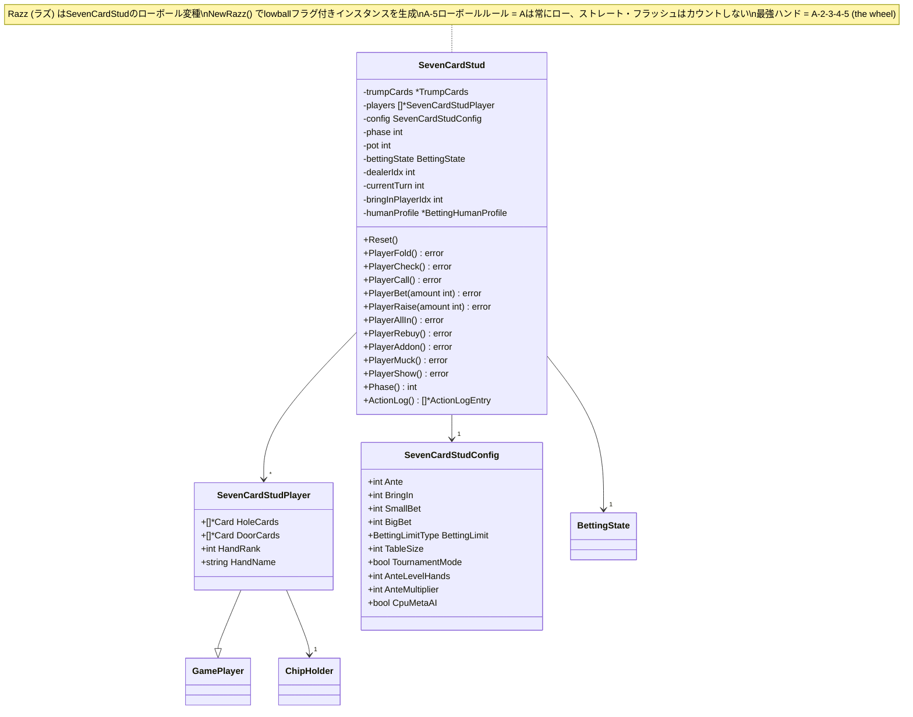
```mermaid
classDiagram
    class SevenCardStud {
        -trumpCards *TrumpCards
        -players []*SevenCardStudPlayer
        -config SevenCardStudConfig
        -phase int
        -pot int
        -bettingState BettingState
        -dealerIdx int
        -currentTurn int
        -bringInPlayerIdx int
        -humanProfile *BettingHumanProfile
        +Reset()
        +PlayerFold() error
        +PlayerCheck() error
        +PlayerCall() error
        +PlayerBet(amount int) error
        +PlayerRaise(amount int) error
        +PlayerAllIn() error
        +PlayerRebuy() error
        +PlayerAddon() error
        +PlayerMuck() error
        +PlayerShow() error
        +Phase() int
        +ActionLog() []*ActionLogEntry
    }

    class SevenCardStudPlayer {
        +[]*Card HoleCards
        +[]*Card DoorCards
        +int HandRank
        +string HandName
    }

    class SevenCardStudConfig {
        +int Ante
        +int BringIn
        +int SmallBet
        +int BigBet
        +BettingLimitType BettingLimit
        +int TableSize
        +bool TournamentMode
        +int AnteLevelHands
        +int AnteMultiplier
        +bool CpuMetaAI
    }

    SevenCardStud --> "*" SevenCardStudPlayer
    SevenCardStud --> "1" SevenCardStudConfig
    SevenCardStud --> "1" BettingState
    SevenCardStudPlayer --|> GamePlayer
    SevenCardStudPlayer --> "1" ChipHolder

    note for SevenCardStud "Razz (ラズ) はSevenCardStudのローボール変種\nNewRazz() でlowballフラグ付きインスタンスを生成\nA-5ローボールルール = Aは常にロー、ストレート・フラッシュはカウントしない\n最強ハンド = A-2-3-4-5 (the wheel)"
```

#### ソリティア系ゲーム

```mermaid
classDiagram
    class Klondike {
        -trumpCards *TrumpCards
        -tableau [7][]*KlondikeTableauCard
        -foundation [4][]*Card
        -stock []*Card
        -waste []*Card
        -config KlondikeConfig
        -phase KlondikePhase
        -history []*klondikeSnapshot
        +Reset()
        +Draw() error
        +Move(from string, fromCol int, fromIdx int, to string, toCol int) error
        +Hint() *KlondikeHint
        +Undo() error
        +UndoN(n int) error
        +UndoToEscape() int
        +Autocomplete() error
        +GiveUp()
        +Phase() KlondikePhase
    }

    class FreeCell {
        -trumpCards *TrumpCards
        -tableau [8][]*Card
        -foundation [4][]*Card
        -freeCells [4]*Card
        -phase FreeCellPhase
        -history []*freeCellSnapshot
        +Reset()
        +Move(from string, fromCol int, fromIdx int, to string, toCol int) error
        +Hint() *FreeCellHint
        +Undo() error
        +UndoN(n int) error
        +UndoToEscape() int
        +Autocomplete() error
        +GiveUp()
        +Phase() FreeCellPhase
    }

    class Spider {
        -trumpCards *TrumpCards
        -tableau [10][]*SpiderTableauCard
        -foundation [][]*Card
        -stock []*Card
        -config SpiderConfig
        -phase SpiderPhase
        -history []*spiderSnapshot
        +Reset()
        +Deal() error
        +Move(fromCol int, fromIdx int, toCol int) error
        +Hint() *SpiderHint
        +Undo() error
        +UndoN(n int) error
        +UndoToEscape() int
        +Autocomplete() error
        +GiveUp()
        +Phase() SpiderPhase
    }

    class Pyramid {
        -trumpCards *TrumpCards
        -pyramid [7][]*PyramidCard
        -stock []*Card
        -waste []*Card
        -phase PyramidPhase
        -history []*pyramidSnapshot
        +Reset()
        +Draw() error
        +RemovePair(row1 int, col1 int, row2 int, col2 int) error
        +RemoveKing(row int, col int) error
        +RemoveWithWaste(row int, col int) error
        +RemoveWasteKing() error
        +GetHint() *PyramidHint
        +Undo() error
        +UndoN(n int) error
        +UndoToEscape() int
        +GiveUp()
        +Phase() PyramidPhase
    }

    class TriPeaks {
        -trumpCards *TrumpCards
        -tableau [4][]*TriPeaksCard
        -stock []*Card
        -waste []*Card
        -phase TriPeaksPhase
        -history []*tripeaksSnapshot
        +Reset()
        +Draw() error
        +Remove(row int, col int) error
        +GetHint() *TriPeaksHint
        +Undo() error
        +UndoN(n int) error
        +UndoToEscape() int
        +GiveUp()
        +Phase() TriPeaksPhase
    }

    class Golf {
        -trumpCards *TrumpCards
        -layout [7][5]*GolfCard
        -stock []*Card
        -waste []*Card
        -phase GolfPhase
        -history []*golfSnapshot
        +Reset()
        +Draw() error
        +Remove(col int) error
        +GetHint() *GolfHint
        +Undo() error
        +UndoN(n int) error
        +UndoToEscape() int
        +GiveUp()
        +Phase() GolfPhase
    }

    class Durak {
        -trumpCards *TrumpCards
        -players []*DurakPlayer
        -config DurakConfig
        -phase DurakPhase
        -trumpSuit int
        -trumpCard *Card
        -tableAttack []*Card
        -tableDefense []*Card
        +Reset()
        +Attack(cardIdx int) error
        +Defend(cardIdx int) error
        +PickUp() error
        +Done() error
        +Pass() error
        +Phase() DurakPhase
    }

    class DurakPlayer {
        +bool IsHuman
    }

    class DurakConfig {
        +int PlayerCount
    }

    class FortyThieves {
        -trumpCards *TrumpCards
        -tableau [][]*Card
        -foundations [][]*Card
        -stock []*Card
        -waste []*Card
        -moveCount int
        -phase FortyThievesPhase
        +Reset()
        +Draw() error
        +Move(src string, dst string) error
        +Undo() error
        +GiveUp()
        +Hint() string
        +AutoComplete() error
        +Phase() FortyThievesPhase
    }

    class ClockSolitaire {
        -trumpCards *TrumpCards
        -piles [13][]*ClockCard
        -currentPileIdx int
        -stepCount int
        -phase ClockSolitairePhase
        +Reset()
        +Step() error
        +AutoPlay() error
        +Phase() ClockSolitairePhase
    }

    class Cribbage {
        -trumpCards *TrumpCards
        -players []*CribbagePlayer
        -config CribbageConfig
        -phase CribbagePhase
        -crib []*Card
        -starter *Card
        -pegCount int
        -pegPlayedCards []*Card
        +Reset()
        +Discard(indices []int) error
        +Peg(cardIdx int) error
        +Go() error
        +ShowNext() error
        +NextRound() error
        +Phase() CribbagePhase
    }

    class Memory {
        -trumpCards *TrumpCards
        -board []*MemoryBoardCard
        -players []*MemoryPlayer
        -config MemoryConfig
        -phase MemoryPhase
        +Reset()
        +Flip(position int) error
        +Next() error
        +Phase() MemoryPhase
    }

    class KlondikeTableauCard {
        +*Card Card
        +bool FaceUp
    }

    class SpiderTableauCard {
        +*Card Card
        +bool FaceUp
    }

    class PyramidCard {
        +*Card Card
        +bool Removed
    }

    class TriPeaksCard {
        +*Card Card
        +bool Removed
    }

    class MemoryBoardCard {
        +*Card Card
        +bool FaceUp
        +bool Matched
    }

    class ClockCard {
        +*Card Card
        +bool FaceUp
    }

    Klondike --> "*" KlondikeTableauCard
    FreeCell --> "*" Card
    Spider --> "*" SpiderTableauCard
    Pyramid --> "*" PyramidCard
    TriPeaks --> "*" TriPeaksCard
    Cribbage --> "*" CribbagePlayer
    Memory --> "*" MemoryBoardCard
    Memory --> "*" MemoryPlayer
    MemoryPlayer --|> GamePlayer
    ClockSolitaire --> "*" ClockCard
    Durak --> "*" DurakPlayer
    Durak --> "1" DurakConfig
    DurakPlayer --|> GamePlayer
    FortyThieves --> "*" Card

    class Yukon {
        -trumpCards *TrumpCards
        -tableau [7][]*KlondikeTableauCard
        -foundation [4][]*Card
        -phase YukonPhase
        -moveCount int
        -history []*yukonSnapshot
        -isStalemate bool
        +Reset()
        +MoveTableauToTableau(fromCol int, fromIdx int, toCol int) error
        +MoveTableauToFoundation(fromCol int) error
        +Hint() *YukonHint
        +Undo() error
        +UndoN(n int) error
        +UndoToEscape() int
        +AutoComplete() error
        +GiveUp()
        +GetPhase() YukonPhase
    }

    Yukon --> "*" KlondikeTableauCard

    class Scorpion {
        -trumpCards *TrumpCards
        -tableau [7][]*KlondikeTableauCard
        -stock []*Card
        -completedSuits int
        -phase ScorpionPhase
        -moveCount int
        -actionLog []*ActionLogEntry
        -history []*scorpionSnapshot
        -isStalemate bool
        +Reset()
        +Deal() error
        +MoveTableauToTableau(fromCol int, cardIndex int, toCol int) error
        +GetHint() *ScorpionHint
        +AutoComplete() error
        +AllFaceUp() bool
        +Undo() error
        +UndoN(n int) error
        +UndoToEscape() int
        +GiveUp()
        +GetPhase() ScorpionPhase
    }

    Scorpion --> "*" KlondikeTableauCard
    Scorpion --> "1" TrumpCards

    class Canfield {
        -trumpCards *TrumpCards
        -tableau [4][]*CanfieldTableauCard
        -reserve []*Card
        -stock []*Card
        -waste []*Card
        -foundation [4][]*Card
        -baseRank int
        -phase CanfieldPhase
        -moveCount int
        -history []*canfieldSnapshot
        +Reset()
        +Draw() error
        +MoveWasteToTableau(col int) error
        +MoveWasteToFoundation() error
        +MoveTableauToTableau(fromCol int, cardIndex int, toCol int) error
        +MoveTableauToFoundation(col int) error
        +MoveReserveToTableau(col int) error
        +MoveReserveToFoundation() error
        +GiveUp()
        +GetHint() *CanfieldHint
        +AutoComplete() error
        +Undo() error
        +UndoN(n int) error
        +GetPhase() CanfieldPhase
    }

    class War {
        -trumpCards *TrumpCards
        -players [2]*WarPlayer
        -config WarConfig
        -phase WarPhase
        -warPot []*Card
        -playerRevealed *Card
        -cpuRevealed *Card
        -lastWinnerIdx int
        -roundsPlayed int
        -gameEndFlag bool
        -winnerIdx int
        +Reset()
        +Step() error
        +GetPhase() WarPhase
    }

    class Whist {
        -trumpCards *TrumpCards
        -players []*WhistPlayer
        -config WhistConfig
        -phase WhistPhase
        -roundNumber int
        -trickNumber int
        -currentPlayerIdx int
        -currentTrick []*WhistTrickCard
        -trumpSuit int
        -leadPlayerIdx int
        -dealerIdx int
        -teamScores [2]int
        -gameEndFlag bool
        -winnerTeam int
        +Reset()
        +PlayerPlay(cardIdx int) error
        +CpuPlay()
        +NextTrick() error
        +ResolveTrick() error
        +ScoreRound()
        +NextRound()
        +GetHint() *WhistHint
        +GetPhase() WhistPhase
    }

    Canfield --> "1" TrumpCards
    War --> "1" TrumpCards
    War --> "2" WarPlayer
    Whist --> "1" TrumpCards
    Whist --> "4" WhistPlayer
```

### 1.3 ユースケース層 (Interactor・Presenter)

```mermaid
classDiagram
    class GamePresenter~G~ {
        <<interface>>
        +Output(game G, lastErr error) string
        +ActionLogOutput(game G) string
    }

    class BlackJackInteractor {
        -game BlackJackGame
        -presenter BlackJackPresenter
        +Reset() string
        +Hit() string
        +Stand() string
        +Bet(amount int) string
        +DoubleDown() string
        +Split() string
        +Insurance(accept bool) string
        +Surrender() string
        +ActionLog() string
    }

    class PokerPresenter {
        <<interface>>
        +Output(game PokerGame, lastErr error) string
        +ActionLogOutput(game PokerGame) string
        +OddsOutput(game PokerGame) string
    }

    class HeartsPresenter {
        <<interface>>
        +Output(game HeartsGame, lastErr error) string
        +ActionLogOutput(game HeartsGame) string
        +HintOutput(game HeartsGame) string
    }

    class KlondikePresenter {
        <<interface>>
        +Output(game KlondikeGame, lastErr error) string
        +ActionLogOutput(game KlondikeGame) string
        +HintOutput(game KlondikeGame) string
    }

    BlackJackInteractor ..> GamePresenter : uses
    BlackJackInteractor ..> BlackJackGame : uses

    note for GamePresenter "各ゲームの Presenter は\nGamePresenter[G] の型エイリアス\nまたは拡張インターフェース"
```

**Interactor パターン (全62ゲーム共通)**

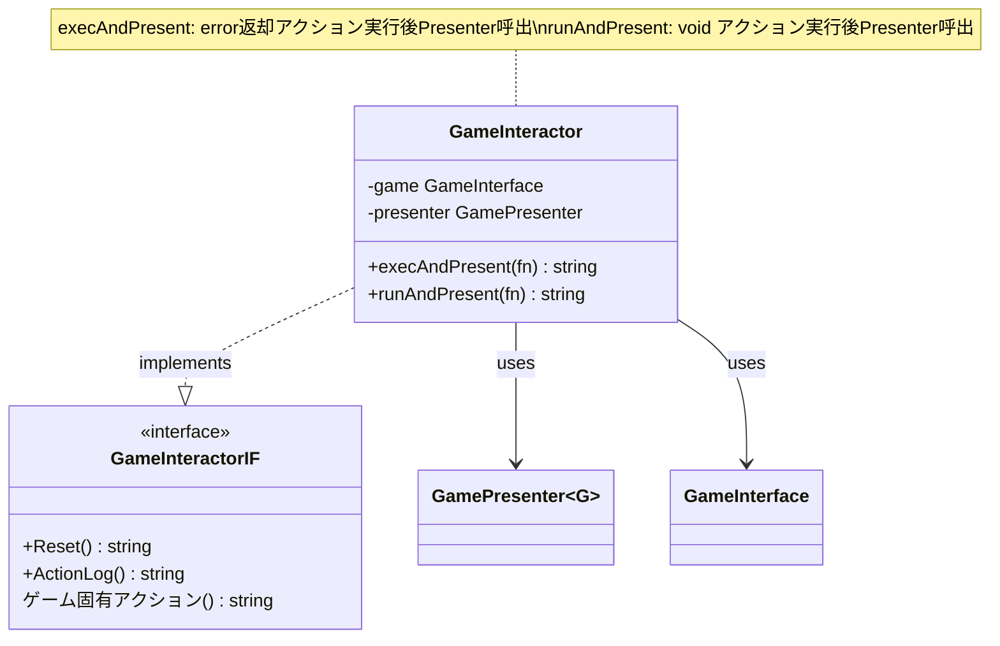
```mermaid
classDiagram
    class GameInteractorIF {
        <<interface>>
        +Reset() string
        +ActionLog() string
        ゲーム固有アクション() string
    }

    class GameInteractor {
        -game GameInterface
        -presenter GamePresenter
        +execAndPresent(fn) string
        +runAndPresent(fn) string
    }

    GameInteractor ..|> GameInteractorIF : implements
    GameInteractor --> GamePresenter~G~ : uses
    GameInteractor --> GameInterface : uses

    note for GameInteractor "execAndPresent: error返却アクション実行後Presenter呼出\nrunAndPresent: void アクション実行後Presenter呼出"
```

### 1.4 アダプタ層 (Controller・Presenter実装)

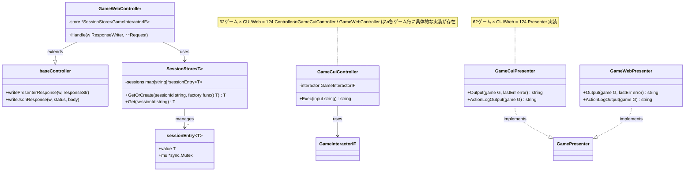
```mermaid
classDiagram
    class baseController {
        +writePresenterResponse(w, responseStr)
        +writeJsonResponse(w, status, body)
    }

    class SessionStore~T~ {
        -sessions map[string]*sessionEntry~T~
        +GetOrCreate(sessionId string, factory func() T) T
        +Get(sessionId string) T
    }

    class sessionEntry~T~ {
        +value T
        +mu *sync.Mutex
    }

    class GameCuiController {
        -interactor GameInteractorIF
        +Exec(input string) string
    }

    class GameWebController {
        -store *SessionStore~GameInteractorIF~
        +Handle(w ResponseWriter, r *Request)
    }

    class GameCuiPresenter {
        +Output(game G, lastErr error) string
        +ActionLogOutput(game G) string
    }

    class GameWebPresenter {
        +Output(game G, lastErr error) string
        +ActionLogOutput(game G) string
    }

    GameWebController --|> baseController : extends
    GameWebController --> SessionStore : uses
    SessionStore --> "*" sessionEntry : manages
    GameCuiController --> GameInteractorIF : uses
    GameCuiPresenter ..|> GamePresenter : implements
    GameWebPresenter ..|> GamePresenter : implements

    note for GameCuiController "62ゲーム × CUI/Web = 124 Controller\nGameCuiController / GameWebController は\n各ゲーム毎に具体的な実装が存在"
    note for GameCuiPresenter "62ゲーム × CUI/Web = 124 Presenter 実装"
```

### 1.5 インフラストラクチャ層

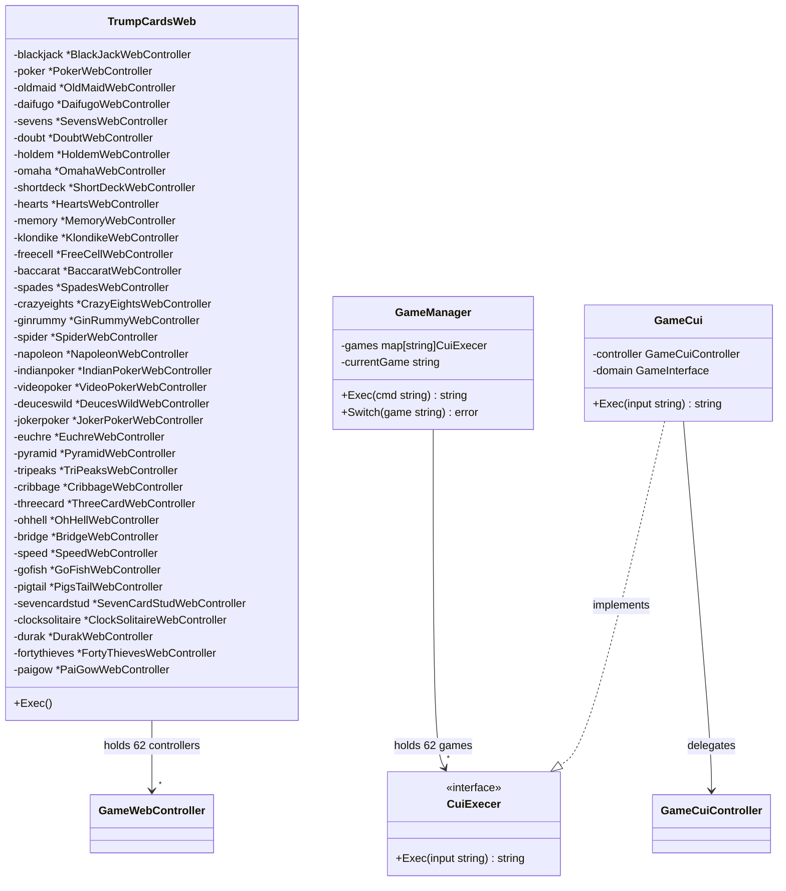
```mermaid
classDiagram
    class TrumpCardsWeb {
        -blackjack *BlackJackWebController
        -poker *PokerWebController
        -oldmaid *OldMaidWebController
        -daifugo *DaifugoWebController
        -sevens *SevensWebController
        -doubt *DoubtWebController
        -holdem *HoldemWebController
        -omaha *OmahaWebController
        -shortdeck *ShortDeckWebController
        -hearts *HeartsWebController
        -memory *MemoryWebController
        -klondike *KlondikeWebController
        -freecell *FreeCellWebController
        -baccarat *BaccaratWebController
        -spades *SpadesWebController
        -crazyeights *CrazyEightsWebController
        -ginrummy *GinRummyWebController
        -spider *SpiderWebController
        -napoleon *NapoleonWebController
        -indianpoker *IndianPokerWebController
        -videopoker *VideoPokerWebController
        -deuceswild *DeucesWildWebController
        -jokerpoker *JokerPokerWebController
        -euchre *EuchreWebController
        -pyramid *PyramidWebController
        -tripeaks *TriPeaksWebController
        -cribbage *CribbageWebController
        -threecard *ThreeCardWebController
        -ohhell *OhHellWebController
        -bridge *BridgeWebController
        -speed *SpeedWebController
        -gofish *GoFishWebController
        -pigtail *PigsTailWebController
        -sevencardstud *SevenCardStudWebController
        -clocksolitaire *ClockSolitaireWebController
        -durak *DurakWebController
        -fortythieves *FortyThievesWebController
        -paigow *PaiGowWebController
        +Exec()
    }

    class GameManager {
        -games map[string]CuiExecer
        -currentGame string
        +Exec(cmd string) string
        +Switch(game string) error
    }

    class CuiExecer {
        <<interface>>
        +Exec(input string) string
    }

    class GameCui {
        -controller GameCuiController
        -domain GameInterface
        +Exec(input string) string
    }

    TrumpCardsWeb --> "*" GameWebController : holds 62 controllers
    GameManager --> "*" CuiExecer : holds 62 games
    GameCui ..|> CuiExecer : implements
    GameCui --> GameCuiController : delegates
```

---

## 2. シーケンス図

### 2.1 CUIゲーム実行フロー

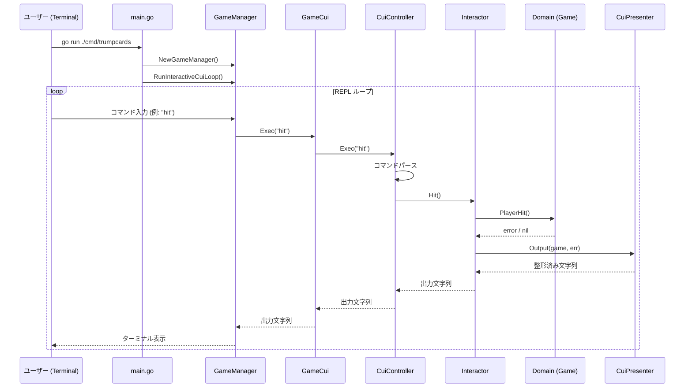
```mermaid
sequenceDiagram
    participant User as ユーザー (Terminal)
    participant Main as main.go
    participant GM as GameManager
    participant Cui as GameCui
    participant Ctrl as CuiController
    participant Interactor as Interactor
    participant Domain as Domain (Game)
    participant Pres as CuiPresenter

    User->>Main: go run ./cmd/trumpcards
    Main->>GM: NewGameManager()
    Main->>GM: RunInteractiveCuiLoop()

    loop REPL ループ
        User->>GM: コマンド入力 (例: "hit")
        GM->>Cui: Exec("hit")
        Cui->>Ctrl: Exec("hit")
        Ctrl->>Ctrl: コマンドパース
        Ctrl->>Interactor: Hit()
        Interactor->>Domain: PlayerHit()
        Domain-->>Interactor: error / nil
        Interactor->>Pres: Output(game, err)
        Pres-->>Interactor: 整形済み文字列
        Interactor-->>Ctrl: 出力文字列
        Ctrl-->>Cui: 出力文字列
        Cui-->>GM: 出力文字列
        GM-->>User: ターミナル表示
    end
```

### 2.2 Web APIゲーム実行フロー

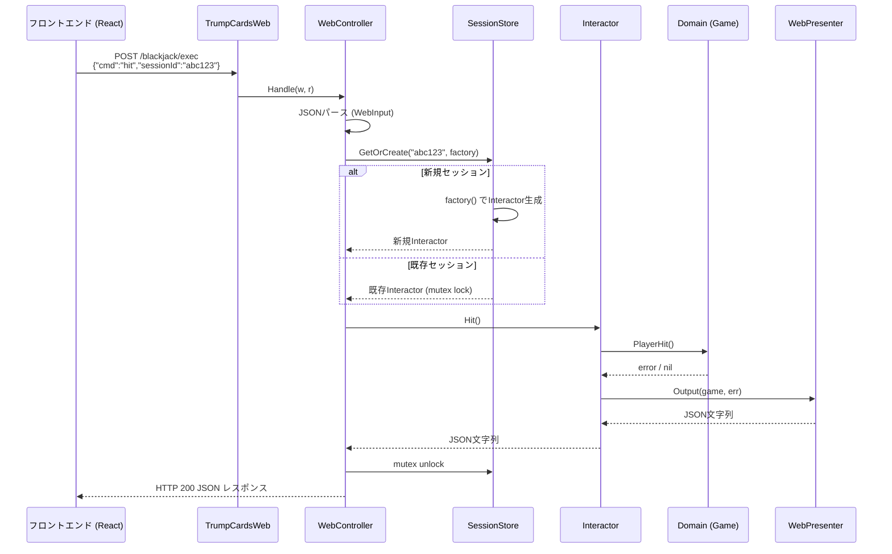
```mermaid
sequenceDiagram
    participant Client as フロントエンド (React)
    participant Server as TrumpCardsWeb
    participant WebCtrl as WebController
    participant Store as SessionStore
    participant Interactor as Interactor
    participant Domain as Domain (Game)
    participant Pres as WebPresenter

    Client->>Server: POST /blackjack/exec<br/>{"cmd":"hit","sessionId":"abc123"}
    Server->>WebCtrl: Handle(w, r)
    WebCtrl->>WebCtrl: JSONパース (WebInput)

    WebCtrl->>Store: GetOrCreate("abc123", factory)
    alt 新規セッション
        Store->>Store: factory() でInteractor生成
        Store-->>WebCtrl: 新規Interactor
    else 既存セッション
        Store-->>WebCtrl: 既存Interactor (mutex lock)
    end

    WebCtrl->>Interactor: Hit()
    Interactor->>Domain: PlayerHit()
    Domain-->>Interactor: error / nil
    Interactor->>Pres: Output(game, err)
    Pres-->>Interactor: JSON文字列
    Interactor-->>WebCtrl: JSON文字列
    WebCtrl->>Store: mutex unlock
    WebCtrl-->>Client: HTTP 200 JSON レスポンス
```

### 2.3 セッション管理フロー

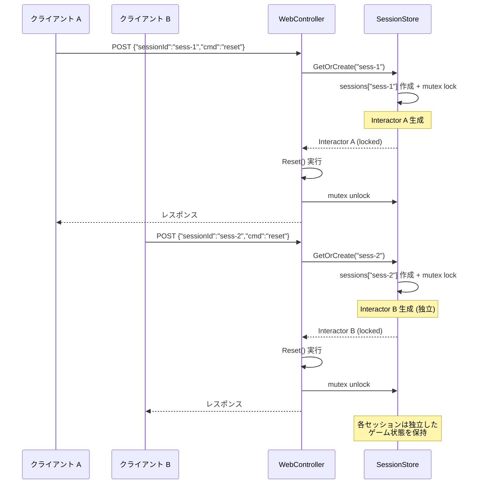
```mermaid
sequenceDiagram
    participant C1 as クライアント A
    participant C2 as クライアント B
    participant WebCtrl as WebController
    participant Store as SessionStore

    C1->>WebCtrl: POST {"sessionId":"sess-1","cmd":"reset"}
    WebCtrl->>Store: GetOrCreate("sess-1")
    Store->>Store: sessions["sess-1"] 作成 + mutex lock
    Note over Store: Interactor A 生成
    Store-->>WebCtrl: Interactor A (locked)
    WebCtrl->>WebCtrl: Reset() 実行
    WebCtrl->>Store: mutex unlock
    WebCtrl-->>C1: レスポンス

    C2->>WebCtrl: POST {"sessionId":"sess-2","cmd":"reset"}
    WebCtrl->>Store: GetOrCreate("sess-2")
    Store->>Store: sessions["sess-2"] 作成 + mutex lock
    Note over Store: Interactor B 生成 (独立)
    Store-->>WebCtrl: Interactor B (locked)
    WebCtrl->>WebCtrl: Reset() 実行
    WebCtrl->>Store: mutex unlock
    WebCtrl-->>C2: レスポンス

    Note over Store: 各セッションは独立した<br/>ゲーム状態を保持
```

### 2.4 VideoPoker ベット・ホールドフロー

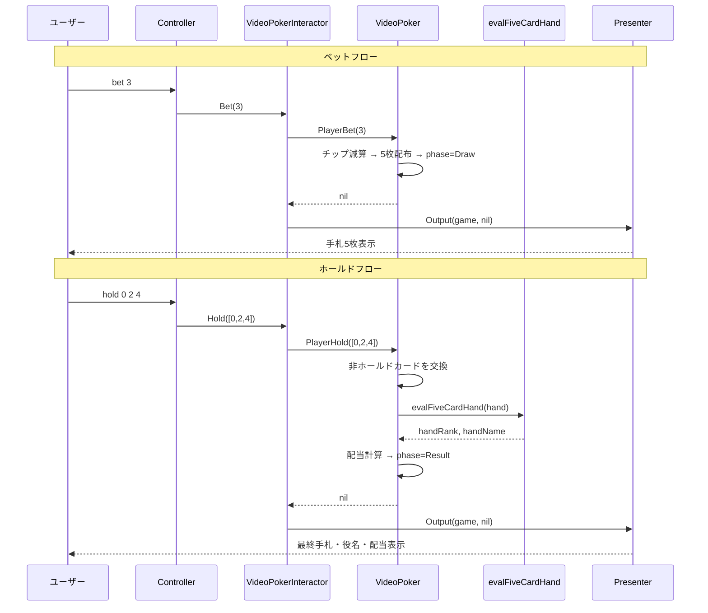
```mermaid
sequenceDiagram
    participant User as ユーザー
    participant Ctrl as Controller
    participant Interactor as VideoPokerInteractor
    participant Domain as VideoPoker
    participant Eval as evalFiveCardHand
    participant Pres as Presenter

    Note over User,Pres: ベットフロー
    User->>Ctrl: bet 3
    Ctrl->>Interactor: Bet(3)
    Interactor->>Domain: PlayerBet(3)
    Domain->>Domain: チップ減算 → 5枚配布 → phase=Draw
    Domain-->>Interactor: nil
    Interactor->>Pres: Output(game, nil)
    Pres-->>User: 手札5枚表示

    Note over User,Pres: ホールドフロー
    User->>Ctrl: hold 0 2 4
    Ctrl->>Interactor: Hold([0,2,4])
    Interactor->>Domain: PlayerHold([0,2,4])
    Domain->>Domain: 非ホールドカードを交換
    Domain->>Eval: evalFiveCardHand(hand)
    Eval-->>Domain: handRank, handName
    Domain->>Domain: 配当計算 → phase=Result
    Domain-->>Interactor: nil
    Interactor->>Pres: Output(game, nil)
    Pres-->>User: 最終手札・役名・配当表示
```

### 2.5 ThreeCard ベット・プレイフロー

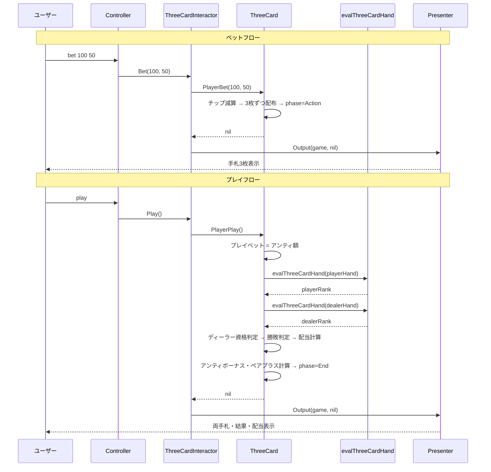
```mermaid
sequenceDiagram
    participant User as ユーザー
    participant Ctrl as Controller
    participant Interactor as ThreeCardInteractor
    participant Domain as ThreeCard
    participant Eval as evalThreeCardHand
    participant Pres as Presenter

    Note over User,Pres: ベットフロー
    User->>Ctrl: bet 100 50
    Ctrl->>Interactor: Bet(100, 50)
    Interactor->>Domain: PlayerBet(100, 50)
    Domain->>Domain: チップ減算 → 3枚ずつ配布 → phase=Action
    Domain-->>Interactor: nil
    Interactor->>Pres: Output(game, nil)
    Pres-->>User: 手札3枚表示

    Note over User,Pres: プレイフロー
    User->>Ctrl: play
    Ctrl->>Interactor: Play()
    Interactor->>Domain: PlayerPlay()
    Domain->>Domain: プレイベット = アンティ額
    Domain->>Eval: evalThreeCardHand(playerHand)
    Eval-->>Domain: playerRank
    Domain->>Eval: evalThreeCardHand(dealerHand)
    Eval-->>Domain: dealerRank
    Domain->>Domain: ディーラー資格判定 → 勝敗判定 → 配当計算
    Domain->>Domain: アンティボーナス・ペアプラス計算 → phase=End
    Domain-->>Interactor: nil
    Interactor->>Pres: Output(game, nil)
    Pres-->>User: 両手札・結果・配当表示
```

### 2.6 OhHell ビッド・トリックフロー

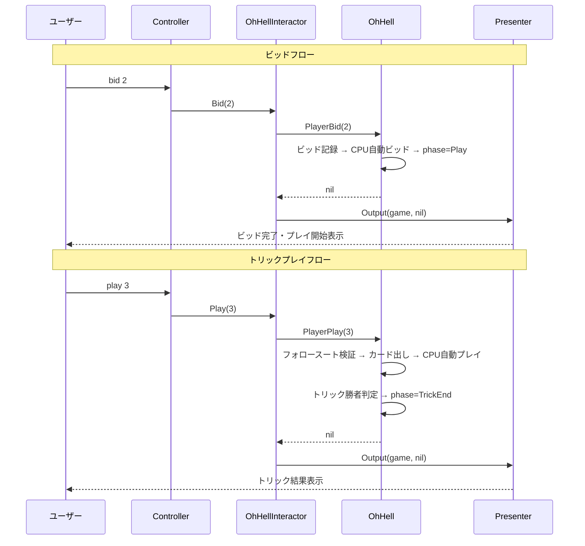
```mermaid
sequenceDiagram
    participant User as ユーザー
    participant Ctrl as Controller
    participant Interactor as OhHellInteractor
    participant Domain as OhHell
    participant Pres as Presenter

    Note over User,Pres: ビッドフロー
    User->>Ctrl: bid 2
    Ctrl->>Interactor: Bid(2)
    Interactor->>Domain: PlayerBid(2)
    Domain->>Domain: ビッド記録 → CPU自動ビッド → phase=Play
    Domain-->>Interactor: nil
    Interactor->>Pres: Output(game, nil)
    Pres-->>User: ビッド完了・プレイ開始表示

    Note over User,Pres: トリックプレイフロー
    User->>Ctrl: play 3
    Ctrl->>Interactor: Play(3)
    Interactor->>Domain: PlayerPlay(3)
    Domain->>Domain: フォロースート検証 → カード出し → CPU自動プレイ
    Domain->>Domain: トリック勝者判定 → phase=TrickEnd
    Domain-->>Interactor: nil
    Interactor->>Pres: Output(game, nil)
    Pres-->>User: トリック結果表示
```

### 2.7 Bridge オークション・トリックフロー

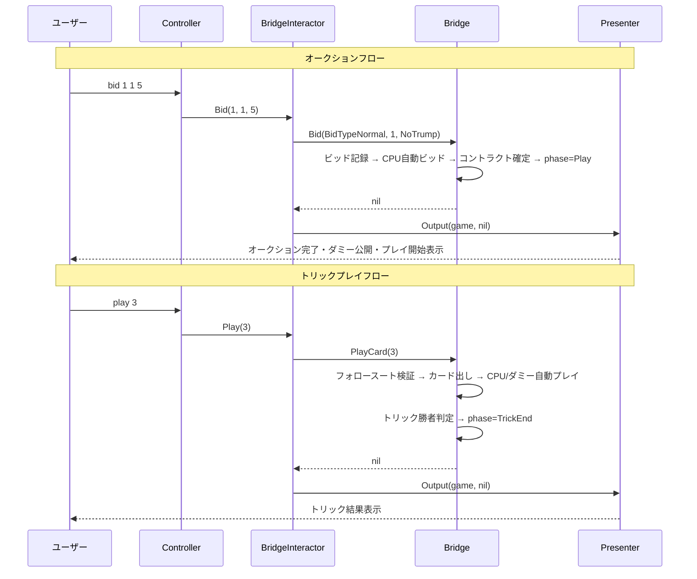
```mermaid
sequenceDiagram
    participant User as ユーザー
    participant Ctrl as Controller
    participant Interactor as BridgeInteractor
    participant Domain as Bridge
    participant Pres as Presenter

    Note over User,Pres: オークションフロー
    User->>Ctrl: bid 1 1 5
    Ctrl->>Interactor: Bid(1, 1, 5)
    Interactor->>Domain: Bid(BidTypeNormal, 1, NoTrump)
    Domain->>Domain: ビッド記録 → CPU自動ビッド → コントラクト確定 → phase=Play
    Domain-->>Interactor: nil
    Interactor->>Pres: Output(game, nil)
    Pres-->>User: オークション完了・ダミー公開・プレイ開始表示

    Note over User,Pres: トリックプレイフロー
    User->>Ctrl: play 3
    Ctrl->>Interactor: Play(3)
    Interactor->>Domain: PlayCard(3)
    Domain->>Domain: フォロースート検証 → カード出し → CPU/ダミー自動プレイ
    Domain->>Domain: トリック勝者判定 → phase=TrickEnd
    Domain-->>Interactor: nil
    Interactor->>Pres: Output(game, nil)
    Pres-->>User: トリック結果表示
```

### 2.8 Pineapple ディスカードフロー

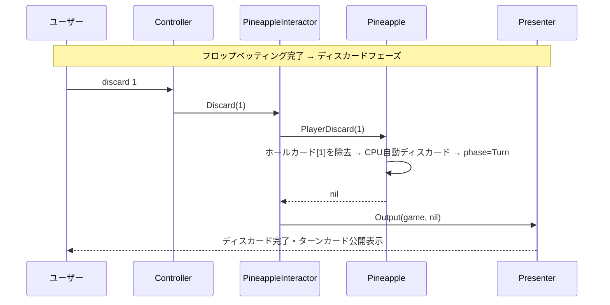
```mermaid
sequenceDiagram
    participant User as ユーザー
    participant Ctrl as Controller
    participant Interactor as PineappleInteractor
    participant Domain as Pineapple
    participant Pres as Presenter

    Note over User,Pres: フロップベッティング完了 → ディスカードフェーズ
    User->>Ctrl: discard 1
    Ctrl->>Interactor: Discard(1)
    Interactor->>Domain: PlayerDiscard(1)
    Domain->>Domain: ホールカード[1]を除去 → CPU自動ディスカード → phase=Turn
    Domain-->>Interactor: nil
    Interactor->>Pres: Output(game, nil)
    Pres-->>User: ディスカード完了・ターンカード公開表示
```

### 2.9 Speed プレイフロー

```mermaid
sequenceDiagram
    participant User as ユーザー
    participant Ctrl as Controller
    participant Interactor as SpeedInteractor
    participant Domain as Speed
    participant Pres as Presenter

    Note over User,Pres: プレイフロー
    User->>Ctrl: play 0 1
    Ctrl->>Interactor: Play(0, 1)
    Interactor->>Domain: Play(0, 1)
    Domain->>Domain: 手札[0]を場札[1]に出す → 手札補充 → CPU自動プレイ
    Domain-->>Interactor: nil
    Interactor->>Pres: Output(game, nil)
    Pres-->>User: 場札・手札更新表示

    Note over User,Pres: スタック → フリップフロー
    User->>Ctrl: flip
    Ctrl->>Interactor: Flip()
    Interactor->>Domain: Flip()
    Domain->>Domain: 山札から場札に新カード配置 → phase=Play
    Domain-->>Interactor: nil
    Interactor->>Pres: Output(game, nil)
    Pres-->>User: 新しい場札表示
```

### 2.10 GoFish 要求フロー

```mermaid
sequenceDiagram
    participant User as ユーザー
    participant Ctrl as Controller
    participant Interactor as GoFishInteractor
    participant Domain as GoFish
    participant Pres as Presenter

    Note over User,Pres: 要求フロー
    User->>Ctrl: ask 1 7
    Ctrl->>Interactor: Ask(1, 7)
    Interactor->>Domain: Ask(1, 7)
    Domain->>Domain: 相手が持っていればカード移動 → ブックチェック → CPU自動プレイ
    Domain-->>Interactor: nil
    Interactor->>Pres: Output(game, nil)
    Pres-->>User: 要求結果・手札更新表示

    Note over User,Pres: Go Fish (相手が持っていない場合)
    User->>Ctrl: ask 2 13
    Ctrl->>Interactor: Ask(2, 13)
    Interactor->>Domain: Ask(2, 13)
    Domain->>Domain: 相手が持っていない → 山札から1枚引く → ブックチェック → CPU自動プレイ
    Domain-->>Interactor: nil
    Interactor->>Pres: Output(game, nil)
    Pres-->>User: Go Fish結果・手札更新表示
```

### 2.11 PigsTail ドローフロー

```mermaid
sequenceDiagram
    participant User as ユーザー
    participant Ctrl as Controller
    participant Interactor as PigsTailInteractor
    participant Domain as PigsTail
    participant Pres as Presenter

    Note over User,Pres: ドローフロー
    User->>Ctrl: draw
    Ctrl->>Interactor: Draw()
    Interactor->>Domain: Draw()
    Domain->>Domain: 山札から1枚引く → スート一致判定 → ペナルティ or 場に置く → CPU自動プレイ
    Domain-->>Interactor: nil
    Interactor->>Pres: Output(game, nil)
    Pres-->>User: ドロー結果・手札枚数更新表示
```

### 2.12 FiftyOne 交換フロー

```mermaid
sequenceDiagram
    participant User as ユーザー
    participant Ctrl as Controller
    participant Interactor as FiftyOneInteractor
    participant Domain as FiftyOne
    participant Pres as Presenter

    Note over User,Pres: 1枚交換フロー
    User->>Ctrl: play 2 0
    Ctrl->>Interactor: ExchangeOne(2, 0)
    Interactor->>Domain: ExchangeOne(2, 0)
    Domain->>Domain: 手札[2]と場札[0]を交換 → CPUターン自動実行
    Domain-->>Interactor: nil
    Interactor->>Pres: Output(game, nil)
    Pres-->>User: 交換結果・手札更新表示

    Note over User,Pres: 全交換フロー
    User->>Ctrl: exchangeall
    Ctrl->>Interactor: ExchangeAll()
    Interactor->>Domain: ExchangeAll()
    Domain->>Domain: 手札5枚と場札5枚を交換 → CPUターン自動実行
    Domain-->>Interactor: nil
    Interactor->>Pres: Output(game, nil)
    Pres-->>User: 全交換結果表示

    Note over User,Pres: ストップ宣言
    User->>Ctrl: stop
    Ctrl->>Interactor: Stop()
    Interactor->>Domain: Stop()
    Domain->>Domain: ストップ宣言 → 残り3ターン → CPUターン自動実行 → ゲーム終了
    Domain-->>Interactor: nil
    Interactor->>Pres: Output(game, nil)
    Pres-->>User: ゲーム終了・スコア表示
```

### 2.13 SevenCardStud ベッティングフロー

```mermaid
sequenceDiagram
    participant User as ユーザー
    participant Ctrl as Controller
    participant Interactor as SevenCardStudInteractor
    participant Domain as SevenCardStud
    participant Pres as Presenter

    Note over User,Pres: ベッティングフロー (サード～セブンスストリート)
    User->>Ctrl: bet 40 / call / raise 80 / fold / allin
    Ctrl->>Interactor: PlayerBet(40) / PlayerCall() / PlayerRaise(80) / PlayerFold() / PlayerAllIn()
    Interactor->>Domain: アクション実行
    Domain->>Domain: ベット処理 → CPU自動アクション → ストリート進行判定
    Domain-->>Interactor: nil
    Interactor->>Pres: Output(game, nil)
    Pres-->>User: ベッティング結果・カード更新表示
```

### 2.14 Durak アタック・ディフェンスフロー

```mermaid
sequenceDiagram
    participant User as ユーザー
    participant Ctrl as Controller
    participant Interactor as DurakInteractor
    participant Domain as Durak
    participant Pres as Presenter

    Note over User,Pres: アタックフロー
    User->>Ctrl: attack 0
    Ctrl->>Interactor: Attack(0)
    Interactor->>Domain: Attack(0)
    Domain->>Domain: カード出す → テーブルに配置 → CPU自動ディフェンス判定
    Domain-->>Interactor: nil
    Interactor->>Pres: Output(game, nil)
    Pres-->>User: テーブル状態・手札更新表示

    Note over User,Pres: ディフェンスフロー
    User->>Ctrl: defend 2
    Ctrl->>Interactor: Defend(2)
    Interactor->>Domain: Defend(2)
    Domain->>Domain: 防御カード配置 → 切り札/同スート判定 → ビート成否
    Domain-->>Interactor: nil
    Interactor->>Pres: Output(game, nil)
    Pres-->>User: テーブル状態・手札更新表示

    Note over User,Pres: ピックアップ (防御失敗)
    User->>Ctrl: pickup
    Ctrl->>Interactor: PickUp()
    Interactor->>Domain: PickUp()
    Domain->>Domain: テーブルカード全て手札に追加 → デッキ補充 → 次のバウト
    Domain-->>Interactor: nil
    Interactor->>Pres: Output(game, nil)
    Pres-->>User: 手札枚数・次アタッカー表示
```

### 2.15 FortyThieves ドロー・ムーブフロー

```mermaid
sequenceDiagram
    participant User as ユーザー
    participant Ctrl as Controller
    participant Interactor as FortyThievesInteractor
    participant Domain as FortyThieves
    participant Pres as Presenter

    Note over User,Pres: ドローフロー
    User->>Ctrl: draw
    Ctrl->>Interactor: Draw()
    Interactor->>Domain: Draw()
    Domain->>Domain: 山札からウェストへ1枚めくる
    Domain-->>Interactor: nil
    Interactor->>Pres: Output(game, nil)
    Pres-->>User: 山札・ウェスト状態更新表示

    Note over User,Pres: ムーブフロー
    User->>Ctrl: move w f1
    Ctrl->>Interactor: Move("w", "f1")
    Interactor->>Domain: Move("w", "f1")
    Domain->>Domain: ウェスト → 組札1へ移動 → 同スート昇順チェック
    Domain-->>Interactor: nil
    Interactor->>Pres: Output(game, nil)
    Pres-->>User: タブロー・組札状態更新表示

    Note over User,Pres: オートコンプリート
    User->>Ctrl: autocomplete
    Ctrl->>Interactor: AutoComplete()
    Interactor->>Domain: AutoComplete()
    Domain->>Domain: 安全に移動可能なカードを組札へ自動移動
    Domain-->>Interactor: nil
    Interactor->>Pres: Output(game, nil)
    Pres-->>User: 組札更新表示
```

### 2.16 PaiGow ベット・セットフロー

```mermaid
sequenceDiagram
    participant User as ユーザー
    participant Ctrl as Controller
    participant Interactor as PaiGowInteractor
    participant Domain as PaiGow
    participant Eval as evalFiveCardHand / evalPaiGowLow
    participant Pres as Presenter

    Note over User,Pres: ベットフロー
    User->>Ctrl: bet 100
    Ctrl->>Interactor: Bet(100)
    Interactor->>Domain: PlayerBet(100)
    Domain->>Domain: チップ減算 → 7枚ずつ配布 → phase=Set
    Domain-->>Interactor: nil
    Interactor->>Pres: Output(game, nil)
    Pres-->>User: 7枚カード表示

    Note over User,Pres: セットフロー
    User->>Ctrl: set 2 5
    Ctrl->>Interactor: Set(2, 5)
    Interactor->>Domain: PlayerSet(2, 5)
    Domain->>Domain: ローハンド(2枚) / ハイハンド(5枚) 分離
    Domain->>Domain: ディーラーハウスウェイ設定
    Domain->>Eval: evalFiveCardHand(playerHighHand)
    Eval-->>Domain: playerHighRank
    Domain->>Eval: evalFiveCardHand(dealerHighHand)
    Eval-->>Domain: dealerHighRank
    Domain->>Domain: ハイハンド比較 → ローハンド比較
    Domain->>Domain: 勝敗判定 → 配当計算(5%コミッション) → phase=End
    Domain-->>Interactor: nil
    Interactor->>Pres: Output(game, nil)
    Pres-->>User: 両ハンド・結果・配当表示
```

### 2.17 Yukon ムーブフロー

```mermaid
sequenceDiagram
    participant User as ユーザー
    participant Ctrl as Controller
    participant Interactor as YukonInteractor
    participant Domain as Yukon
    participant Pres as Presenter

    Note over User,Pres: タブロー間移動フロー
    User->>Ctrl: move (from=tableau col=2 cardIndex=1, to=tableau col=5)
    Ctrl->>Interactor: MoveTableauToTableau(2, 1, 5)
    Interactor->>Domain: MoveTableauToTableau(2, 1, 5)
    Domain->>Domain: カード群を列2から列5へ移動 → 裏向きカード表返し
    Domain-->>Interactor: nil
    Interactor->>Pres: Output(game, nil)
    Pres-->>User: タブロー更新表示

    Note over User,Pres: ファウンデーション移動フロー
    User->>Ctrl: move (from=tableau col=3, to=foundation)
    Ctrl->>Interactor: MoveTableauToFoundation(3)
    Interactor->>Domain: MoveTableauToFoundation(3)
    Domain->>Domain: 列3の末尾カードをファウンデーションに積む → クリア判定
    Domain-->>Interactor: nil
    Interactor->>Pres: Output(game, nil)
    Pres-->>User: ファウンデーション・タブロー更新表示

    Note over User,Pres: オートコンプリートフロー
    User->>Ctrl: autocomplete
    Ctrl->>Interactor: AutoComplete()
    Interactor->>Domain: AutoComplete()
    Domain->>Domain: 全表向きカードをファウンデーションに自動積み → phase=GameClear
    Domain-->>Interactor: nil
    Interactor->>Pres: Output(game, nil)
    Pres-->>User: ゲームクリア表示
```

### 2.17 RedDog ベット・スプレッドフロー

```mermaid
sequenceDiagram
    participant User
    participant Ctrl as RedDogController
    participant Interactor as RedDogInteractor
    participant Domain as RedDog
    participant Pres as RedDogPresenter

    User->>Ctrl: bet(amount)
    Ctrl->>Interactor: Bet(amount)
    Interactor->>Domain: Bet(amount)
    Domain->>Domain: dealInitial() → 2枚配布
    Domain->>Domain: ResolveInitial() → スプレッド計算
    alt ペア
        Domain->>Domain: phase=PairThird → dealThird() → ResolveThird()
    else 連続
        Domain->>Domain: phase=End (プッシュ)
    else スプレッドあり
        Domain->>Domain: phase=SpreadDecision
    end
    Domain-->>Interactor: nil
    Interactor->>Pres: Output(game, nil)
    Pres-->>User: カード＋スプレッド表示

    alt スプレッド判断フェーズ
        User->>Ctrl: raise(amount) / stay
        Ctrl->>Interactor: Raise(amount) / Stay()
        Interactor->>Domain: Raise(amount) / Stay()
        Domain->>Domain: dealThird() → ResolveThird() → 配当計算
        Domain-->>Interactor: nil
        Interactor->>Pres: Output(game, nil)
        Pres-->>User: 3枚目＋結果表示
    end

    User->>Ctrl: reset
    Ctrl->>Interactor: Reset()
    Interactor->>Domain: Reset()
    Domain-->>Interactor: nil
    Interactor->>Pres: Output(game, nil)
    Pres-->>User: ベット画面
```

---

## 3. ステートマシン図

### 3.1 BlackJack フェーズ遷移

```mermaid
stateDiagram-v2
    [*] --> Bet : Reset()
    Bet --> Deal : PlayerBet()
    Deal --> EarlySurrender : ディーラーAce &<br/>EarlySurrender有効
    EarlySurrender --> Bet : Surrender (次ラウンド)
    EarlySurrender --> Insurance : 続行
    Deal --> Insurance : ディーラーAce &<br/>Insurance有効
    Deal --> Action : ディーラーAce以外
    Insurance --> Action : Insurance判定後
    Action --> Action : Hit / DoubleDown / Split
    Action --> End : Stand / Bust / BlackJack
    End --> Bet : 次ラウンド (Reset)
    End --> [*] : チップ0 (ゲーム終了)
```

### 3.2 Poker フェーズ遷移

```mermaid
stateDiagram-v2
    [*] --> Init : Reset()
    Init --> Deal : カード配布 + 第1ベッティング
    Deal --> Exchange : プレイヤーのベット完了
    Exchange --> SecondBet : カード交換完了
    SecondBet --> End : 第2ベッティング完了 / Fold
    End --> Init : 次ラウンド (Reset)
    End --> [*] : チップ0 (ゲーム終了)
```

### 3.3 Texas Hold'em フェーズ遷移

Omaha Hold'em および Short Deck Hold'em も同一のフェーズ遷移を共有します。

```mermaid
stateDiagram-v2
    [*] --> Init : Reset()
    Init --> PreFlop : ブラインド + ホールカード配布
    PreFlop --> Flop : ベッティング完了
    PreFlop --> Showdown : 1人以外 Fold
    Flop --> Turn : ベッティング完了
    Flop --> Showdown : 1人以外 Fold
    Turn --> River : ベッティング完了
    Turn --> Showdown : 1人以外 Fold
    River --> Showdown : ベッティング完了
    Showdown --> End : 勝者決定
    End --> Rebuy : リバイ/アドオン有効
    End --> Init : 次ラウンド (Reset)
    Rebuy --> Init : リバイ/アドオン完了
    End --> [*] : ゲーム終了
```

### 3.4 Hearts フェーズ遷移

```mermaid
stateDiagram-v2
    [*] --> Pass : Reset()
    Pass --> Play : カード交換完了<br/>(または交換なしラウンド)
    Play --> TrickEnd : 4人全員カード出し完了
    TrickEnd --> Play : 次トリック開始
    TrickEnd --> RoundEnd : 13トリック完了
    RoundEnd --> Pass : 次ラウンド開始
    RoundEnd --> GameEnd : 目標点到達
    GameEnd --> [*]
```

### 3.5 Spades フェーズ遷移

```mermaid
stateDiagram-v2
    [*] --> Bid : Reset()
    Bid --> Play : 4人全員ビッド完了
    Play --> TrickEnd : 4人全員カード出し完了
    TrickEnd --> Play : 次トリック開始
    TrickEnd --> RoundEnd : 13トリック完了
    RoundEnd --> Bid : 次ラウンド開始
    RoundEnd --> GameEnd : 目標点到達
    GameEnd --> [*]
```

### 3.5.1 TwoTenJack フェーズ遷移

```mermaid
stateDiagram-v2
    [*] --> Declare : Reset()
    Declare --> Play : 親が切り札スート宣言
    Play --> TrickEnd : 4人全員カード出し完了
    TrickEnd --> Play : 次トリック開始
    TrickEnd --> RoundEnd : 13トリック完了
    RoundEnd --> Declare : 次ラウンド開始 (親=次の席)
    RoundEnd --> GameEnd : 目標点到達 (チーム累計 ≥ PointLimit)
    GameEnd --> [*]
```

### 3.6 Doubt フェーズ遷移

```mermaid
stateDiagram-v2
    [*] --> Play : Reset()
    Play --> DoubtPhase : カードを出す
    DoubtPhase --> Play : ダウトスキップ → 次プレイヤー
    DoubtPhase --> Play : ダウト実行 → ペナルティ処理 → 次プレイヤー
    DoubtPhase --> End : ダウト成功 & 全カード消化
    Play --> End : 手札0枚 (勝利)
    End --> [*]
```

### 3.7 Memory フェーズ遷移

```mermaid
stateDiagram-v2
    [*] --> Flip1 : Reset()
    Flip1 --> Flip2 : 1枚目めくり
    Flip2 --> Result : 2枚目めくり
    Result --> Flip1 : Next() → 次プレイヤーのターン
    Result --> GameEnd : 全ペアマッチ
    GameEnd --> [*]

    note right of Flip1 : MemoryPhaseFlip1 = 0
    note right of Flip2 : MemoryPhaseFlip2 = 1
    note right of Result : MemoryPhaseResult = 2
```

### 3.8 Klondike / FreeCell / Spider / Pyramid / TriPeaks / Golf / ClockSolitaire フェーズ遷移

7つのソリティア系ゲームは共通のフェーズ構造を持ちます。

```mermaid
stateDiagram-v2
    [*] --> Playing : Reset()
    Playing --> Playing : Move / Draw / Deal / Remove / Step / Undo
    Playing --> GameClear : 全カードをFoundation/Pyramid/Tableau除去完了または全表向き
    Playing --> GameClear : Autocomplete成功 (Klondike/FreeCell/Spider のみ)
    Playing --> GameOver : GiveUp または4枚目のK表向き(ClockSolitaire)
    GameClear --> [*]
    GameOver --> [*]

    note right of Playing : Klondike/FreeCell/Spider/Pyramid/TriPeaks/Golf/ClockSolitaire 共通 Phase = 0
    note right of GameClear : Phase = 1
    note right of GameOver : Phase = 2
```

Pyramid 固有のアクション: `Draw` / `RemovePair` / `RemoveKing` / `RemoveWithWaste` / `RemoveWasteKing` / `Undo`。クリア条件はピラミッドの28枚全除去。

TriPeaks 固有のアクション: `Draw` / `Remove` / `Undo`。除去条件はウェイストトップ±1ランク（K-Aラップ）。クリア条件はタブローの28枚全除去。

Golf 固有のアクション: `Draw` / `Remove` / `Undo`。除去条件はウェイストトップ±1ランク（K-Aラップ）。7列×5段の35枚全除去でクリア。

ClockSolitaire 固有のアクション: `Step` / `AutoPlay`。52枚を13山に4枚ずつ配り、ランクに対応する山へ移動させる完全自動ゲーム。4枚目のKが表向きになる前に全カードが表向きになるとクリア。

各ゲームのフェーズ定数名: `KlondikePhasePlaying` / `FreeCellPhasePlaying` / `SpiderPhasePlaying` / `PyramidPhasePlaying` / `TriPeaksPhasePlaying` / `GolfPhasePlaying` / `ClockSolitairePhasePlaying` = 0、`…GameClear` = 1、`…GameOver` = 2。

### 3.9 CrazyEights フェーズ遷移

```mermaid
stateDiagram-v2
    [*] --> Play : Reset()
    Play --> Play : カードを出す / ドローする
    Play --> ChooseSuit : 8を出す
    ChooseSuit --> Play : スート選択完了
    Play --> RoundEnd : 手札0枚 (勝ち上がり)
    RoundEnd --> Play : NextRound()
    RoundEnd --> GameEnd : 目標点到達
    GameEnd --> [*]
```

### 3.10 GinRummy フェーズ遷移

```mermaid
stateDiagram-v2
    [*] --> Draw : Reset()
    Draw --> Discard : カードを引く (山札 or 捨て札)
    Discard --> Draw : カードを捨てる → 次プレイヤー
    Discard --> Layoff : ノック宣言
    Discard --> RoundEnd : ジン宣言
    Layoff --> RoundEnd : レイオフ完了
    RoundEnd --> Draw : NextRound()
    RoundEnd --> GameEnd : 目標点到達
    GameEnd --> [*]
```

### 3.11 Baccarat フェーズ遷移

```mermaid
stateDiagram-v2
    [*] --> Bet : Reset()
    Bet --> End : ベット → 自動カード配布 → 結果判定
    End --> Bet : 次ラウンド (Reset)
    End --> [*] : チップ0 (ゲーム終了)
```

### 3.12 Napoleon フェーズ遷移

```mermaid
stateDiagram-v2
    [*] --> Bid : Reset()
    Bid --> Trump : ナポレオン決定
    Trump --> Exchange : 切り札宣言 + 副官指名
    Exchange --> Play : キティ交換完了
    Play --> TrickEnd : 4人全員カード出し完了
    TrickEnd --> Play : 次トリック開始
    TrickEnd --> RoundEnd : 13トリック完了
    RoundEnd --> Bid : 次ラウンド開始
    RoundEnd --> GameEnd : 目標点到達
    GameEnd --> [*]
```

### 3.13 IndianPoker フェーズ遷移

```mermaid
stateDiagram-v2
    [*] --> Init : 初期状態
    Init --> Ante : Reset()
    Ante --> Betting : アンティ投入・カード配布
    Betting --> Showdown : 全員アクション完了
    Betting --> Showdown : 1人以外全員フォールド
    Showdown --> Ante : 次ハンド開始
    Showdown --> End : プレイヤーのチップが0
    End --> [*]
```

### 3.14 VideoPoker フェーズ遷移

```mermaid
stateDiagram-v2
    [*] --> Bet : Reset()
    Bet --> Draw : ベット(1-5コイン)
    Draw --> Result : ホールド選択 → カード交換 → 役判定
    Result --> Bet : 次ラウンド (Reset)
    Result --> [*] : チップ0 (ゲーム終了)

    note right of Bet : VideoPokerPhaseBet = 1
    note right of Draw : VideoPokerPhaseDraw = 2
    note right of Result : VideoPokerPhaseResult = 3
```

### 3.15 Euchre フェーズ遷移

```mermaid
stateDiagram-v2
    [*] --> PickUp : Reset()
    PickUp --> CallTrump : 全員パス
    PickUp --> Discard : オーダーアップ(ディーラーが拾う)
    CallTrump --> Discard : トランプ宣言(ディーラーが拾う)
    CallTrump --> PickUp : 全員パス(ディーラー強制コール)
    Discard --> Play : ディーラーが1枚捨てる
    Play --> TrickEnd : 参加者全員カード出し完了
    TrickEnd --> Play : 次トリック開始
    TrickEnd --> RoundEnd : 5トリック完了
    RoundEnd --> PickUp : 次ラウンド開始
    RoundEnd --> GameEnd : 目標点到達
    GameEnd --> [*]

    note right of PickUp : EuchrePhasePickUp = 0
    note right of CallTrump : EuchrePhaseCallTrump = 1
    note right of Discard : EuchrePhaseDiscard = 2
    note right of Play : EuchrePhasePlay = 3
    note right of TrickEnd : EuchrePhaseTrickEnd = 4
    note right of RoundEnd : EuchrePhaseRoundEnd = 5
    note right of GameEnd : EuchrePhaseGameEnd = 6
```

### 3.16 Cribbage フェーズ遷移

```mermaid
stateDiagram-v2
    [*] --> Discard : Reset()
    Discard --> Cut : 両プレイヤーが2枚ずつクリブに捨てる
    Cut --> Pegging : スターターカード公開
    Pegging --> Pegging : Peg / Go (ペギング継続)
    Pegging --> Show : 全カード使用済み
    Show --> Show : ShowNext (次のスコア表示)
    Show --> RoundEnd : 全スコア表示完了
    RoundEnd --> Discard : NextRound (次のラウンド)
    RoundEnd --> GameEnd : 121点到達
    Pegging --> GameEnd : ペギング中に121点到達
    Show --> GameEnd : ショー中に121点到達

    note right of Discard : CribbagePhaseDiscard = 0
    note right of Cut : CribbagePhaseCut = 1
    note right of Pegging : CribbagePhasePegging = 2
    note right of Show : CribbagePhaseShow = 3
    note right of RoundEnd : CribbagePhaseRoundEnd = 4
    note right of GameEnd : CribbagePhaseGameEnd = 5
```

### 3.17 ShortDeck フェーズ遷移

Short Deck Hold'em は Texas Hold'em と同一のフェーズ遷移を使用します（[3.3 Texas Hold'em フェーズ遷移](#33-texas-holdem-フェーズ遷移)を参照）。

主な違いはデッキ構成（36枚、2〜5除去）とハンドランキング（フラッシュ > フルハウス、最低ストレート = A-6-7-8-9）のみで、フェーズ遷移ロジックは���通です。

### 3.18 ThreeCard フェーズ遷移

```mermaid
stateDiagram-v2
    [*] --> Bet : Reset()
    Bet --> Action : アンティベット → 3枚配布
    Action --> End : プレイ → ディーラー公開 → 結果判定
    Action --> End : フォールド → ベット没収
    End --> Bet : 次ラウンド (Reset)
    End --> [*] : チップ0 (ゲーム終了)

    note right of Bet : ThreeCardPhaseBet = 1
    note right of Action : ThreeCardPhaseAction = 2
    note right of End : ThreeCardPhaseEnd = 3
```

### 3.19 OhHell フェーズ遷移

```mermaid
stateDiagram-v2
    [*] --> Bid : Reset()
    Bid --> Play : 4人全員ビッド完了
    Play --> TrickEnd : 4人全員カード出し完了
    TrickEnd --> Play : 次トリック開始
    TrickEnd --> RoundEnd : 全トリック完了
    RoundEnd --> Bid : 次ラウンド開始
    RoundEnd --> GameEnd : 全ラウンド完了
    GameEnd --> [*]

    note right of Bid : OhHellPhaseBid = 0
    note right of Play : OhHellPhasePlay = 1
    note right of TrickEnd : OhHellPhaseTrickEnd = 2
    note right of RoundEnd : OhHellPhaseRoundEnd = 3
    note right of GameEnd : OhHellPhaseGameEnd = 4
```

### 3.20 Bridge フェーズ遷移

```mermaid
stateDiagram-v2
    [*] --> Bid : Reset()
    Bid --> Play : コントラクト確定(3連続パス) → ダミー公開
    Play --> TrickEnd : 4人全員カード出し完了
    TrickEnd --> Play : 次トリック開始
    TrickEnd --> RoundEnd : 13トリック完了
    RoundEnd --> Bid : 次ラウンド開始
    RoundEnd --> GameEnd : ラバー完了(2ゲーム先勝)
    Bid --> RoundEnd : 4人全員パス(パスアウト)
    GameEnd --> [*]

    note right of Bid : BridgePhaseBid = 0
    note right of Play : BridgePhasePlay = 1
    note right of TrickEnd : BridgePhaseTrickEnd = 2
    note right of RoundEnd : BridgePhaseRoundEnd = 3
    note right of GameEnd : BridgePhaseGameEnd = 4
```

### 3.21 Pineapple フェーズ遷移

```mermaid
stateDiagram-v2
    [*] --> Init : Reset()
    Init --> PreFlop : ブラインド + ホールカード3枚配布
    PreFlop --> Flop : ベッティング完了
    PreFlop --> Showdown : 1人以外 Fold
    Flop --> Discard : ベッティング完了
    Flop --> Showdown : 1人以外 Fold
    Discard --> Turn : 全員ディスカード完了
    Turn --> River : ベッティング完了
    Turn --> Showdown : 1人以外 Fold
    River --> Showdown : ベッティング完了
    Showdown --> End : 勝者決定
    End --> Rebuy : リバイ/アドオン有効
    End --> Init : 次ラウンド (Reset)
    Rebuy --> Init : リバイ/アドオン完了
    End --> [*] : ゲーム終了

    note right of Init : PineapplePhaseInit = 0
    note right of PreFlop : PineapplePhasePreFlop = 1
    note right of Flop : PineapplePhaseFlop = 2
    note right of Discard : PineapplePhaseDiscard = 8
    note right of Turn : PineapplePhaseTurn = 3
    note right of River : PineapplePhaseRiver = 4
    note right of Showdown : PineapplePhaseShowdown = 5
    note right of End : PineapplePhaseEnd = 6
    note right of Rebuy : PineapplePhaseRebuy = 7
```

### 3.22 Speed フェーズ遷移

```mermaid
stateDiagram-v2
    [*] --> Play : Reset()
    Play --> Play : カードを場札に出す + CPU自動プレイ
    Play --> Stuck : 両プレイヤーが出せるカードなし
    Stuck --> Play : Flip() → 新しい場札をめくる
    Stuck --> GameEnd : 山札なし(フリップ不可)
    Play --> GameEnd : 手札+山札が空(勝利)
    GameEnd --> [*]

    note right of Play : SpeedPhasePlay = 0
    note right of Stuck : SpeedPhaseStuck = 1
    note right of GameEnd : SpeedPhaseGameEnd = 2
```

### 3.23 GoFish フェーズ遷移

```mermaid
stateDiagram-v2
    [*] --> Play : Reset()
    Play --> Play : Ask成功 → もう一度要求 + CPU自動プレイ
    Play --> Play : Go Fish → 山札から引く + CPU自動プレイ
    Play --> GameEnd : 全13ブック完成 or 山札枯渇
    GameEnd --> [*]

    note right of Play : GoFishPhasePlay = 0
    note right of GameEnd : GoFishPhaseGameEnd = 1
```

### 3.24 Canasta フェーズ遷移

```mermaid
stateDiagram-v2
    [*] --> Draw : Reset()
    Draw --> Meld : 山札から引く or 捨て札の山を取る
    Meld --> Discard : メルド実行 or スキップ
    Meld --> RoundEnd : メルド後手札0枚 + カナスタあり → 上がり
    Discard --> Draw : カードを捨てる → 次プレイヤー
    Discard --> RoundEnd : 上がり (カナスタ必須)
    Draw --> RoundEnd : 山札枯渇 → 引き分け
    RoundEnd --> Draw : NextRound()
    RoundEnd --> GameEnd : 目標点到達
    GameEnd --> [*]

    note right of Draw : CanastaPhaseDraw = 0
    note right of Meld : CanastaPhaseMeld = 1
    note right of Discard : CanastaPhaseDiscard = 2
    note right of RoundEnd : CanastaPhaseRoundEnd = 3
    note right of GameEnd : CanastaPhaseGameEnd = 4
```

### 3.25 Pinochle フェーズ遷移

```mermaid
stateDiagram-v2
    [*] --> Bid : Reset()
    Bid --> Trump : ビッド勝者決定
    Bid --> Trump : 全員パス → ディーラー強制ビッド
    Trump --> Meld : トランプスート宣言
    Meld --> Play : メルド確認 (ConfirmMelds)
    Play --> TrickEnd : 4人プレイ完了
    TrickEnd --> Play : NextTrick() → 次トリック
    TrickEnd --> RoundEnd : 12トリック完了 → 得点計算
    RoundEnd --> Bid : NextRound()
    RoundEnd --> GameEnd : ポイント上限到達
    GameEnd --> [*]

    note right of Bid : PinochlePhaseBid = 0
    note right of Trump : PinochlePhaseTrump = 1
    note right of Meld : PinochlePhaseMeld = 2
    note right of Play : PinochlePhasePlay = 3
    note right of TrickEnd : PinochlePhaseTrickEnd = 4
    note right of RoundEnd : PinochlePhaseRoundEnd = 5
    note right of GameEnd : PinochlePhaseGameEnd = 6
```

### 3.26 PigsTail フェーズ遷移

```mermaid
stateDiagram-v2
    [*] --> Play : Reset()
    Play --> Play : Draw() → スート不一致 or 一致ペナルティ → CPU自動プレイ
    Play --> GameEnd : 山札が空
    GameEnd --> [*]

    note right of Play : gameEndFlag = false
    note right of GameEnd : gameEndFlag = true
```

### 3.27 SevenCardStud フェーズ遷移

```mermaid
stateDiagram-v2
    [*] --> Init : Reset()
    Init --> ThirdSt : アンティ + ホールカード2枚 + ドアカード1枚配布 + ブリングイン
    ThirdSt --> FourthSt : ベッティング完了
    ThirdSt --> Showdown : 1人以外 Fold
    FourthSt --> FifthSt : ベッティング完了
    FourthSt --> Showdown : 1人以外 Fold
    FifthSt --> SixthSt : ベッティング完了
    FifthSt --> Showdown : 1人以外 Fold
    SixthSt --> SeventhSt : ベッティング完了
    SixthSt --> Showdown : 1人以外 Fold
    SeventhSt --> Showdown : ベッティング完了
    Showdown --> End : 勝者決定
    End --> Rebuy : リバイ/アドオン有効
    End --> Init : 次ラウンド (Reset)
    Rebuy --> Init : リバイ/アドオン完了
    End --> [*] : ゲーム終了

    note right of Init : SevenCardStudPhaseInit = 0
    note right of ThirdSt : SevenCardStudPhaseThirdSt = 1
    note right of FourthSt : SevenCardStudPhaseFourthSt = 2
    note right of FifthSt : SevenCardStudPhaseFifthSt = 3
    note right of SixthSt : SevenCardStudPhaseSixthSt = 4
    note right of SeventhSt : SevenCardStudPhaseSeventhSt = 5
    note right of Showdown : SevenCardStudPhaseShowdown = 6
    note right of End : SevenCardStudPhaseEnd = 7
    note right of Rebuy : SevenCardStudPhaseRebuy = 8
```

### 3.28 Durak フェーズ遷移

```mermaid
stateDiagram-v2
    [*] --> Attack : Reset()
    Attack --> Defend : Attack() カード配置
    Attack --> BoutEnd : Done() アタック終了
    Defend --> Attack : Defend() 全カードをビート → 追加アタック可能
    Defend --> BoutEnd : PickUp() 防御失敗
    BoutEnd --> Attack : デッキ補充 → 次のバウト
    BoutEnd --> GameEnd : 1人以外全員手札なし
    GameEnd --> [*]

    note right of Attack : DurakPhaseAttack = 0
    note right of Defend : DurakPhaseDefend = 1
    note right of BoutEnd : DurakPhaseBoutEnd = 2
    note right of GameEnd : DurakPhaseGameEnd = 3
```

### 3.29 FortyThieves フェーズ遷移

```mermaid
stateDiagram-v2
    [*] --> Playing : Reset()
    Playing --> Playing : Draw() / Move() / Undo() / Hint() / AutoComplete()
    Playing --> GameClear : 8組札すべて完成
    Playing --> GameOver : 移動可能な手なし
    GameOver --> [*]
    GameClear --> [*]

    note right of Playing : FortyThievesPlaying = 0
    note right of GameClear : FortyThievesGameClear = 1
    note right of GameOver : FortyThievesGameOver = 2
```

### 3.30 PaiGow フェーズ遷移

```mermaid
stateDiagram-v2
    [*] --> Bet : Reset()
    Bet --> Set : ベット → 7枚配布
    Set --> End : ローハンド設定 → ディーラー公開 → 結果判定
    End --> Bet : 次ラウンド (Reset)
    End --> [*] : チップ0 (ゲーム終了)

    note right of Bet : PaiGowPhaseBet = 1
    note right of Set : PaiGowPhaseSetHands = 2
    note right of End : PaiGowPhaseEnd = 3
```

### 3.31 FiftyOne フェーズ遷移

```mermaid
stateDiagram-v2
    [*] --> Play : Reset()
    Play --> Play : ExchangeOne / ExchangeAll → CPUターン自動実行
    Play --> Play : Stop → 残りプレイヤー各1回プレイ
    Play --> GameEnd : ストップ後の残りターン完了
    GameEnd --> [*]

    note right of Play : FiftyOnePhasePlay = 0
    note right of GameEnd : FiftyOnePhaseGameEnd = 1
```

### 3.32 Yukon フェーズ遷移

```mermaid
stateDiagram-v2
    [*] --> Playing : Reset()
    Playing --> Playing : MoveTableauToTableau / MoveTableauToFoundation
    Playing --> Playing : Undo / UndoN / Hint
    Playing --> GameClear : 全カードがファウンデーションに積まれた
    Playing --> GameClear : AutoComplete()
    Playing --> GameOver : GiveUp()
    Playing --> GameOver : 手詰まり検出 (isStalemate)
    GameClear --> [*]
    GameOver --> [*]

    note right of Playing : YukonPhasePlaying = 0
    note right of GameClear : YukonPhaseGameClear = 1
    note right of GameOver : YukonPhaseGameOver = 2
```

### 3.33 Whist フェーズ遷移

```mermaid
stateDiagram-v2
    [*] --> Play : Reset()
    Play --> Play : CpuPlay() / PlayerPlay()
    Play --> TrickEnd : 4人全員プレイ完了
    TrickEnd --> Play : NextTrick() (トリック < 13)
    TrickEnd --> RoundEnd : ResolveTrick() (トリック = 13)
    RoundEnd --> Play : ScoreRound() + NextRound() (目標未到達)
    RoundEnd --> GameEnd : ScoreRound() (目標到達)
    GameEnd --> [*]

    note right of Play : WhistPhasePlay = 0
    note right of TrickEnd : WhistPhaseTrickEnd = 1
    note right of RoundEnd : WhistPhaseRoundEnd = 2
    note right of GameEnd : WhistPhaseGameEnd = 3
```

### 3.34 Canfield フェーズ遷移

```mermaid
stateDiagram-v2
    [*] --> Playing : Reset()
    Playing --> Playing : Draw() / MoveWasteToTableau() / MoveWasteToFoundation()
    Playing --> Playing : MoveTableauToTableau() / MoveTableauToFoundation()
    Playing --> Playing : MoveReserveToTableau() / MoveReserveToFoundation()
    Playing --> Playing : Undo() / UndoN() / GetHint()
    Playing --> GameClear : 全カードがファンデーションに積まれた
    Playing --> GameClear : AutoComplete()
    Playing --> GameOver : GiveUp()
    GameClear --> [*]
    GameOver --> [*]

    note right of Playing : CanfieldPhasePlaying = 0
    note right of GameClear : CanfieldPhaseGameClear = 1
    note right of GameOver : CanfieldPhaseGameOver = 2
```

### 3.35 CaribbeanStud フェーズ遷移

```mermaid
stateDiagram-v2
    [*] --> Bet : Reset()
    Bet --> Action : Bet() (アンテ＋配布)
    Action --> End : Play() (コール＝勝負)
    Action --> End : Fold() (フォールド＝アンテ没収)
    End --> Bet : Reset() (次ラウンド)
    End --> [*]

    note right of Bet : CaribbeanStudPhaseBet = 1
    note right of Action : CaribbeanStudPhaseAction = 2
    note right of End : CaribbeanStudPhaseEnd = 3
```

### 3.36 War フェーズ遷移

```mermaid
stateDiagram-v2
    [*] --> Reveal : Reset()
    Reveal --> Resolved : Step() (勝者確定)
    Reveal --> WarBury : Step() (同ランク＝戦争発生)
    Reveal --> GameEnd : Step() (カード切れ)
    WarBury --> Resolved : Step() (伏せ札＋新表札で勝者確定)
    WarBury --> WarBury : Step() (再び同ランク＝再戦争)
    WarBury --> GameEnd : Step() (カード切れ)
    Resolved --> Reveal : Step() (場札回収＋次ラウンド)
    Resolved --> GameEnd : Step() (最大ラウンド到達 or カード切れ)
    GameEnd --> [*]

    note right of Reveal : WarPhaseReveal = 0
    note right of Resolved : WarPhaseResolved = 1
    note right of WarBury : WarPhaseWarBury = 2
    note right of GameEnd : WarPhaseGameEnd = 3
```

### 3.37 LetItRide フェーズ遷移

```mermaid
stateDiagram-v2
    [*] --> Bet : Reset()
    Bet --> Decision1 : Bet() (3等分ベット＋配布)
    Decision1 --> Decision2 : Pull() or LetItRide() (1枚目コミュニティ公開)
    Decision2 --> End : Pull() or LetItRide() (2枚目コミュニティ公開＋判定)
    End --> Bet : Reset() (次ラウンド)
    End --> [*]

    note right of Bet : LetItRidePhaseBet = 1
    note right of Decision1 : LetItRidePhaseDecision1 = 2
    note right of Decision2 : LetItRidePhaseDecision2 = 3
    note right of End : LetItRidePhaseEnd = 4
```

### 3.38 PokerSquares フェーズ遷移

```mermaid
stateDiagram-v2
    [*] --> Playing : Reset()
    Playing --> Playing : Place(row, col) / Undo() (25枚未満)
    Playing --> Complete : Place() で25枚目を配置
    Playing --> Complete : GiveUp()
    Complete --> Playing : Reset() (次ゲーム)
    Complete --> [*]

    note right of Playing : PokerSquaresPhasePlaying = 0
    note right of Complete : PokerSquaresPhaseComplete = 1
```

PokerSquares 固有のアクション: `Place(row, col)` / `Undo` / `GiveUp`。5x5 グリッドに 25 枚のカードを 1 枚ずつ配置し、全配置完了時に 5 行 + 5 列 = 10 手のポーカー役を American 採点法で評価して合計スコアを算出する。

### 3.39 RedDog フェーズ遷移

```mermaid
stateDiagram-v2
    [*] --> Bet : Reset()
    Bet --> SpreadDecision : Bet() (2枚配布＋スプレッドあり)
    Bet --> PairThird : Bet() (ペア → 3枚目)
    Bet --> End : Bet() (連続 → プッシュ)
    SpreadDecision --> End : Raise() / Stay() (3枚目配布＋判定)
    PairThird --> End : (3枚目自動配布＋判定)
    End --> Bet : Reset() (次ラウンド)
    End --> [*]

    note right of Bet : RedDogPhaseBet = 1
    note right of SpreadDecision : RedDogPhaseSpreadDecision = 3
    note right of PairThird : RedDogPhasePairThird = 4
    note right of End : RedDogPhaseEnd = 5
```

RedDog 固有のアクション: `Bet(amount)` / `Raise(amount)` / `Stay`。2枚のカードのランク差（スプレッド）に基づき、3枚目がその間に入るかを賭ける。ペア時は11:1配当のチャンス、連続はプッシュ。

### 3.40 Scorpion フェーズ遷移

```mermaid
stateDiagram-v2
    [*] --> Playing : Reset()
    Playing --> Playing : MoveTableauToTableau()
    Playing --> Playing : Deal() (ストック3枚配布)
    Playing --> Playing : Undo() / UndoN() / GetHint()
    Playing --> GameClear : 4スートが完成した
    Playing --> GameClear : AutoComplete()
    Playing --> GameOver : GiveUp()
    Playing --> GameOver : 手詰まり検出 (isStalemate)
    GameClear --> [*]
    GameOver --> [*]

    note right of Playing : ScorpionPhasePlaying = 0
    note right of GameClear : ScorpionPhaseGameClear = 1
    note right of GameOver : ScorpionPhaseGameOver = 2
```

Scorpion 固有のアクション: `MoveTableauToTableau(fromCol, cardIndex, toCol)` / `Deal` / `Undo` / `UndoN` / `GiveUp`。Yukon 的な「任意カード以降を一括で移動」ルールと Spider 的な「同スート13枚で自動除去」ルールを組み合わせた 52 枚 1 デッキのソリティア。ストック 3 枚は各列の末尾に追加され、4 スート全完成でゲームクリア。

### 3.41 Trash フェーズ遷移

```mermaid
stateDiagram-v2
    [*] --> PlayerTurn : Reset()
    PlayerTurn --> PlayerTurn : Draw() [1-10 → auto-place chain]
    PlayerTurn --> AwaitWild : Draw() [K/Joker]
    PlayerTurn --> PlayerTurn : Draw() [J/Q → discard, switch turn]
    AwaitWild --> PlayerTurn : PlaceWild(pos) [chain continues]
    AwaitWild --> GameOver : PlaceWild(pos) [all 10 face-up]
    PlayerTurn --> GameOver : 勝利確定 (全スロット表向き)
    PlayerTurn --> PlayerTurn : CpuStep() [CPUターン]
    AwaitWild --> PlayerTurn : CpuStep() [CPUがワイルドを配置]
    GameOver --> [*]

    note right of PlayerTurn : TrashPhasePlayerTurn = 0
    note right of AwaitWild : TrashPhaseAwaitWild = 1
    note right of GameOver : TrashPhaseGameOver = 2
```

Trash 固有のアクション: `Draw()` / `PlaceWild(pos)` / `CpuStep()` / `Reset()`。2人プレイヤー (人間 vs CPU)、54枚デッキ (52+ジョーカー2)。
各プレイヤーは10枚の裏向きカード (ポジション1〜10) を持ち、山札から引いたカードを対応するポジションと交換しつつチェーン化。
K/Joker はワイルドで任意スロット配置、J/Q はターン終了。山札が尽きた場合は捨て札の一番上を残して残りを再シャッフル。

**注:** OldMaid・Daifugo・Sevens は明示的なフェーズ定数を持たず、ターン制で進行します (currentTurn が巡回し、全プレイヤーの手札が0枚またはランク確定で終了)。
