# フロントエンド設計ドキュメント (UML)

本ドキュメントは go_trumpcards フロントエンド (React + TypeScript) の設計をMermaid記法で可視化したものです。

## 目次

- [1. クラス図](#1-クラス図)
  - [1.1 型定義 (Card・Response・Phase)](#11-型定義-cardresponsephase)
  - [1.2 API クライアント層](#12-api-クライアント層)
  - [1.3 Hook 層 (共通Hook)](#13-hook-層-共通hook)
  - [1.4 Hook 層 (ゲーム固有Hook)](#14-hook-層-ゲーム固有hook)
  - [1.5 コンポーネント層](#15-コンポーネント層)
  - [1.6 ページコンポーネント層](#16-ページコンポーネント層)
  - [1.7 i18n・プロバイダー・ルーティング](#17-i18nプロバイダールーティング)
  - [1.8 AI Game Concierge (/discover)](#18-ai-game-concierge-discover)
- [2. シーケンス図](#2-シーケンス図)
  - [2.1 ゲームアクション実行フロー](#21-ゲームアクション実行フロー)
  - [2.2 CPUリプレイアニメーションフロー](#22-cpuリプレイアニメーションフロー)
  - [2.3 ゲーム初期化フロー](#23-ゲーム初期化フロー)
  - [2.4 VideoPokerPage フェーズ別レンダリングフロー](#24-videopokerpage-フェーズ別レンダリングフロー)
  - [2.5 ThreeCardPage フェーズ別レンダリングフロー](#25-threecardpage-フェーズ別レンダリングフロー)
  - [2.6 OhHellPage フェーズ別レンダリングフロー](#26-ohhellpage-フェーズ別レンダリングフロー)
  - [2.7 BridgePage フェーズ別レンダリングフロー](#27-bridgepage-フェーズ別レンダリングフロー)
  - [2.8 PineapplePage フェーズ別レンダリングフロー](#28-pineapplepage-フェーズ別レンダリングフロー)
  - [2.9 SpeedPage フェーズ別レンダリングフロー](#29-speedpage-フェーズ別レンダリングフロー)
  - [2.10 GoFishPage フェーズ別レンダリングフロー](#210-gofishpage-フェーズ別レンダリングフロー)
  - [2.11 CanastaPage フェーズ別レンダリングフロー](#211-canastapage-フェーズ別レンダリングフロー)
  - [2.12 PinochlePage フェーズ別レンダリングフロー](#212-pinochlepage-フェーズ別レンダリングフロー)
  - [2.13 PigsTailPage フェーズ別レンダリングフロー](#213-pigstailpage-フェーズ別レンダリングフロー)
  - [2.14 SevenCardStudPage フェーズ別レンダリングフロー](#214-sevencardstudpage-フェーズ別レンダリングフロー)
  - [2.15 DurakPage フェーズ別レンダリングフロー](#215-durakpage-フェーズ別レンダリングフロー)
  - [2.16 FortyThievesPage フェーズ別レンダリングフロー](#216-fortythievespage-フェーズ別レンダリングフロー)
  - [2.17 PaiGowPage フェーズ別レンダリングフロー](#217-paigowpage-フェーズ別レンダリングフロー)
  - [2.18 YukonPage フェーズ別レンダリングフロー](#218-yukonpage-フェーズ別レンダリングフロー)
  - [2.19 WhistPage フェーズ別レンダリングフロー](#219-whistpage-フェーズ別レンダリングフロー)
  - [2.20 CLIモード コマンド実行フロー](#220-cliモード-コマンド実行フロー)
  - [2.21 RedDogPage フェーズ別レンダリングフロー](#221-reddogpage-フェーズ別レンダリングフロー)
  - [2.22 ScorpionPage フェーズ別レンダリングフロー](#222-scorpionpage-フェーズ別レンダリングフロー)
  - [2.22b WaspPage フェーズ別レンダリングフロー](#222b-wasppage-フェーズ別レンダリングフロー)
  - [2.23 TrashPage フェーズ別レンダリングフロー](#223-trashpage-フェーズ別レンダリングフロー)
  - [2.24 RussianSolitairePage フェーズ別レンダリングフロー](#224-russiansolitairepage-フェーズ別レンダリングフロー)
  - [2.25 MightyPage フェーズ別レンダリングフロー](#225-mightypage-フェーズ別レンダリングフロー)
  - [2.26 PenguinPage フェーズ別レンダリングフロー](#226-penguinpage-フェーズ別レンダリングフロー)
  - [2.27 AI Game Concierge サーベイ → 結果フロー](#227-ai-game-concierge-サーベイ--結果フロー)
- [3. ステートマシン図](#3-ステートマシン図)
  - [3.1 ゲームページ表示状態](#31-ゲームページ表示状態)
  - [3.2 カード選択状態 (useCardSelection)](#32-カード選択状態-usecardselection)
  - [3.3 確認ダイアログ状態 (useConfirmDialog)](#33-確認ダイアログ状態-useconfirmdialog)
  - [3.4 アクションログ状態 (useActionLog)](#34-アクションログ状態-useactionlog)
  - [3.5 ゲーム設定パネル状態](#35-ゲーム設定パネル状態)
  - [3.6 チュートリアル状態 (useTutorial)](#36-チュートリアル状態-usetutorial)
  - [3.7 CLIモード状態 (useCliMode + useCliGame)](#37-cliモード状態-useclimode--usecligame)
  - [3.8 Mighty フェーズ遷移 (MightyPhase)](#38-mighty-フェーズ遷移-mightyphase)
  - [3.8.1 Doudizhu フェーズ遷移 (DoudizhuPage)](#381-doudizhu-フェーズ遷移-doudizhupage)
  - [3.8.2 Truco フェーズ遷移 (TrucoPage)](#382-truco-フェーズ遷移-trucopage)
  - [3.9 Discover サーベイステップ遷移 (SurveyState)](#39-discover-サーベイステップ遷移-surveystate)

---

## 1. クラス図

### 1.1 型定義 (Card・Response・Phase)

```mermaid
classDiagram
    class Card {
        +string design
        +number value
    }

    class ActionLogEntry {
        +number turnNumber
        +number playerIdx
        +string actionType
        +string detail
        +Card[] cards
    }

    class BlackJackResponse {
        +object dealer
        +BlackJackPlayer player
        +BlackJackHand[] hands
        +number phase
        +string message
        +string messageCode
        +object messageParams
    }

    class HeartsResponse {
        +object[] players
        +HeartsTrickCard[] currentTrick
        +number phase
        +string message
        +string messageCode
        +object messageParams
    }

    class KlondikeResponse {
        +object[][] tableau
        +Card[][] foundation
        +number stockCount
        +Card[] waste
        +number phase
        +number moveCount
        +number score
        +string message
        +string messageCode
        +object messageParams
    }

    class MemoryResponse {
        +object[] board
        +object[] players
        +number phase
        +number currentPlayerIdx
        +string message
        +string messageCode
        +object messageParams
    }

    class TutorialStep {
        +string target
        +string messageKey
        +TutorialPlacement placement
        +TutorialAdvanceOn advanceOn
        +Function onEnter
    }

    class TutorialConfig {
        +string gameName
        +TutorialStep[] steps
    }

    TutorialConfig --> TutorialStep : contains

    class PyramidResponse {
        +object[][] pyramid
        +Card[] waste
        +number stockCount
        +number phase
        +number moveCount
        +boolean canUndo
        +boolean isStalemate
        +string message
        +string messageCode
        +object messageParams
    }

    class TriPeaksResponse {
        +TriPeaksCard[][] layout
        +Card[] waste
        +number stockCount
        +number phase
        +number moveCount
        +boolean canUndo
        +boolean isStalemate
        +string message
        +string messageCode
        +object messageParams
    }

    class GolfResponse {
        +object[][] layout
        +Card[] waste
        +number stockCount
        +number phase
        +number moveCount
        +boolean canUndo
        +boolean isStalemate
        +string message
        +string messageCode
        +object messageParams
    }

    class ClockSolitaireResponse {
        +object[][] piles
        +number faceUpCount
        +number phase
        +number stepCount
        +Card currentCard
        +string message
        +string messageCode
        +object messageParams
    }

    class CribbageResponse {
        +object[] players
        +number phase
        +number roundNumber
        +number currentPlayerIdx
        +number dealerIdx
        +Card[] crib
        +Card starter
        +number pegCount
        +Card[] pegPlayedCards
        +number showPhaseStep
        +object[] handScoreDetails
        +boolean gameEndFlag
        +number winnerIdx
        +string message
        +string messageCode
        +object messageParams
        +object config
    }

    class SpeedResponse {
        +object[] players
        +Card[] centerPiles
        +number phase
        +boolean gameEndFlag
        +number winnerIdx
        +object[] cpuActions
        +string message
        +string messageCode
        +object messageParams
    }

    class GoFishResponse {
        +object[] players
        +number phase
        +number currentTurn
        +number winnerIdx
        +number deckRemaining
        +object humanAction
        +object[] cpuActions
        +string message
        +string messageCode
        +object messageParams
    }

    class FiftyOneResponse {
        +FiftyOnePlayerData[] players
        +Card[] tableCards
        +number phase
        +number currentTurn
        +boolean gameEndFlag
        +number winnerIdx
        +number stopCallerIdx
        +string lastAction
        +FiftyOneConfig config
        +string message
        +string messageCode
        +object messageParams
    }

    class YukonResponse {
        +KlondikeTableauCard[][] tableau
        +Card[][] foundation
        +number phase
        +number moveCount
        +boolean canUndo
        +boolean isStalemate
        +number undoToEscape
        +YukonHint hint
        +string message
        +string messageCode
        +object messageParams
    }

    class RussianSolitaireResponse {
        +KlondikeTableauCard[][] tableau
        +Card[][] foundation
        +number phase
        +number moveCount
        +boolean canUndo
        +boolean isStalemate
        +number undoToEscape
        +RussianSolitaireHint hint
        +string message
        +string messageCode
        +object messageParams
    }

    class CanastaResponse {
        +CanastaPlayerData[] players
        +number phase
        +number roundNumber
        +number currentPlayerIdx
        +Card discardTop
        +number drawPileCount
        +number discardPileCount
        +boolean isFrozen
        +boolean gameEndFlag
        +number winnerIdx
        +CanastaConfig config
        +string message
        +string messageCode
        +object messageParams
    }

    class PinochleResponse {
        +PinochlePlayerData[] players
        +number phase
        +number roundNumber
        +number trickNumber
        +number currentPlayerIdx
        +number bidPlayerIdx
        +number trumpSuit
        +number highestBid
        +number highestBidder
        +PinochleTrickCard[] currentTrick
        +number[] teamScores
        +boolean gameEndFlag
        +number winnerTeam
        +PinochleMeldData[][] playerMelds
        +number[] validPlayIndices
        +PinochleConfig config
        +string message
    }

    class PigsTailResponse {
        +object[] players
        +Card|null centerTop
        +number centerCount
        +number circleCount
        +boolean gameEndFlag
        +number currentTurn
        +number loserIdx
        +object[] cpuActions
        +string message
        +string messageCode
        +object messageParams
    }

    class DurakResponse {
        +object[] players
        +DurakTablePair[] tablePairs
        +Card trumpCard
        +number trumpSuit
        +number stockCount
        +number attackerIdx
        +number defenderIdx
        +number currentTurn
        +number phase
        +boolean gameEndFlag
        +number loserIdx
        +object[] cpuActions
        +string message
        +string messageCode
        +object messageParams
    }

    class FortyThievesResponse {
        +Card[][] tableau
        +Card[][] foundation
        +Card waste
        +number stockCount
        +number moveCount
        +number phase
        +string message
    }

    class PaiGowResponse {
        +Card[] playerCards
        +Card[] dealerCards
        +Card[] playerHighHand
        +Card[] playerLowHand
        +Card[] dealerHighHand
        +Card[] dealerLowHand
        +number phase
        +number chips
        +number bet
        +number result
        +number highHandResult
        +number lowHandResult
        +number payout
        +number commission
        +string playerHighRank
        +string playerLowRank
        +string dealerHighRank
        +string dealerLowRank
        +string message
        +string messageCode
        +object messageParams
    }

    class SevenCardStudResponse {
        +object[] players (holeCards, doorCards)
        +number pot
        +object[] sidePots
        +number dealerIdx
        +number currentTurn
        +number phase
        +boolean gameEndFlag
        +number lastBet
        +number minRaise
        +number bettingLimit
        +number raiseCount
        +number maxBetAmount
        +object[] roundResults
        +object[] cpuActions
        +number handCount
        +number ante
        +number bringIn
        +number smallBet
        +number bigBet
        +boolean tournamentMode
        +number anteLevelHands
        +number anteMultiplier
        +number tableSize
        +number bringInPlayerIdx
        +boolean rebuyAvailable
        +boolean addonAvailable
        +string message
        +string messageCode
        +object messageParams
    }

    class RedDogResponse {
        +Card[] initialCards
        +Card thirdCard
        +number phase
        +number ante
        +number raise
        +number spread
        +number result
        +number totalPayout
        +number chips
        +string message
        +string messageCode
        +object messageParams
    }

    class CasinoWarResponse {
        +Card playerCard
        +Card dealerCard
        +Card playerWarCard
        +Card dealerWarCard
        +Card[] burnCards
        +number phase
        +number chips
        +number ante
        +number warBet
        +number result
        +number totalPayout
        +string message
        +string messageCode
        +object messageParams
    }

    note for BlackJackResponse "各ゲームが固有のResponse型を持つ\n(全338ゲーム分存在)\n共通フィールド: message, messageCode, messageParams"
```

**フェーズ定数 (全ゲーム)**

```mermaid
classDiagram
    class BjPhase {
        <<enumeration>>
        BET = 1
        DEAL = 2
        INSURANCE = 3
        ACTION = 4
        END = 5
        EARLY_SURRENDER = 6
    }

    class PokerPhase {
        <<enumeration>>
        INIT = 0
        DEAL = 1
        EXCHANGE = 2
        SECOND_BET = 3
        END = 4
    }

    class HoldemPhase {
        <<enumeration>>
        INIT = 0
        PRE_FLOP = 1
        FLOP = 2
        TURN = 3
        RIVER = 4
        SHOWDOWN = 5
        END = 6
        REBUY = 7
    }

    class HeartsPhase {
        <<enumeration>>
        PASS = 0
        PLAY = 1
        TRICK_END = 2
        ROUND_END = 3
        GAME_END = 4
    }

    class SpadesPhase {
        <<enumeration>>
        BID = 0
        PLAY = 1
        TRICK_END = 2
        ROUND_END = 3
        GAME_END = 4
    }

    class MemoryPhase {
        <<enumeration>>
        FLIP1 = 0
        FLIP2 = 1
        RESULT = 2
        GAME_END = 3
    }

    class KlondikePhase {
        <<enumeration>>
        PLAYING = 0
        GAME_CLEAR = 1
        GAME_OVER = 2
    }

    class FreeCellPhase {
        <<enumeration>>
        PLAYING = 0
        GAME_CLEAR = 1
        GAME_OVER = 2
    }

    class SpiderPhase {
        <<enumeration>>
        PLAYING = 0
        GAME_CLEAR = 1
        GAME_OVER = 2
    }

    class CrazyEightsPhase {
        <<enumeration>>
        PLAY = 0
        CHOOSE_SUIT = 1
        ROUND_END = 2
        GAME_END = 3
    }

    class GinRummyPhase {
        <<enumeration>>
        DRAW = 0
        DISCARD = 1
        LAYOFF = 2
        ROUND_END = 3
        GAME_END = 4
    }

    class BaccaratPhase {
        <<enumeration>>
        BET = 1
        END = 2
    }

    class NapoleonPhase {
        <<enumeration>>
        BID = 0
        TRUMP_DECLARATION = 1
        KITTY_EXCHANGE = 2
        PLAY = 3
        TRICK_END = 4
        ROUND_END = 5
        GAME_END = 6
    }

    class MightyPhase {
        <<enumeration>>
        BID = 0
        TRUMP_AND_FRIEND = 1
        KITTY_EXCHANGE = 2
        PLAY = 3
        TRICK_END = 4
        ROUND_END = 5
        GAME_END = 6
    }

    class IndianPokerPhase {
        <<enumeration>>
        INIT = 0
        ANTE = 1
        BETTING = 2
        SHOWDOWN = 3
        END = 4
    }

    class VideoPokerPhase {
        <<enumeration>>
        BET = 1
        DRAW = 2
        RESULT = 3
    }

    class EuchrePhase {
        <<enumeration>>
        PICK_UP = 0
        CALL_TRUMP = 1
        DISCARD = 2
        PLAY = 3
        TRICK_END = 4
        ROUND_END = 5
        GAME_END = 6
    }

    class PyramidPhase {
        <<enumeration>>
        PLAYING = 0
        GAME_CLEAR = 1
        GAME_OVER = 2
    }

    class TriPeaksPhase {
        <<enumeration>>
        PLAYING = 0
        GAME_CLEAR = 1
        GAME_OVER = 2
    }

    class GolfPhase {
        <<enumeration>>
        PLAYING = 0
        GAME_CLEAR = 1
        GAME_OVER = 2
    }

    class ClockSolitairePhase {
        <<enumeration>>
        PLAYING = 0
        GAME_CLEAR = 1
        GAME_OVER = 2
    }

    class PigsTailPhase {
        <<enumeration>>
        PIGTAIL_PHASE_PLAY = 0
        PIGTAIL_PHASE_END = 1
    }

    class CribbagePhase {
        <<enumeration>>
        DISCARD = 0
        CUT = 1
        PEGGING = 2
        SHOW = 3
        ROUND_END = 4
        GAME_END = 5
    }

    class OhHellPhase {
        <<enumeration>>
        BID = 0
        PLAY = 1
        TRICK_END = 2
        ROUND_END = 3
        GAME_END = 4
    }

    class BridgePhase {
        <<enumeration>>
        BID = 0
        PLAY = 1
        TRICK_END = 2
        ROUND_END = 3
        GAME_END = 4
    }

    class ThreeCardPhase {
        <<enumeration>>
        BET = 1
        ACTION = 2
        END = 3
    }

    class PaiGowPhase {
        <<enumeration>>
        BET = 1
        SET_HANDS = 2
        END = 3
    }

    class SpeedPhase {
        <<enumeration>>
        PLAY = 0
        STUCK = 1
        GAME_END = 2
    }

    class GoFishPhase {
        <<enumeration>>
        PLAY = 0
        GAME_END = 1
    }

    class CanastaPhase {
        <<enumeration>>
        DRAW = 0
        MELD = 1
        DISCARD = 2
        ROUND_END = 3
        GAME_END = 4
    }

    class PinochlePhase {
        <<enumeration>>
        BID = 0
        TRUMP = 1
        MELD = 2
        PLAY = 3
        TRICK_END = 4
        ROUND_END = 5
        GAME_END = 6
    }

    class DurakPhase {
        <<enumeration>>
        ATTACK = 0
        DEFEND = 1
        BOUT_END = 2
        GAME_END = 3
    }

    class FortyThievesPhase {
        <<enumeration>>
        PLAYING = 0
        GAME_CLEAR = 1
        GAME_OVER = 2
    }

    class SevenCardStudPhase {
        <<enumeration>>
        INIT = 0
        THIRD_STREET = 1
        FOURTH_STREET = 2
        FIFTH_STREET = 3
        SIXTH_STREET = 4
        SEVENTH_STREET = 5
        SHOWDOWN = 6
        END = 7
        REBUY = 8
    }

    class CanfieldPhase {
        <<enumeration>>
        PLAYING = 0
        GAME_CLEAR = 1
        GAME_OVER = 2
    }

    class TwoTenJackPhase {
        <<enumeration>>
        DECLARE = 0
        PLAY = 1
        TRICK_END = 2
        ROUND_END = 3
        GAME_END = 4
    }

    class CaribbeanStudPhase {
        <<enumeration>>
        BET = 1
        ACTION = 2
        END = 3
    }

    class LetItRidePhase {
        <<enumeration>>
        BET = 1
        FIRST_DECISION = 2
        SECOND_DECISION = 3
        END = 4
    }

    class PokerSquaresPhase {
        <<enumeration>>
        PLAYING = 0
        COMPLETE = 1
    }

    class WarPhase {
        <<enumeration>>
        REVEAL = 0
        RESOLVED = 1
        WAR_BURY = 2
        GAME_END = 3
    }

    class FiftyOnePhase {
        <<enumeration>>
        PLAY = 0
        GAME_END = 1
    }

    class YukonPhase {
        <<enumeration>>
        PLAYING = 0
        GAME_CLEAR = 1
        GAME_OVER = 2
    }

    class RussianSolitairePhase {
        <<enumeration>>
        PLAYING = 0
        GAME_CLEAR = 1
        GAME_OVER = 2
    }

    class RedDogPhase {
        <<enumeration>>
        BET = 1
        INITIAL_DEALT = 2
        SPREAD_DECISION = 3
        PAIR_THIRD = 4
        END = 5
    }

    class CasinoWarPhase {
        <<enumeration>>
        BET = 1
        INITIAL_DEALT = 2
        TIE_DECISION = 3
        WAR_DEALT = 4
        END = 5
    }

    note for KlondikePhase "KlondikePhase, FreeCellPhase, SpiderPhase, PyramidPhase, TriPeaksPhase, GolfPhase, ClockSolitairePhase, FortyThievesPhase, CanfieldPhase, YukonPhase, RussianSolitairePhase は、\nそれぞれ同一の値を持つ別定数です"

    note for DurakPhase "DurakPhase の定数は src/pages/DurakPage.tsx 内にローカル定義 (PHASE_ATTACK/DEFEND/BOUT_END)。\nPigsTailPhase の定数は src/pages/PigsTailPage.tsx 内にローカル定義 (PIGTAIL_PHASE_PLAY/END)。\nDaifugoPage は数値 Phase を持たず gameEndFlag と t('phase.play'/'phase.end') を使用する"
```

### 1.2 API クライアント層

```mermaid
classDiagram
    class gameApi {
        -string sessionId
        +postJson~T~(url, body) Promise~T~
        +gameExec~T~(game, body) Promise~T~
    }

    class blackjackApi {
        +exec(cmd, args?, config?) Promise~BlackJackResponse~
    }

    class pokerApi {
        +exec(cmd, args?, config?) Promise~PokerResponse~
    }

    class heartsApi {
        +exec(cmd, args?, config?) Promise~HeartsResponse~
    }

    class klondikeApi {
        +exec(cmd, args?, config?) Promise~KlondikeResponse~
    }

    class pyramidApi {
        +exec(cmd, card1?, card2?) Promise~PyramidResponse~
    }

    class tripeaksApi {
        +exec(cmd, row?, col?) Promise~TriPeaksResponse~
    }

    class golfApi {
        +exec(cmd, col?) Promise~GolfResponse~
    }

    class clocksolitaireApi {
        +exec(cmd) Promise~ClockSolitaireResponse~
    }

    class cribbageApi {
        +exec(cmd, args?, config?) Promise~CribbageResponse~
    }

    class actionLogApi {
        +blackjack() Promise~ActionLogResponse~
        +poker() Promise~ActionLogResponse~
        ...全338ゲーム()
    }

    blackjackApi --> gameApi : uses postJson/gameExec
    pokerApi --> gameApi : uses postJson/gameExec
    heartsApi --> gameApi : uses postJson/gameExec
    klondikeApi --> gameApi : uses postJson/gameExec
    pyramidApi --> gameApi : uses postJson/gameExec
    tripeaksApi --> gameApi : uses postJson/gameExec
    clocksolitaireApi --> gameApi : uses postJson/gameExec
    cribbageApi --> gameApi : uses postJson/gameExec
    actionLogApi --> gameApi : uses gameExec

    class speedApi {
        +exec(cmd, args?) Promise~SpeedResponse~
    }

    speedApi --> gameApi : uses postJson/gameExec

    class goFishApi {
        +exec(cmd, args?) Promise~GoFishResponse~
    }

    goFishApi --> gameApi : uses postJson/gameExec

    class canastaApi {
        +exec(cmd, args?) Promise~CanastaResponse~
    }

    canastaApi --> gameApi : uses postJson/gameExec

    class durakApi {
        +exec(cmd, args?) Promise~DurakResponse~
    }

    durakApi --> gameApi : uses postJson/gameExec

    class pigtailApi {
        +exec(cmd) Promise~PigsTailResponse~
    }

    pigtailApi --> gameApi : uses postJson/gameExec

    note for gameApi "全APIリクエストにsessionIdを自動付与\n各ゲームAPIは cmd ベースの統一形式"
    class fortyThievesApi {
        +exec(cmd, args?) Promise~FortyThievesResponse~
    }

    fortyThievesApi --> gameApi : uses postJson/gameExec

    class paigowApi {
        +exec(cmd, args?) Promise~PaiGowResponse~
    }

    paigowApi --> gameApi : uses postJson/gameExec

    class reddogApi {
        +exec(cmd, amount?) Promise~RedDogResponse~
    }

    reddogApi --> gameApi : uses postJson/gameExec

    note for blackjackApi "全338ゲーム分のAPI Objectが存在\n(ゲーム一覧の SSoT は internal/infrastructure/games/registry.go。\nfrontend/src/api/gameApi.ts の games 配列と1:1対応)"
```

### 1.3 Hook 層 (共通Hook)

```mermaid
classDiagram
    class useGamePageSetup {
        +TFunction t
        +TFunction tc
        +ActionLogEntry[] actionLog
        +Function showActionLog
        +Function hideActionLog
        +boolean confirmOpen
        +Function requestConfirm
        +Function confirmReset
        +Function cancelReset
    }

    class useGameApi~TState_TArgs~ {
        +TState state
        +Function setState
        +boolean loading
        +Error error
        +Function exec
        +Function retry
    }

    class useGameConfig~T~ {
        +T config
        +Function handleConfigChange
        +Function handleToggle
    }

    class useCardSelection {
        +number[] selected
        +Function toggle
        +Function clear
    }

    class usePhaseNames {
        +Record~number_string~ phaseNames
    }

    class useActionLog {
        +ActionLogEntry[] actionLog
        +Function showActionLog
        +Function hideActionLog
    }

    class useConfirmDialog {
        +boolean isOpen
        +Function requestConfirm
        +Function confirm
        +Function cancel
    }

    class useCardDimensions {
        +number cardWidth
        +number cardHeight
        +number cardOverlap
        +number cpuCardWidth
        +number footerCardWidth
        +number solitaireMinColWidth
    }
    note for useCardDimensions "3-tier responsive = mobile/desktop/largeDesktop (640px/1024px)"

    class useIsLargeDesktop {
        +boolean isLargeDesktop
    }
    note for useIsLargeDesktop "Returns true when viewport >= 1024px"

    class useActionKeyboardNav {
        +(bindings: KeyBinding[]) void
    }

    class useCardKeyboardNav {
        +(cardCount, onToggle, onConfirm, ...) void
    }

    class useSound {
        +Function playSound
        +boolean muted
        +Function toggleMute
        +Function claimExecSound
        +Function consumeExecClaim
    }
    note for useSound "SoundProvider の SoundContextValue を返す。\nProvider 外では throw。Provider 任意の場合は\nuseOptionalSound() が null を返す"

    class useReducedMotion {
        +boolean prefersReducedMotion
    }

    class useTutorial {
        +boolean isActive
        +number currentStepIndex
        +TutorialStep currentStep
        +number totalSteps
        +boolean isCompleted
        +boolean canResume
        +Function start
        +Function restart
        +Function next
        +Function skip
    }

    class useFirstVisit {
        +boolean shouldShowDialog
        +Function dismiss
        +Function dismissPermanently
    }

    class useGameHint {
        +boolean hintEnabled
        +Function setHintEnabled
        +HintResult hint
    }

    class useTutorialProgress {
        +GameProgress[] games
        +number completedCount
        +number totalCount
    }

    class useLocalStorageToggle {
        +boolean value
        +Function setValue
    }

    class useCardSwipeSelection {
        +(selected, toggle, enabled?) UseCardSwipeSelectionParams
        +Function onPointerDown
    }
    note for useCardSwipeSelection "引数は selected / toggle / enabled? のオブジェクト。\nカードボタンは data-card-index 属性が必須"

    class useKlondikeTimer {
        +number elapsedSeconds
        +Function resetTimer
        +Function timeBonus
    }

    class useProfilePersistence {
        +Function loadProfile
        +Function saveProfile
    }

    class useFavoriteGames {
        +string[] favorites
        +Function toggleFavorite
        +Function isFavorite
    }

    class useRecentGames {
        +(pathname: string) string[]
    }
    note for useRecentGames "戻り値は最近遊んだパスの配列そのもの。\n記録は pathname を渡した副作用で行う (最大5件)"

    class useCliMode {
        +boolean cliEnabled
        +Function toggleCli
        +CliLogEntry[] logEntries
        +Function addInput
        +Function addOutput
        +Function addError
        +Function clearLog
    }
    note for useCliMode "localStorage persistence per game"

    class useCliGame~TState_TArgs~ {
        +Function handleCommand
    }
    note for useCliGame "Orchestrates command parse -> exec -> format -> log"

    useGamePageSetup --> useActionLog : composes
    useGamePageSetup --> useConfirmDialog : composes
    useTutorial ..> useReducedMotion : optional
    useGameHint --> useLocalStorageToggle : uses
    useCliMode --> useLocalStorageToggle : uses
    useCliGame --> useCliMode : reads logEntries
```

### 1.4 Hook 層 (ゲーム固有Hook)

```mermaid
classDiagram
    class useHeartsGame {
        +HeartsResponse state
        +number[] selectedCardIndices
        +Function handlePass
        +Function handlePlay
        +Function handleNextTrick
        +Function handleNextRound
        +Function handleHint
    }

    class useKlondikeGame {
        +KlondikeResponse state
        +KlondikeMoveZone selectedSource
        +Function handleDraw
        +Function handleSelectSource
        +Function handleSelectTarget
        +Function handleHint
        +Function handleUndo
        +Function handleAutoComplete
        +Function handleReset
    }

    class useMemoryGame {
        +MemoryResponse state
        +Function handleFlip
        +Function handleNext
    }

    class useDoubtGame {
        +DoubtResponse state
        +number countdown
        +number[] selectedCardIndices
        +Function handlePlay
        +Function handleDoubt
        +Function handleSkip
    }

    useHeartsGame --> useGameApi : uses
    useHeartsGame --> useCardSelection : uses
    class usePyramidGame {
        +PyramidResponse state
        +Function handleDraw
        +Function handleSelectCard
        +Function handleHint
        +Function handleUndo
        +Function handleReset
    }

    class useTriPeaksGame {
        +TriPeaksResponse state
        +Function handleDraw
        +Function handleSelectCard
        +Function handleHint
        +Function handleUndo
        +Function handleReset
    }

    class useGolfGame {
        +GolfResponse state
        +Function handleDraw
        +Function handleSelectCard
        +Function handleHint
        +Function handleUndo
        +Function handleReset
    }

    class useDurakGame {
        +DurakResponse state
        +Function handleAttack
        +Function handleDefend
        +Function handleTake
        +Function handlePass
    }

    class useCribbageGame {
        +CribbageResponse state
        +Function handleDiscard
        +Function handlePeg
        +Function handleGo
        +Function handleShowNext
        +Function handleNextRound
    }

    class useFortyThievesGame {
        +FortyThievesResponse state
        +Function handleDraw
        +Function handleSelectSource
        +Function handleSelectTarget
        +Function handleHint
        +Function handleUndo
        +Function handleAutoComplete
        +Function handleGiveUp
        +Function handleReset
    }

    useKlondikeGame --> useGameApi : uses
    usePyramidGame --> useGameApi : uses
    useTriPeaksGame --> useGameApi : uses
    useGolfGame --> useGameApi : uses
    useFortyThievesGame --> useGameApi : uses

    useDurakGame --> useGameApi : uses
    useCribbageGame --> useGameApi : uses
    useMemoryGame --> useGameApi : uses
    useDoubtGame --> useGameApi : uses
    useDoubtGame --> useCardSelection : uses

    class useOhHellGame {
        +OhHellResponse state
        +number[] selectedCardIndices
        +Function handleBid
        +Function handlePlay
        +Function handleNextTrick
        +Function handleNextRound
        +Function handleHint
    }

    useOhHellGame --> useGameApi : uses
    useOhHellGame --> useCardSelection : uses

    class useSpeedGame {
        +SpeedResponse state
        +Function handlePlay
        +Function handleFlip
        +Function handleHint
    }

    useSpeedGame --> useGameApi : uses

    class useGoFishGame {
        +GoFishResponse state
        +Function handleAsk
    }

    useGoFishGame --> useGameApi : uses

    class useCanastaGame {
        +CanastaResponse state
        +Function handleDrawStock
        +Function handleDrawDiscard
        +Function handleMeldSelected
        +Function handleSkipMeld
        +Function handleDiscard
        +Function handleGoOut
        +Function handleNextRound
    }

    useCanastaGame --> useGameApi : uses

    note for useHeartsGame "主要ゲームに固有Hookが存在 (現在 use<Game>Game.ts が167本、hooks/ 全体で229モジュール)\n各HookはuseGameApiで統一的にAPI呼出し\n必要に応じてuseCardSelectionを合成"
```

### 1.5 コンポーネント層

```mermaid
classDiagram
    class NavBar {
        +gameCategories: GameCategory[]
        +言語切替 (JA/EN)
        +レスポンシブ ハンバーガーメニュー
        +カテゴリ折りたたみ (モバイル)
        +絵文字アイコン表示
        +モバイル時 focus trap (Tab ラップ)
        +お気に入りトグル aria-pressed + 色変化
    }

    class GameRoute {
        +string path
        +string labelKey
        +string icon
        +string page
        +GameProfile profile
    }

    class GameCategory {
        +string labelKey
        +string icon
        +GameRoute[] routes
    }

    class PhaseIndicator {
        +string phaseName
        +boolean isYourTurn
        +内部 sr-only ライブリージョン (aria-live polite, aria-atomic)
    }

    class SettingsPanel {
        +ReactNode children
        +boolean open
        +ツールチップ付き設定項目
    }

    class GameFooter {
        +ReactNode children
        +glassmorphismスタイル
        +safe-area対応
    }

    class GameMessageBox {
        +string messageCode
        +object messageParams
        +i18n翻訳表示
    }

    class ActionLogSection {
        +Function onShow
        +ActionLogEntry[] entries
        +モーダルパネル表示
    }

    class ConfirmDialog {
        +string message
        +Function onConfirm
        +Function onCancel
        +フォーカストラップ
        +Escape キー対応
    }

    class AnimatedCard {
        +Card card
        +number x
        +number y
        +number rotation
        +Framer Motion アニメーション
    }

    class CardImage {
        +Card card
        +number width
        +SVG カード画像
    }

    class CpuPlayerCard {
        +string name
        +number chips
        +string status
    }

    class PokerTableLayout {
        +ReactNode communityCards
        +ReactNode cpuPlayers
        +string cpuAreaTutorial
        +string communityCardsTutorial
        +デスクトップ=3列グリッド / モバイル=縦並び
    }

    class ErrorBoundary {
        +ReactNode children
        +エラー時リトライボタン
    }

    class WinCelebration {
        +紙吹雪アニメーション
    }

    class ErrorAlert {
        +string message
        +Function onDismiss
    }

    class SkipNavLink {
        +アクセシビリティ スキップリンク
    }

    class GamePageHeading {
        +string title
        +visually-hidden h1 (WCAG 2.4.6)
    }

    class TutorialOverlay {
        +TutorialStep step
        +number stepIndex
        +number totalSteps
        +Function onNext
        +Function onSkip
        +SVG mask スポットライト
        +ResizeObserver 追従
        +フォーカストラップ
    }

    class TutorialTooltip {
        +string message
        +TutorialPlacement placement
        +number stepIndex
        +number totalSteps
        +Function onNext
        +Function onSkip
        +glass-panel ツールチップ
    }

    class CliTerminal {
        +CliLogEntry[] logEntries
        +Function onCommand
        +boolean disabled
        +コマンド履歴 (up/down)
        +自動スクロール
        +黒背景 + 等幅フォント
    }

    class CliToggle {
        +boolean cliEnabled
        +Function onToggle
        +GUI/CLI アイコン切替
    }

    TutorialOverlay --> TutorialTooltip : renders
    TutorialOverlay --> ConfirmDialog : reuses getFocusableElements
```

**マニュアル表示コンポーネント**

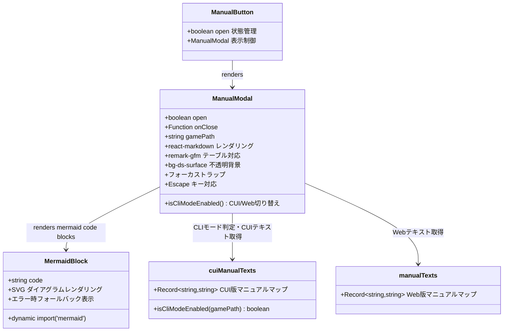

### 1.6 ページコンポーネント層

```mermaid
classDiagram
    class GamePage {
        <<abstract>>
        useGamePageSetup() セットアップ
        usePhaseNames() フェーズ名
        use[Game]Game() ゲームロジック
        render() ページ描画
    }

    class BlackJackPage {
        +ベッティングUI
        +マルチハンド表示
        +CPU プレイヤー表示
        +サイドベット UI
    }

    class HeartsPage {
        +カード交換UI
        +トリック表示エリア
        +スコアテーブル
        +ヒントシステム
    }

    class KlondikePage {
        +タブロー列 (7列)
        +ファウンデーション (4山)
        +ストック/ウェイスト
        +Undo/ヒント/自動完成
    }

    class MemoryPage {
        +52枚カードグリッド
        +プレイヤースコア表示
        +カードフリップアニメーション
    }

    class DoubtPage {
        +カード選択UI
        +カウントダウンタイマー
        +ダウト判定表示
        +フロントエンドヒント (useGameHint)
    }

    class NapoleonPage {
        +ビッドUI
        +切り札宣言UI
        +キティ交換UI
        +トリック表示エリア
        +スコアテーブル
        +ヒントシステム
        +フロントエンドヒント (useGameHint)
    }

    class MightyPage {
        +useMightyGame() : MightyGameState
        +useGameHint() : MightyHint
        +useCliMode() : CliState
        +useGameRoundGuard() : RoundGuard
        +ビッドUI (NoTrump スイッチ + 数値)
        +切り札・副官宣言UI (trumpSuit + partnerSuit + partnerValue)
        +キティ交換UI (3枚ディスカード)
        +ジョーカーリードUI (jokerLeadSuit 指定)
        +トリック表示エリア (5プレイヤー円卓)
        +スコアテーブル (ラウンド/累積)
        +PhaseIndicator
        +SettingsPanel (cpuDifficulty, minBid, noTrumpExtra, pointLimit)
        +ヒントシステム
    }

    class IndianPokerPage {
        +他プレイヤーカード表示
        +自分カード非表示（???）
        +ベッティングアクションボタン
        +ポット・サイドポット表示
        +ショーダウン結果表示
    }

    class VideoPokerPage {
        +配当表表示
        +コインセレクター (1-5)
        +5枚カード表示
        +カードクリックでホールド選択
        +役名・配当表示
    }

    class DeucesWildPage {
        +Deuces Wild配当表表示
        +VideoPokerGameContent再利用
        +ワイルドカード(2)ハイライト
    }

    class JokerPokerPage {
        +Joker Poker配当表表示
        +VideoPokerGameContent再利用
        +ジョーカーワイルドカード表示
    }

    class EuchrePage {
        +チーム別スコア表示
        +ビッドUI (オーダーアップ/パス/コール)
        +トリック表示エリア
        +切り札・ターンアップカード表示
        +ゴーイングアローン選択
        +ヒントシステム
        +フロントエンドヒント (useGameHint)
    }

    class PyramidPage {
        +ピラミッド表示 (7段)
        +ストック/ウェイスト
        +カード選択・ペア除去
        +Undo/ヒント
    }

    class TriPeaksPage {
        +3ピークスタブロー表示
        +ストック/ウェイスト
        +カード除去 (±1ランク)
        +Undo/ヒント
    }

    class CribbagePage {
        +プレイヤー情報・スコア表示
        +スターターカード
        +ペギングエリア
        +ディスカード/ペグ操作
        +ショーフェーズスコア詳細
    }

    class BaccaratPage {
        +ベッティングUI (プレイヤー/バンカー/タイ)
        +サイドベット (ペア)
        +カード表示
        +罫線 (Big Road)
        +ヒントシステム
    }

    class ThreeCardPage {
        +チップ表示
        +アンティ/ペアプラスベット入力
        +プレイヤー3枚カード表示
        +ディーラー3枚カード表示
        +プレイ/フォールドボタン
        +配当詳細表示(アンティ/プレイ/ボーナス/ペアプラス)
        +ヒントシステム
    }

    BlackJackPage --|> GamePage : follows pattern
    HeartsPage --|> GamePage : follows pattern
    KlondikePage --|> GamePage : follows pattern
    MemoryPage --|> GamePage : follows pattern
    DoubtPage --|> GamePage : follows pattern
    NapoleonPage --|> GamePage : follows pattern
    MightyPage --|> GamePage : follows pattern
    IndianPokerPage --|> GamePage : follows pattern
    VideoPokerPage --|> GamePage : follows pattern
    DeucesWildPage --|> GamePage : follows pattern
    JokerPokerPage --|> GamePage : follows pattern
    DeucesWildPage --> VideoPokerPage : reuses VideoPokerGameContent
    JokerPokerPage --> VideoPokerPage : reuses VideoPokerGameContent
    EuchrePage --|> GamePage : follows pattern
    PyramidPage --|> GamePage : follows pattern
    TriPeaksPage --|> GamePage : follows pattern
    class ShortDeckPage {
        +ホールデム系共通UI
        +36枚デッキ表示
        +フラッシュ>フルハウス役順
        +コミュニティカード表示
        +ベッティングアクションボタン
    }

    ShortDeckPage --|> GamePage : follows pattern
    CribbagePage --|> GamePage : follows pattern
    BaccaratPage --|> GamePage : follows pattern
    ThreeCardPage --|> GamePage : follows pattern

    class PaiGowPage {
        +チップ表示
        +ベット額入力
        +プレイヤー7枚カード表示
        +ローハンド選択UI
        +ハイハンド/ローハンド比較表示
        +配当詳細表示(コミッション込み)
    }

    PaiGowPage --|> GamePage : follows pattern

    class OhHellPage {
        +プレイヤー情報・スコア表示
        +切り札カード・スート表示
        +ラウンド/トリック情報
        +ビッド入力(フック制限表示)
        +トリックカード表示
        +ヒントボタン
        +フロントエンドヒント (useGameHint)
    }

    OhHellPage --|> GamePage : follows pattern

    class BridgePage {
        +チーム別スコア表示(ラバー/ゲーム)
        +オークションUI (ビッドレベル/スート/パス/ダブル/リダブル)
        +ダミーハンド公開表示
        +トリック表示エリア
        +切り札・コントラクト表示
        +バルネラビリティ表示
        +ヒントシステム
        +チュートリアル (TutorialProvider)
    }

    BridgePage --|> GamePage : follows pattern

    class PineapplePage {
        +ホールデム系共通UI
        +ホールカード3枚表示
        +ディスカードフェーズUI (カード選択・捨てるボタン)
        +コミュニティカード表示
        +ベッティングアクションボタン
    }

    PineapplePage --|> GamePage : follows pattern

    class SpeedPage {
        +中央場札2枚表示
        +手札カード選択
        +CPUカード裏向き表示
        +フリップボタン (スタック時)
        +ヒントボタン
        +フロントエンドヒント (useGameHint)
    }

    SpeedPage --|> GamePage : follows pattern

    class GoFishPage {
        +CPUプレイヤーエリア (要求先選択)
        +ランク選択ボタン
        +ブック表示
        +山札残り枚数
        +CPU行動アニメーション
    }

    GoFishPage --|> GamePage : follows pattern

    class CanastaPage {
        +スコアテーブル表示
        +メルド表示 (ナチュラル/ミックス/カナスタ)
        +赤3表示
        +フリーズ状態表示
        +捨て札の山ピックアップ (ペア選択)
        +メルドグループ選択
        +チュートリアル (TutorialProvider)
    }

    CanastaPage --|> GamePage : follows pattern

    class PigsTailPage {
        +CPUプレイヤーエリア (手札枚数表示)
        +山札残り枚数
        +場札トップカード表示
        +引くボタン
        +CPU行動アニメーション
    }

    PigsTailPage --|> GamePage : follows pattern

    class SevenCardStudPage {
        +CPUプレイヤーエリア (ドアカード表示)
        +ホールカード・ドアカード表示
        +ベッティングアクションボタン
        +ポット・サイドポット表示
        +HUD統計表示
        +マック/ショー選択
        +リバイ/アドオン画面
        +CPU行動アニメーション
    }

    SevenCardStudPage --|> GamePage : follows pattern

    class RazzPage {
        +CPUプレイヤーエリア (ドアカード表示)
        +ホールカード・ドアカード表示
        +ベッティングアクションボタン
        +ポット・サイドポット表示
        +HUD統計表示
        +マック/ショー選択
        +リバイ/アドオン画面
        +CPU行動アニメーション
    }

    note for RazzPage "SevenCardStudPageと構造的に同一\nローボール (A-5) ハンド評価のみ異なる"

    RazzPage --|> GamePage : follows pattern

    class DurakPage {
        +CPUプレイヤーエリア (手札枚数表示)
        +テーブルカード (攻撃/防御) 表示
        +切り札カード・スート表示
        +デッキ残り枚数
        +アタック/ディフェンス/ピックアップ/パスボタン
        +CPU行動アニメーション
    }

    DurakPage --|> GamePage : follows pattern

    class ClockSolitairePage {
        +13山を時計配置で表示
        +表向き/伏せカード表示
        +ステップ/自動再生ボタン
        +進捗インジケーター(表向き枚数)
    }

    ClockSolitairePage --|> GamePage : follows pattern

    class FortyThievesPage {
        +10列タブロー表示 (全カード表向き)
        +8組札表示
        +山札・ウェスト表示
        +手数カウンター
        +引く/元に戻す/ヒント/オートコンプリートボタン
        +ギブアップ/リセットボタン
    }

    FortyThievesPage --|> GamePage : follows pattern

    class YukonPage {
        +7列タブロー表示 (表向き/伏せカード)
        +4組札表示
        +手数カウンター
        +元に戻す/ヒント/オートコンプリートボタン
        +ギブアップ/リセットボタン
    }

    YukonPage --|> GamePage : follows pattern

    class RussianSolitairePage {
        +7列タブロー表示 (表向き/伏せカード)
        +4組札表示
        +手数カウンター
        +元に戻す/ヒント/オートコンプリートボタン
        +ギブアップ/リセットボタン
    }

    RussianSolitairePage --|> GamePage : follows pattern

    class LetItRidePage {
        +チップ表示
        +ベット額入力
        +プレイヤー3枚カード表示
        +コミュニティカード2枚表示
        +Pull/Let It Rideボタン
        +ベット状態表示(Bet1/Bet2/Bet3)
        +配当詳細表示(Bet1/Bet2/Bet3/合計)
    }

    LetItRidePage --|> GamePage : follows pattern

    class PokerSquaresPage {
        +5x5グリッド表示(25セル)
        +現在のカード表示
        +配置済みカード数表示
        +行スコアバッジ(5行)
        +列スコアバッジ(5列)
        +合計得点表示
        +元に戻すボタン
        +ギブアップ/リセットボタン
    }

    PokerSquaresPage --|> GamePage : follows pattern

    class RedDogPage {
        +チップ表示
        +アンテ額入力
        +初手2枚カード表示
        +スプレッド表示
        +3枚目カード表示
        +レイズ/ステイボタン
        +配当表(collapsible)
        +合計配当表示
    }

    RedDogPage --|> GamePage : follows pattern

    GamePage --> PhaseIndicator : renders
    GamePage --> SettingsPanel : renders
    GamePage --> GameFooter : renders
    GamePage --> ActionLogSection : renders
    GamePage --> GameMessageBox : renders
    GamePage --> ConfirmDialog : renders
    GamePage --> ErrorAlert : renders
    GamePage --> GamePageHeading : renders
    GamePage --> ManualButton : renders

    GamePage --> PokerTableLayout : renders (Hold'em/Omaha/BigO/ShortDeck/Pineapple/SevenCardStud/Razz)
    PokerTableLayout --> CpuPlayerCard : wraps

    note for GamePage "全338ゲームページが同一パターンで構成\nuseGamePageSetup → ゲーム固有Hook → 描画"
```

### 1.7 i18n・プロバイダー・ルーティング

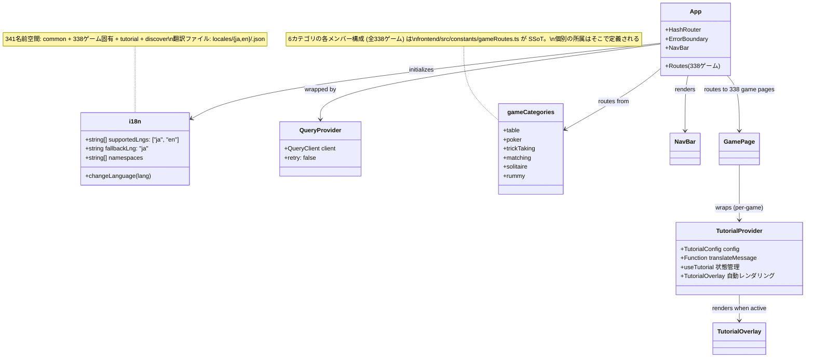

### 1.8 AI Game Concierge (/discover)

`/discover` (サーベイ) と `/discover/result` (結果) の関係する型・コンポーネント・hook・util の依存関係です。`profile: GameProfile` は `gameRoutes` の必須フィールドとして TypeScript レベルで強制されます。

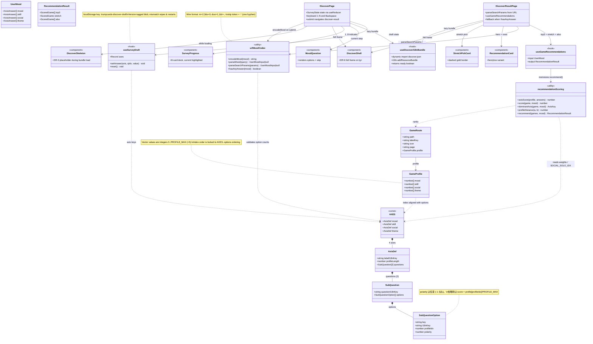

---

## 2. シーケンス図

### 2.1 ゲームアクション実行フロー

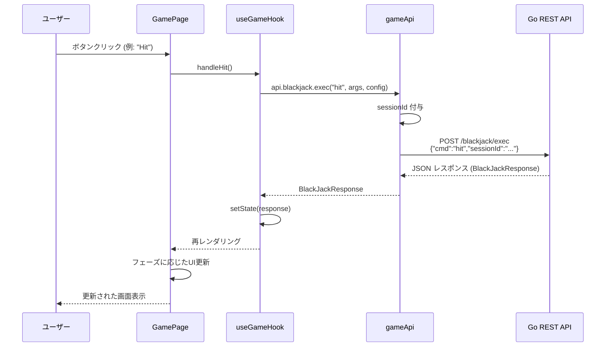

### 2.2 CPUリプレイアニメーションフロー

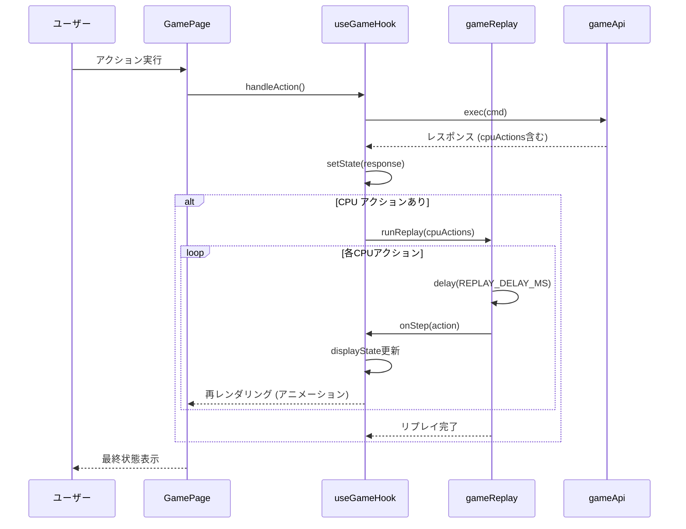

### 2.3 ゲーム初期化フロー

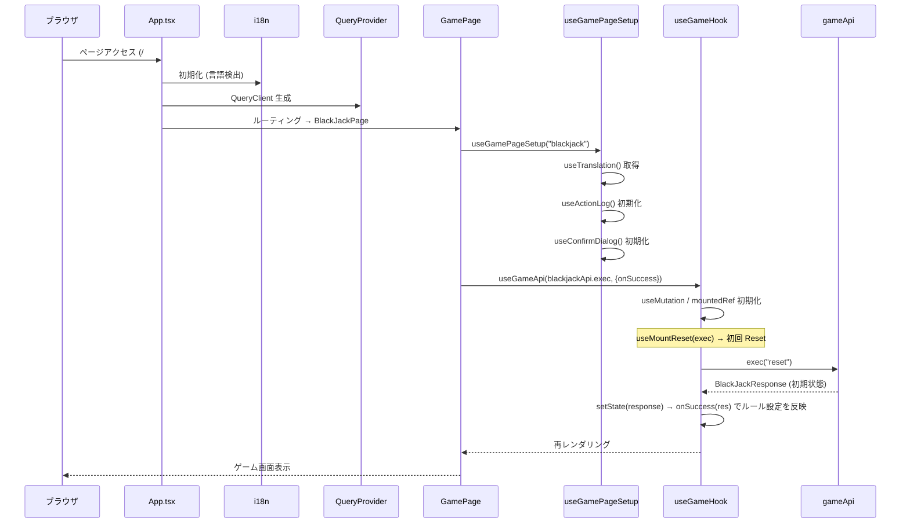

### 2.4 VideoPokerPage フェーズ別レンダリングフロー

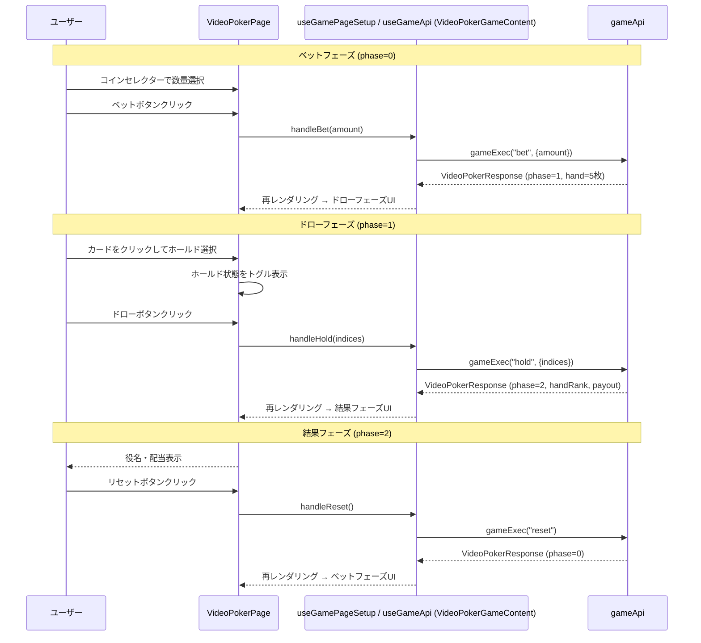

### 2.5 ThreeCardPage フェーズ別レンダリングフロー

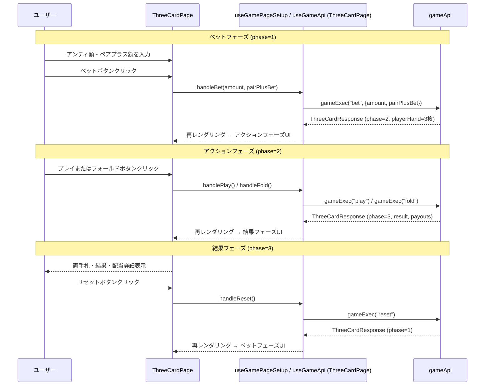

### 2.6 OhHellPage フェーズ別レンダリングフロー

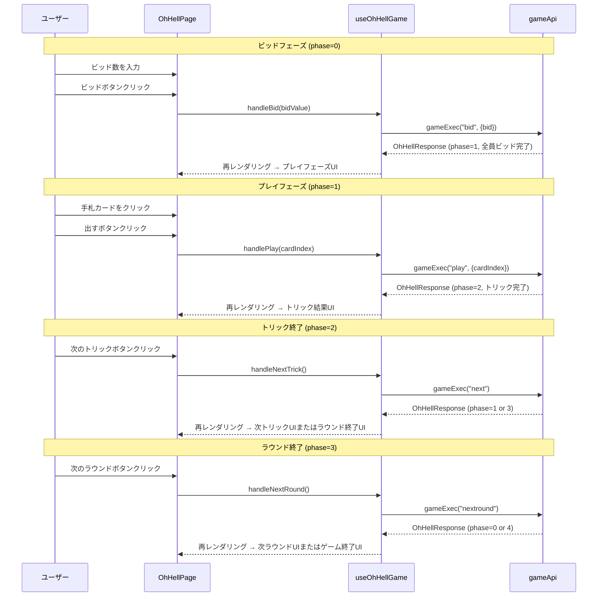

### 2.7 BridgePage フェーズ別レンダリングフロー

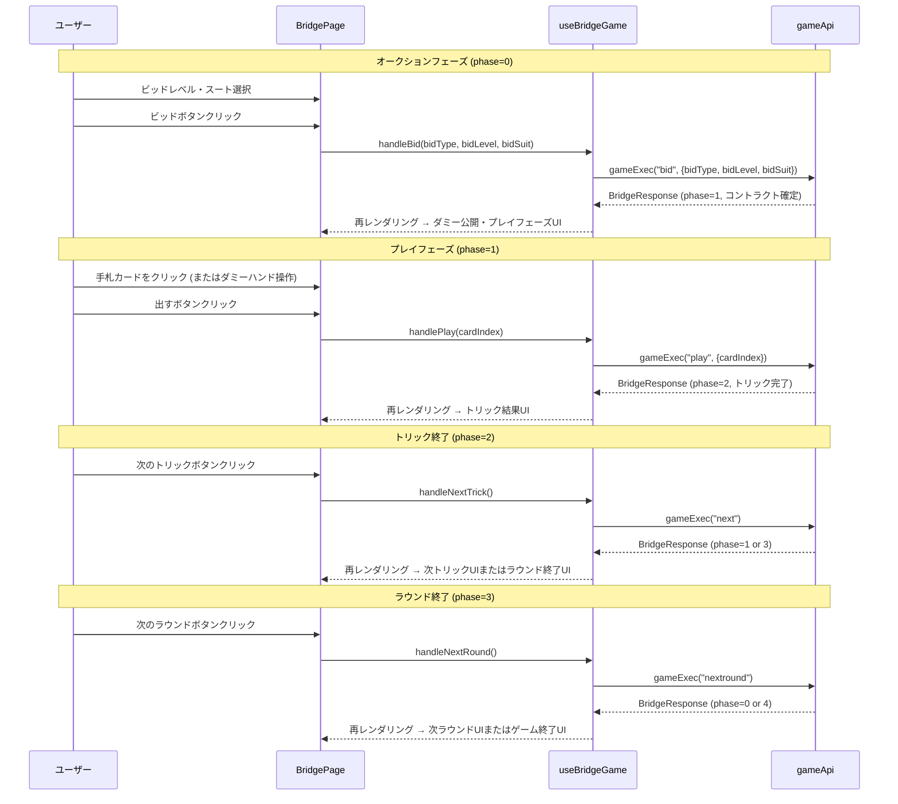

### 2.8 PineapplePage フェーズ別レンダリングフロー

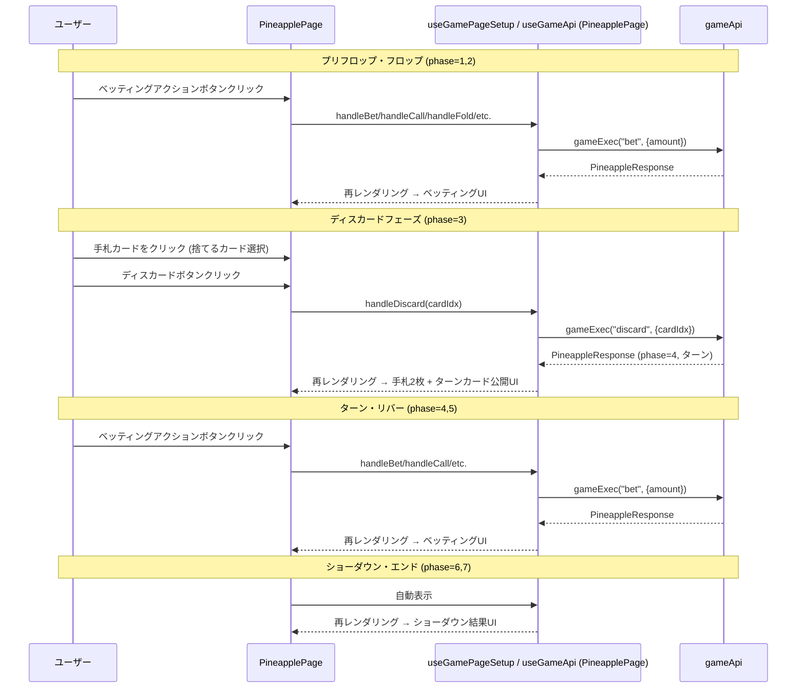

### 2.9 SpeedPage フェーズ別レンダリングフロー

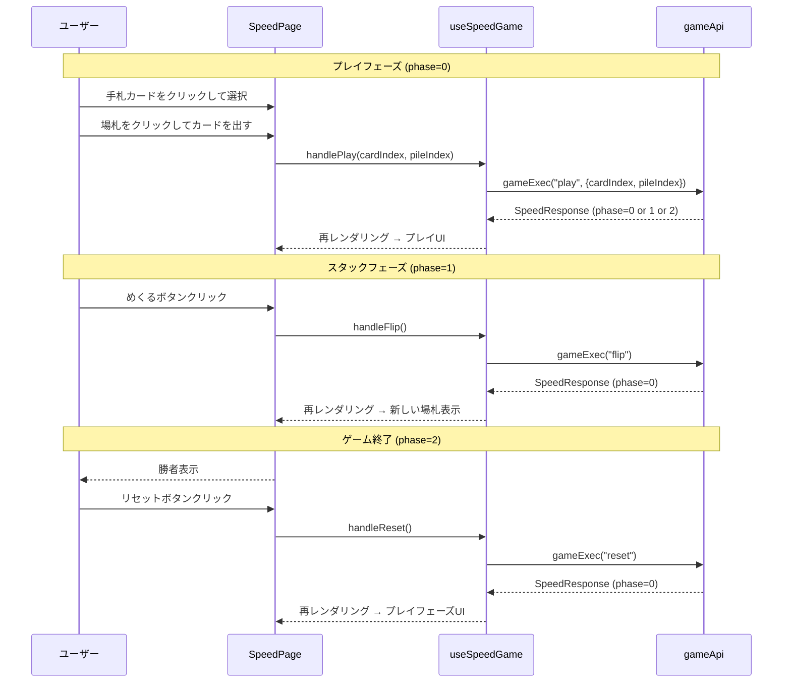

### 2.10 GoFishPage フェーズ別レンダリングフロー

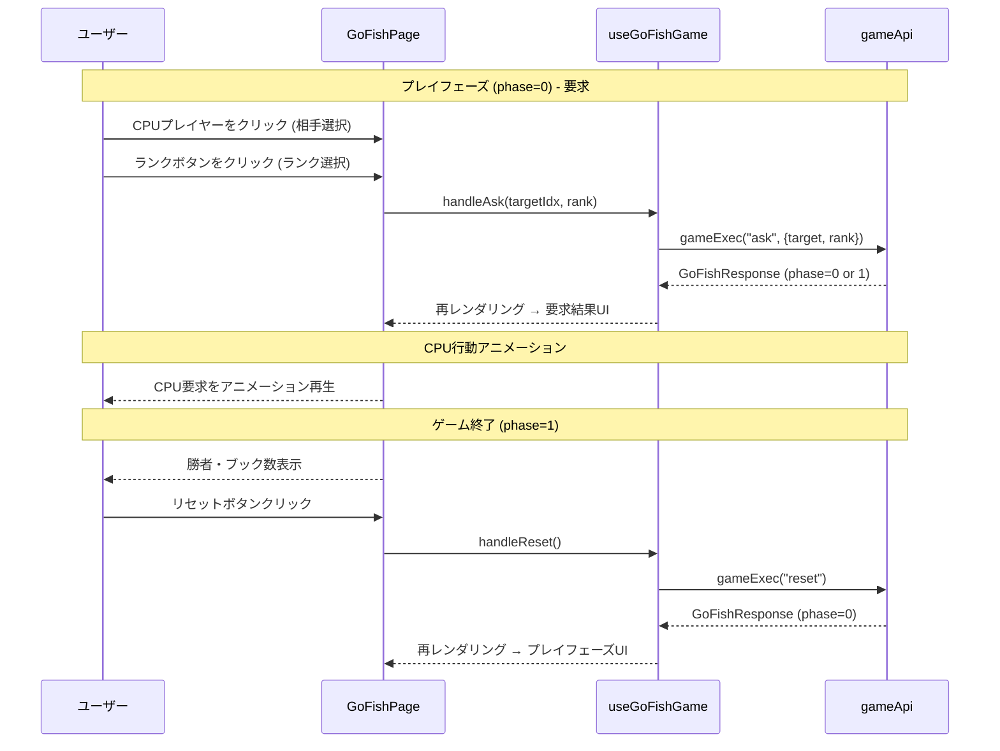

### 2.11 CanastaPage フェーズ別レンダリングフロー

```mermaid
sequenceDiagram
    participant User as ユーザー
    participant Page as CanastaPage
    participant Hook as useCanastaGame
    participant API as gameApi

    Note over User,API: ドローフェーズ (phase=0)
    User->>Page: 山札から引くボタンクリック
    Page->>Hook: handleDrawStock()
    Hook->>API: gameExec("drawstock")
    API-->>Hook: CanastaResponse (phase=1)
    Hook-->>Page: 再レンダリング → メルドフェーズUI

    Note over User,API: メルドフェーズ (phase=1)
    User->>Page: カード3枚以上選択 → メルドボタン
    Page->>Hook: handleMeldSelected()
    Hook->>API: gameExec("meld", {meldGroups})
    API-->>Hook: CanastaResponse (phase=2)
    Hook-->>Page: 再レンダリング → ディスカードフェーズUI

    Note over User,API: ディスカードフェーズ (phase=2)
    User->>Page: カード1枚選択 → 捨てるボタン
    Page->>Hook: handleDiscard()
    Hook->>API: gameExec("discard", {cardIndex})
    API-->>Hook: CanastaResponse (phase=0 or 3)
    Hook-->>Page: 再レンダリング → CPUターン後ドローフェーズUI

    Note over User,API: ラウンド終了 (phase=3)
    User->>Page: 次のラウンドボタンクリック
    Page->>Hook: handleNextRound()
    Hook->>API: gameExec("nextround")
    API-->>Hook: CanastaResponse (phase=0)
    Hook-->>Page: 再レンダリング → ドローフェーズUI
```

### 2.12 PinochlePage フェーズ別レンダリングフロー

```mermaid
sequenceDiagram
    participant User as ユーザー
    participant Page as PinochlePage
    participant Hook as usePinochleGame
    participant API as gameApi

    Note over User,API: ビッドフェーズ (phase=0)
    User->>Page: ビッド額入力 → ビッドボタン
    Page->>Hook: handleBid(amount)
    Hook->>API: gameExec("bid", {bidAmount})
    API-->>Hook: PinochleResponse (phase=0 or 1)
    Hook-->>Page: 再レンダリング → CPUビッド後

    Note over User,API: トランプ宣言フェーズ (phase=1)
    User->>Page: スートボタンクリック
    Page->>Hook: handleCallTrump(suit)
    Hook->>API: gameExec("trump", {suit})
    API-->>Hook: PinochleResponse (phase=2)
    Hook-->>Page: 再レンダリング → メルドフェーズUI

    Note over User,API: メルドフェーズ (phase=2)
    User->>Page: メルド確認ボタン
    Page->>Hook: handleConfirmMelds()
    Hook->>API: gameExec("meld")
    API-->>Hook: PinochleResponse (phase=3)
    Hook-->>Page: 再レンダリング → プレイフェーズUI

    Note over User,API: プレイフェーズ (phase=3)
    User->>Page: カードクリック
    Page->>Hook: handlePlay(cardIndex)
    Hook->>API: gameExec("play", {cardIndex})
    API-->>Hook: PinochleResponse (phase=3 or 4)
    Hook-->>Page: 再レンダリング → CPUプレイ後

    Note over User,API: トリック終了 (phase=4)
    User->>Page: 次のトリックボタン
    Page->>Hook: handleNextTrick()
    Hook->>API: gameExec("next")
    API-->>Hook: PinochleResponse (phase=3 or 5)
    Hook-->>Page: 再レンダリング

    Note over User,API: ラウンド終了 (phase=5)
    User->>Page: 次のラウンドボタン
    Page->>Hook: handleNextRound()
    Hook->>API: gameExec("nextround")
    API-->>Hook: PinochleResponse (phase=0)
    Hook-->>Page: 再レンダリング → ビッドフェーズUI
```

### 2.13 PigsTailPage フェーズ別レンダリングフロー

```mermaid
sequenceDiagram
    participant User as ユーザー
    participant Page as PigsTailPage
    participant Hook as useGameApi(pigtailApi.exec)
    participant API as gameApi

    Note over User,API: プレイフェーズ (phase=0) - ドロー
    User->>Page: 引くボタンクリック
    Page->>Hook: handleDraw()
    Hook->>API: gameExec("draw")
    API-->>Hook: PigsTailResponse (phase=0 or 1)
    Hook-->>Page: 再レンダリング → ドロー結果UI

    Note over User,API: CPU行動アニメーション
    Page-->>User: CPUドローをアニメーション再生

    Note over User,API: ゲーム終了 (phase=1)
    Page-->>User: 勝者・手札枚数表示
    User->>Page: リセットボタンクリック
    Page->>Hook: handleReset()
    Hook->>API: gameExec("reset")
    API-->>Hook: PigsTailResponse (phase=0)
    Hook-->>Page: 再レンダリング → プレイフェーズUI
```

### 2.14 SevenCardStudPage フェーズ別レンダリングフロー

```mermaid
sequenceDiagram
    participant User as ユーザー
    participant Page as SevenCardStudPage
    participant Hook as useGamePageSetup / useGameApi (SevenCardStudPage)
    participant API as gameApi

    Note over User,API: サード～セブンスストリート - ベッティング
    User->>Page: アクションボタンクリック (fold/check/call/bet/raise/allin)
    Page->>Hook: handleAction(command, amount)
    Hook->>API: gameExec(command, {amount, humanPlayMs})
    API-->>Hook: SevenCardStudResponse (phase=1-5)
    Hook-->>Page: 再レンダリング → ベッティング結果UI

    Note over User,API: CPU行動アニメーション
    Page-->>User: CPUアクションをアニメーション再生

    Note over User,API: ショーダウン (phase=6)
    Page-->>User: 全員の手札・役名表示

    Note over User,API: マック/ショー選択
    User->>Page: マック or ショーボタンクリック
    Page->>Hook: handleMuck() / handleShow()
    Hook->>API: gameExec("muck" / "show")

    Note over User,API: リバイ/アドオン (phase=8)
    User->>Page: リバイ or スキップボタンクリック
    Page->>Hook: handleRebuy() / handleSkipRebuy()
    Hook->>API: gameExec("rebuy" / "skiprebuy")
    API-->>Hook: SevenCardStudResponse (phase=0)
    Hook-->>Page: 再レンダリング → 次ハンドUI
```

### 2.15 DurakPage フェーズ別レンダリングフロー

```mermaid
sequenceDiagram
    participant User as ユーザー
    participant Page as DurakPage
    participant Hook as useDurakGame
    participant API as gameApi

    Note over User,API: アタックフェーズ (phase=0)
    User->>Page: カード選択 → アタックボタンクリック
    Page->>Hook: handleAttack(cardIndex)
    Hook->>API: gameExec("attack", {cardIndex})
    API-->>Hook: DurakResponse (phase=0 or 1)
    Hook-->>Page: 再レンダリング → テーブルカード表示

    Note over User,API: ディフェンスフェーズ (phase=1)
    User->>Page: カード選択 → ディフェンスボタンクリック
    Page->>Hook: handleDefend(cardIndex)
    Hook->>API: gameExec("defend", {cardIndex})
    API-->>Hook: DurakResponse (phase=0 or 1)
    Hook-->>Page: 再レンダリング → 防御結果表示

    Note over User,API: ピックアップ (防御放棄)
    User->>Page: ピックアップボタンクリック
    Page->>Hook: handleTake()
    Hook->>API: gameExec("take")
    API-->>Hook: DurakResponse (phase=0)
    Hook-->>Page: 再レンダリング → 次のバウトUI

    Note over User,API: CPU行動アニメーション
    Page-->>User: CPUアクションをアニメーション再生

    Note over User,API: ゲーム終了 (phase=3)
    Page-->>User: 敗者表示・結果サマリー
```

### 2.16 FortyThievesPage フェーズ別レンダリングフロー

```mermaid
sequenceDiagram
    participant User as ユーザー
    participant Page as FortyThievesPage
    participant Hook as useFortyThievesGame
    participant API as gameApi

    Note over User,API: プレイフェーズ (phase=0)
    User->>Page: 山札クリック
    Page->>Hook: handleDraw()
    Hook->>API: gameExec("draw")
    API-->>Hook: FortyThievesResponse (phase=0)
    Hook-->>Page: 再レンダリング → 山札・ウェスト更新

    User->>Page: カード選択 → 移動先クリック
    Page->>Hook: handleMove(src, dst)
    Hook->>API: gameExec("move", {args})
    API-->>Hook: FortyThievesResponse (phase=0)
    Hook-->>Page: 再レンダリング → タブロー・組札更新

    User->>Page: オートコンプリートボタンクリック
    Page->>Hook: handleAutoComplete()
    Hook->>API: gameExec("autocomplete")
    API-->>Hook: FortyThievesResponse (phase=0 or 1)
    Hook-->>Page: 再レンダリング → 組札更新

    Note over User,API: ゲームクリア (phase=1)
    Page-->>User: クリアメッセージ表示

    Note over User,API: ゲームオーバー (phase=2)
    Page-->>User: ゲームオーバーメッセージ表示
```

### 2.17 PaiGowPage フェーズ別レンダリングフロー

```mermaid
sequenceDiagram
    participant User as ユーザー
    participant Page as PaiGowPage
    participant Hook as useGameApi(paigowApi.exec)
    participant API as gameApi

    Note over User,API: ベットフェーズ (phase=1)
    User->>Page: ベット額を入力
    User->>Page: ベットボタンクリック
    Page->>Hook: handleBet(amount)
    Hook->>API: gameExec("bet", {amount})
    API-->>Hook: PaiGowResponse (phase=2, playerCards=7枚)
    Hook-->>Page: 再レンダリング → セットフェーズUI

    Note over User,API: セットフェーズ (phase=2)
    User->>Page: ローハンドにする2枚のカードを選択
    User->>Page: セットボタンクリック
    Page->>Hook: handleSet(low0, low1)
    Hook->>API: gameExec("set", {low0, low1})
    API-->>Hook: PaiGowResponse (phase=3, result, payout)
    Hook-->>Page: 再レンダリング → 結果フェーズUI

    Note over User,API: 結果フェーズ (phase=3)
    Page-->>User: 両ハンド・結果・配当詳細表示
    User->>Page: リセットボタンクリック
    Page->>Hook: handleReset()
    Hook->>API: gameExec("reset")
    API-->>Hook: PaiGowResponse (phase=1)
    Hook-->>Page: 再レンダリング → ベットフェーズUI
```

### 2.18 YukonPage フェーズ別レンダリングフロー

```mermaid
sequenceDiagram
    participant User as ユーザー
    participant Page as YukonPage
    participant Hook as useGamePageSetup / useSolitaireDragDrop (YukonPage)
    participant API as gameApi

    Note over User,API: プレイフェーズ (phase=0)
    User->>Page: タブローカード選択 → 移動先クリック
    Page->>Hook: handleMove(src, dst)
    Hook->>API: gameExec("move", {from, to})
    API-->>Hook: YukonResponse (phase=0)
    Hook-->>Page: 再レンダリング → タブロー・組札更新

    User->>Page: ヒントボタンクリック
    Page->>Hook: handleHint()
    Hook->>API: gameExec("hint")
    API-->>Hook: YukonResponse (hint付き)
    Hook-->>Page: 再レンダリング → ヒントハイライト表示

    User->>Page: オートコンプリートボタンクリック
    Page->>Hook: handleAutoComplete()
    Hook->>API: gameExec("autocomplete")
    API-->>Hook: YukonResponse (phase=0 or 1)
    Hook-->>Page: 再レンダリング → 組札更新

    User->>Page: 元に戻すボタンクリック
    Page->>Hook: handleUndo()
    Hook->>API: gameExec("undo")
    API-->>Hook: YukonResponse (phase=0)
    Hook-->>Page: 再レンダリング → 前の状態に復元

    Note over User,API: ゲームクリア (phase=1)
    Page-->>User: クリアメッセージ表示

    Note over User,API: ゲームオーバー (phase=2)
    Page-->>User: ゲームオーバーメッセージ表示
```

### 2.19 WhistPage フェーズ別レンダリングフロー

```mermaid
sequenceDiagram
    participant U as User
    participant WP as WhistPage
    participant H as useWhistGame
    participant API as whistApi

    U->>WP: ページ表示
    WP->>H: useWhistGame()
    H->>API: dispatch('reset')
    API-->>H: WhistResponse (phase=Play)
    H-->>WP: state更新

    alt phase = Play (人間の手番)
        U->>WP: カード選択 + 出すボタン
        WP->>H: handlePlay(cardIndex)
        H->>API: dispatch('play', cardIndex)
        API-->>H: WhistResponse
    end

    alt phase = TrickEnd
        U->>WP: 次のトリックボタン
        WP->>H: handleNextTrick()
        H->>API: dispatch('next')
    end

    alt phase = RoundEnd
        U->>WP: 次のラウンドボタン
        WP->>H: handleNextRound()
        H->>API: dispatch('nextround')
    end

    alt phase = GameEnd
        WP->>WP: 勝利チーム表示
    end
```

### 2.20 CLIモード コマンド実行フロー

```mermaid
sequenceDiagram
    participant User as ユーザー (CliTerminal入力)
    participant useCliGame as useCliGame
    participant Parser as parseXxxCommand
    participant API as useGameApi
    participant Formatter as formatXxxState
    participant Log as useCliMode.logEntries

    User->>useCliGame: handleCommand("hit")
    useCliGame->>Log: addInput("hit")
    useCliGame->>Parser: parseCommand("hit")
    Parser-->>useCliGame: { args = ["hit"] }
    useCliGame->>API: 実行("hit")
    API-->>useCliGame: state更新
    useCliGame->>Formatter: formatResponse(state)
    Formatter-->>useCliGame: テキスト出力
    useCliGame->>Log: addOutput(テキスト)
    Log-->>User: CliTerminal再レンダリング (自動スクロール)
```

### 2.21 RedDogPage フェーズ別レンダリングフロー

```mermaid
sequenceDiagram
    participant User
    participant Page as RedDogPage
    participant Hook as useGameApi
    participant API as reddogApi

    Note over Page: BET フェーズ
    Page->>Page: アンテ入力 + ベットボタン表示
    User->>Page: ベットボタンクリック
    Page->>Hook: exec('bet', amount)
    Hook->>API: POST /reddog {cmd='bet', amount}
    API-->>Hook: RedDogResponse
    Hook-->>Page: state 更新

    alt スプレッドあり
        Note over Page: SPREAD_DECISION フェーズ
        Page->>Page: 初手2枚 + スプレッド + レイズ/ステイボタン表示
        User->>Page: レイズ or ステイ
        Page->>Hook: exec('raise', amount) / exec('stay')
        Hook->>API: POST /reddog
        API-->>Hook: RedDogResponse
        Hook-->>Page: state 更新
    else ペア
        Note over Page: PAIR_THIRD → END (自動遷移)
    else 連続
        Note over Page: END (プッシュ)
    end

    Note over Page: END フェーズ
    Page->>Page: 結果 + 配当 + リセットボタン表示
    User->>Page: リセットボタンクリック
    Page->>Hook: exec('reset')
```

### 2.22 ScorpionPage フェーズ別レンダリングフロー

```mermaid
sequenceDiagram
    participant User as ユーザー
    participant Page as ScorpionPage
    participant Hook as useGameApi
    participant API as scorpionApi

    Note over User,API: プレイフェーズ (phase=0)
    User->>Page: タブローカード選択 → 移動先列クリック
    Page->>Hook: dispatch move {fromCol, cardIndex, toCol}
    Hook->>API: POST /scorpion/exec cmd=move
    API-->>Hook: ScorpionResponse (phase=0)
    Hook-->>Page: 再レンダリング → タブロー更新

    User->>Page: ディール (D キー) / ディールボタン
    Page->>Hook: dispatch deal
    Hook->>API: POST /scorpion/exec cmd=deal
    API-->>Hook: ScorpionResponse (ストック3枚が各列末尾へ)

    User->>Page: ヒントボタン (H キー)
    Page->>Hook: dispatch hint
    API-->>Hook: ScorpionResponse (hint 付き)

    User->>Page: オートコンプリート (A キー)
    Page->>Hook: dispatch autocomplete
    API-->>Hook: ScorpionResponse (phase=0 or 1)

    User->>Page: 元に戻す (Z キー)
    Page->>Hook: dispatch undo
    API-->>Hook: ScorpionResponse (前の状態に復元)

    Note over User,API: ゲームクリア (phase=1)
    Page-->>User: クリアメッセージ + 完成スート数表示

    Note over User,API: ゲームオーバー (phase=2)
    Page-->>User: 手詰まり / ギブアップメッセージ表示
```

### 2.22b WaspPage フェーズ別レンダリングフロー

WaspPage は ScorpionPage と同一のレンダリングフロー（`waspApi` 経由で `/wasp/exec` を呼び出す）。唯一の差は、空の列に任意のカードをドロップできる点で、UI 操作のシーケンスは Scorpion とまったく同じ。

```mermaid
sequenceDiagram
    participant User as ユーザー
    participant Page as WaspPage
    participant Hook as useGameApi
    participant API as waspApi

    Note over User,API: プレイフェーズ (phase=0)
    User->>Page: タブローカード選択 → 移動先列クリック (空列には任意カード可)
    Page->>Hook: dispatch move {fromCol, cardIndex, toCol}
    Hook->>API: POST /wasp/exec cmd=move
    API-->>Hook: WaspResponse (phase=0)
    Hook-->>Page: 再レンダリング → タブロー更新

    User->>Page: ディール (D キー) / ディールボタン
    Page->>Hook: dispatch deal
    Hook->>API: POST /wasp/exec cmd=deal
    API-->>Hook: WaspResponse (ストック3枚が各列末尾へ)

    Note over User,API: ゲームクリア (phase=1)
    Page-->>User: クリアメッセージ + 完成スート数表示

    Note over User,API: ゲームオーバー (phase=2)
    Page-->>User: 手詰まり / ギブアップメッセージ表示
```

### 2.23 TrashPage フェーズ別レンダリングフロー

```mermaid
sequenceDiagram
    participant User as ユーザー
    participant Page as TrashPage
    participant Hook as useGameApi
    participant API as trashApi

    Note over User,API: PlayerTurn (phase=0, current=0)
    User->>Page: 山札ボタンをクリック
    Page->>Hook: dispatch draw
    Hook->>API: POST /trash/exec cmd=draw
    API-->>Hook: TrashResponse (自動チェーン解決)
    Hook-->>Page: 再レンダリング → スロット更新

    Note over User,API: AwaitWild (phase=1)
    Page-->>User: 自スロットに ring-info 強調
    User->>Page: 裏向きスロットをクリック
    Page->>Hook: dispatch place position=pos
    Hook->>API: POST /trash/exec cmd=place
    API-->>Hook: TrashResponse (wild 配置 + 連鎖)

    Note over User,API: CPU Turn (current=1)
    Page->>Hook: useEffect → 自動 dispatch cpu (500ms遅延)
    Hook->>API: POST /trash/exec cmd=cpu
    API-->>Hook: TrashResponse (CPU が1ステップ進行)
    Page-->>User: 自動で再レンダリング (勝敗 / ターン交代まで)

    Note over User,API: GameOver (phase=2)
    Page-->>User: 勝敗メッセージ + 手数表示 + WinCelebration (勝利時)
    User->>Page: Reset ボタン
    Page->>Hook: dispatch reset
```

### 2.24 RussianSolitairePage フェーズ別レンダリングフロー

```mermaid
sequenceDiagram
    participant User as ユーザー
    participant Page as RussianSolitairePage
    participant Hook as useGamePageSetup / useSolitaireDragDrop (RussianSolitairePage)
    participant API as gameApi

    Note over User,API: プレイフェーズ (phase=0)
    User->>Page: タブローカード選択 → 移動先クリック
    Page->>Hook: handleMove(src, dst)
    Hook->>API: gameExec("move", {from, to})
    API-->>Hook: RussianSolitaireResponse (phase=0)
    Hook-->>Page: 再レンダリング → タブロー・組札更新

    User->>Page: ヒントボタンクリック
    Page->>Hook: handleHint()
    Hook->>API: gameExec("hint")
    API-->>Hook: RussianSolitaireResponse (hint付き)
    Hook-->>Page: 再レンダリング → ヒントハイライト表示

    User->>Page: オートコンプリートボタンクリック
    Page->>Hook: handleAutoComplete()
    Hook->>API: gameExec("autocomplete")
    API-->>Hook: RussianSolitaireResponse (phase=0 or 1)
    Hook-->>Page: 再レンダリング → 組札更新

    User->>Page: 元に戻すボタンクリック
    Page->>Hook: handleUndo()
    Hook->>API: gameExec("undo")
    API-->>Hook: RussianSolitaireResponse (phase=0)
    Hook-->>Page: 再レンダリング → 前の状態に復元

    Note over User,API: ゲームクリア (phase=1)
    Page-->>User: クリアメッセージ表示

    Note over User,API: ゲームオーバー (phase=2)
    Page-->>User: ゲームオーバーメッセージ表示
```

YukonPage と同一のフロー。タブロー間の積み重ね判定はサーバ側 (`canPlaceOnTableau` で同スート降順チェック) で行われるため、フロントエンドの呼び出しシーケンスは Yukon と完全に一致する。

### 2.25 MightyPage フェーズ別レンダリングフロー

```mermaid
sequenceDiagram
    participant User as ユーザー
    participant Page as MightyPage
    participant Hook as useMightyGame
    participant API as gameApi

    Note over User,API: マウント時 (Reset)
    Page->>Hook: useEffect → reset()
    Hook->>API: gameExec("reset")
    API-->>Hook: MightyResponse (phase=0, BID)
    Hook-->>Page: 再レンダリング → ビッドUI 表示

    Note over User,API: ビッドフェーズ (phase=0)
    User->>Page: bid値・NoTrumpスイッチ・bidボタンクリック
    Page->>Hook: handleBid(bid, noTrump)
    Hook->>API: gameExec("bid", {bid, noTrump})
    API-->>Hook: MightyResponse (phase=0 or 1, CPU自動ビッドループ済)
    Hook-->>Page: 再レンダリング → 切り札・副官UI or 次の人間ビッド待ち

    Note over User,API: 切り札・副官指名 (phase=1)
    User->>Page: trumpSuit/partnerSuit/partnerValue 選択
    Page->>Hook: handleTrumpAndFriend(t, ps, pv)
    Hook->>API: gameExec("trump", {trumpSuit, partnerSuit, partnerValue})
    API-->>Hook: MightyResponse (phase=2, KittyExchange)
    Hook-->>Page: 再レンダリング → キティ交換UI 表示

    Note over User,API: キティ交換 (phase=2)
    User->>Page: 3枚のディスカード選択 → 確定
    Page->>Hook: handleExchange(discardIndices)
    Hook->>API: gameExec("exchange", {discardIndices})
    API-->>Hook: MightyResponse (phase=3, Play)
    Hook-->>Page: 再レンダリング → トリック盤面

    Note over User,API: トリック (phase=3)
    User->>Page: 手札カードをクリック → 出すボタン
    alt 通常プレイ
        Page->>Hook: handlePlay(cardIndex)
        Hook->>API: gameExec("play", {cardIndex})
    else ジョーカーリード
        User->>Page: ジョーカーリード + 要求スート選択
        Page->>Hook: handleJokerLead(cardIndex, jokerLeadSuit)
        Hook->>API: gameExec("jokerlead", {cardIndex, jokerLeadSuit})
    end
    API-->>Hook: MightyResponse (phase=3 or 4, ResolveTrick)
    Hook-->>Page: 再レンダリング → トリック結果UI

    Note over User,API: トリック終了 (phase=4)
    User->>Page: 次のトリックボタン
    Page->>Hook: handleNext()
    Hook->>API: gameExec("next")
    API-->>Hook: MightyResponse (phase=3 or 5)
    Hook-->>Page: 再レンダリング → 次トリックUI or ラウンド終了UI

    Note over User,API: ラウンド終了 (phase=5)
    User->>Page: 次のラウンドボタン
    Page->>Hook: handleNextRound()
    Hook->>API: gameExec("nextround")
    API-->>Hook: MightyResponse (phase=0 or 6)
    Hook-->>Page: 再レンダリング → 次ラウンドUI or ゲーム終了UI
```

### 2.26 PenguinPage フェーズ別レンダリングフロー

EightOff の派生。baseRank に応じた組札開始ランクの表示と、7列×7枚タブロー + 7フリーセル (初期3つ使用済み) のレイアウト。空列には prevRank(baseRank) のカードのみ配置可能。

```mermaid
sequenceDiagram
    actor User
    participant Page as PenguinPage
    participant Hook as useGameApi
    participant API as penguinApi

    Note over Page: mount then reset
    Page->>Hook: run("reset")
    Hook->>API: POST /penguin/run {command="reset"}
    API-->>Hook: PenguinResponse (phase=0, baseRank=N)
    Hook-->>Page: state update - Playing UI

    rect rgb(230,245,255)
    Note over User,Page: Playing (phase=0)
    User->>Page: card click (select source)
    Page->>Page: highlight selection
    User->>Page: target click
    Page->>Hook: run("move", from, to)
    Hook->>API: POST /penguin/run {command="move", from, to}
    API-->>Hook: PenguinResponse (moveCount++, phase=0 or 1)
    Hook-->>Page: re-render
    end

    rect rgb(230,255,230)
    Note over User,Page: GameClear (phase=1)
    Page->>Page: WinCelebration display
    User->>Page: reset button
    Page->>Hook: run("reset")
    Hook->>API: POST /penguin/run {command="reset"}
    API-->>Hook: PenguinResponse (phase=0)
    Hook-->>Page: new game start
    end

    rect rgb(255,230,230)
    Note over User,Page: GameOver (phase=2)
    User->>Page: next game or reset
    Page->>Hook: run("reset")
    Hook->>API: POST /penguin/run {command="reset"}
    API-->>Hook: PenguinResponse (phase=0)
    Hook-->>Page: new game start
    end
```

### 2.27 AI Game Concierge サーベイ → 結果フロー

ユーザーが Sidebar/NavBar CTA から `/discover` を開き、8問のアンケートを進めて `/discover/result` で推薦結果を見るまで。i18n bundle は `/discover` mount 時に遅延ロードされ、その間 `DiscoverSkeleton` が表示されます。

```mermaid
sequenceDiagram
    actor User
    participant Sidebar as DesktopSidebar/NavBar
    participant Page as DiscoverPage
    participant Bundle as useDiscoverI18nBundle
    participant i18n as i18next
    participant Draft as useSurveyDraft
    participant LS as localStorage
    participant Result as DiscoverResultPage
    participant Codec as urlMoodCodec
    participant Recs as useGameRecommendations

    User->>Sidebar: tap "🎲 おすすめを探す"
    Sidebar->>Page: navigate /discover

    Page->>Bundle: useDiscoverI18nBundle()
    alt bundle not yet loaded
        Bundle->>i18n: hasResourceBundle('discover') → false
        Bundle->>Bundle: dynamic import('locales/{lang}/discover.json')
        Page-->>User: DiscoverSkeleton (DR-3)
        Bundle->>i18n: addResourceBundle(lang, 'discover', json)
        Bundle-->>Page: ready=true
    end

    Page->>Draft: useSurveyDraft() → restored axes
    Draft->>LS: read trumpcards-discover-draft
    LS-->>Draft: { v: 1, axes } | null
    Page->>Page: firstUnansweredStep(axes) → initial step

    loop 8 questions (advance/back)
        Page-->>User: MoodQuestion (current axis/qIdx)
        User->>Page: select option N (1-N key or click)
        Page->>Draft: setAnswer(axis, qIdx, idx)
        Draft->>LS: persist (try/catch)
        Page->>Page: dispatch advance — slide animation (DR-4)
    end

    Page->>Codec: encodeMood({ axes }) → "m=...&s=...&so=...&t=..."
    Page->>Draft: reset() → clears localStorage
    Page->>Result: navigate /discover/result?<query>

    Result->>Bundle: useDiscoverI18nBundle() (already ready in most flows)
    Result->>Codec: parseSearchParams(params) → UserMoodInput|null
    alt parsed === null
        Result->>Result: navigate('/discover', { replace: true })
    end
    Result->>Codec: hasAnyAnswer(mood) → boolean
    Result->>Recs: useGameRecommendations(toUserMood(mood))
    Recs-->>Result: { top3, stretch, also }

    alt all-skip mood
        Result-->>User: fallback hero (warm dashed border + 2 CTA)
    else
        Result-->>User: hero card (TOP1) + TOP2/3 + Stretch + Also rows
    end
```

---

## 3. ステートマシン図

### 3.1 ゲームページ表示状態

```mermaid
stateDiagram-v2
    [*] --> Loading : ページマウント
    Loading --> Playing : Reset API 成功
    Loading --> Error : API エラー

    state Playing {
        [*] --> WaitingInput : 自分のターン
        WaitingInput --> Processing : アクション実行
        Processing --> CpuReplay : CPUアクションあり
        Processing --> WaitingInput : 即座に次のターン
        CpuReplay --> WaitingInput : リプレイ完了
        Processing --> PhaseTransition : フェーズ変化
        PhaseTransition --> WaitingInput : 次フェーズのUI表示
    }

    Playing --> GameEnd : ゲーム終了フェーズ
    Playing --> Error : API エラー
    Error --> Loading : リトライ
    GameEnd --> Loading : リセット
    GameEnd --> [*] : ページ離脱
```

### 3.2 カード選択状態 (useCardSelection)

```mermaid
stateDiagram-v2
    [*] --> Empty : 初期化

    Empty --> Selected : toggle(cardIndex)
    Selected --> Selected : toggle(別のcardIndex) → 追加/解除
    Selected --> Empty : clear()
    Selected --> Empty : confirm() → アクション実行後クリア

    note right of Selected : selected = number[]\n選択中のカードインデックス配列
    note right of Empty : selected = []\n何も選択されていない
```

### 3.3 確認ダイアログ状態 (useConfirmDialog)

```mermaid
stateDiagram-v2
    [*] --> Closed : 初期化
    Closed --> Open : requestConfirm(callback)
    Open --> Closed : cancel() / Escapeキー
    Open --> Closed : confirm() → callback実行

    note right of Open : フォーカストラップ有効\nTab キーでダイアログ内循環\nEscape で閉じる
```

### 3.4 アクションログ状態 (useActionLog)

```mermaid
stateDiagram-v2
    [*] --> Hidden : 初期化
    Hidden --> Fetching : show()
    Fetching --> Visible : API成功 (entries取得)
    Fetching --> Hidden : APIエラー
    Visible --> Hidden : hide()
    Visible --> Fetching : show() (再取得)
```

### 3.5 ゲーム設定パネル状態

```mermaid
stateDiagram-v2
    [*] --> Collapsed : 初期化

    Collapsed --> Expanded : パネル開く
    Expanded --> Collapsed : パネル閉じる

    state Expanded {
        [*] --> Idle
        Idle --> Changing : 設定変更
        Changing --> Resetting : Reset API呼出し
        Resetting --> Idle : 新しい設定でゲーム再開
    }

    note right of Expanded : 設定変更時は自動的にゲームリセット\nhandleConfigChange → exec reset with newConfig
```

### 3.6 チュートリアル状態 (useTutorial)

```mermaid
stateDiagram-v2
    [*] --> Inactive : 初期化

    Inactive --> Active : start()
    Inactive --> Inactive : next()/skip() (何もしない)

    state Active {
        [*] --> Step_0 : onEnter呼出し
        Step_0 --> Step_N : next() / onEnter呼出し
        Step_N --> Step_N : next() (次ステップ)
    }

    Active --> Completed : next() (最終ステップ)
    Active --> Inactive : skip()
    Completed --> Active : start() (再開)

    note right of Completed : localStorage に完了フラグ保存\ntutorial_completed_{gameName} = true
    note right of Active : advanceOn=click → 対象クリックで next()\nadvanceOn=next → 次へボタンで next()
```

### 3.7 CLIモード状態 (useCliMode + useCliGame)

```mermaid
stateDiagram-v2
    [*] --> GUI : 初期化 (localStorage確認)

    GUI --> CLI : toggleCli()
    CLI --> GUI : toggleCli()

    state CLI {
        [*] --> Idle : CliTerminal表示

        Idle --> Parsing : コマンド入力 (Enter)
        Parsing --> Help : help/?
        Parsing --> Clear : clear
        Parsing --> Executing : コマンドパース成功
        Parsing --> Error : パースエラー

        Help --> Idle : ヘルプテキスト表示
        Clear --> Idle : ログクリア
        Error --> Idle : エラーメッセージ表示
        Executing --> Formatting : API成功
        Executing --> Error : APIエラー
        Formatting --> Idle : 整形テキスト表示 (自動スクロール)
    }

    note right of GUI : GUIコンポーネント表示\nGameFooter + カードUI
    note right of CLI : CliTerminal表示\n黒背景 + 等幅フォント\nコマンド履歴 (up/down)
    note left of GUI : ゲーム状態はGUI/CLI共有\nuseGameApi.state は同一
```

### 3.8 Mighty フェーズ遷移 (MightyPhase)

```mermaid
stateDiagram-v2
    [*] --> BID : reset()
    BID --> TRUMP_AND_FRIEND : 全員ビッド/パス完了
    TRUMP_AND_FRIEND --> KITTY_EXCHANGE : 切り札 + 副官カード指名
    KITTY_EXCHANGE --> PLAY : ディスカード3枚確定
    PLAY --> TRICK_END : 5プレイヤーのカード出し完了
    TRICK_END --> PLAY : next() / 残りトリックあり
    TRICK_END --> ROUND_END : 10トリック完了
    ROUND_END --> BID : nextround() / PointLimit 未到達
    ROUND_END --> GAME_END : 累積点 ≥ PointLimit
    GAME_END --> [*]

    note right of BID : MightyPhase.BID = 0\nNoTrump 軸は別フラグ\n(bid floor +noTrumpExtra)
    note right of TRUMP_AND_FRIEND : MightyPhase.TRUMP_AND_FRIEND = 1\ntrumpSuit = -1 (NoTrump) or 1-4\npartnerSuit/partnerValue 指定\nセルフフレンド可
    note right of KITTY_EXCHANGE : MightyPhase.KITTY_EXCHANGE = 2\n宣言者のみ手札 10+3=13\n3枚ディスカードで 10 に戻る
    note right of PLAY : MightyPhase.PLAY = 3\n通常 play(cardIndex)\nまたは jokerlead(cardIndex,jokerLeadSuit)
    note right of ROUND_END : MightyPhase.ROUND_END = 5\nスコア = (|points-bid|+1)×倍率\nNoTrump 倍率 = 2, セルフフレンド ×2
```

### 3.8.1 Doudizhu フェーズ遷移 (DoudizhuPage)

`DoudizhuPage` はサーバーから返る `phase` 文字列 (`bid` / `play` / `end`) に応じて表示を切り替えます。ビッドフェーズではビッドボタン群、プレイフェーズでは手札選択 + 出す/パス、終了フェーズではスコア表示を描画します。

```mermaid
stateDiagram-v2
    [*] --> Bid : reset() (mount)
    Bid --> Bid : bid (継続)
    Bid --> Play : 地主決定
    Play --> Play : play / pass
    Play --> End : 手札を出し切る
    End --> [*]

    note right of Bid : phase = "bid"\nビッドボタン (1-3/パス)\n最高入札超過分のみ活性
    note right of Play : phase = "play"\nカード複数選択 → 出す\n場にカードあり時のみパス可
    note right of End : phase = "end"\n地主/農民勝敗 + スコア表示
```

### 3.8.2 Truco フェーズ遷移 (TrucoPage)

`TrucoPage` はサーバーから返る数値 `phase` (`TrucoPhase` enum) に応じて表示を切り替えます。プレイフェーズでは手札の play ボタン + `canDeclareTruco` のとき「Truco を宣言」ボタン、応答フェーズでは受諾/拒否/引き上げボタン、バサ・マノ終了では「次へ」ボタンを描画します。マッチ得点と現在の賭け点 (level) は常時ヘッダーに表示します。

```mermaid
stateDiagram-v2
    [*] --> Play : reset() (mount)
    Play --> Respond : truco
    Play --> TrickEnd : バサ完了
    Respond --> Play : accept
    Respond --> Respond : truco (再引き上げ)
    Respond --> HandEnd : decline
    TrickEnd --> Play : next
    TrickEnd --> HandEnd : next (マノ決着)
    HandEnd --> Play : next (次マノ)
    HandEnd --> GameEnd : next (設定点到達)
    GameEnd --> [*]

    note right of Play : phase = 0\n手札クリックで出す + Truco 宣言ボタン
    note right of Respond : phase = 1\n受諾(Quiero)/拒否(No Quiero)/引き上げ
    note right of TrickEnd : phase = 2\n次へボタン
    note right of HandEnd : phase = 3\n賭け点加算 + 次へボタン
    note right of GameEnd : phase = 4\nマッチ勝敗バナー
```

### 3.9 Discover サーベイステップ遷移 (SurveyState)

`DiscoverPage` の `useReducer` が管理する step pointer (`0..TOTAL_QUESTIONS`) の遷移。マウント時に `firstUnansweredStep(restoredAxes)` で localStorage から再開位置を計算し、advance/back で 1 ステップずつ移動、`TOTAL_QUESTIONS` 到達で submit effect が発火して `/discover/result` へ遷移します。

```mermaid
stateDiagram-v2
    [*] --> Restoring : mount

    Restoring --> Step0 : firstUnansweredStep = 0
    Restoring --> StepN : firstUnansweredStep = N (resume from draft)

    state "Step N (0..7)" as StepN {
        [*] --> Showing
        Showing --> Showing : back / Backspace = max(step-1, 0)
        Showing --> Animating : advance (select option or skip)
        Animating --> Showing : transition complete (DR-4 200ms ease-out)
    }

    Step0 --> StepN : advance
    StepN --> Submitted : advance from step=7
    StepN --> StepN : back

    state Submitted {
        [*] --> Encoding
        Encoding --> Clearing : encodeMood ok
        Clearing --> Navigating : draft cleared
        Navigating --> [*] : navigate /discover/result?...
    }

    Submitted --> [*]

    note right of Restoring : axes = useSurveyDraft() (lazy useState)\nfirstUnansweredStep walks 0..7 looking\nfor the first (axis, qIdx) with null answer.
    note right of StepN : current = stepToAxisQuestion(step)\nMoodQuestion renders 1 question.\nReducer pure = advance | back.
    note right of Submitted : Submit effect deps include state.step.\nresetDraft() removes localStorage entry.
```

