# フロントエンド設計ドキュメント (UML)

本ドキュメントは go_trumpcards フロントエンド (React + TypeScript) の設計をMermaid記法で可視化したものです。

## 目次

- [1. クラス図](#1-クラス図)
  - [1.1 型定義 (Card・Response・Phase)](#11-型定義-cardresponsephase)
  - [1.2 API クライアント層](#12-api-クライアント層)
  - [1.3 Hook 層 (共通Hook)](#13-hook-層-共通hook)
  - [1.4 Hook 層 (ゲーム固有Hook)](#14-hook-層-ゲーム固有hook)
  - [1.5 コンポーネント層](#15-コンポーネント層)
  - [1.6 ページコンポーネント層](#16-ページコンポーネント層)
  - [1.7 i18n・プロバイダー・ルーティング](#17-i18nプロバイダールーティング)
- [2. シーケンス図](#2-シーケンス図)
  - [2.1 ゲームアクション実行フロー](#21-ゲームアクション実行フロー)
  - [2.2 CPUリプレイアニメーションフロー](#22-cpuリプレイアニメーションフロー)
  - [2.3 ゲーム初期化フロー](#23-ゲーム初期化フロー)
  - [2.4 VideoPokerPage フェーズ別レンダリングフロー](#24-videopokerpage-フェーズ別レンダリングフロー)
- [3. ステートマシン図](#3-ステートマシン図)
  - [3.1 ゲームページ表示状態](#31-ゲームページ表示状態)
  - [3.2 カード選択状態 (useCardSelection)](#32-カード選択状態-usecardselection)
  - [3.3 確認ダイアログ状態 (useConfirmDialog)](#33-確認ダイアログ状態-useconfirmdialog)
  - [3.4 アクションログ状態 (useActionLog)](#34-アクションログ状態-useactionlog)
  - [3.5 ゲーム設定パネル状態](#35-ゲーム設定パネル状態)
  - [3.6 チュートリアル状態 (useTutorial)](#36-チュートリアル状態-usetutorial)

---

## 1. クラス図

### 1.1 型定義 (Card・Response・Phase)

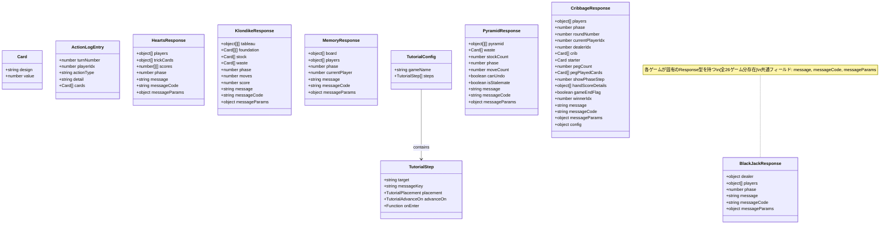

**フェーズ定数 (全ゲーム)**

```mermaid
classDiagram
    class BjPhase {
        <<enumeration>>
        BET = 1
        DEAL = 2
        INSURANCE = 3
        ACTION = 4
        END = 5
        EARLY_SURRENDER = 6
    }

    class PokerPhase {
        <<enumeration>>
        INIT = 0
        DEAL = 1
        EXCHANGE = 2
        SECOND_BET = 3
        END = 4
    }

    class HoldemPhase {
        <<enumeration>>
        INIT = 0
        PRE_FLOP = 1
        FLOP = 2
        TURN = 3
        RIVER = 4
        SHOWDOWN = 5
        END = 6
        REBUY = 7
    }

    class HeartsPhase {
        <<enumeration>>
        PASS = 0
        PLAY = 1
        TRICK_END = 2
        ROUND_END = 3
        GAME_END = 4
    }

    class SpadesPhase {
        <<enumeration>>
        BID = 0
        PLAY = 1
        TRICK_END = 2
        ROUND_END = 3
        GAME_END = 4
    }

    class MemoryPhase {
        <<enumeration>>
        FLIP1 = 0
        FLIP2 = 1
        RESULT = 2
        GAME_END = 3
    }

    class KlondikePhase {
        <<enumeration>>
        PLAYING = 0
        GAME_CLEAR = 1
        GAME_OVER = 2
    }

    class CrazyEightsPhase {
        <<enumeration>>
        PLAY = 0
        CHOOSE_SUIT = 1
        ROUND_END = 2
        GAME_END = 3
    }

    class GinRummyPhase {
        <<enumeration>>
        DRAW = 0
        DISCARD = 1
        LAYOFF = 2
        ROUND_END = 3
        GAME_END = 4
    }

    class BaccaratPhase {
        <<enumeration>>
        BET = 1
        END = 2
    }

    class NapoleonPhase {
        <<enumeration>>
        BID = 0
        TRUMP_DECLARATION = 1
        KITTY_EXCHANGE = 2
        PLAY = 3
        TRICK_END = 4
        ROUND_END = 5
        GAME_END = 6
    }

    class IndianPokerPhase {
        <<enumeration>>
        INIT = 0
        ANTE = 1
        BETTING = 2
        SHOWDOWN = 3
        END = 4
    }

    class VideoPokerPhase {
        <<enumeration>>
        BET = 1
        DRAW = 2
        RESULT = 3
    }

    class EuchrePhase {
        <<enumeration>>
        PICK_UP = 0
        CALL_TRUMP = 1
        DISCARD = 2
        PLAY = 3
        TRICK_END = 4
        ROUND_END = 5
        GAME_END = 6
    }

    class PyramidPhase {
        <<enumeration>>
        PLAYING = 0
        GAME_CLEAR = 1
        GAME_OVER = 2
    }

    class CribbagePhase {
        <<enumeration>>
        DISCARD = 0
        CUT = 1
        PEGGING = 2
        SHOW = 3
        ROUND_END = 4
        GAME_END = 5
    }

    note for KlondikePhase "FreeCellPhase, SpiderPhase, PyramidPhase も\n同一の値を持つ別定数として存在"
```

### 1.2 API クライアント層

```mermaid
classDiagram
    class gameApi {
        -string sessionId
        +postJson~T~(url, body) Promise~T~
        +gameExec~T~(game, body) Promise~T~
    }

    class BlackJackApi {
        +exec(cmd, args?, config?) Promise~BlackJackResponse~
    }

    class PokerApi {
        +exec(cmd, args?, config?) Promise~PokerResponse~
    }

    class HeartsApi {
        +exec(cmd, args?, config?) Promise~HeartsResponse~
    }

    class KlondikeApi {
        +exec(cmd, args?, config?) Promise~KlondikeResponse~
    }

    class PyramidApi {
        +run(cmd, card1?, card2?) Promise~PyramidResponse~
    }

    class CribbageApi {
        +run(cmd, args?, config?) Promise~CribbageResponse~
    }

    class actionLogApi {
        +blackjack() Promise~ActionLogResponse~
        +poker() Promise~ActionLogResponse~
        ...全26ゲーム()
    }

    BlackJackApi --> gameApi : uses postJson/gameExec
    PokerApi --> gameApi : uses postJson/gameExec
    HeartsApi --> gameApi : uses postJson/gameExec
    KlondikeApi --> gameApi : uses postJson/gameExec
    PyramidApi --> gameApi : uses postJson/gameExec
    CribbageApi --> gameApi : uses postJson/gameExec
    actionLogApi --> gameApi : uses gameExec

    note for gameApi "全APIリクエストにsessionIdを自動付与\n各ゲームAPIは cmd ベースの統一形式"
    note for BlackJackApi "全26ゲーム分のAPI Objectが存在\n(blackjack, poker, oldmaid, daifugo,\nsevens, doubt, holdem, omaha, shortdeck,\nhearts, memory, klondike, freecell, baccarat,\nspades, crazyeights, ginrummy, spider,\nnapoleon, indianpoker, videopoker, deuceswild,\njokerpoker, euchre, pyramid, cribbage)"
```

### 1.3 Hook 層 (共通Hook)

```mermaid
classDiagram
    class useGamePageSetup {
        +TFunction t
        +TFunction tc
        +ActionLogEntry[] actionLog
        +Function showActionLog
        +Function hideActionLog
        +boolean confirmOpen
        +Function requestConfirm
        +Function confirmReset
        +Function cancelReset
    }

    class useGameApi~TState_TArgs~ {
        +TState data
        +boolean isLoading
        +Error error
        +Function exec
    }

    class useGameConfig~T~ {
        +T config
        +Function handleConfigChange
        +Function handleToggle
    }

    class useCardSelection {
        +number[] selected
        +Function toggle
        +Function clear
    }

    class usePhaseNames {
        +Record~number_string~ phaseNames
    }

    class useActionLog {
        +ActionLogEntry[] entries
        +boolean isOpen
        +Function show
        +Function hide
    }

    class useConfirmDialog {
        +boolean isOpen
        +Function requestConfirm
        +Function confirm
        +Function cancel
    }

    class useCardDimensions {
        +number cardWidth
        +number cardHeight
        +number cardOverlap
        +number cpuCardWidth
        +number footerCardWidth
        +number sevensCellSize
        +string sevensFontSize
    }
    note for useCardDimensions "3-tier responsive = mobile/desktop/largeDesktop (640px/1024px)"

    class useIsLargeDesktop {
        +boolean isLargeDesktop
    }
    note for useIsLargeDesktop "Returns true when viewport >= 1024px"

    class useActionKeyboardNav {
        +(bindings: KeyBinding[]) void
    }

    class useCardKeyboardNav {
        +(cardCount, onToggle, onConfirm, ...) void
    }

    class useGameSound {
        +Function playSound
        +boolean enabled
        +Function toggle
    }

    class useReducedMotion {
        +boolean prefersReducedMotion
    }

    class useTutorial {
        +boolean isActive
        +number currentStepIndex
        +TutorialStep currentStep
        +number totalSteps
        +boolean isCompleted
        +boolean canResume
        +Function start
        +Function restart
        +Function next
        +Function skip
    }

    class useFirstVisit {
        +boolean shouldShowDialog
        +Function dismiss
        +Function dismissPermanently
    }

    class useGameHint {
        +boolean hintEnabled
        +Function setHintEnabled
        +HintResult hint
    }

    class useTutorialProgress {
        +GameProgress[] games
        +number completedCount
        +number totalCount
    }

    class useLocalStorageToggle {
        +boolean value
        +Function setValue
    }

    useGamePageSetup --> useActionLog : composes
    useGamePageSetup --> useConfirmDialog : composes
    useTutorial ..> useReducedMotion : optional
    useGameHint --> useLocalStorageToggle : uses
```

### 1.4 Hook 層 (ゲーム固有Hook)

```mermaid
classDiagram
    class useBlackJackGame {
        +BlackJackResponse state
        +Function handleBet
        +Function handleHit
        +Function handleStand
        +Function handleDoubleDown
        +Function handleSplit
        +Function handleInsurance
        +Function handleSurrender
        +Function handleReset
    }

    class useHeartsGame {
        +HeartsResponse state
        +number[] selectedCards
        +Function handlePass
        +Function handlePlay
        +Function handleNextTrick
        +Function handleNextRound
        +Function handleHint
        +Function handleReset
    }

    class useKlondikeGame {
        +KlondikeResponse state
        +MoveZone source
        +MoveZone target
        +Function handleDraw
        +Function handleMove
        +Function handleHint
        +Function handleUndo
        +Function handleAutocomplete
        +Function handleReset
    }

    class useMemoryGame {
        +MemoryResponse state
        +Function handleFlip
        +Function handleNext
        +Function handleReset
    }

    class useDoubtGame {
        +DoubtResponse state
        +number countdown
        +number[] selectedCards
        +Function handlePlay
        +Function handleDoubt
        +Function handleSkip
        +Function handleReset
    }

    useBlackJackGame --> useGameApi : uses
    useHeartsGame --> useGameApi : uses
    useHeartsGame --> useCardSelection : uses
    class usePyramidGame {
        +PyramidResponse state
        +Function handleDraw
        +Function handleRemove
        +Function handleHint
        +Function handleUndo
        +Function handleReset
    }

    class useCribbageGame {
        +CribbageResponse state
        +Function handleDiscard
        +Function handlePeg
        +Function handleGo
        +Function handleShowNext
        +Function handleNextRound
        +Function handleReset
    }

    useKlondikeGame --> useGameApi : uses
    usePyramidGame --> useGameApi : uses
    useCribbageGame --> useGameApi : uses
    useMemoryGame --> useGameApi : uses
    useDoubtGame --> useGameApi : uses
    useDoubtGame --> useCardSelection : uses

    note for useBlackJackGame "全26ゲーム分の固有Hookが存在\n各HookはuseGameApiで統一的にAPI呼出し\n必要に応じてuseCardSelectionを合成"
```

### 1.5 コンポーネント層

```mermaid
classDiagram
    class NavBar {
        +gameCategories: GameCategory[]
        +言語切替 (JA/EN)
        +レスポンシブ ハンバーガーメニュー
        +カテゴリ折りたたみ (モバイル)
        +絵文字アイコン表示
    }

    class GameRoute {
        +string path
        +string labelKey
        +string icon
    }

    class GameCategory {
        +string labelKey
        +string icon
        +GameRoute[] routes
    }

    class PhaseIndicator {
        +string phaseName
        +boolean isYourTurn
        +aria-live polite
    }

    class SettingsPanel {
        +ReactNode children
        +boolean open
        +ツールチップ付き設定項目
    }

    class GameFooter {
        +ReactNode children
        +glassmorphismスタイル
        +safe-area対応
    }

    class GameMessageBox {
        +string messageCode
        +object messageParams
        +i18n翻訳表示
    }

    class ActionLogSection {
        +Function onShow
        +ActionLogEntry[] entries
        +モーダルパネル表示
    }

    class ConfirmDialog {
        +string message
        +Function onConfirm
        +Function onCancel
        +フォーカストラップ
        +Escape キー対応
    }

    class AnimatedCard {
        +Card card
        +number x
        +number y
        +number rotation
        +Framer Motion アニメーション
    }

    class CardImage {
        +Card card
        +number width
        +SVG カード画像
    }

    class CpuPlayerCard {
        +string name
        +number chips
        +string status
    }

    class ErrorBoundary {
        +ReactNode children
        +エラー時リトライボタン
    }

    class WinCelebration {
        +紙吹雪アニメーション
    }

    class ErrorAlert {
        +string message
        +Function onDismiss
    }

    class SkipNavLink {
        +アクセシビリティ スキップリンク
    }

    class GamePageHeading {
        +string title
        +visually-hidden h1 (WCAG 2.4.6)
    }

    class TutorialOverlay {
        +TutorialStep step
        +number stepIndex
        +number totalSteps
        +Function onNext
        +Function onSkip
        +SVG mask スポットライト
        +ResizeObserver 追従
        +フォーカストラップ
    }

    class TutorialTooltip {
        +string message
        +TutorialPlacement placement
        +number stepIndex
        +number totalSteps
        +Function onNext
        +Function onSkip
        +glass-panel ツールチップ
    }

    TutorialOverlay --> TutorialTooltip : renders
    TutorialOverlay --> ConfirmDialog : reuses getFocusableElements
```

### 1.6 ページコンポーネント層

```mermaid
classDiagram
    class GamePage {
        <<abstract>>
        useGamePageSetup() セットアップ
        usePhaseNames() フェーズ名
        use[Game]Game() ゲームロジック
        render() ページ描画
    }

    class BlackJackPage {
        +ベッティングUI
        +マルチハンド表示
        +CPU プレイヤー表示
        +サイドベット UI
    }

    class HeartsPage {
        +カード交換UI
        +トリック表示エリア
        +スコアテーブル
        +ヒントシステム
    }

    class KlondikePage {
        +タブロー列 (7列)
        +ファウンデーション (4山)
        +ストック/ウェイスト
        +Undo/ヒント/自動完成
    }

    class MemoryPage {
        +52枚カードグリッド
        +プレイヤースコア表示
        +カードフリップアニメーション
    }

    class DoubtPage {
        +カード選択UI
        +カウントダウンタイマー
        +ダウト判定表示
    }

    class NapoleonPage {
        +ビッドUI
        +切り札宣言UI
        +キティ交換UI
        +トリック表示エリア
        +スコアテーブル
        +ヒントシステム
    }

    class IndianPokerPage {
        +他プレイヤーカード表示
        +自分カード非表示（???）
        +ベッティングアクションボタン
        +ポット・サイドポット表示
        +ショーダウン結果表示
    }

    class VideoPokerPage {
        +配当表表示
        +コインセレクター (1-5)
        +5枚カード表示
        +カードクリックでホールド選択
        +役名・配当表示
    }

    class DeucesWildPage {
        +Deuces Wild配当表表示
        +VideoPokerGameContent再利用
        +ワイルドカード(2)ハイライト
    }

    class JokerPokerPage {
        +Joker Poker配当表表示
        +VideoPokerGameContent再利用
        +ジョーカーワイルドカード表示
    }

    class EuchrePage {
        +チーム別スコア表示
        +ビッドUI (オーダーアップ/パス/コール)
        +トリック表示エリア
        +切り札・ターンアップカード表示
        +ゴーイングアローン選択
        +ヒントシステム
    }

    class PyramidPage {
        +ピラミッド表示 (7段)
        +ストック/ウェイスト
        +カード選択・ペア除去
        +Undo/ヒント
    }

    class CribbagePage {
        +プレイヤー情報・スコア表示
        +スターターカード
        +ペギングエリア
        +ディスカード/ペグ操作
        +ショーフェーズスコア詳細
    }

    BlackJackPage --|> GamePage : follows pattern
    HeartsPage --|> GamePage : follows pattern
    KlondikePage --|> GamePage : follows pattern
    MemoryPage --|> GamePage : follows pattern
    DoubtPage --|> GamePage : follows pattern
    NapoleonPage --|> GamePage : follows pattern
    IndianPokerPage --|> GamePage : follows pattern
    VideoPokerPage --|> GamePage : follows pattern
    DeucesWildPage --|> GamePage : follows pattern
    JokerPokerPage --|> GamePage : follows pattern
    DeucesWildPage --> VideoPokerPage : reuses VideoPokerGameContent
    JokerPokerPage --> VideoPokerPage : reuses VideoPokerGameContent
    EuchrePage --|> GamePage : follows pattern
    PyramidPage --|> GamePage : follows pattern
    class ShortDeckPage {
        +ホールデム系共通UI
        +36枚デッキ表示
        +フラッシュ>フルハウス役順
        +コミュニティカード表示
        +ベッティングアクションボタン
    }

    ShortDeckPage --|> GamePage : follows pattern
    CribbagePage --|> GamePage : follows pattern

    GamePage --> PhaseIndicator : renders
    GamePage --> SettingsPanel : renders
    GamePage --> GameFooter : renders
    GamePage --> ActionLogSection : renders
    GamePage --> GameMessageBox : renders
    GamePage --> ConfirmDialog : renders
    GamePage --> ErrorAlert : renders
    GamePage --> GamePageHeading : renders

    note for GamePage "全26ゲームページが同一パターンで構成\nuseGamePageSetup → ゲーム固有Hook → 描画"
```

### 1.7 i18n・プロバイダー・ルーティング

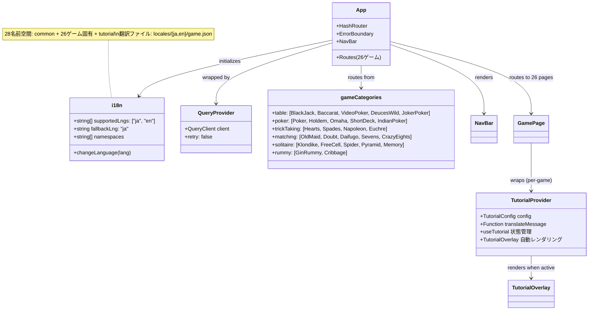

---

## 2. シーケンス図

### 2.1 ゲームアクション実行フロー

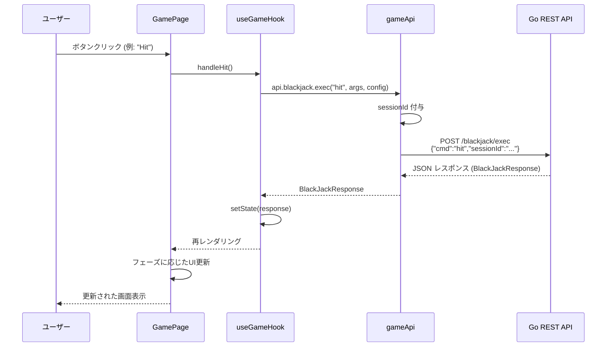

### 2.2 CPUリプレイアニメーションフロー

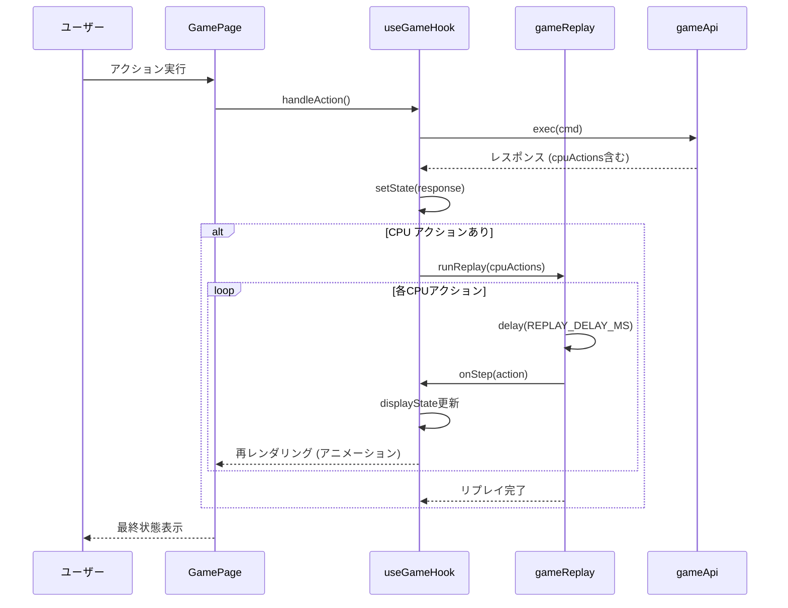

### 2.3 ゲーム初期化フロー

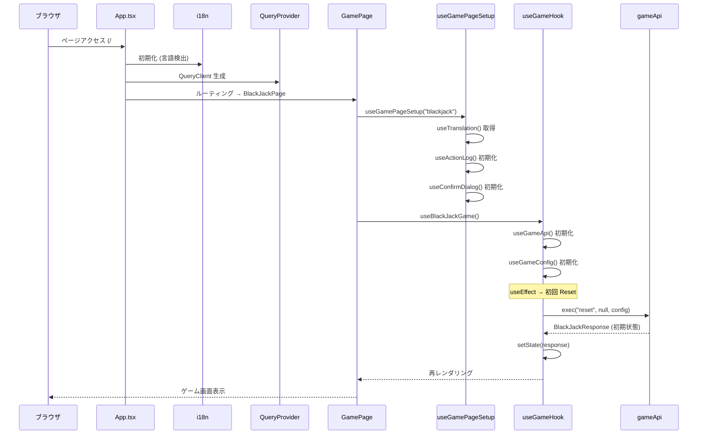

### 2.4 VideoPokerPage フェーズ別レンダリングフロー

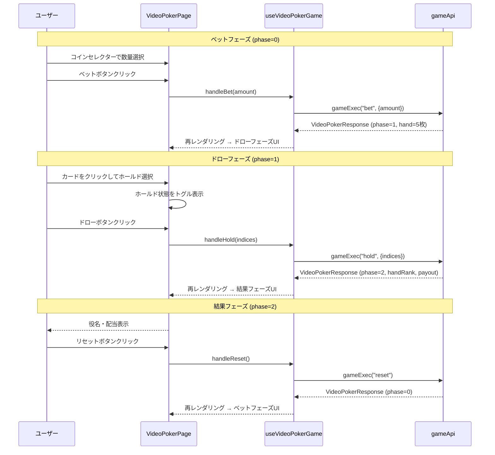

---

## 3. ステートマシン図

### 3.1 ゲームページ表示状態

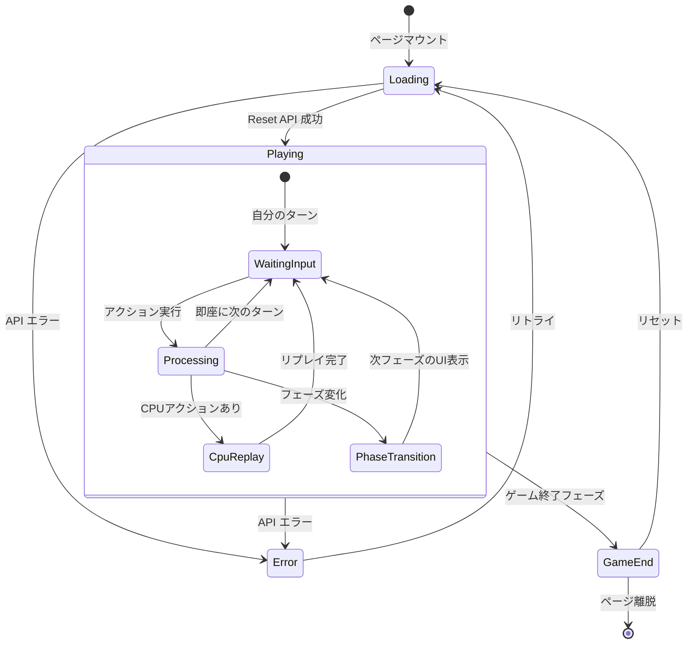

### 3.2 カード選択状態 (useCardSelection)

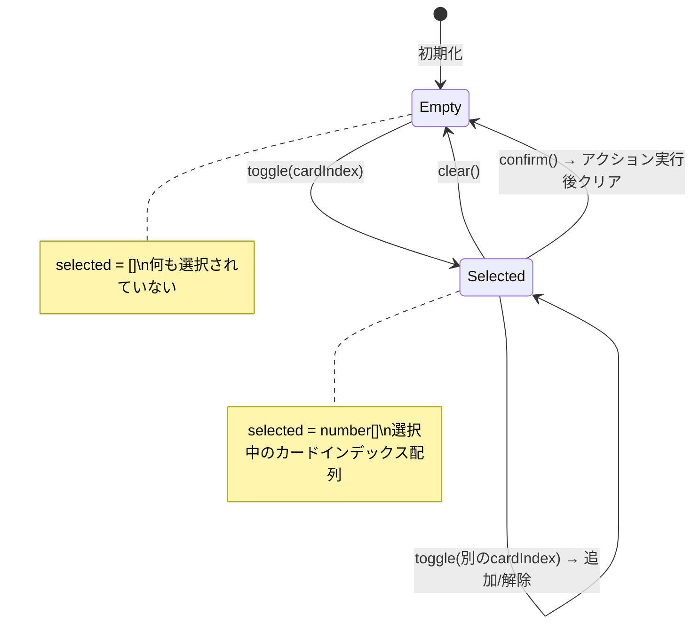

### 3.3 確認ダイアログ状態 (useConfirmDialog)

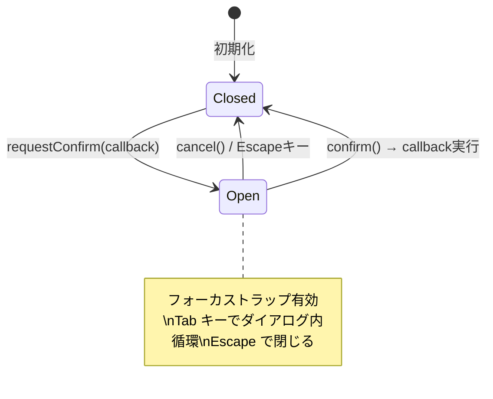

### 3.4 アクションログ状態 (useActionLog)

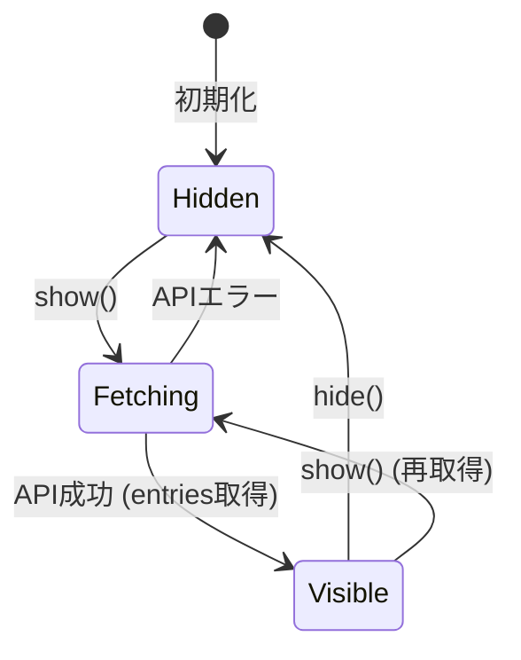

### 3.5 ゲーム設定パネル状態

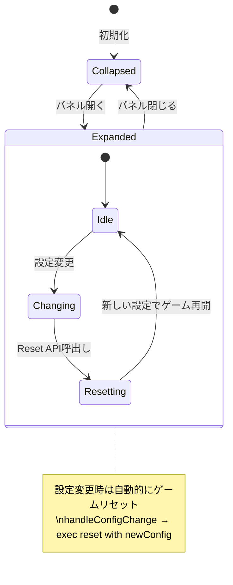

### 3.6 チュートリアル状態 (useTutorial)

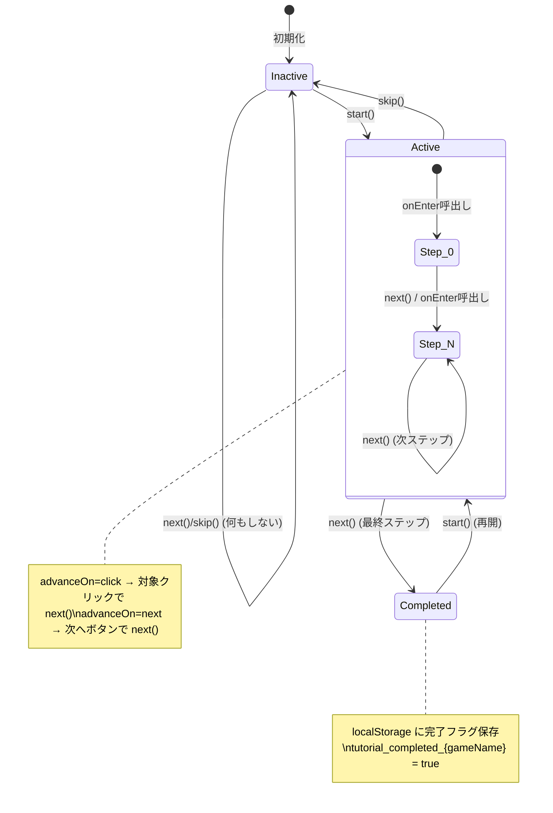
