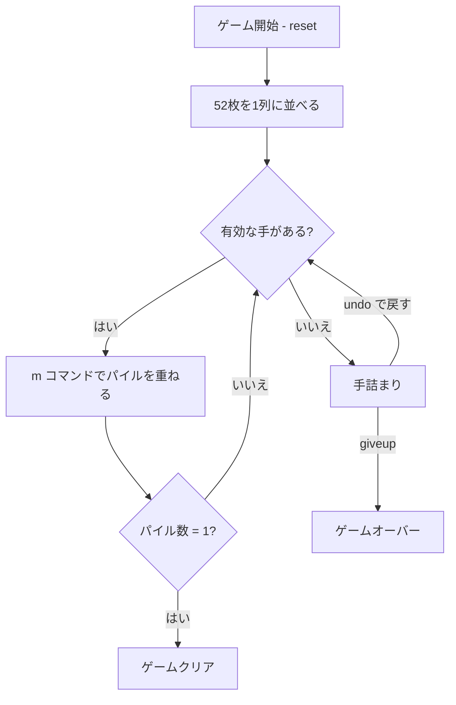

# アコーディオン（CUI版）遊び方

## ゲーム概要

1人用のソリティア「アコーディオン（Accordion）」。52枚を1列に並べ、条件に合うパイル同士を重ねて圧縮していくパズル型ソリティアです。最終的に1つの山にまとめられればクリアです。

## 起動方法

```sh
go run ./cmd/trumpcards accordion
go run ./cmd/trumpcards --lang en accordion  # 英語モード
```

## ルール

### 基本ルール

- 52枚のカードを左から1枚ずつ山（パイル）として並べます。
- あるパイルの「1つ左」または「3つ左」にあるパイルと、最上段のカードがスートまたはランクのどちらかで一致している場合、そのパイルを左側のパイルの上に重ねられます。
- 重ねたあとは、重ねた側のパイルが消え、右側のパイルが左に詰まります。

### ゲーム終了

- すべてのカードが1つのパイルに収まれば「ゲームクリア」。
- どのパイル間でも有効な手が打てなくなり、かつパイル数が2以上のままなら「手詰まり」。
- 任意のタイミングで `giveup` により「ゲームオーバー」。

## ゲームの流れ



## コマンド一覧

| コマンド | 短縮形 | 説明 |
|----------|--------|------|
| `reset` | `r` | 新しいゲームを開始 |
| `move <from> <to>` | `m <from> <to>` | パイル `from` を `to` に重ねる (`to` は `from-1` または `from-3` であること) |
| `giveup` | `g` | ギブアップ |
| `hint` | `h` | ヒントを表示 |
| `undo` | `u` | 直前の操作を取り消す |
| `log` | `l` | 棋譜を表示 |
| `quit` | `q` | ゲーム終了 |
| `help` | `?` | コマンド一覧を表示 |

## 画面の見方

```
==========
Accordion (アコーディオン)
==========
残りパイル: 52
----------
[0]SPADE 5 [1]HEART 10 [2]CLOVER 2 [3]SPADE K [4]DIAMOND 7 [5]HEART 7 [6]SPADE 3 [7]CLOVER Q
[8]...
----------
手数: 0 （戻せる手はありません）
```

- 各 `[n]` はパイルのインデックスを示し、そのあとに最上段のカードを表示します。
- 複数枚が重なっているパイルでは `(+n)` の形式で追加枚数を表示します。

## 遊び方のコツ

- 可能なときは `offset=3` の手（3つ左への移動）を優先すると、将来の合流候補を多く残しやすいです。
- `hint` は `offset=3` を優先して提案します。詰まったら `undo` で巻き戻すか、`giveup` で終了しましょう。
