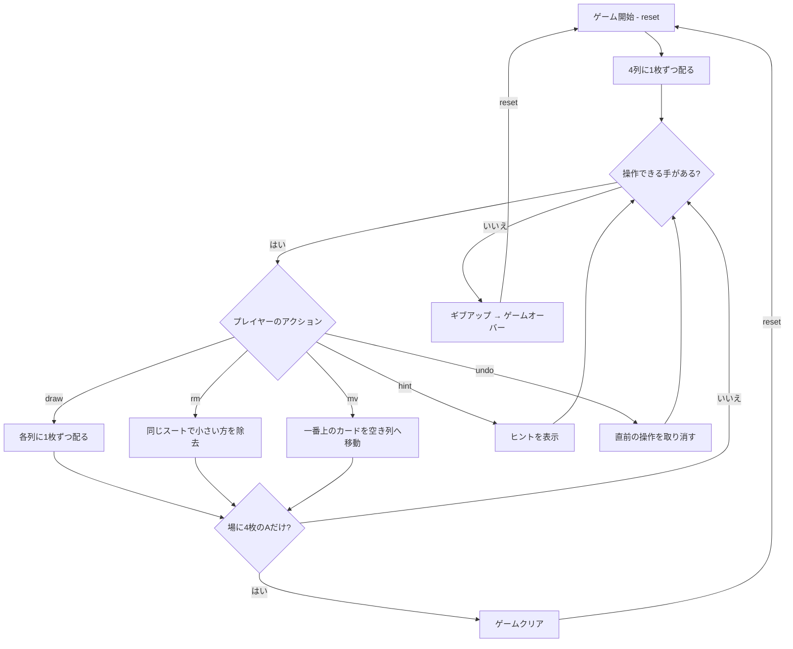

# 四つ葉のクローバー（CUI版）遊び方

## ゲーム概要

1人用のソリティアカードゲームです。52枚のカードを4列の場札に配り、各列の一番上にあるカードのうち「同じスートで数字が小さい方」を取り除いていきます。最終的に場に4枚のエース（A）だけが残ればクリアです。エース（A）は最強として扱います。

## 起動方法

```sh
go run ./cmd/trumpcards acesup
go run ./cmd/trumpcards --lang en acesup  # 英語モード
```

## ルール

### 基本ルール

- 52枚のトランプ（ジョーカーなし）を使用
- 開始時、4列に1枚ずつ（計4枚）を表向きに配る
- 残り48枚は山札（ストック）に置く
- 操作できるのは各列の一番上のカードのみ

### 除去ルール

- 2つの列の一番上のカードが「同じスート」のとき、ランクが小さい方を除去できる
- エース（A）は最強（K より強い）として扱う。例：♠A と ♠9 が場にあるとき ♠9 を除去できる
- 除去したカードは捨て札（discard）へ移動する

### 配るルール

- `draw` で山札から各列に1枚ずつ（計4枚）配る
- 山札がなくなるまで繰り返す

### 移動ルール

- 列が空になったら、他の列の一番上のカードを空き列へ移動できる（`move`）
- 移動により下のカードが露出し、新たな除去の手が生まれることがある

### ゲームクリア

- 山札を配りきり、場に4枚のエース（各列に1枚ずつ）だけが残ればクリア

### ゲームオーバー

- これ以上の手がない場合はギブアップでゲームオーバー

### 手詰まり検出

- ヒントが存在せず、かつ山札が空の場合に「手詰まりです」と表示します
- 手詰まり状態では「元に戻す」またはギブアップを選択できます

## ゲームの流れ



## コマンド一覧

| コマンド | 短縮形 | 説明 |
|----------|--------|------|
| `reset` | `r` | 新しいゲームを開始 |
| `draw` | `d` | 山札から各列に1枚ずつ配る |
| `remove <col>` | `rm` | 指定列の一番上のカードを除去 |
| `move <col>` | `mv` | 指定列の一番上のカードを空き列へ移動 |
| `giveup` | `g` | ギブアップしてゲームを終了 |
| `hint` | `h` | 次の一手のヒントを表示 |
| `undo` | `u` | 直前の操作を元に戻す |
| `log` | `l` | アクションログ（棋譜）を表示 |
| `quit` | `q` | ゲーム終了 |
| `help` | `?` | コマンド一覧を表示 |

### コマンド例

- `d` → 各列に1枚ずつ配る
- `rm 0` → 1列目の一番上のカードを除去
- `mv 2` → 3列目の一番上のカードを空き列へ移動
- `u` → 直前の操作を元に戻す
- `h` → ヒントを表示

## 画面の見方

```
==========
Aces Up (四つ葉のクローバー)
==========
列0: ♠3 ♥7 [♦K]
列1: [♣5]
列2: [空]
列3: ♦2 [♠A]
----------
Stock: 40枚 | Discard: 8枚
----------
手数: 12 （戻せる手はありません）
==========
```

- `列N:`: N列目の場札（左が古く、右が一番上）
- `[...]`: その列の一番上の操作可能なカード
- `[空]`: 空の列（移動先に使える）
- `Stock: N枚`: 山札の残り枚数
- `Discard: N枚`: 除去済みの枚数
- `手数: N`: 現在の手数

## 遊び方のコツ

- エースは絶対に除去できないので、早めに各列へ振り分けて空き列を作りましょう
- 同じスートの大きいカードを場に残し、小さいカードを次々と除去するとチェーンが作れます
- 配る前に、いま除去・移動できる手がないか必ず確認しましょう
- 空き列はエースの待避や、下のカードを露出させるために使います
- ヒントコマンドで詰まった時のアドバイスを得られます（推奨する手に加えて、**なぜその手なのか**の一文が付きます）
- アンドゥを活用して、異なる手順を試しましょう
