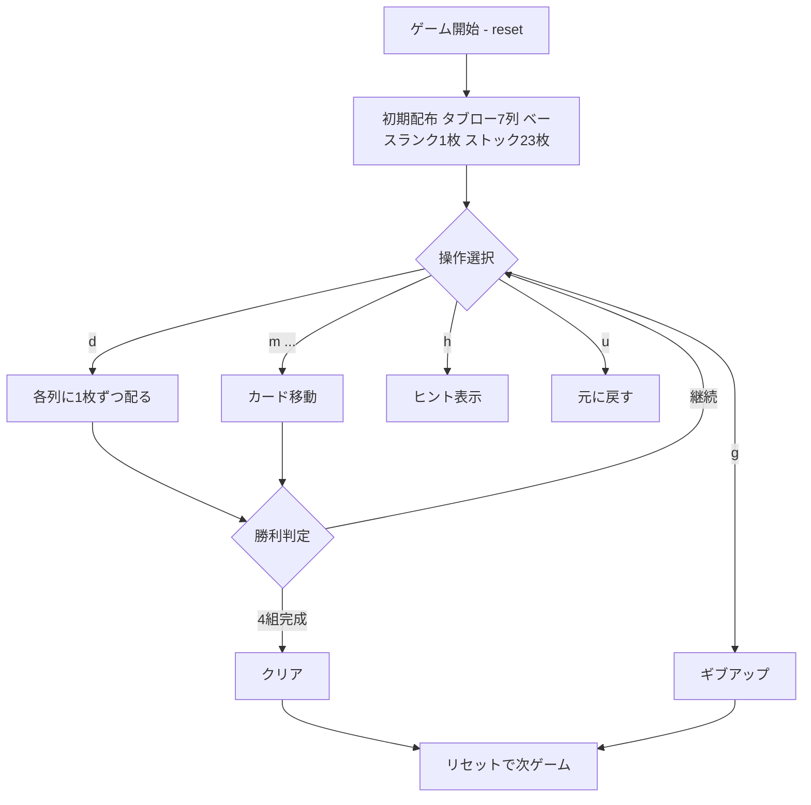

# アグネス・ソレル（CUI版）遊び方

## ゲーム概要

アグネス・ソレル（Agnes Sorel）は1人用ソリティア。クロンダイク式の7列のタブローと、キャンフィールド式のベースランクから始まる4つのファンデーションを組み合わせたゲーム。すべてのカードをファンデーションに積み上げることを目指す。

## 起動方法

```sh
go run ./cmd/trumpcards agnes
go run ./cmd/trumpcards --lang en agnes
```

## ルール

- 配り: 7列のタブロー（列iにi+1枚）。各列、底の1枚だけ表向き。底のカードが移動して新たに露出したカードは自動で表向きになる。
- ベースランク: 28枚を配った後の次の1枚のランクがベースランク。そのカードはファンデーションに置かれる。
- ファンデーション: 同スート、ベースランクから昇順にラップアラウンド（K→A→...）
- タブロー: 末尾（底）のカードのみ移動可能。同色・1ランク下にのみ重ねられる（ラップなし、Aの上には置けない）。1枚ずつ移動。
- 空のタブロー列は手動では埋められない（ストックの配りでのみ補充）。
- ストック（23枚）: `d` で各列に1枚ずつ表向きに配る（最後の配りは2枚）。

## ゲームの流れ



## コマンド一覧

| コマンド | 短縮形 | 説明 |
|----------|--------|------|
| `d` / `deal` | `d` | 各列に1枚ずつ配る |
| `m <from> <to>` | `m` | タブロー間移動（末尾カード） |
| `m <col> f` | `m` | タブローからファンデーションへ |
| `g` / `giveup` | `g` | ギブアップ |
| `h` / `hint` | `h` | ヒント |
| `u` / `undo` | `u` | 元に戻す |
| `l` / `log` | `l` | 棋譜表示 |
| `r` / `reset` | `r` | リセット |
| `q` / `quit` | `q` | 終了 |

## 画面の見方

```
==========
Agnes Sorel (アグネス・ソレル)
==========
Base rank: 5
Foundation: ♠5 | [空] | [空] | [空]
Stock: 23枚
----------
列0: [0]♠J
列1: [0]?? [1]♥10
列2: [0]?? [1]?? [2]♣9
----------
```

- **Base rank**: ファンデーションの開始ランク
- **Foundation**: 4つのファンデーション。ベースランクから昇順に積む
- **Stock**: ストックの残り枚数
- **Tableau**: 7列。同色・降順で重ねる。`??` は裏向きカード
- ストックが尽きて動かせる札が 1 枚も無くなると、手数の上に**手詰まりの警告が赤で表示されます**（Web の赤いバナーと同じ判定です）
