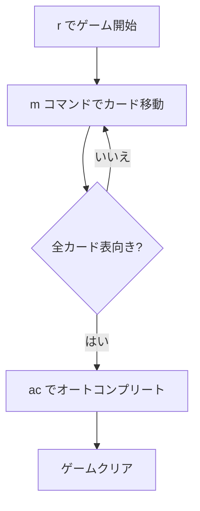

# アラスカ（CUI版）遊び方

## ゲーム概要

アラスカは1人用のソリティアカードゲームで、Yukonの派生版です。配り方や「順序に関係なくまとめてカードを移動できる」特徴はYukonと同じですが、タブロー間の移動条件が「**同スートで昇順または降順**」になっており、上下どちらにも繋げられるぶん先読みの幅が広いゲームです。空の列には任意の札を置けます。

## 起動方法

```sh
go run ./cmd/trumpcards alaska           # 日本語
go run ./cmd/trumpcards --lang en alaska # 英語
```

## ルール

### 配り方

- 7列のタブローにすべてのカード（52枚）を配ります（Yukonと同一）
- 列0: 1枚（表向き）
- 列1〜6: 基本配り + 追加4枚（表向き）

### 移動ルール

- タブロー → タブロー: 表向きカードとその上のカード全てをまとめて移動可能（**同スートで昇順または降順** — Yukon は異色降順、Russian Solitaire は同スート降順のみ）
- 空の列: **任意の札**を置けます（Yukon / Russian Solitaire は K のみ）
- タブロー → ファンデーション: 列最上段のみ（同スート・昇順）
- 空の列にはKのみ配置可能

## ゲームの流れ



## コマンド一覧

| コマンド | 短縮形 | 説明 |
|----------|--------|------|
| `move <列> <列>` | `m` | 列間の最上段カード移動（ショートハンド） |
| `move t <列> f` | `m` | タブローからファンデーションへ移動 |
| `move t <列> <ID> t <列>` | `m` | タブローからタブローへ（カードID指定） |
| `giveup` | `g` | ギブアップ |
| `hint` | `h` | ヒント |
| `autocomplete` | `ac` | オートコンプリート |
| `undo` | `u` | 元に戻す |
| `log` | `l` | 棋譜表示 |
| `reset` | `r` | リセット |
| `quit` | `q` | 終了 |
| `help` | `?` | コマンド一覧を表示 |

## 画面の見方

```
=== Alaska (アラスカ) ===
Foundation: [空] | [空] | [空] | [空]
----------
列0: [0]♠A
列1: [0]?? [1]♥5 [2]♣8 [3]♦3 [4]♠7 [5]♥2
列2: [0]?? [1]?? [2]♦J [3]♠4 [4]♥K [5]♣6 [6]♦9
...
----------
手数: 0
```

## 遊び方のコツ

- **同スートなら上下どちらにも繋げられます。** 降順で行き詰まったら昇順の接続を探してください
- 空列は任意の札を置けるので、単独の札を逃がす場所として使えます
- 裏向きカードの列を優先的に解放しましょう
- `h` コマンドでヒントを活用しましょう
- 手詰まりになったら `u` で戻ってやり直しましょう
