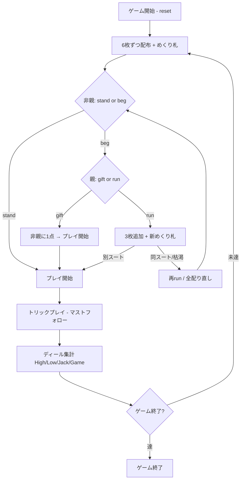

# オールフォーズ（CUI版）遊び方

## ゲーム概要

All Fours (別名: Seven Up / Old Sledge) は2人 (人間1 + CPU1) の古典的なトリックテイキングゲームです。
6枚ずつ配り、めくり札 (turn-up) で切り札を決め、各ディールで High / Low / Jack / Game の4種類のポイントを競います。
最初に PointLimit (デフォルト 7) に到達したプレイヤーが勝利します。

人間は非親 (elder hand)、CPU が親 (dealer) を担当します。

## 起動方法

```sh
go run ./cmd/trumpcards allfours
go run ./cmd/trumpcards --lang en allfours  # 英語モード
```

## ルール

### 基本ルール

- 2人プレイ (人間=非親 / CPU=親)、52枚デッキから6枚ずつ配布
- 次の1枚を表向きにめくり (turn-up)、そのスートが暫定の切り札になる

### ベグ / スタンド (非親の選択)

- 非親は **stand (スタンド)** か **beg (ベグ)** を選ぶ
- stand: めくり札のスートを切り札としてそのままプレイ開始
- beg: 親に切り直しを要求する

### 親の応答 (ベグされた場合)

- **gift (ギフト / take-it)**: 非親に 1 点を渡し、同じ切り札でプレイ開始
- **run (ランザカード)**: 互いに3枚ずつ追加で配り、新しいめくり札を出す
  - 新しいめくり札が前と違うスートならそれが切り札
  - 同じスートが続く場合は上限まで再 run。デッキが尽きたら全カードを配り直す

### プレイ

- 非親 (elder hand) が最初にリードする
- フォロー時は **リードスートに従う** か **トランプ (切り札) を出す** 必要がある
- リードスートを持っていなければ任意のカードをプレイ可

### 得点 (1ディール最大4点 + gift)

| 得点 | 内容 |
|------|------|
| **High** | 配られた中で最強のトランプを獲得した者に +1 |
| **Low** | 配られた中で最弱のトランプを獲得した者に +1 |
| **Jack** | トランプの J を捕獲した者に +1 (J が配られた場合のみ) |
| **Game** | カードのピップ合計 (A=4, K=3, Q=2, J=1, 10=10) が単独最大の者に +1 (同点は誰にも入らない) |

### ゲーム終了 / 同点時のタイブレーク

- 先に PointLimit に到達したプレイヤーが勝利
- 同一ディールで両者が上限に到達した場合は **Gift → High → Low → Jack → Game** の集計順で、
  先に上限へ達したプレイヤーを勝者とする (決定的な peg-out 順)

### CPU難易度

| レベル | 動作 |
|--------|------|
| Easy (0) | ランダムプレイ |
| Normal (1) | トリックを取りに行く / トランプ温存 |
| Hard (2) | Normal と同等の戦略的プレイ |

## ゲームの流れ



## コマンド一覧

| コマンド | 短縮形 | 説明 |
|----------|--------|------|
| `reset` | `r` | 新しいゲームを開始 (設定保持) |
| `quit` | `q` | ゲーム終了 |
| `stand` | `st` | スタンド (非親) |
| `beg` | `bg` | ベグ=切り直しを要求 (非親) |
| `gift` | `g` | ギフト=1点を渡す (親の応答) |
| `run` | | ランザカード=引き直す (親の応答) |
| `play <i>` | `p <i>` | カードをプレイ (インデックス) |
| `next` | `n` | 次のトリックへ |
| `nextround` | `nr` | ディール集計 + 次のディールへ |
| `setdifficulty <n>` | `sd <n>` | CPU難易度設定 (0=Easy, 1=Normal, 2=Hard) |
| `setlimit <n>` | `sl <n>` | ポイント上限設定 |
| `hint` | `h` | ヒント表示 |
| `log` | `l` | 棋譜表示 |

## 画面の見方

```
==== All Fours (オールフォーズ/セブンアップ) ====
ラウンド: 1  トリック: 0  親: CPU 1
トランプ: ♥  めくり札: ♥7
あなた: 獲得0トリック 累積0点 ラウンド0点 6枚
[0]SPADE 5  [1]HEART 9  ...
CPU 1: 獲得0トリック 累積0点 ラウンド0点 6枚
----------
ベグフェーズ: 非親はスタンドかベグを選びます。
stand・・・スタンド / beg・・・切り直しを要求
```

- 「トランプ」 はめくり札のスート
- 「めくり札」 は暫定の切り札を決めた1枚
- 手札はインデックス付きで表示

## 遊び方のコツ

- A・K のトランプを多く持っているときは stand が有利
- トランプが弱いときは beg で切り直しを狙うのも手
- J of trump は捕獲すると Jack 点が確定する。積極的に取りに行く
- Game ポイントは 10・A の取り合い。引き分けでは誰にも入らない
- Low ポイントは最弱トランプを取った者に入る。低トランプの扱いに注意
