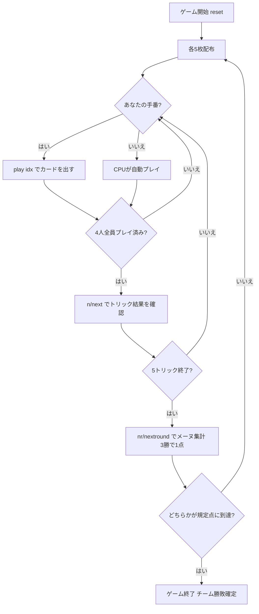

# アリュエット（CUI版）遊び方

## ゲーム概要

Aluette（アリュエット）はフランス西部（ヴァンデ／ブルターニュ沿岸）で遊ばれてきた48枚スペイン式デッキのトリックテイキングゲームです。**対面同士が固定パートナー**となる4人2対2のチーム戦で、あなたは席0でプレイします。入札も捨て札もありません。

このゲームの最大の特徴は **強さが「ランク」ではなく「特定の1枚」で決まること**です。最強の6枚は**リュエット (luettes)** と呼ばれ、スートとランクの組で名指しされた個別の札です。金貨の3 (Monsieur) はデッキ最強である一方、剣の3 はごく普通の札にすぎません。

## 起動方法

```sh
go run ./cmd/trumpcards aluette
go run ./cmd/trumpcards --lang en aluette  # 英語モード
```

## ルール

### デッキ（48枚）

| 種別 | 枚数 | 内訳 |
|------|------|------|
| スート札 | 48 | 4スート × 12枚（1〜9, 11=ソタ, 12=カバジョ, 13=レイ） |

**10は存在しません。**スペイン式デッキの慣習に従い、9の次は絵札に飛びます。Tute などが使う40枚デッキとは違い、Aluette は **8と9を含みます** —— 9は2枚がリュエットなので落とせません。

本作ではスペイン式スートを標準の4スートに割り当てています（1=剣 Espadas / 2=棍棒 Bastos / 3=聖杯 Copas / 4=金貨 Oros）。

### 序列（このゲームの中心）

**リュエット6枚が上位を独占します。強い順に:**

| 順位 | 呼び名 | 札 |
|------|--------|-----|
| 1 | Monsieur | 金貨の3 |
| 2 | Madame | 聖杯の3 |
| 3 | Borgne（隻眼） | 聖杯の2 |
| 4 | Vache（牝牛） | 金貨の2 |
| 5 | Grand Neuf | 聖杯の9 |
| 6 | Petit Neuf | 金貨の9 |

**リュエット以外はスートを一切見ません。** 3 > 2 > A > 王 > 騎 > 従 > 9 > 8 > 7 > 6 > 5 > 4 の順です。

### トリック・テイキング

- **切札はありません。**
- **フォロー義務もありません。** どの札もいつでも出せます。
- **同じ強さの札が複数出たときは、先に出した側が勝ちます。** リュエット以外は同ランクが4枚ずつあるため、後から同じ強さを重ねても奪えません。

この3点は互いに支え合っています。リュエットは4スートに散らばっているので、フォロー義務を課すとほとんどの局面で最強札を出せなくなり、序列表そのものが意味を失います。

### 得点計算と勝利条件

- 1メーヌ（mène）は **5トリック**です。
- **5トリック中3トリック**を取ったチームがそのメーヌの **1点**を獲得します。
- 規定点（デフォルト **5点**）に先に到達したチームがマッチの勝者です。

## ゲームの流れ



## コマンド一覧

| コマンド | 短縮形 | 説明 |
|----------|--------|------|
| `play <idx>` | — | 手札のidx番目のカードを出す |
| `next` | `n` | 次のトリックへ進む |
| `nextround` | `nr` | 次のメーヌへ進む（5トリック終了後） |
| `setdifficulty <0-2>` | `sd <0-2>` | CPU難易度設定（0=Easy, 1=Normal, 2=Hard・ゲームはリセットされます） |
| `hint` | `h` | ヒントを表示 |
| `log` | `l` | アクションログを表示 |
| `reset` | `r` | 新しいゲームを開始（設定保持） |
| `quit` | `q` | ゲーム終了 |
| `help` | `?` | コマンド一覧を表示 |

入札も捨て札も存在しないため、`bid` / `pass` / `scarto` コマンドはありません。

## 画面の見方

```
==========
アリュエット コマンド一覧
==========
メーヌ: 1  トリック: 1
得点  チーム0: 0  チーム1: 0  （5点先取）
リュエット（強い順）: Monsieur(DIAMOND3) > Madame(HEART3) > Borgne(HEART2) > Vache(DIAMOND2) > GrandNeuf(HEART9) > PetitNeuf(DIAMOND9)
You (チーム0): 5枚  トリック: 0 [親]
[0]SPADE 1  [1]DIAMOND 3〈Monsieur〉  [2]CLOVER 7  [3]HEART 9〈GrandNeuf〉  [4]SPADE 12
CPU1 (チーム1): 5枚  トリック: 0
CPU2 (チーム0): 5枚  トリック: 0
CPU3 (チーム1): 5枚  トリック: 0
----------
手番: You
play <idx>・・・カードを出す（フォロー義務はありません。どの札でも出せます）
```

- **得点行**: チーム単位の累計メーヌ数と規定点。個人ではなくチームで競います。
- **リュエット行**: 序列表を毎フレーム表示します。**6枚を覚えるまでは手札を強さ順に並べることすらできない**ためです。
- **`〈名前〉`付きの札**: その札がリュエットであることを示します。`DIAMOND 3` とだけ出ていたら最強札とは読めません。
- **プレイヤー行**: 所属チーム・手札枚数・このメーヌで取ったトリック数。`[親]` はディーラーです。

## 遊び方のコツ

- **値ではなく札を覚える**: 「3が強い」ではありません。金貨の3と聖杯の3は最上位ですが、剣の3と棍棒の3は普通の札です。この6枚を覚えることが上達の第一歩です。
- **同格は先出し有利**: 後から同じ強さを重ねても奪えません。強い普通札でリードすると、相手は**それより強い札**を出さない限り取れません。
- **味方のトリックは奪わない**: 対面が既に勝っているトリックに強い札を重ねるのは無駄です。CPUも同じ判断をします（ヒントの「味方が勝っている」はこれです）。
- **3勝すればよい**: 5トリック全部を取る必要はありません。3トリックを確実に取れる形を組むほうが、リュエットを抱え込むより堅実です。
- **フォロー義務が無いことを使う**: 弱い札はいつでも捨てられます。相手のリュエットに強い札を無駄打ちせず、取れないトリックは最も弱い札で降りましょう。
