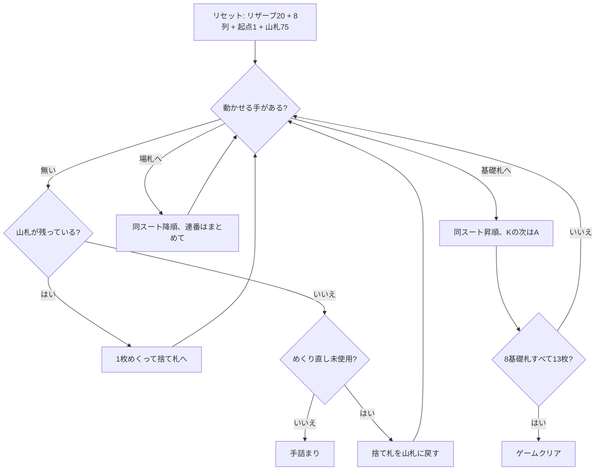

# アメリカン・トード（CUI版）遊び方

## ゲーム概要

52 枚 2 組（104 枚）で遊ぶカンフィールド系ソリティアの 2 デッキ版。**20 枚のリザーブ**、8 列のタブロー、そして最初に置かれた 1 枚が基礎札の開始ランクを決め、残り 75 枚が山札になる。

基礎札は 8 つ（スートごとに 2 つ）。開始ランクから同スートで昇順、**K の次は A に折り返して 13 枚**で 1 つ完成。8×13＝104 枚すべてを積み切ればクリア。

## 起動方法

```sh
go run ./cmd/trumpcards americantoad
go run ./cmd/trumpcards --lang en americantoad   # 英語
```

## ルール

- 52 枚 2 組（104 枚）。リザーブ 20 枚、タブロー 8 列に 1 枚ずつ、基礎札の起点に 1 枚、残り 75 枚が山札
- 使えるのはリザーブの一番上、捨て札の一番上、各列の一番上
- **基礎札**: 8 つ。開始ランクから同スートで昇順、**K の次は A**。13 枚で完成
- **タブロー**: **同じスート**の降順。**A の下には K** を置ける。連番はまとめて動かせる
- **空き列（このゲームの要）**:
  - リザーブが残っているうちは、空いた列は**自動的に**リザーブの一番上で埋まる
  - リザーブを使い切ったあとは、**捨て札からのみ**埋められる
  - **タブローから空き列へは動かせない**（許すと列を自由に組み替えられてしまう）
- 山札は 1 枚ずつ捨て札へ。**めくり直しは 1 回だけ**（通算 2 巡）。山札が空のときに `d` を押すと捨て札が山札に戻る
- 8 つの基礎札すべてが 13 枚になればクリア

> 補足: issue #4417 の仕様案とは 5 点異なるが、いずれも実際の規則に合わせた。
> (1) 基礎札は「各スート 8 枚」ではなく **8 つの山に 13 枚ずつ**（前者は 32 枚にしかならず 104 枚を吸収できない）。
> (2) 空き列はリザーブ専用ではなく、**リザーブが尽きたあとは捨て札から**埋められる（さらに補充は自動）。
> (3) **めくり直しが 1 回ある**。
> (4) タブローの連番は**まとめて動かせる**。
> (5) タブローの降順も **A→K に折り返す**。

## ゲームの流れ



## コマンド一覧

| コマンド | 説明 |
|---------|------|
| `d`, `draw` | 山札を 1 枚めくる（山札が空ならめくり直し／1 回だけ） |
| `m r f` | リザーブから基礎札へ |
| `m r t <col>` | リザーブからタブローへ |
| `m w f` | 捨て札から基礎札へ |
| `m w t <col>` | 捨て札からタブローへ |
| `m t <col> f` | タブロー最上段を基礎札へ |
| `m t <from> t <to> [idx]` | タブロー間で移動（`idx` は連番の先頭、省略時は最上段） |
| `h`, `hint` | ヒントを表示する |
| `ac`, `autocomplete` | 基礎札へ送れる札がなくなるまで自動で送る |
| `u`, `undo` | 1 手戻す |
| `g`, `giveup` | ギブアップ |
| `l` | 棋譜（アクションログ）を表示する |
| `r`, `reset` | 最初からやり直す |
| `q`, `quit` | 終了する |

## 画面の見方

```
開始ランク: 5
基礎札: SPADE 5 | [空] | [空] | [空] | [空] | [空] | [空] | [空]
リザーブ: CLOVER 3 (残り18枚)
山札: 70枚 捨て札: HEART 9 (5枚)
----------
列0: [0]SPADE 9 [1]SPADE 8
列1: [0]CLOVER 4
...
列7: [0]DIAMOND 11
----------
手数: 12
```

- リザーブの残り枚数は難度に直結する。0 になると空き列の扱いが変わる
- 山札が尽きると「めくり直しはあと 1 回使えます」が黄色で出る
- 各列の `[n]` は列内のインデックス。`m t <from> t <to> <idx>` の `<idx>` に対応する

## 遊び方のコツ

- **リザーブ 20 枚を削ることが最優先。** 空き列を作ってもリザーブが残っていれば自動で埋まるだけで、自由には使えない。逆にリザーブを使い切れば、空き列が捨て札の受け皿になる
- タブローは**同スート**なので、色違いのゲームより繋がりにくい。同じスートの連番を育てて一気に動かす形を狙う
- **めくり直しは 1 回きり。** 1 巡目で捨て札に送った札の並びは 2 巡目でもほぼ同じなので、1 巡目のうちに拾えるものは拾っておく
- 基礎札が 8 つあるので、同じランクが 2 枚来ても両方上げられる。序盤の 1 枚が後半の詰まりを大きく変える
- 詰まったら `undo` で分岐をやり直す
