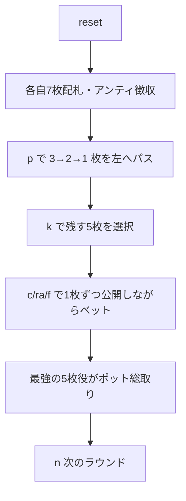

# アナコンダ（CUI版）遊び方

## ゲーム概要

アナコンダ（Anaconda / Pass the Trash）はアメリカのホームポーカー文化から生まれた、札の受け渡しが特徴的なポット・ヴァイイング（vying）ゲームです。各プレイヤーには7枚が配られ、3枚→2枚→1枚と左隣へ札を渡してから、最良の5枚を残して2枚を捨てます。残した5枚を1枚ずつ公開し、公開の合間にベッティングを行います。ポットに残った中で最強の5枚ポーカー役がポットを総取りします。

## 起動方法

```sh
go run ./cmd/trumpcards anaconda
go run ./cmd/trumpcards --lang en anaconda
```

## ルール

### 基本ルール

1. 全員がアンティを支払い、標準52枚デッキから各自7枚の手札が配られます。
2. **パス**: まず3枚、次に2枚、最後に1枚を左隣へ渡します。
3. **セット**: 残す5枚を選び、残り2枚を捨てます。
4. **ロール**: 残した5枚を1枚ずつ公開し、公開の合間にコール／レイズ／フォールドのベッティングを行います。
5. ポットに残った中で最強の5枚ポーカー役がポットを総取りします。

### 停止条件

規定ラウンド数を消化するか、アンティを払えるプレイヤーが2人未満になるとゲーム終了。最終的にチップが最も多いプレイヤーが勝者です。

## ゲームの流れ



## コマンド一覧

| コマンド | 短縮形 | 説明 |
|----------|--------|------|
| `pass <i...>` | `p <i...>` | 選んだ札を左へ渡す（3→2→1） |
| `keep <i...>` | `k <i...>` | 残す5枚を選ぶ（他2枚を捨てる） |
| `call` | `c` | コール（チェック） |
| `raise` | `ra` | レイズ |
| `fold` | `f` | フォールド |
| `nextround` | `n` / `nr` | 次のラウンドへ |
| `setplayers <n>` | `sp <n>` | プレイヤー数を設定（3-7） |
| `setante <n>` | `sa <n>` | アンティ額を設定 |
| `setchips <n>` | `sc <n>` | 初期チップを設定 |
| `setrounds <n>` | `st <n>` | 実施ラウンド数を設定 |
| `hint` | `h` | ヒントを表示。パス／セットのフェーズでは推奨する札のインデックスとカード名も出ます |
| `log` | `l` | 棋譜を表示 |
| `reset` | `r` | ゲームをリセット（設定は保持） |
| `quit` | `q` | ゲーム終了 |
| `help` | `?` | コマンド一覧を表示 |

## 画面の見方

```
==========
アナコンダ（Pass the Trash）
==========
ラウンド: 1  ポット: 40  アンティ: 10
あなた  チップ 190  賭け 10  [待機]
[0]HEART 6  [1]CLOVER 6  [2]DIAMOND 2  [3]DIAMOND 9  [4]SPADE 13  [5]SPADE 6  [6]SPADE 10
CPU 1  チップ 190  賭け 10  [待機]
CPU 2  チップ 190  賭け 10  [待機]
CPU 3  チップ 190  賭け 10  [待機]
----------
パスフェーズ: 3 枚を選んで左隣へ渡してください（例: p 0 1 2）
→ 左隣の CPU 1 へ 3 枚渡す
p でパス、k でキープ、c/ra/f でベット、n で次のラウンド
==========
```

- 1行目 — ラウンド番号・現在のポット・アンティ額（**コール額は出ません**）
- 各プレイヤー行 — 名前・チップ・このラウンドの賭け累計・状態
  （手番／フォールド／脱落／勝者／待機）
- カード行 — 手札（インデックス付き。ロールでは公開された分の役名も表示）。
  **自分の行の直後**に出ます
- **`パスフェーズ: ...（例: p 0 1 2）`**: 何枚選ぶのかと**入力例**がその場に出ます
- **`→ 左隣の CPU 1 へ 3 枚渡す`**: 誰に渡ることになるかを名指しで示す行

## 遊び方のコツ

- パスでは弱い札を渡し、渡ってきた札で役を組み立てましょう。
- セットでは確実なペアやドローを優先すると安定します。
- ロールでは強い手はレイズ、弱い手は早めのフォールドでマッチ負担を抑えましょう。
