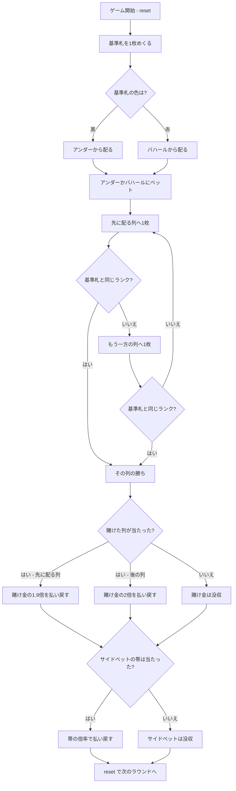

# アンダーバハール（CUI版）遊び方

## ゲーム概要

インド・バンガロール発祥の**二者択一のカジノゲーム**（Katti とも）。**基準札（ジョーカー）を1枚めくり**、アンダー（内側）とバハール（外側）の2列へ交互に配って、**基準札と同じランクが先に出た列**を当てます。1人プレイ（プレイヤー対ハウス）です。

## 起動方法

```sh
go run ./cmd/trumpcards andarbahar
go run ./cmd/trumpcards --lang en andarbahar  # 英語モード
```

## ルール

### 基準札と配り始める列

標準52枚から**基準札を1枚**めくります。**基準札の色が、配り始める列を決めます。**

| 基準札の色 | 先に配る列 | その列の配当 |
|-----------|-----------|-------------|
| 黒（♠♣） | アンダー | 0.9:1 |
| 赤（♥♦） | バハール | 0.9:1 |

基準札を出したあと、先に配る列 → もう一方 → 先の列… と**1枚ずつ交互に表向きで配ります**。

### 配当が非対称な理由

**「最初の1枚だから」ではありません。有利なのは「先に配る列」です。**

先に配る列は1枚多く配られる機会があります。基準札を除いた51枚に同ランクが3枚あるので、数え上げると：

| 列 | 勝つ確率 | 公平な配当 | 採用する配当 | ハウスエッジ |
|----|---------|-----------|-------------|------------|
| 先に配る列 | **51.50%**（429/833） | 0.9417:1 | **0.9:1** | 2.15% |
| 後に配る列 | 48.50%（404/833） | 1.0619:1 | **1:1** | 3.00% |

**両方を 1:1 にすると、先に配る列がプレイヤー有利（+3.00%）になります。** だから先の列だけ配当を下げます。

### ベット

**ベット額は10の倍数**（10〜10000）に限ります。0.9:1 の配当を**チップの整数のまま端数なく**払うためです。

### サイドベット（決着枚数）

決着までに配られた**枚数の帯**に賭けられます。任意で、賭けなければ付きません。

| 帯 | 枚数 | 当たる確率 | 配当 |
|----|------|-----------|------|
| 0 | 1枚ちょうど | 5.88% | 15.0倍 |
| 1 | 2〜5枚 | 21.22% | 4.2倍 |
| 2 | 6〜10枚 | 21.71% | 4.1倍 |
| 3 | 11〜15枚 | 16.90% | 5.2倍 |
| 4 | 16〜25枚 | 21.80% | 4.1倍 |
| 5 | 26〜35枚 | 9.80% | 9.0倍 |
| 6 | 36枚以上 | 2.69% | 33.0倍 |

配当は賭け金の返還を含む**払戻総額の倍率**です。ハウスマージンはどの帯も約11%です。

### 勝敗と終わり方

基準札と同じランクが出た時点で配布が終わり、その場で精算します。**必ず終わります**——51枚に同ランクが3枚あるので、遅くとも**49枚目**までに出ます。

`reset` で次のラウンドに進みます。チップが最低ベット額を下回ったときだけ、自動で補充されます。

## ゲームの流れ



## コマンド一覧

| コマンド | 短縮形 | 説明 |
|----------|--------|------|
| `bet <amount> <a\|b>` | `b` | アンダー（a）かバハール（b）に賭ける |
| `bet <amount> <a\|b> <side> <band>` | `b` | サイドベット（金額と帯 0〜6）も同時に賭ける |
| `clear` | | 罫線（履歴）を消す |
| `hint` | | どちらの列が先に配られるかを助言する |
| `log` | | 棋譜（アクションログ）を表示する |
| `reset` | `r` | 次のラウンドを始める |
| `quit` | `q` | 終了する |
| `help` | `?` | コマンド一覧を表示 |

**`bet` 1回で決着まで進みます。** 配布の途中に判断は入りません。

## 画面の見方

```
==========
Andar Bahar (アンダーバハール)
==========
チップ: 1000
フェーズ: BET
基準札: SPADE 7
先に配る列: アンダー (配当 0.9:1)
----------
アンダー: SPADE 3 CLOVER 10 HEART 7
バハール: DIAMOND 12 SPADE 5
配った枚数: 5
アンダー に基準札と同じランクが出ました
払い戻し: 190
　内訳: メイン 190 / サイド 0
罫線: A B A A B
アンダー 3 / バハール 2
```

- **基準札**: このランクが出た列の勝ちです
- **先に配る列**: **賭ける前に見えます。** 51.50%で当たる代わりに配当が 0.9:1 に下がる側です
- **アンダー / バハール**: 配られた札。長くなると末尾12枚だけ表示し、先頭に `...` が付きます
- **配った枚数**: サイドベットの帯の判定に使う枚数です
- **払い戻し**: 賭け金の返還を含んだ総額です（100を先の列に賭けて当たれば190）。**サイドベットを張った回だけ内訳の行が続きます**——メインで取ってサイドを外した回とその逆を区別するためです
- **罫線**: 直近20ラウンドの勝った列（A=アンダー、B=バハール）と通算数

## 遊び方のコツ

- **先に配る列がわずかに有利ですが、期待値は先の列（-2.15%）のほうがまだマシです。** 後の列は -3.00% で、どちらを選んでも長期的にはハウスが勝ちます
- **基準札のランクは勝率に影響しません。** 残り51枚に同ランクが3枚あるのは常に同じです
- **サイドベットはハウスマージンが約11%**とメインベットよりずっと重いので、当てにいく賭けです
- **決着枚数は短い側に偏ります。** 半分以上が15枚以内に決まるので、長い帯ほど当たりません
- **`hint` はどちらが先に配られるかを教えます。** 基準札の色を見落としたときに使ってください
