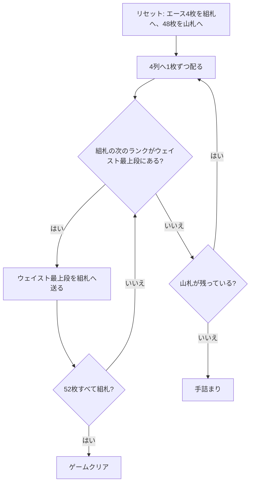

# オールド・ラング・サイン（CUI版）遊び方

## ゲーム概要

イギリスの古典的な一人用ペイシェンス。4 枚のエースを最初からファンデーション（組札）に据え、残る 48 枚を 4 つのウェイスト（捨て札列）へ **1 段 4 枚ずつ**配りながら、組札を A から K まで積み上げる。

サー・トミーと盤面はよく似ているが、決定的に違うのは**配り先を選べない**点。あちらは引いた 1 枚をどの列に置くか選ぶのがゲーム性の中心だが、こちらは 4 列へ強制的に配られる。そのためプレイヤーに残る判断は「いつ配るか」と「置ける札が複数あるときどれを先に送るか」だけで、運の要素が非常に強い古典として知られる。

## 起動方法

```sh
go run ./cmd/trumpcards auldlangsyne
go run ./cmd/trumpcards --lang en auldlangsyne   # 英語
```

## ルール

- 52 枚 1 組。**エース 4 枚を抜いて 4 つのファンデーションに据え**、残る 48 枚を山札にする
- 山札から 4 つのウェイストへ 1 枚ずつ、計 4 枚を配る（開始時に 1 段目が配られている）
- ファンデーションは**スートを問わず** A→2→3→…→K の順に 1 ずつ積み上げる
- ウェイストは**最上段のみ**ファンデーションへ移せる。列内の入れ替えも、ウェイスト同士の移動もできない
- 置ける札がなくなったら、また 4 枚配る。48 枚は 4 の倍数なので、配りは全部で 12 回
- 52 枚すべてがファンデーションに乗れば勝ち。山札を配り切り、どのウェイスト最上段も置けなくなれば手詰まり

## ゲームの流れ



## コマンド一覧

| コマンド | 短縮形 | 説明 |
|----------|--------|------|
| `deal` | `d` | 山札から 4 つのウェイストへ 1 枚ずつ配る |
| `w <wIdx> f <fIdx>` |  | ウェイスト `<wIdx>` の最上段をファンデーション `<fIdx>` に置く |
| `hint` | `h` | ヒントを表示する |
| `autocomplete` | `ac` | 置けるカードを自動で組札へ送る（山札を配り切ってから） |
| `undo` | `u` | 1 手戻す |
| `giveup` | `g` | ギブアップ |
| `log` | `l` | 棋譜（アクションログ）を表示する |
| `reset` | `r` | 最初からやり直す |
| `quit` | `q` | 終了する |
| `help` | `?` | コマンド一覧を表示 |

## 画面の見方

```
[F0] ♠A (1/13) → 次: 2   ← ファンデーション0: 最上段と積み上げ枚数、次に必要なランク
[F1] ♥A (1/13) → 次: 2
[F2] ♦A (1/13) → 次: 2
[F3] ♣A (1/13) → 次: 2
----------
[W0] ♥9 (1枚)       ← ウェイスト0: 最上段と枚数
[W1] ♠2 (1枚)
[W2] ♣K (1枚)
[W3] ♦7 (1枚)
----------
ストック: 44枚 (残り11回配れます)
```

- `F0`〜`F3` がファンデーション。開始時点で 4 枚のエースが据わっているので `(1/13)` から始まります
- `→ 次: R` はその山が次に必要とするランク。スートは問わず、13 枚積み上がると `→ 完成` に変わります
- `W0`〜`W3` がウェイスト。動かせるのは表示されている最上段だけ
- 「残り n 回配れます」は `deal` を実行できる残り回数。次に配られるカードは**見えません**（4 列へ強制的に配られるため）

## 遊び方のコツ

- **配る前に、送れる札は全部送る。** 配ると各列の最上段が新しい札で塞がれるので、送れるうちに送っておくのが唯一の実質的な選択
- 複数の札が送れるときは、**下に有用な札が埋まっている列から**先に送る。1 枚どけると次の札が最上段に出てくる
- 同じランクが 2 枚送れる場合、どちらの組札に載せても同じ（スートを問わないので 4 列は互換）。悩む必要はない
- 山札を配り切ったら `autocomplete` が使える。あとは強制手なので自動で流してよい
- 運の比重が非常に大きいゲームなので、手詰まったら `undo` で戻すより `reset` で配り直すほうが早いことも多い
