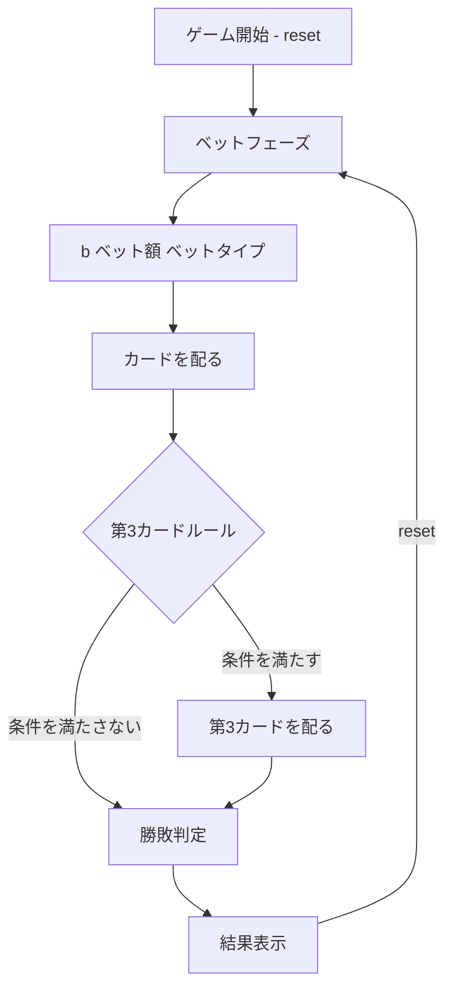

# バカラ（CUI版）遊び方

## ゲーム概要

カジノの定番カードゲームです。プレイヤーとバンカーのどちらが勝つかを予想してベットします。カードの合計値の下一桁が9に近い方が勝ちです。

## 起動方法

```sh
go run ./cmd/trumpcards baccarat
go run ./cmd/trumpcards --lang en baccarat  # 英語モード
```

## ルール

### 基本ルール

- 52枚のトランプ（ジョーカーなし）を使用
- カードの点数: A=1, 2〜9=額面通り, 10/J/Q/K=0
- ハンドの値は各カードの点数の合計の下一桁
- プレイヤーとバンカーにそれぞれ2枚ずつ配る
- 第3カードルール（サードカードルール）に従って追加カードが配られることがある

### ベットタイプと配当

| ベット先 | 条件 | 配当 |
|---------|------|------|
| プレイヤー (0) | プレイヤーの勝ち | 2倍 |
| バンカー (1) | バンカーの勝ち | 1.95倍（5%コミッション） |
| タイ (2) | 引き分け | 9倍（8:1） |

### ナチュラル

- 最初の2枚の合計が8または9の場合「ナチュラル」となり、第3カードは配られない

### 第3カードルール

**プレイヤー側:**
- 合計0〜5: 1枚引く
- 合計6〜7: スタンド

**バンカー側:**（プレイヤーが第3カードを引いた場合）
- 合計0〜2: 必ず引く
- 合計3: プレイヤーの第3カードが8以外なら引く
- 合計4: プレイヤーの第3カードが2〜7なら引く
- 合計5: プレイヤーの第3カードが4〜7なら引く
- 合計6: プレイヤーの第3カードが6〜7なら引く
- 合計7: スタンド

## ゲームの流れ



## コマンド一覧

| コマンド | 短縮形 | 説明 |
|----------|--------|------|
| `reset` | `r` | 新しいゲームを開始 |
| `bet <amount> <type>` | `b <amount> <type>` | ベットする（金額とタイプを指定） |
| `log` | `l` | アクションログ（棋譜）を表示 |
| `clearhistory` | `ch` | Big Road（出目履歴）をクリア |
| `quit` | `q` | ゲーム終了 |
| `help` | `?` | コマンド一覧を表示 |

### コマンド例

- `r` → ゲームリセット
- `b 100 0` → 100チップをプレイヤーにベット
- `b 200 1` → 200チップをバンカーにベット
- `b 50 2` → 50チップをタイにベット
- `l` → 棋譜を表示
- `ch` → Big Road（出目履歴）をクリア

## 画面の見方

```
==========
バカラ
==========
チップ: 1000
----------
ベットフェーズ
b・・・ベット  l・・・棋譜
==========

> b 100 0

==========
バカラ
==========
チップ: 1100
----------
プレイヤー (値: 9): ♠9 ♥K
バンカー (値: 7): ♣5 ♦2
----------
プレイヤーの勝ち！ 配当: 200
----------
r・・・リセット  l・・・棋譜
==========
```

- `チップ: N`: 所持チップ数
- `プレイヤー (値: N)`: プレイヤーのハンドと合計値
- `バンカー (値: N)`: バンカーのハンドと合計値
- `配当: N`: 獲得配当

## 遊び方のコツ

- バンカーベットの方が統計的にわずかに有利です（ハウスエッジ約1.06%）
- プレイヤーベットのハウスエッジは約1.24%
- タイベットはハウスエッジが高い（約14.4%）ので控えめに
- ベット額の管理が重要です。一度に大きくベットせず、計画的にプレイしましょう
