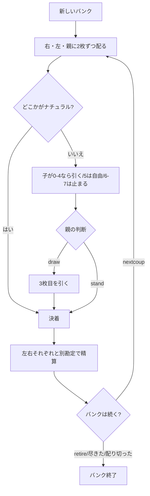

# バカラ・バンク（CUI版）遊び方

## ゲーム概要

バカラ・バンク（Baccarat Banque、別名 **Baccarat à Deux Tableaux**）はフランスのカジノ・バンキングゲームで、**1 つのバンクが左右 2 つの子と同時に勝負する**のが最大の特徴です。シューは **3 組 156 枚**をまとめてシャッフルしたもの。あなたがバンカー（親）を務めます。

**バンクは負けても動きません。** シュメン・ド・フェールでは負けた瞬間にバンクが隣へ回りますが、バカラ・バンクの親は **シューを配り切るまで／自分から降りるまで／バンクが尽きるまで** 同じ席に座り続けます。1 回の負けは持ちチップを減らすだけで、席は取られません。ここがこの形式の存在理由です。

## 起動方法

```sh
go run ./cmd/trumpcards baccaratbanque
# または
go run ./cmd/trumpcards --lang en baccaratbanque
```

## ルール

### 配り

1 クーごとに **右の子 → 左の子 → バンカー** の順で 2 枚ずつ配ります。**札は全部表向き**です。

### 合計の数え方

| 札 | 点 |
|------|-----|
| A | 1 |
| 2〜9 | その数字 |
| 10・J・Q・K | **0** |

合計は **10 で割った余り**です（7 + 6 = 13 → **3**）。

### ナチュラル

**最初の 2 枚で 8 か 9** なら「ナチュラル」。そこで打ち止めで、どちらの側も 3 枚目を引きません。

### 子の引き際（**裁量があるのは 5 だけ**）

| 子の合計 | 3 枚目 |
|------|-----|
| **0〜4** | **必ず引く** |
| **5** | **自由**（CPU が判断します） |
| **6〜7** | **必ず止まる** |
| 8〜9 | ナチュラル（引かない） |

### バンカーの引き際（**どの合計でも自由**）

あなたは **左右の子が引き終わった結果を見てから**、自分の合計に関わらず引くか止まるかを選べます。**固定表はありません。** ナチュラルのときだけ引けません。

### 精算

左右それぞれと **別勘定**で勝負します。合計が大きいほうの勝ち、同数は引き分け（やり取りなし）。**片方に払いながらもう片方から取る**クーが普通に起こります。

### バンクの終わり

| 終わり方 | いつ |
|------|-----|
| 降りる | `retire` を打ったとき |
| 配り切る | シューに次のクーぶんの札が無くなったとき |
| 尽きる | バンクが賭け金を賄えなくなったとき |

配り切った時点でチップが増えていれば勝ちです。

## ゲームの流れ



## コマンド一覧

| コマンド | 短縮形 | 説明 |
|----------|--------|------|
| `draw` | `d` | 3 枚目を引く |
| `stand` | `s` | 3 枚目を引かない |
| `nextcoup` | `nc` | 次のクーへ進む |
| `retire` | — | バンクを降りる（決着のときだけ） |
| `setdifficulty <0-2>` | `sd` | CPU 難易度（0=Easy, 1=Normal, 2=Hard） |
| `setchips <100-100000>` | `sc` | 元手 |
| `setbet <10-500>` | `sb` | 1 つの子が張る額 |
| `hint` | `h` | 助言を表示 |
| `log` | `l` | 行動ログを表示（終局後） |
| `reset` | `r` | ゲームをリセット |
| `quit` | `q` | 終了 |
| `help` | `?` | コマンド一覧を表示 |

## 画面の見方

```
クー 2
このバンクで 2 回目 ── 負けても続きます
シューの残り: 141 枚
バンカー（あなた）: ♥J ♠5　合計 5　チップ 1100
右のタブロー: ♣K ♦A ♥8　合計 9　チップ 950　賭け 50
左のタブロー: ♥6 ♥2　合計 8　チップ 950　賭け 50　★ナチュラル
あなたの合計は 5。**どの合計でも引く / 引かないは自由です**（固定表はありません）。
draw ... 引く / stand ... 引かない
```

**「このバンクで N 回目 ── 負けても続きます」**が、この形式の要です。前のクーで負けていても席は動きません。

**★ナチュラル**の印が付いた側は 8 か 9 で打ち止め。上の例では左が 8 で確定しており、あなたの 5 は止まると左に負けます。

**「シューの残り」**が次のクーぶんに足りなくなるとバンクは配り切りで終わります。残りが少なくなったら `retire` と続行を天秤にかけてください。

### 決着の画面

```
--- 決着（バンカー 8）---
  右のタブロー: バンカーの勝ち（50）
  左のタブロー: バンカーの勝ち（50）
  バンカーの増減: 100
nextcoup で次のクーへ、retire でバンクを降ります。
```

**左右は 1 行ずつ別に出ます。** 片方が「バンカーの勝ち」でもう片方が「子の勝ち」になるクーは珍しくなく、そのときの増減は差し引きです。
