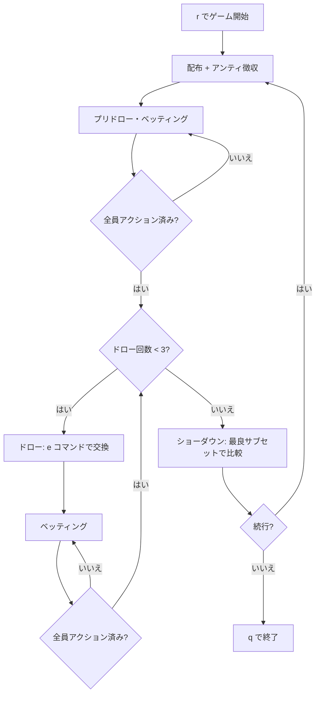

# バドゥーギ（CUI版）遊び方

## ゲーム概要

バドゥーギ（Badugi）はアジア発祥の4枚ドローポーカーで、ランクとスートがすべて異なる最も低い4枚の組み合わせ（= バドゥーギ）を目指すローボールゲームです。各プレイヤーに4枚が配られ、最大3回のドロー（交換）を経てショーダウンします。エースは常にロー（1）として扱い、ストレート・フラッシュは役に影響しません。

## 起動方法

```sh
go run ./cmd/trumpcards badugi
go run ./cmd/trumpcards --lang en badugi   # 英語モード
```

## ルール

### 基本ルール

- 52枚のトランプを使用（ジョーカーなし）
- 各プレイヤーに4枚配布
- 最大3回のドロー（交換）
- ベッティングラウンドは計4回（ディール後・各ドロー後）
- ショーダウンでは「ランクもスートもすべて異なる」最大のサブセットを選び、最も低いものが勝ち
- サブセットサイズ順（4 > 3 > 2 > 1）、同サイズなら最高ランクから比較（低い方が勝ち）
- エースは常にロー（1）として扱う
- ストレート・フラッシュは役に影響しない

### ハンドの強さ

| サイズ | 表示名 | 説明 |
|--------|--------|------|
| 4 | Badugi | 4枚すべてのランク・スートが異なる（最強） |
| 3 | 3-card | 3枚がランク・スートともに異なる |
| 2 | 2-card | 2枚がランク・スートともに異なる |
| 1 | 1-card | 残りの1枚のみ評価対象 |

### リミット構造

Fixed Limit / Pot Limit / No Limit の3種類。Fixed Limit ではラウンド1〜2がスモールベット、3〜4がビッグベット（= 2×）となります。

## ゲームの流れ



## コマンド一覧

| コマンド | 短縮形 | 説明 |
|----------|--------|------|
| `reset` | `r` | 新しいハンドを開始 |
| `bet [amount]` | `b` | 指定額をベット |
| `call` | `c` | 現在のベット額にコール |
| `raise [amount]` | `ra` | 指定額にレイズ |
| `check` | `ck` | チェック |
| `fold` | `f` | フォールド |
| `allin` | `a` | オールイン |
| `exchange [indices]` | `e` | カード交換（例: `e 0 2 3`） |
| `stand` | `s` | 交換なし（スタンドパット） |
| `bettinglimit <n>` | `bl` | リミット設定（0=Fixed, 1=PotLimit, 2=NoLimit） |
| `setcpucount <n>` | `scc` | CPU人数（1〜3） |
| `metaai <0\|1>` | `mai` | メタAIの有効/無効 |
| `log` | `l` | 棋譜表示 |
| `quit` | `q` | 終了 |
| `help` | `?` | コマンド一覧を表示 |

カード位置は `0` 〜 `3` で指定します（手札は左から 0, 1, 2, 3）。

## 画面の見方

```
==========
Badugi (4-Card Draw Lowball)
==========
ディーラー: Player 0
ポット: 130
ドロー: 1/3
リミット: Fixed
----------
あなた チップ:990
  手札: [0]♠A  [1]♥2  [2]♦3  [3]♣4  [Badugi]
CPU 1 (Conservative) チップ:980 ベット:10
CPU 2 (Aggressive)   チップ:970 ベット:20
CPU 3 (Bluffer)      チップ:960 ベット:30
----------
[CPU行動]
  Player 1 (pre-draw): ベット (10)
  Player 2 (pre-draw): レイズ (10)
  Player 3 (pre-draw): レイズ (10)
----------
[CPUドロー]
  Player 2 (draw 1): 2枚交換
  Player 3 (draw 1): 0枚交換
```

- **ディーラー**: ボタン位置のプレイヤー
- **ドロー**: 現在のドロー進行（`プリドロー` / `n/3`）
- **リミット**: Fixed / PotLimit / NoLimit
- **手札**: インデックス付きで `[0]♠A` のように表示

## 遊び方のコツ

- 完成したバドゥーギ（サイズ 4）は迷わずスタンドパット
- 3-card ローは中盤まで粘れる強さ — コールでバリューを取る
- 2枚以下のハンドで相手がスタンドパットしたらフォールド検討
- CPUの交換枚数は強さのシグナル — 0 は完成手、3 は完全なドロー
- Fixed Limit では後半（ラウンド3〜4）がビッグベット。前半で仕掛け過ぎると苦しくなる
