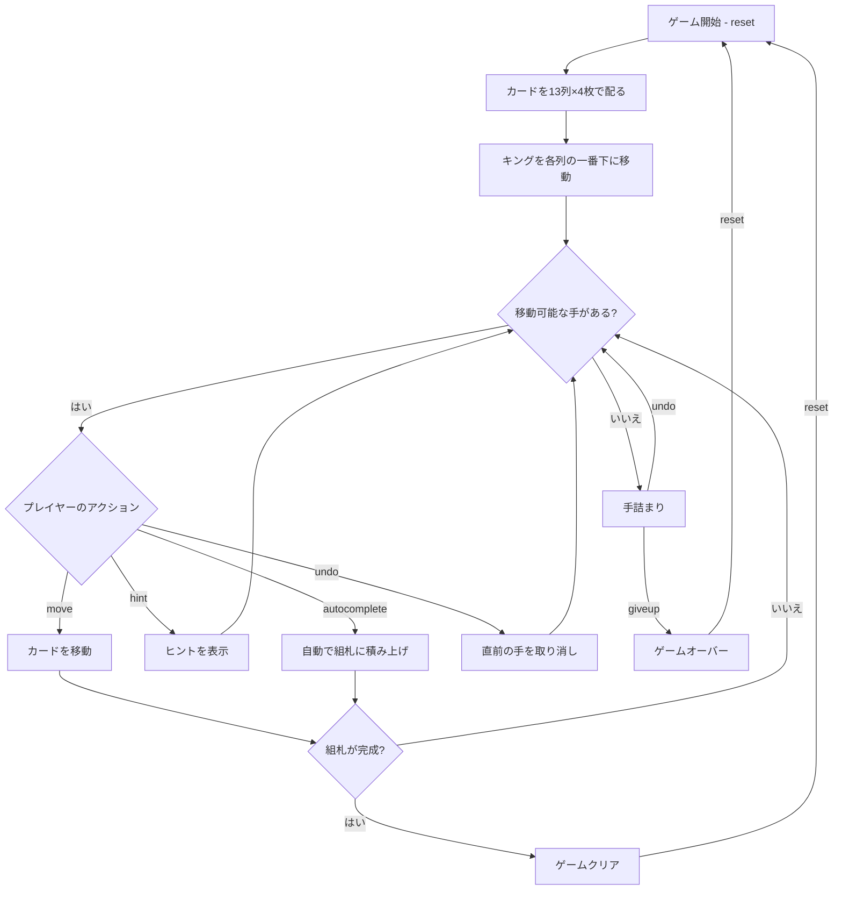

# ベーカーズ・ダズン（CUI版）遊び方

## ゲーム概要

1人用のソリティアカードゲームです。1デッキ（52枚）を使い、13列のタブロー（各4枚）と4つの組札で構成されます。配られた時点で全てのカードが表向きで、ストックやウェイストはありません。組札にA→Kまでスート別に積み上げればクリアです。

## 起動方法

```sh
go run ./cmd/trumpcards bakersdozen
go run ./cmd/trumpcards --lang en bakersdozen  # 英語モード
```

## ルール

### 基本ルール

- 1デッキ（52枚、ジョーカーなし）を使用
- 13列のタブローに各4枚ずつ表向きで配る（計52枚）
- 配り直し時、各列のキング（K）は自動的に列の一番下（最初に配られた位置）へ移動する
- 4つの組札（ファンデーション）はスート別にA→Kの順に積み上げる
- タブローではスート関係なく、ランクが1つ下のカードに重ねる（例: ♠5の上に♣4または♦4または♥4）
- 移動できるのは1枚ずつのみ（複数枚の同時移動は不可）
- **空の列にはカードを置けない**

### ゲームクリア

- 4つの組札すべてにA→Kまで13枚ずつ積み上げるとゲームクリア

### ゲームオーバー

- これ以上移動可能な手がない場合は手詰まり（オートコンプリートやアンドゥで打開可能）

## ゲームの流れ



## コマンド一覧

| コマンド | 短縮形 | 説明 |
|----------|--------|------|
| `reset` | `r` | 新しいゲームを開始 |
| `move` | `m` | カードを移動する（サブ引数で移動元・移動先を指定） |
| `targets` | `t` | その列の一番下のカードを置ける先を一覧する |
| `undo` | `u` | 直前の操作を元に戻す |
| `giveup` | `g` | ギブアップしてゲームを終了 |
| `hint` | `h` | 次の一手のヒントを表示 |
| `autocomplete` | `ac` | 自動的に組札へ積み上げ可能なカードを移動 |
| `log` | `l` | アクションログ（棋譜）を表示 |
| `quit` | `q` | ゲーム終了 |
| `help` | `?` | コマンド一覧を表示 |

### コマンド例

- `m 0 1` → 列0の最上段カードを列1へ移動
- `m 3 f` → 列3の最上段カードを組札（ファンデーション）へ移動
- `t 3` → 列3のカードを置ける列・組札を一覧（置ける先が無ければその旨を表示）
- `u` → 直前の操作を元に戻す
- `h` → ヒントを表示
- `ac` → オートコンプリート

## 画面の見方

```
==========
Baker's Dozen (ベーカーズ・ダズン)
==========
Foundation: [空] | [空] | [空] | [空]
----------
列0: [0]♠K [1]♠5 [2]♥Q [3]♣8
列1: [0]♠K [1]♥3 [2]♦9 [3]♥7
...
列12: [0]♠A [1]♥J [2]♦9 [3]♥6
----------
手数: 0
==========
```

- `Foundation`: 4つのスート別の組札の状態（`[空]`は空）
- `列N`: タブロー列（左がベース、右が最上段）
- `[0]♠K`: 列内の位置インデックスとカード
- `手数: N`: 現在の手数

## 遊び方のコツ

- すべてのカードが表向きなので、先を見越した計画が重要です
- 早めにAを組札へ移動しましょう
- キングは初期配置で必ず列の底に来るため、その上のカードから順に動かす計画を立てます
- 空の列ができても**カードを置けない**ため、無闇に列を空にする必要はありません
- ヒント機能で詰まった時のアドバイスを得られます
- 手詰まりになったらアンドゥで戻ってリトライしましょう
