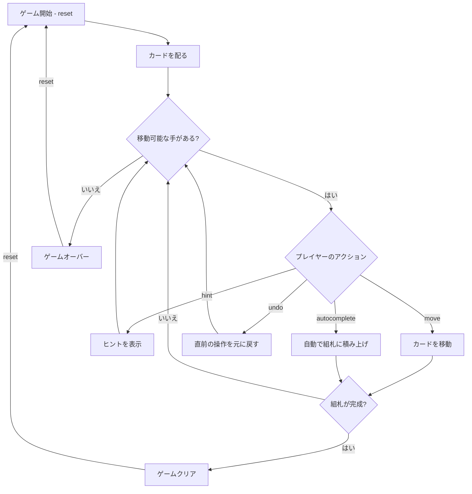

# ベーカーズ・ゲーム（CUI版）遊び方

## ゲーム概要

1人用のソリティアカードゲームで、フリーセルの直接の元祖にあたります。52枚のカードを使い、8列のタブロー、4つのフリーセル、4つの組札で構成されます。すべてのカードが表向きに配られ、組札にA→Kまでスート別に積み上げればクリアです。フリーセルとの唯一の違いは、タブローでの積み替えが「同じスートの降順」に限定される点で、その分難易度が高くなります。

## 起動方法

```sh
go run ./cmd/trumpcards bakersgame
```

## ルール

### 基本ルール

- 52枚のトランプ（ジョーカーなし）を使用
- 8列のタブローに配る（最初の4列に7枚ずつ、残りの4列に6枚ずつ）、すべて表向き
- 4つのフリーセル: 一時的にカード1枚を置ける場所
- 4つの組札（ファンデーション）はスート別にA→Kの順に積み上げる
- **タブローでは降順かつ同じスートで重ねる（例: ♠8 の上には ♠7 のみ）** ← フリーセルとの最大の違い
- 空いた列には任意のカードを置くことができる

### スーパームーブ

一度に移動できるカード数は以下の計算式で決まります:

```
最大移動枚数 = (1 + 空きフリーセル数) × 2^(空きタブロー列数)
```

### ゲームクリア

- 4つの組札すべてにA→Kまで13枚ずつ積み上げるとゲームクリア

### ゲームオーバー

- これ以上移動可能な手がない場合はゲームオーバー

### 手詰まり検出

- 各操作の後、ソルバー（A* + メモ化）がボード全体を解析し、解法が存在しないと判定された場合「手詰まりです」と表示します
- 手詰まり状態では「元に戻す」またはギブアップを選択できます
- ソルバーの探索上限（100,000状態）を超えた場合は手詰まりとは判定しません

## ゲームの流れ



## コマンド一覧

| コマンド | 短縮形 | 説明 |
|----------|--------|------|
| `reset` | `r` | 新しいゲームを開始 |
| `move` | `m` | カードを移動する（サブ引数で移動元・移動先を指定） |
| `undo` | `u` | 直前の操作を元に戻す |
| `giveup` | `g` | ギブアップしてゲームを終了 |
| `hint` | `h` | 次の一手のヒントを表示 |
| `autocomplete` | `ac` | 自動的に組札へ積み上げ可能なカードを移動 |
| `log` | `l` | アクションログ（棋譜）を表示 |
| `quit` | `q` | ゲーム終了 |
| `help` | `?` | コマンド一覧を表示 |

### 移動コマンドの構文

移動元・移動先にはゾーン名とインデックスを指定します:

- `tableau <列番号>` — タブローの列（0〜7）
- `freecell <セル番号>` — フリーセル（0〜3）
- `foundation <列番号>` — 組札（0〜3）

### コマンド例

- `m` → 移動コマンド（移動元・移動先の入力を求められる）
- `u` → 直前の操作を元に戻す
- `h` → ヒントを表示
- `ac` → オートコンプリート

## 画面の見方

```
==========
Baker's Game (ベーカーズ・ゲーム)
==========
フリーセル: [♠K] [  ] [  ] [  ]
----------
組札:
[♠] A  [♥] A 2  [♦] --  [♣] --
----------
タブロー:
[0] ♥Q ♥J ♥10 ♥9 ♥8 ♥7 ♥6
...
----------
一括移動: 最大5枚 (空きセル4 / 空き列0)
手数: 15
m・・・カードを移動  h・・・ヒント  ac・・・オートコンプリート
==========
```

- `フリーセル: [♠K] [  ]`: フリーセルの状態（カードまたは空）
- `組札`: 各スートの組札の状態（`--`は空）
- `[0] ♥Q ♥J ...`: タブロー列（すべて表向き、同スートで連結）
- `一括移動: 最大N枚 (空きセルX / 空き列Y)`: 一度に動かせる連続札の枚数。`(1 + 空きセル) × 2^空き列` で決まる。空き列があるときは、その列自身を経由地に使えないぶん上限が下がるので `/ 空き列へはM枚` が続く
- `手数: N`: 現在の手数

## 遊び方のコツ

- 同じスートでしか重ねられないため、フリーセルでは通用した「色違いでつなぐ」手は使えません
- フリーセルは一時的な退避場所です。むやみに埋めないようにしましょう
- 空いたタブロー列はスーパームーブの計算に影響するため、戦略的に活用しましょう
- Aが出たらすぐに組札へ移動しましょう
- ヒントコマンドで詰まった時のアドバイスを得られます
- オートコンプリートは組札に安全に移動できるカードがある場合に便利です
