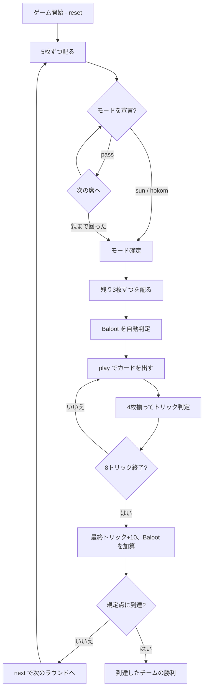

# バルート（CUI版）遊び方

## ゲーム概要

サウジアラビアをはじめ湾岸諸国で最も遊ばれているトリックテイキング。フランスのベロートから派生した**2対2のパートナー戦**で、向かい合う席が味方。32枚を4人に8枚ずつ配ります。**このゲームの肝は、宣言したモードによって札の序列そのものが入れ替わること**——切り札なしの **Sun** と、切り札ありの **Hokom** では、同じ32枚が2通りの強さと2通りの点数表を持ちます。

## 起動方法

```sh
go run ./cmd/trumpcards baloot
go run ./cmd/trumpcards --lang en baloot  # 英語モード
```

## ルール

### 配り方（2段構え）

**8枚 × 4人 = 32枚はデッキ全部**なので、先に配り切ると手札を見てモードを決める余地がなくなります。本場の手順どおり2段構えです。

1. 各プレイヤーに**5枚**配る（20枚）
2. 順に Sun / Hokom / パスを宣言する
3. モードが決まったら残り**3枚ずつ**を配る（12枚）

5×4 + 3×4 = 32 で、全員ちょうど8枚。

### モードの宣言

親の左隣から順に選び、**親で終わります**。

- `sun` … 切り札なし（Sun）を宣言する
- `hokom <suit>` … 指定スートを切り札として Hokom を宣言する（1:♠ 2:♣ 3:♥ 4:♦）
- `pass` … 見送る

**親は見送れません。** 全員が見送ると誰もモードを決めないまま進めなくなるためです。

### 札の強さと点数

**モードで序列そのものが入れ替わります。** これがバルート最大の特徴です。

**Sun（切り札なし）** — 全スート共通:

| 札 | 点 |
|----|----|
| A | 11 |
| 10 | 10 |
| K | 4 |
| Q | 3 |
| J | 2 |
| 9, 8, 7 | 0 |

強い順に A > 10 > K > Q > J > 9 > 8 > 7。カード点の合計は **120点**。

**Hokom（切り札あり）** — 切り札のスートだけ:

| 札 | 点 |
|----|----|
| **J** | **20** |
| **9** | **14** |
| A | 11 |
| 10 | 10 |
| K | 4 |
| Q | 3 |
| 8, 7 | 0 |

強い順に J > 9 > A > 10 > K > Q > 8 > 7。**非切り札は Sun と同じ**序列・同じ点数です。カード点の合計は **152点**（切り札62 + 非切り札30×3）。

どちらのモードでも**最終トリックに10点**が乗ります（Sun 130点 / Hokom 162点）。

### Baloot（役）

**切り札の K と Q を同じ手に持つと 20点**。役名がそのままゲーム名になっています。**Hokom のときだけ成立**します——Sun には切り札が無いためです。配り札から自動で判定されます。

### 勝敗

全8トリック終了後、カード点＋最終トリック＋Baloot をチームごとに集計。**規定点（既定152点）に先に達したチームの勝ち**。

## ゲームの流れ



## コマンド一覧

| コマンド | 短縮形 | 説明 |
|----------|--------|------|
| `sun` |  | 切り札なし（Sun）を宣言する |
| `hokom <suit>` |  | 指定スートを切り札として Hokom を宣言する（1:♠ 2:♣ 3:♥ 4:♦） |
| `pass` |  | 宣言を見送る（親は不可） |
| `play <idx>` | `p` | 手札の `<idx>` 番目のカードを出す |
| `next` | `n` | 次のラウンドを開始する |
| `hint` | `h` | 宣言すべきモード、または打つべき札を提示する |
| `giveup` | `g` | 投了する |
| `log` | `l` | 棋譜（アクションログ）を表示する |
| `reset` | `r` | 最初からやり直す |
| `quit` | `q` | 終了する |
| `help` | `?` | コマンド一覧を表示 |

## 画面の見方

```
==========
Baloot (バルート)
==========
ラウンド: 1  トリック: 1/8  (152点先取)
得点: あなたのチーム=0  相手=0
モード: Hokom（切り札 ハート・CPU2 が宣言）
切り札: J=20 > 9=14 > A=11 > 10 > K=4 > Q=3 > 8 > 7。非切り札は Sun と同じ（合計152点）
あなた[T0]: Baloot(K+Q)=20点 獲得0 手札8枚
  [0]♠7 [1]♠A [2]♣10 [3]♥Q [4]♥K [5]♥9 [6]♦8 [7]♦J
CPU1[T1]: 役なし 獲得0 手札8枚
CPU2[T0]: 役なし 獲得0 手札8枚
CPU3[T1]: 役なし 獲得0 手札8枚
----------
手番: あなた
play <idx>・・・カードを出す
```

- **モード行と序列行**: **有効な方の序列だけ**が出ます。同じ札の強さがラウンドごとに変わるため、どちらが効いているかを毎回明示します
- **`[T0]` / `[T1]`**: チーム番号。**T0 があなたの味方**（向かい合う席）
- **役欄**: Baloot（切り札の K+Q）の有無
- **`[n]`**: `play <n>` で指定する手札の番号

## 遊び方のコツ

- **Sun か Hokom かは「厚みの形」で決める。** A と 10 が散らばっているなら Sun、1スートに J・9・A が固まっているなら Hokom です
- **Hokom の J と 9 を数える。** この2枚で34点、1ラウンドの2割強が動きます
- **Sun では J と 9 はただの弱い札。** 同じ札の価値がモードで反転することを忘れないように
- **自分が親なら見送れない。** 弱い手でもどちらかを宣言することになるので、長いスートを Hokom に選ぶのが無難です
- **味方が勝っているトリックには点を乗せる。** A(11) や 10(10) を投げ込むのが定石
- **Baloot は Hokom 限定。** 切り札の K+Q を持っていても、Sun を宣言したら 20点は消えます
