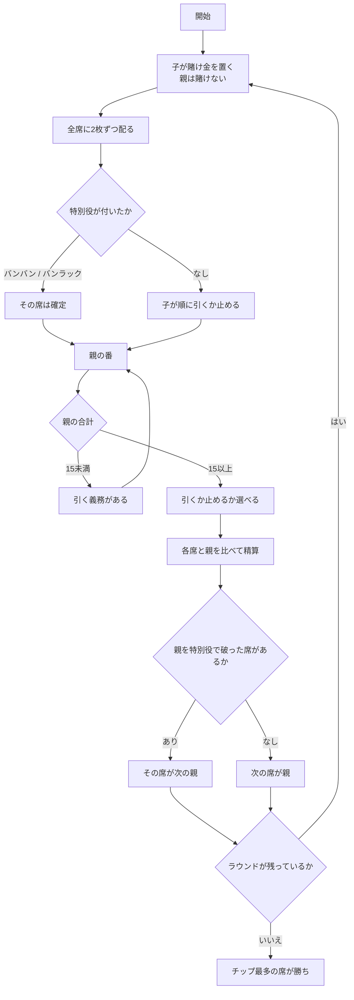

# バンラック（CUI版）遊び方

## ゲーム概要

バンラック（チャイニーズ・ブラックジャック）は、シンガポールやマレーシアの旧正月に定番のカードゲームです。合計 21 を目指す点はブラックジャックと同じですが、**強さを決めるのは合計値だけではありません**。

**枚数が役を決めます。** A が 2 枚なら合計は 12 ですが、これが最強の役「バンバン」です。配られた 2 枚で 21 なら「バンラック」、5 枚で 21 以下なら「ファイブドラゴン」。**5 枚の 16 が 2 枚の 20 に勝ちます。**

もうひとつの柱が**親の義務**です。親は合計が 15 未満の間、止まることができません。子は何点でも自由に止められます。この不公平が、全員をまとめて相手にできる親の有利さを打ち消しています。

## 起動方法

```sh
go run ./cmd/trumpcards banluck
```

英語で起動する場合:

```sh
go run ./cmd/trumpcards --lang en banluck
```

## ルール

- 標準 52 枚。2〜6 席（既定 4 席）で、席 0 があなた、残りは CPU です。
- 各ラウンド、子は賭け金を置きます。**親は賭けません**（`bet 0` で進めます）。
- 全席に 2 枚ずつ配ります。A は 1 でも 11 でも数えられ、絵札は 10 です。
- 役は強い順に:
  1. **バンバン**（A + A）
  2. **バンラック**（配られた 2 枚で 21）
  3. **ファイブドラゴン**（5 枚で 21 以下）
  4. **通常**（合計で比べる）
  5. **バスト**（21 超え）
- **配られた時点で特別役が付いた席は、そのまま確定**です。引く手番は来ません。
- **親は 15 未満では止まれません。** 子にこの義務はありません。
- **親は最後に打ちます。** 子の結果を見てから引くか決められます。
- 手札は 5 枚が上限です。
- 勝敗は各席と親の一騎討ちで、席同士は競いません。**倍率は勝った側の役**で決まります（バンバン 3 倍 / バンラック 2 倍 / ファイブドラゴン 2 倍 / 通常 1 倍）。
- 特別役同士は合計を比べず引き分けです。通常の手同士は合計で比べ、同点は引き分けです。
- **自分がバストしていたら、親が後でバストしても負け**です。
- **特別役で親を破った席が次の親**になります。居なければ次の席へ順に回ります。
- 既定のラウンド数を終えるか、チップの残る席が 2 未満になったら終了し、チップがいちばん多い席の勝ちです。

## ゲームの流れ



## コマンド一覧

| コマンド | 短縮形 | 説明 |
|----------|--------|------|
| `bet <額>` | `b` | 賭け金を置いて配る（親のラウンドは `bet 0`） |
| `hit` | `h` | 1枚引く |
| `stand` | `s` | 打ち止めにする（親は15未満だと拒否されます） |
| `next` | - | 次のラウンドへ |
| `hint` | - | 助言を表示する |
| `log` | - | 棋譜を表示する |
| `reset` | `r` | ゲームをやり直す |
| `quit` | `q` | ゲームを終了する |
| `help` | - | ヘルプを表示する |

## 画面の見方

```
フェーズ: PLAY
ラウンド: 3 / 10
親: YOU
親は15未満では止まれません。引いてください
----------
*YOU（親） チップ 1050 / 賭け 0 : ♠9 ♥4 13
 CPU1 チップ 950 / 賭け 50 : ♣10 ♦7 17
 CPU2 チップ 1000 / 賭け 50 : ♠A ♥K 21
 CPU3 チップ 1000 / 賭け 50 : ♦5 ♣6 ♠3 14
```

- **フェーズ**: `BET`（賭け）→ `PLAY`（プレイ）→ `ROUND END`（決着）→ `GAME END`（終了）
- **親**: いま親の席。ラウンドごとに移ります
- **義務の行**: 親が 15 未満のときだけ出ます。この間は `stand` が拒否されます
- **席の行**: `*` が付いているのがいま操作している席。`（親）` が親です
- **賭け**: 親は常に 0（親は賭けないため）

決着すると、席ごとの役と収支、最終ラウンドでは勝者が表示されます。

## 遊び方のコツ

- **親のときは慎重に。** 15 未満で止まれないので、13〜14 は引かされてバストしやすい形です。逆に 15 以上まで来れば、子の結果を見てから止められます。
- **子のときは低い点でも止まれます。** 親が 15 未満から引かされてバストするのを待つ、という選択が常にあります。
- **4 枚で 21 以下まで来たら、もう 1 枚引く価値があります。** ファイブドラゴンになれば合計に関係なく通常の手に勝てるので、17 でも引くほうが得な場面があります。
- **A が 2 枚来たら動かないでください。** バンバンは最強の役で、引く手番自体が来ません。
