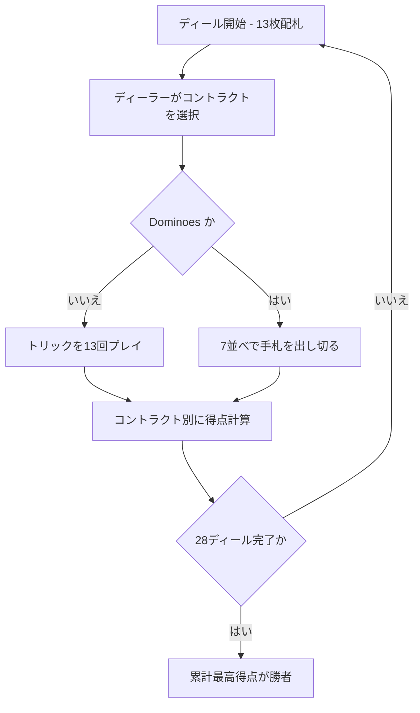

# バルブ（CUI版）遊び方

## ゲーム概要

Barbu（バルブ／ひげおじさん）はフランス発祥のコンペンディウム（オムニバス）型トリックテイキングゲームです。4 人・52 枚デッキでプレイし、各プレイヤーが順番にディーラーを務めて計 28 ディールを行います。ディーラーは手札を見たうえで 7 つのコントラクト（ミニゲーム）から 1 つを選び、それぞれ異なる得点ルールでプレイします。28 ディール終了時に累計得点が最も高いプレイヤーが勝者です。

## 起動方法

```sh
go run ./cmd/trumpcards barbu
# 英語表示:
go run ./cmd/trumpcards --lang en barbu
```

## ルール

- プレイ人数: 4 人（あなた + CPU 3 人）。
- デッキ: ジョーカーを除く 52 枚。各プレイヤーに 13 枚配ります。
- 計 28 ディール。各プレイヤーがディーラーを 7 回務め、毎回異なるコントラクトを 1 つずつ選びます（同じコントラクトは選び直せません）。
- コントラクトと得点:
  1. **No Tricks** — 取ったトリック 1 つにつき −2。
  2. **No Hearts** — 取ったハート 1 枚につき −2。
  3. **No Queens** — 取った Q 1 枚につき −6。
  4. **Barbu** — K♥ を取ったプレイヤーが −20。
  5. **No Last Trick** — 最後（13 番目）のトリックを取ると −20。
  6. **Trumps** — 宣言者が切り札スートを決め、取ったトリック 1 つにつき +5。
  7. **Dominoes** — 7 並べ。手札を早く出し切るほど高得点（1 着 +45 / 2 着 +20 / 3 着 −5 / 4 着 −30）。
- トリック系コントラクトではリードスートに従う義務があります（フォロースート）。

## ゲームの流れ



## コマンド一覧

| コマンド | 短縮形 | 説明 |
|----------|--------|------|
| `contract <0-6> [切札 1-4]` | `c` | コントラクトを選ぶ（切札は Trumps=5 のときのみ指定） |
| `play <h>` | `p` | 手札 h を出す（Dominoes では `p -1` でパス） |
| `next` | `n` | 次のディールを開始 |
| `setdifficulty <0-2>` | `sd` | CPU 難易度を変更（0=Easy, 1=Normal, 2=Hard） |
| `log` | `l` | 棋譜（アクションログ）を表示 |
| `reset` | `r` | ゲームをリセット |
| `quit` | `q` | 終了 |
| `help` | `?` | コマンド一覧を表示 |

## 画面の見方

- 先頭行に「ディール n/28」と現在のディーラーが表示されます。
- 各プレイヤー行に手札枚数 / 獲得トリック数 / 累計得点が出ます。あなたの手札は `[0] ♠5 [1] ♥K ...` のように添字付きで表示されます。
- コントラクト選択後は「Contract: ...（切札: ...）」が表示されます。
- トリック系では現在のトリック、Dominoes では各スートの並びが表示されます。

## 遊び方のコツ

- ディーラーになったら手札を見て「安全なコントラクト」を先に消化しましょう（例: ハートが少ないうちに No Hearts、Q を持っていないうちに No Queens）。
- 強い手札（高ランク・長いスート）のときは Trumps を選んでトリックを稼ぐと加点できます。
- Dominoes では 7 から遠い端のカードを優先して出すと、手札を早く軽くできます。
- 負のコントラクトでは、リードを低く保ち、危険なカード（K♥・Q・高いハート）はボイドのときに捨てましょう。
