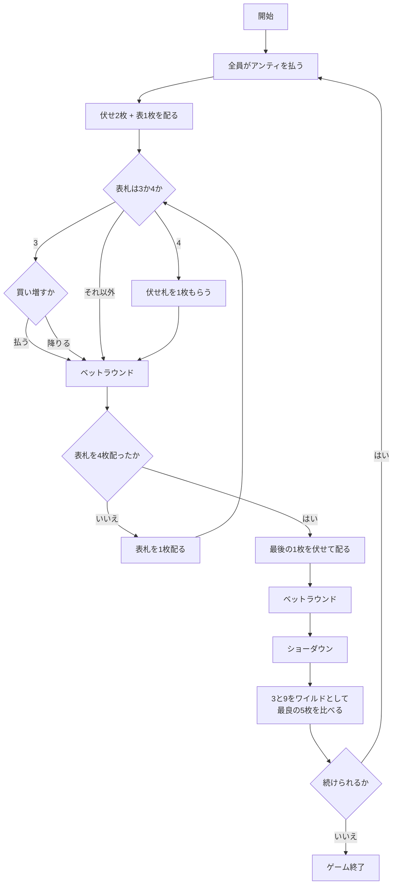

# ベースボールポーカー（CUI版）遊び方

## ゲーム概要

ベースボールポーカーは、アメリカのホームポーカーで遊ばれるセブンカードスタッドのバリアントです。野球にちなんだ 2 つの名物ルールを持ちます。

1. **3 と 9 はいつでもワイルド。** 山に 8 枚あるので、役の相場がまるごと上がります。ワイルド無しの感覚で降りると降りすぎます。
2. **表向きに配られた札でイベントが起きます。**
   - **表の 4** … 伏せ札を 1 枚もらえます（追加のヒット）
   - **表の 3** … その時点のポットを払って続けるか、その場で降りるかを迫られます

**同じ 3 が「嬉しい札」と「請求書」の両方になります。** 伏せて配られた 3 はただのワイルドですが、表で出た 3 は支払いを迫ります。違うのは札ではなく、**どちら向きに配られたか**です。

## 起動方法

```sh
go run ./cmd/trumpcards baseballpoker
```

英語で起動する場合:

```sh
go run ./cmd/trumpcards --lang en baseballpoker
```

## ルール

- 標準 52 枚。2〜6 席（既定 4 席）で、席 0 があなた、残りは CPU です。
- 開始時に全員がアンティ（既定 10）を払います。
- 配り方はセブンカードスタッドと同じです。
  1. 伏せ 2 枚 + 表 1 枚（3rd ストリート）
  2. 表 1 枚ずつを 3 回（4th・5th・6th ストリート）
  3. 最後に伏せ 1 枚（7th ストリート）
- **表札を配るたびにベットラウンド**が入ります（計 4 回）。
  - 誰も賭けていなければ **チェック** または **ベット**
  - 誰かが賭けていれば **コール** / **レイズ** / **フォールド**
  - **レイズは 1 ラウンド 3 回まで**です。
- **表の 4 が配られた席**は、伏せ札を 1 枚受け取ります。手札が 8 枚以上になる席が出ます。
- **表の 3 が配られた席**は、`pay`（そのときのポットを払って続ける）か `buyfold`（払わずに降りる）を選びます。
  - **払う額は迫られた時点のポットで固定**です。後の席が買い増してポットが膨らんでも、あなたの請求額は変わりません。
  - チップが足りなければ、あるだけ払う（実質オールイン）扱いになります。
- ショーダウンでは、**手札全部から最良の 5 枚**を作って比べます。3 と 9 は好きな札として使えます。
- いちばん強い役の席がポットを取ります。同じ役なら山分けし、端数は若い席から配ります。
- チップが尽きた席は脱落し、あなたが賭けられなくなるか、残り 1 席になったら終了です。

## ゲームの流れ



## コマンド一覧

| コマンド | 短縮形 | 説明 |
|----------|--------|------|
| `fold` | `f` | 降りる |
| `check` | `k` | 賭けずに次へ（誰も賭けていないとき） |
| `call` | `c` | 現在の賭け額に合わせる |
| `bet <額>` | `b` | 賭ける（誰も賭けていないとき） |
| `raise <額>` | - | 上乗せする（1ラウンド3回まで） |
| `pay` | `p` | ポットを買い増して続ける（表の3が出たとき） |
| `buyfold` | - | 買い増さずに降りる |
| `next` | - | 次のハンドへ |
| `hint` | - | 助言を表示する |
| `log` | - | 棋譜を表示する |
| `reset` | `r` | ゲームをやり直す |
| `quit` | `q` | ゲームを終了する |
| `help` | - | ヘルプを表示する |

## 画面の見方

```
フェーズ: BUY THE POT
ハンド: 2（ポット: 120）
ストリート: 2 / 4
3 と 9 はワイルド。表の 4 は追加札、表の 3 は買い増し
----------
 YOU チップ 940 / 賭け 0 : ♠A ♥7 ♣9 ♦4
$CPU1 チップ 980 / 賭け 0 : [??] [??] ♠3 ♥K
 CPU2（降り） チップ 980 / 賭け 0 : [??] [??] ♦5 ♣2
 CPU3 チップ 980 / 賭け 0（追加1枚） : [??] [??] ♥4 ♠8 [??]
```

- **フェーズ**: `BETTING`（ベット）→ `BUY THE POT`（買い増しの返事待ち）→ `SHOWDOWN`（ショーダウン）→ `GAME END`（終了）
- **ストリート**: 表札を何枚配り終えたか。残りの回数だけベットラウンドがあります
- **席の行**: `*` があなたの手番、`$` が買い増しを迫られている席。**表札は全員ぶん見えています**（伏せ札だけが `[??]`）
- **（追加n枚）**: 表の 4 でもらった伏せ札の枚数

ショーダウンでは全員の伏せ札が開き、獲得額とワイルドを使ったかが表示されます。

## 遊び方のコツ

- **相手の表札を読んでください。** 伏せ札は隠れていますが、表札は全員ぶん見えています。相手の表に 3 や 9 が並んでいたら、その席の役はあなたの想像より上です。
- **ワイルドが 8 枚あるぶん、相場が上がります。** ツーペアは、このゲームでは強い手ではありません。
- **表の 3 は諸刃です。** ワイルドが 1 枚増えるのは嬉しいのですが、その場でポットぶんの支払いを迫られます。**手が弱いうちにポットが小さいのは、むしろ安く買えるということ**でもあります。
- **買い増しの請求額は迫られた時点で決まります。** 後の席が買い増してポットが膨らんでも、あなたが払う額は増えません。
- **追加札は伏せて配られます。** 表の 4 をもらった席は手札が 1 枚多い ── その席と勝負するときは、見えている枚数より 1 枚多く持っていると考えてください。
