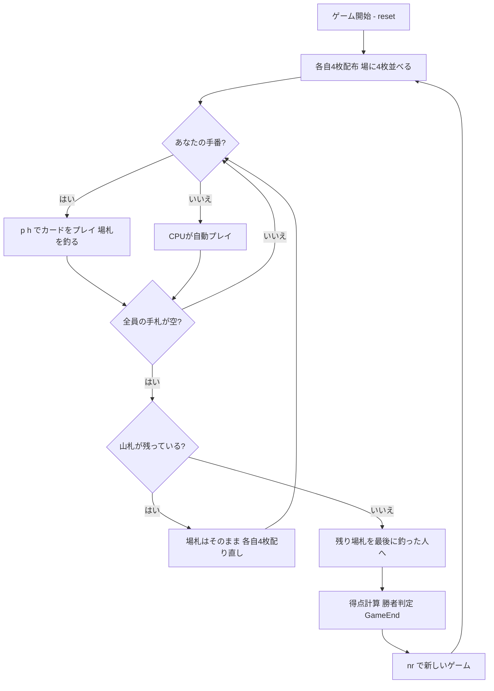

# バスラ（CUI版）遊び方

## ゲーム概要

Basra（バスラ / Bastra）は、エジプトやレバント地方（シリア・レバノンなど）で親しまれている**フィッシング（釣り）系のカードゲーム**です。本実装は 4 人（あなた＋CPU3人）で個人戦としてプレイします。各プレイヤーは手札を 1 枚ずつ出し、**場札（テーブルの表向きの札）を釣り上げて（capture）**取り札を増やします。数札は**同じランク**や**合計値が一致する組み合わせ**をまとめて取れ、ジャック（J）は場を一掃します。1 枚の非ジャック札で場札を全て取り切ると **"Basra"（バスラ）** となり大きなボーナスになります。山札を配り切った後、取り札の内容で得点を計算し、最も高いプレイヤーが勝ちます。

## 起動方法

```sh
go run ./cmd/trumpcards basra
go run ./cmd/trumpcards --lang en basra  # 英語モード
```

## ルール

### デッキと配布

- **デッキ**: 標準52枚（A〜K × 4スート）。
- **プレイヤー**: 4人（プレイヤー0 = あなた、プレイヤー1〜3 = CPU）。それぞれ個人で得点を競います。
- **配布**: 各プレイヤーに **4枚**、さらに場（テーブル）に **4枚**を表向きに並べます。

### 手番と釣り（capture）

- 自分の手番では手札から **1枚**を出します。
- **数札（A=1〜10）**: 場札のうち、
  - **同じランク**の札、および
  - **合計値が出した札の値と一致する場札の組み合わせ**
  を**まとめて**取れます（複数のグループを同時に取ることも可能）。
- **Q・K**: **同じランクの札とのマッチのみ**で取れます（合計では取れません）。
- **ジャック（J）**: 場札のうち、**他のジャックを除くすべての札**を一掃して取ります（スイープ）。
- **釣れない場合**: 出した札はそのまま**場に残ります（トレイル / trail）**。

### バスラ（Basra）

- **ジャック以外の1枚**で場札を**すべて取り切った**とき、**Basra（+10点）**のボーナスになります。
- **ジャックのスイープは Basra ではありません**（場を一掃してもボーナスは付きません）。

### ラウンド進行と札切れ

- 全員の手札がなくなると、**場札は追加せず**、山札から改めて**各自4枚ずつ配り直します**。
- これを**山札が尽きるまで**繰り返します。
- 最後に場に残った札は、**最後に釣り（capture）を行ったプレイヤー**が取ります。

### 得点計算（ゲーム終了時）

| 項目 | 得点 |
|------|------|
| 取った札が最も多いプレイヤー（単独） | +3 |
| ダイヤの7（7♦） | +3 |
| ダイヤの10（10♦） | +2 |
| エース（A）1枚につき | +1 |
| Basra 1回につき | +10 |

- 合計点が**最も高い**プレイヤーが勝ちです（同点の場合は複数人が勝者）。
- 目標点レースはありません。`nr` で**新しいゲーム**を最初から始めます。
- CPU 難易度は Easy / Normal / Hard から選べます。

## ゲームの流れ



## コマンド一覧

| コマンド | 短縮形 | 説明 |
|----------|--------|------|
| `play <h> [t...]` | `p` | 手札のh番目のカードを出し、場札t...を釣る（tを省略するとトレイル。ジャックは常にスイープ） |
| `nextround` | `nr` / `n` | 新しいゲームを開始 |
| `setdifficulty <0-2>` | `sd` | CPU難易度設定（0=Easy, 1=Normal, 2=Hard） |
| `hint` | `h` | 推奨アクションを表示 |
| `log` | `l` | アクションログを表示 |
| `reset` | `r` | 新しいゲームを開始（設定保持） |
| `quit` | `q` | ゲーム終了 |
| `help` | `?` | コマンド一覧を表示 |

## 画面の見方

```
==========
Basra (バスラ)
==========
Round 1  Deck 32

Players:
  P0 (You)   Captured 0   Basra 0
  P1 (CPU)   Captured 4   Basra 0
  P2 (CPU)   Captured 2   Basra 1
  P3 (CPU)   Captured 0   Basra 0
----------
Table: [0]♠7 [1]♥3 [2]♦A [3]♣10

Your hand: [0]♠10 [1]♥3 [2]♠K [3]♦J
```

- **ラウンド行**: ラウンド番号、山札の残り枚数。
- **プレイヤー情報**: 各プレイヤーの取り札枚数（Captured）、Basra の回数。
- **場札（Table）**: 現在テーブルに表向きで並んでいる札。
- **手札**: あなたが出せる札。
- **得点結果**: 各プレイヤーの取り札枚数・7♦/10♦・A・Basra による内訳。ゲーム終了時は `勝者:`（引き分けは複数名）と `最終得点:` の行が出ます。

## 遊び方のコツ

- **合計取りを狙う**: 数札は同じランクだけでなく、合計値が一致する複数枚をまとめて取れます。10 を出して 7＋3 と単独の 10 を同時に取る、といった複数グループ取りで一気に稼ぎましょう。
- **Basra を意識する**: 場札が 1 種類（または合計で取り切れる状態）のとき、非ジャックの 1 枚で全て取ると +10 の Basra。場が少ないときは Basra のチャンスを狙いましょう。
- **ジャックは切り札的に**: ジャックはいつでも場を一掃できます（Basra にはなりません）。場札が多く溜まって相手に取られそうなときの回収に有効です。
- **重要札を確保する**: 7♦（+3）、10♦（+2）、各エース（+1）、そして取り札の総数（最多で +3）が得点源です。これらを含む場札は優先的に釣りましょう。
- **難易度調整**: `sd` コマンドで CPU の強さを変えられます。慣れないうちは 0（Easy）から始めましょう。
