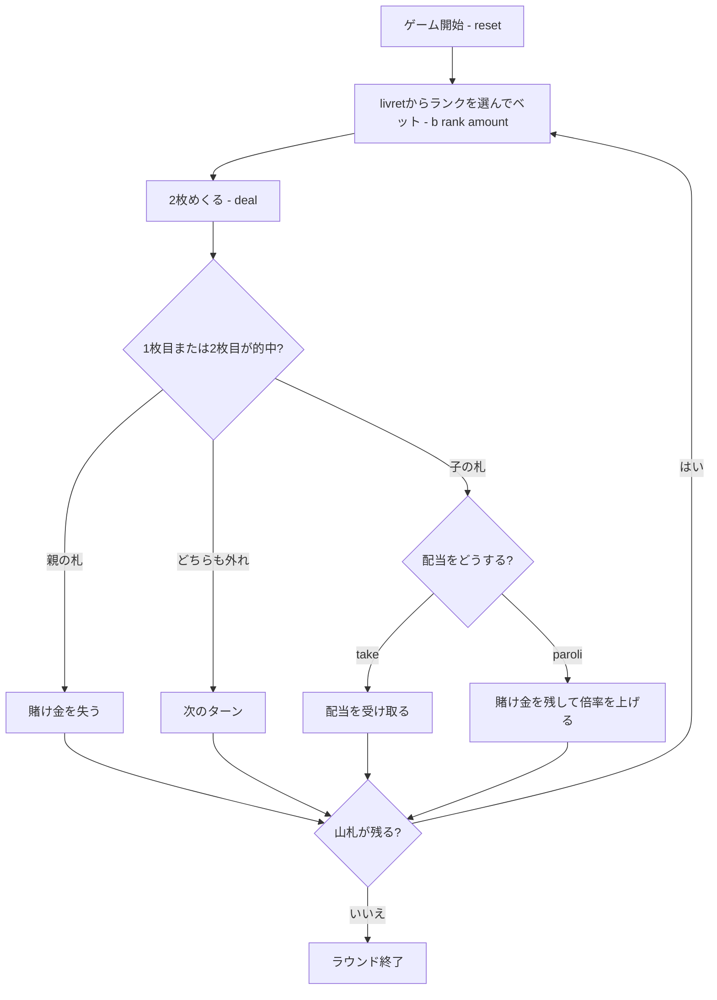

# バセット（CUI版）遊び方

## ゲーム概要

バセットは17世紀のヴェネツィアやフランス宮廷で流行した銀行ゲームで、ファロの先祖にあたります。人間1人が銀行と対戦し、標準52枚の山札が尽きるまでチップを増やします。

## 起動方法

```sh
go run ./cmd/trumpcards basset
go run ./cmd/trumpcards --lang en basset  # 英語モード
```

## ルール

1. 13ランクの札（livret）から1つを選び、チップを賭けます。
2. 銀行が山札から2枚をめくります。1枚目（親の札）が賭けたランクなら親の総取りで賭け金を失います。2枚目（子の札）が一致すれば勝ちです。
3. 勝ったら、配当を受け取って降りるか、賭け金を残して **paroli** を選びます。倍率は **1 → 7（sept-et-le-va）→ 15（quinze-et-le-va）→ 33（trente-et-le-va）→ 67（soixante-et-le-va）** と上がります。
4. 倍率を上げた後に1枚目が一致すると、積み上げた分も含めて失います。山札が尽きるまで繰り返します。

ファロと違い、的中するたびに「受け取って降りる」か「続けて倍率を上げる」かを選ぶことがバセットの主役です。

## ゲームの流れ



## コマンド一覧

| コマンド | 短縮形 | 説明 |
|----------|--------|------|
| `bet <rank> <amount>` | `b` | ランク（1=A〜13=K）にチップを置く |
| `deal` | `d` | 親の札と子の札を2枚めくる |
| `take` |  | 現在の配当を受け取って降りる |
| `paroli` |  | 賭け金を残して倍率を上げる |
| `next` | `n` | 次のディールへ進む |
| `reset` | `r` | 新しいゲームを開始する |
| `log` | `l` | 棋譜を表示する |
| `help` | `?` | コマンド一覧を表示する |
| `quit` | `q` | ゲームを終了する |

## 画面の見方

```
----------
chips: 1000
phase: BETTING
turns: 0/26
remaining: 52
bet: rank 7, amount 100, stage 0
----------
```

- `chips` は手持ちチップ、`remaining` は山札の残り枚数です。
- `bet` は現在のランク、賭け金、paroli の段階です。`phase` が `DECISION` のときに `take` または `paroli` を選びます。

## 遊び方のコツ

- 的中後に安全に配当を確定するか、賭け金を残して大きな倍率を狙うかを判断しましょう。
- paroli は倍率が上がるほど、次に親の札が出たときの損失も大きくなります。
