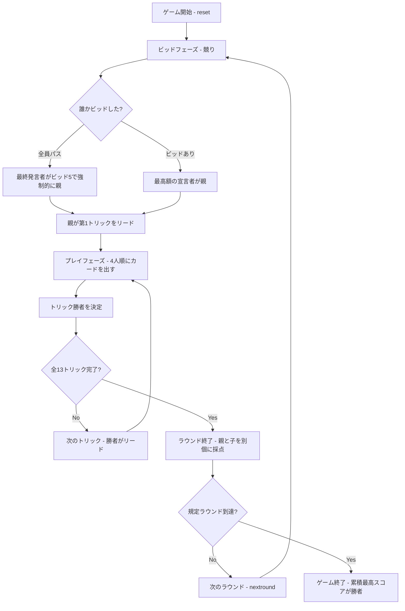

# バタック（CUI版）遊び方

## ゲーム概要

Batak（バタック）はトルコを中心に広く遊ばれている 4 人プレイのトリックテイキングゲームです。スペードが常時切り札ですが、Call Break や Spades と異なり、全員がビッドするのではなく**競り（オークション）によって最高額を宣言した 1 人だけが「親（デクレアラー）」**となり、親と子で非対称な得点ルールで勝負します。標準では 5 ラウンド行い、累積スコアが最も高いプレイヤーが勝者となります。

## 起動方法

```sh
go run ./cmd/trumpcards batak
go run ./cmd/trumpcards --lang en batak  # 英語モード
```

## ルール

### 基本ルール

- 4 人プレイ（人間 1 + CPU 3）、52 枚のトランプを使用し、各プレイヤーに 13 枚ずつ配ります。
- **スペードが常に切り札（トランプ）**です。
- **ビッド（競り）**:
  - 各プレイヤーは時計回りに 1 回ずつ宣言します。
  - 宣言できる値は **5〜13**、または **パス（0）** です。
  - ビッドを行う場合は、それまでの最高ビッドより厳密に大きい値を宣言する必要があります。
  - 最高ビッドを宣言した 1 人が**親（デクレアラー）**となります。
  - **全員がパスした場合**: 最後に発言した席が最低額の 5 で強制的に親になります。
- **プレイ**:
  - **第 1 トリックのリードは親**が行います。
  - **マストフォロー**: リードスートのカードを持っていれば、必ずそのスートを出さなければなりません。
  - **マストトランプ**: リードスートを持たない（ボイド）場合、**スペードを持っていれば必ずスペードを出さなければなりません**。スペードも持たない場合のみ、任意のカードを捨てることができます。
  - **スペードブレイク**: スペードがまだ場に出ていない（ブレイクされていない）間は、手札にスペード以外のカードがある限りスペードでリードすることはできません。
  - トリックの勝者は、最も強いスペードを出したプレイヤー、スペードが出ていなければリードスートの最も強いカードを出したプレイヤーです（カードの強さは A > K > Q > J > 10 > ... > 2）。
  - トリック勝者が次のトリックをリードします。全 13 トリック行います。

### 得点計算

得点は**素の整数**で計算されます（小数や内部 ×10 などのスケールはありません。また、バッグのペナルティもありません）。

- **親（デクレアラー）**:
  - 獲得トリック数 ≥ ビッド数の場合: **+ビッド数**（例: ビッド 5 で 6 トリック獲得 → +5 点）
  - 獲得トリック数 < ビッド数の場合: **-ビッド数**（例: ビッド 5 で 4 トリック獲得 → -5 点）
- **子（ディフェンダー）**:
  - **獲得したトリック数がそのまま加点**されます（例: 3 トリック獲得 → +3 点）。ビッド達成／未達の成否判定はありません。

### ゲーム終了

- 設定されたラウンド数（デフォルト 5 ラウンド）に達した時点でゲーム終了です。
- 全ラウンドを通じた累積スコアが最も高いプレイヤーが勝者となります。

### CPU難易度

- Easy: ランダムなビッドおよびカードプレイ。
- Normal: 手札の強さ（絵札・高札）に基づくビッドと、標準的なトリックフォロー。
- Hard: スペードの枚数や勝ち札の最小化など、勝率を高める戦略的なビッド・プレイ。

## ゲームの流れ



## コマンド一覧

| コマンド | 短縮形 | 説明 |
|----------|--------|------|
| `reset` | `r` | 新しいゲームを開始 (設定保持) |
| `quit` | `q` | ゲーム終了 |
| `bid <n>` | `b <n>` | ビッドを宣言 (5〜13、0=パス) |
| `pass` | - | パス (0 を宣言) |
| `play <i>` | `p <i>` | 手札のインデックス `i` のカードをプレイ |
| `next` | `n` | 次のトリックへ進む |
| `nextround` | `nr` | ラウンドをスコアリングして次のラウンドへ |
| `setdifficulty <0-2>` | `sd <0-2>` | CPU 難易度設定 (0=Easy, 1=Normal, 2=Hard) |
| `setrounds <n>` | `sr <n>` | 総ラウンド数を設定 (1 以上、デフォルト 5) |
| `hint` | `h` | 推奨ビッド/カードを表示 |
| `log` | `l` | 棋譜表示 (ゲーム終了後) |
| `help` | `?` | コマンド一覧を表示 |

## 画面の見方

### 日本語表示

```
==========
Batak (バタック)
==========
ラウンド: 1 / 5  トリック: 0
親: 未確定 (最高ビッド: -)
得点規則: 親は達成で +bid・未達で -bid、子は獲得トリック数が加点
スペードブレイク: なし
あなた: ビッド=未ビッド 獲得0トリック 累積0点 ラウンド0点 13枚
[0]SPADE 8  [1]CLOVER 4  [2]CLOVER 6  [3]CLOVER 10  [4]HEART 1  [5]HEART 2  [6]HEART 9  [7]HEART 10  [8]HEART 11  [9]DIAMOND 2  [10]DIAMOND 8  [11]DIAMOND 10  [12]DIAMOND 11
CPU 1: ビッド=未ビッド 獲得0トリック 累積0点 ラウンド0点 13枚
CPU 2: ビッド=未ビッド 獲得0トリック 累積0点 ラウンド0点 13枚
CPU 3: ビッド=未ビッド 獲得0トリック 累積0点 ラウンド0点 13枚
----------
ビッドフェーズ: あなたの番
b <n> (5-13) または pass (0)・・・ビッドを宣言
==========
```

プレイフェーズ（あなたが親の場合）:

```
==========
Batak (バタック)
==========
ラウンド: 1 / 5  トリック: 1
親: あなた (最高ビッド: 5)
得点規則: 親は達成で +bid・未達で -bid、子は獲得トリック数が加点
スペードブレイク: なし
あなた [親]: ビッド=5 獲得0トリック 累積0点 ラウンド0点 13枚
[0]SPADE 2  [1]SPADE 4  [2]SPADE 5  [3]SPADE 11  [4]CLOVER 3*  [5]CLOVER 4*  [6]CLOVER 5*  [7]CLOVER 7*  [8]CLOVER 9*  [9]HEART 8*  [10]DIAMOND 1*  [11]DIAMOND 3*  [12]DIAMOND 7*
CPU 1: ビッド=パス 獲得0トリック 累積0点 ラウンド0点 13枚
CPU 2: ビッド=パス 獲得0トリック 累積0点 ラウンド0点 13枚
CPU 3: ビッド=パス 獲得0トリック 累積0点 ラウンド0点 13枚
----------
手番: あなた
play <idx>・・・カードを出す
==========
```

### 英語表示 (`--lang en`)

```
==========
Batak
==========
Round: 1 / 5  Trick: 0
Declarer: Undecided (High bid: -)
Scoring: Declarer +bid on make / -bid on set; Defenders +1 per trick won
Spades broken: no
You: bid=no bid won 0 tricks, cum 0pt round 0pt 13 cards
[0]CLOVER 2  [1]CLOVER 4  [2]CLOVER 8  [3]HEART 4  [4]HEART 5  [5]HEART 13  [6]DIAMOND 2  [7]DIAMOND 4  [8]DIAMOND 5  [9]DIAMOND 6  [10]DIAMOND 7  [11]DIAMOND 9  [12]DIAMOND 10
CPU 1: bid=no bid won 0 tricks, cum 0pt round 0pt 13 cards
CPU 2: bid=no bid won 0 tricks, cum 0pt round 0pt 13 cards
CPU 3: bid=no bid won 0 tricks, cum 0pt round 0pt 13 cards
----------
Bid phase — You to act
b <n> (5-13) or pass (0) — declare a bid
==========
```

- `[idx]<Suit> <Value>`: 手札のインデックス（0 始まり）とカード内容。Ace は 1、King は 13 で表示されます。
- **末尾の `*`**: 現在のルール上出すことができる有効なカード（マストフォロー・マストトランプを満たすもの）を示します。あなたの手番でのみ表示されます。
- `[親]` / `[Declarer]`: 競りに勝って親となったプレイヤーに付与される表示です。
- 得点は素の整数値で表示されます（バッグなどの追加ペナルティはありません）。
- スペードブレイクが「なし」の場合、最初のリードでスペードは出せません。

## 遊び方のコツ

- **親になるリスクとリターン**: 親はビッドを達成すれば +bid 点ですが、1 トリックでも足りないと -bid 点のペナルティを受けます。手札の切り札枚数や高札（A, K）を慎重に見極めて競りましょう。
- **子としての立ち回り**: 子（ディフェンダー）はビッド成否に関係なく、取ったトリック数がそのままプラス点になります。無理に親を倒そうとするだけでなく、確実に取れるトリックを拾っていくことが勝利への近道です。
- **マストトランプの活用**: リードスートを持たないときにスペードを持っていれば強制的に出さなければならないため、相手のボイドを突いて強い切り札を吐かせたり、自分の低い切り札でトリックを奪う戦術が有効です。
