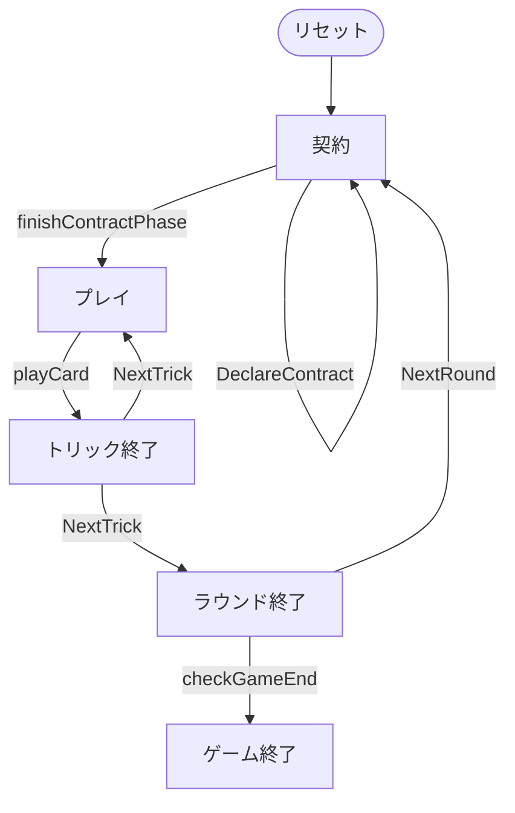

# バウエルンシュナプセン（CUI版）遊び方

## ゲーム概要

Bauernschnapsen（バウエルンシュナプセン）はオーストリアの伝統的なトリックテイキングゲームで、シュナプセン（66）の系統に属します。20枚デッキ（A,10,K,Q,J × 4スート）を使って4人2チームで対戦します。**カードは20枚すべてを配り切る**ため山札は無く、**最初のトリックからフォロー義務**があります。各ラウンドはまず契約（通常 / 同スート縛り / ベテル）の宣言から始まり、宣言した契約を達成できたかで点が動きます。先に24点に達したチームが勝利します。

## 起動方法

```sh
go run ./cmd/trumpcards bauernschnapsen
go run ./cmd/trumpcards --lang en bauernschnapsen  # 英語モード
```

## ルール

### 基本ルール

- プレイヤーは4人（人間1 + CPU3）。プレイヤー0と2、プレイヤー1と3が同チーム（人間はプレイヤー0）。
- 20枚デッキ（A,10,K,Q,J × 4スート）を使用。各プレイヤーに5枚ずつ配って**配り切る**。山札も表向きの切り札表示カードも無い。
- 山札が無いので**第1トリックからフォロー義務**（マストフォロー）がある。リードされたスートを持っていれば必ず出す。

### 契約の宣言

ラウンドの最初にディーラーの左隣から順に、各席が1回ずつ宣言する。一番高い契約が採用され、それを宣言した席が「宣言者」になる。

| 契約 | 番号 | 内容 | 点 |
|------|------|------|----|
| パス | `0` | 宣言しない | — |
| 通常（Rufer） | `1` | 切り札スートを指定し、自チームがカード点の過半（61点以上）を取る | 2 |
| 同スート縛り（Farbenzwang） | `2` | 切り札スートを指定し、**相手に1トリックも渡さない** | 6 |
| ベテル（Bettel） | `3` | **切り札なし**で、自分が**1トリックも取らない** | 5 |

全員がパスした場合は、ディーラーの左隣が手札で一番枚数の多いスートを切り札にして通常契約を行う。

### マリッジ

リード時に同一スートの K+Q を持っていれば「マリッジ」を宣言し、自チームに20点（切り札なら40点）を加算できる。この点は通常契約の「61点以上」の判定に効く。**ベテルでは宣言できない**（切り札が無く、トリックを取らない契約なので意味を持たない）。

### カード点とトリックの強さ

- カード点: A=11, 10=10, K=4, Q=3, J=2（1ラウンドの合計は120点）
- トリックの強さ: A > 10 > K > Q > J

### 勝敗

**カード点そのものではなく契約の点**が加算される。宣言した契約を達成すれば宣言側チームがその点を得て、落とせば同じ点が相手チームに入る。先に24点（変更可）に達したチームが勝利。

## ゲームの流れ

ゲームの進行は `internal/domain/Bauernschnapsen.go` のフェーズ機械そのものです。各ノードは同ファイルの `BauernschnapsenPhase` 定数、矢印ラベルはその遷移を行うメソッド名です。



## コマンド一覧

| コマンド | 短縮形 | 説明 |
|----------|--------|------|
| `contract <0-3> [1-4]` | `c` | 契約を宣言（0=パス 1=通常 2=同スート縛り 3=ベテル / スート 1=S 2=C 3=H 4=D） |
| `play <idx>` | `p` | カードをプレイ |
| `marriage <idx>` | `m` | マリアージュ宣言 (K/Q をリード) |
| `next` | `n` | 次のトリックへ |
| `nextround` | `nr` | 次のラウンドへ |
| `log` | `l` | action log |
| `setdifficulty [0-2]` | `sd` | CPU難易度 (0=易, 1=普通, 2=難) |
| `settarget <n>` | `st` | 目標スコア (デフォルト24) |
| `hint` | `h` | ヒントを表示 |
| `reset` | `r` | 新しいゲームを開始 |
| `quit` | `q` | ゲーム終了（`exit` も同じ） |
| `help` | `?` | コマンド一覧を表示 |

## 画面の見方

実際の出力例です。配りは毎回シャッフルされるので、カードの並びは実行ごとに変わります。

まず契約の宣言から始まります。

```
==========
バウエルンシュナプセン
==========
ラウンド: 1  トリック: 0
ディーラー: あなた
契約: 宣言中
チーム0: 0  チーム1: 0
あなた: チーム 0 トリック=0 手札=5
[0]SPADE 13  [1]CLOVER 11  [2]CLOVER 12  [3]CLOVER 10  [4]HEART 10
CPU 1: チーム 1 トリック=0 手札=5
CPU 2: チーム 0 トリック=0 手札=5
CPU 3: チーム 1 トリック=0 手札=5
----------
あなた の番です
契約を宣言してください
c <0-3> [スート 1-4] (0=パス 1=通常 2=同スート縛り 3=ベテル / スート 1=S 2=C 3=H 4=D)
==========
```

`c 1 1`（スペードを切り札にした通常契約）と入力すると、プレイが始まります。

```
==========
バウエルンシュナプセン
==========
ラウンド: 1  トリック: 1
ディーラー: あなた
契約: 通常 (あなた) / 切り札: SPADE
チーム0: 0  チーム1: 0
あなた: チーム 0 トリック=0 手札=5
[0]SPADE 13  [1]CLOVER 11  [2]CLOVER 12  [3]CLOVER 10  [4]HEART 10
CPU 1: チーム 1 トリック=0 手札=4
CPU 2: チーム 0 トリック=0 手札=4
CPU 3: チーム 1 トリック=0 手札=4
----------
トリック: CPU 1=HEART 11, CPU 2=SPADE 10, CPU 3=HEART 12
あなた の番です
p <i> (プレイ) / m <i> (マリアージュ)
==========
```

- **1〜3行目**: ゲーム名の見出し
- **ラウンド / トリック**: 進行状況
- **契約**: 採用された契約と宣言者、そして切り札スート。宣言中は「宣言中」、ベテルのように切り札を取らない契約では「切り札なし」
- **プレイヤー行**: 各席の獲得トリック数と残り手札枚数
- **`[i]` 付きの行**: あなたの手札。`play <idx>` の `<idx>` はこの番号
- **`----------` の下**: 場に出ているカードと手番
