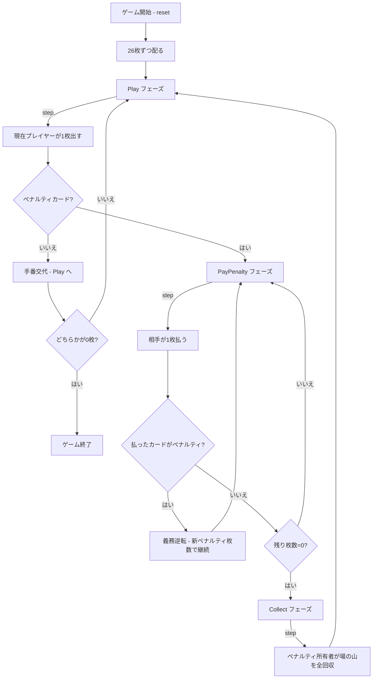

# ビガー・マイ・ネイバー（CUI版）遊び方

## ゲーム概要

プレイヤー1人対CPU 1人で遊ぶ、古典的なイギリスの2人用カードゲーム。52枚のデッキを半分ずつに分け、交互に1枚ずつ場の山に出します。J・Q・K・Aのペナルティカードが出ると相手が枚数分のカードを払わなければなりませんが、支払い中に新たなペナルティカードが出ると義務が逆転します。全52枚を集めた方が勝ちです。

## 起動方法

```sh
go run ./cmd/trumpcards beggarmyneighbour
go run ./cmd/trumpcards --lang en beggarmyneighbour  # 英語モード
```

## ルール

### 基本ルール

- 52枚のトランプ（ジョーカーなし）を使用
- シャッフル後、26枚ずつプレイヤーとCPUの山札として配る
- `step` コマンドで各ターンを進める
- 現在の手番プレイヤーが山札のトップを場の山に表向きに出す
- 数字カード（2〜10）: 手番が相手に移り、通常プレイを続ける
- ペナルティカード: J=1枚、Q=2枚、K=3枚、A=4枚

### ペナルティの連鎖

- ペナルティカードが出ると相手が指定枚数を場の山に支払う
- 支払い中に新たなペナルティカードが出ると、義務が元のプレイヤーに逆転する
- 元のプレイヤーが新しいペナルティ枚数分を支払う
- 支払いが完了（ペナルティカードなしで全枚数払い切り）すると、最後にペナルティカードを出したプレイヤーが場の山を全て回収する

### ゲーム終了

- どちらかのプレイヤーが全52枚を保有したら勝利
- プレイ中に相手のカードが0になったら勝利
- 設定の `MaxRounds`（既定2000）に達した時点で総枚数の多い側を勝者とする

## ゲームの流れ



## コマンド一覧

| コマンド | 短縮形 | 説明 |
|----------|--------|------|
| `reset` | `r` | 新しいゲームを開始 |
| `step`  | `s` | 次のカードを出す / ペナルティを払う / 山を回収する |
| `autoplay` | `a` | 決着まで `step` を自動で繰り返す |
| `sm <n>` | `setmax <n>` | MaxRounds を設定してリセット（10-50000）|
| `log`   | `l` | 棋譜（アクションログ）を表示 |
| `quit`  | `q` | ゲーム終了 |
| `help`  | `?` | コマンド一覧を表示 |

## 画面の見方

```
==========
Beggar-My-Neighbour (ビガー・マイ・ネイバー)
==========
ラウンド: 12 / 2000（上限で引き分け）
CPU: 山札22枚 / 捨札0枚 (計22枚)
----------
[場の山] 場のカード: 5枚
最後に出たカード: [SPADE K]
----------
あなた: 山札25枚 / 捨札0枚 (計25枚)
ペナルティ支払い中！ あと2枚 step で払います。
==========
```

- `ラウンド: N / M`: 消化ラウンド数と上限。**上限に達すると引き分けで打ち切られます。**9 割を超えると強調表示になります
- `山札 N枚 / 捨札 M枚 (計X枚)`: プレイヤーの保有カード内訳
- `[場の山]`: 場の山の総枚数と最後に出たカード
- `優劣`: 手持ち52枚のうち、あなたと CPU がそれぞれ何%を握っているか。`autoplay` で一気に進めた後の形勢を、生の枚数を割らずに読めます（どちらも0枚のときは 50/50）
- `ペナルティ支払い中！`: 支払い義務があり、あと何枚かを表示
- `山を回収`: 支払い完了後、所有者が場の山を回収するフェーズ

## 遊び方のコツ

- 完全な運ゲームなので戦略はありません。ペナルティ連鎖のドキドキを楽しみましょう
- ペナルティが連続すると場の山が膨らみ、獲得したプレイヤーが一気に有利になります
- `log` で過去のターンを振り返ると、ペナルティの連鎖がどれだけ続いたか確認できます
- 長引く場合は `setmax` で上限を下げると決着が早まります
- 1枚ずつ進めるのが面倒な場合は `autoplay` で決着まで一気に進められます
