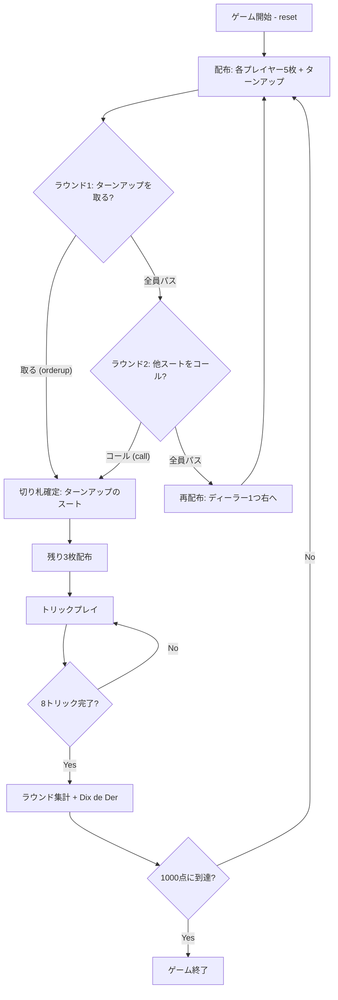

# ベロート（CUI版）遊び方

## ゲーム概要

Belote（ベロート）はフランスの国民的トリックテイキングゲームです。32枚デッキ（7〜A × 4スート）を使って4人2チームで対戦し、切り札のJ（=20点）を最強とする独自の得点体系で先に1000点を取ったチームが勝利します。

## 起動方法

```sh
go run ./cmd/trumpcards belote
go run ./cmd/trumpcards --lang en belote  # 英語モード
```

## ルール

### 基本ルール

- プレイヤーは4人（人間1 + CPU3）。プレイヤー0と2、プレイヤー1と3が同チーム。
- 32枚デッキ（7,8,9,10,J,Q,K,A × 4スート）を使用。
- 各ラウンドは8トリック。
- 切り札を取ったチームを「メイカー」と呼ぶ。

### 配布とビッド

1. 各プレイヤーに5枚配り、その後デッキ先頭を表向きに公開（ターンアップ）。
2. **ラウンド1（ピックアップ）**: ディーラーの左隣から、ターンアップのスートを切り札として取るかパスを選ぶ。
3. 全員パスした場合 **ラウンド2（コール）**: 他の3スートのいずれかを切り札に指名するかパスを選ぶ。
4. 全員パスした場合は再配布（ディーラーは1つ右へ）。
5. 切り札確定後、トランプ取得者にターンアップ + 2枚、他プレイヤーには3枚を追加配布（全員8枚）。

### カードの強さと得点

| カード | 切り札ランク | 切り札得点 | 非切り札ランク | 非切り札得点 |
|-------|------|------|------|------|
| J (Jack) | 8 (最強) | 20 | 4 | 2 |
| 9 | 7 | 14 | 3 | 0 |
| A | 6 | 11 | 8 (最強) | 11 |
| 10 | 5 | 10 | 7 | 10 |
| K | 4 | 4 | 6 | 4 |
| Q | 3 | 3 | 5 | 3 |
| 8 | 2 | 0 | 2 | 0 |
| 7 | 1 | 0 | 1 | 0 |

- 1ラウンドのカード合計は 152点（+ Dix de Der 10点）。

### プレイ（必須ルール）

1. **フォロースート義務**: リードスートを持っていれば必ずそれを出す。
2. **切り札義務 (obligation à couper)**: リードスートを持っていない場合、切り札があれば必ず切り札を出す。
3. **オーバートランプ義務 (obligation à monter)**: 切り札を出す際、既出の切り札より強い切り札があれば必ずそれを出す。
4. **パートナー保護**: パートナーが現在の勝者の場合、切り札義務は免除される。

### 得点

- 各トリックの得点 = カード得点の合計を勝者チームに加算。
- 最終トリックの勝者に **Dix de Der +10点**。
- **Belote/Rebelote**: K+Q of trumps を両方持っているプレイヤーが両方を出すと +20点。
- メイカーが防衛より少ない得点 = **dedans（負け）**: 防衛チームがメイカーのカード得点も総取り。
- 同点（litige）の場合: 防衛チームがメイカーのカード得点を総取り。
- 全8トリック獲得 = **capot +90点**。

### CPU難易度

- `0` Easy: 弱気なビッド + ランダム寄りのプレイ。
- `1` Normal（既定）: 手札スコアに基づくビッド + 標準ヒューリスティック。
- `2` Hard: しきい値が厳しめ + 攻めのオーバートランプ判断。

## ゲームの流れ



## コマンド一覧

| コマンド | 短縮形 | 説明 |
|---------|--------|------|
| `reset` | `r` | 新しいゲームを開始（設定保持） |
| `orderup` | `o` | ターンアップのスートを切り札として取る |
| `pass` | `pa` | パス（PickUp/CallTrump 共通） |
| `call <suit>` | `c <suit>` | スートをコール（1=S, 2=C, 3=H, 4=D） |
| `play <i>` | `p <i>` | インデックス i のカードを出す |
| `next` | `n` | 次のトリックへ |
| `nextround` | `nr` | 次のラウンドへ |
| `setdifficulty <0-2>` | `sd` | CPU難易度を設定 |
| `settarget <n>` | `st` | ターゲットスコアを設定（既定1000） |
| `hint` | `h` | おすすめの一手を表示 |
| `log` | `l` | 棋譜（アクションログ）を表示 |
| `quit` | `q` | ゲーム終了（`bye.`） |
| `help` | `?` | コマンド一覧を表示 |

## 画面の見方

```
==========
Belote (ベロート)
==========
ラウンド: 1  トリック: 1
ディーラー: CPU 3
切り札: SPADE (メイカー: チーム0)
チーム0: 0点  チーム1: 0点
あなた: チーム0 獲得0トリック 8枚
[0]SPADE 11 [1]SPADE 9 [2]HEART 1 ...
CPU 1: チーム1 獲得0トリック 8枚
CPU 2: チーム0 獲得0トリック 8枚
CPU 3: チーム3 獲得0トリック 8枚
----------
手番: あなた
p <i> (play)
```

- **8 トリック目に入ると「最終トリック: … Dix de Der +10 点」の行が出ます。**点数は設定値なので、Dix de Der を 0 にしている場合は出ません。
- 「切り札」行はメイカーチームと切り札スートを表示。
- 「[i]CARD」はあなたの手札と `play <i>` で使うインデックス。
- フェーズ別のプロンプトが画面下部に出る（取る/コール/プレイ/トリック終了/ラウンド終了）。

## 遊び方のコツ

- **取るか取らないかの判断**: ターンアップが切り札になった場合の手札強度を考える。J が含まれる、または 9 + A + 10 のうち2枚以上を持っていれば積極的に取って良い。
- **オーバートランプ義務**: 切り札を出す場面では「より強い切り札を持っているか」を必ず確認。J→9→A→10→K→Q→8→7 の順を意識する。
- **Dix de Der**: 最終トリックの 10点ボーナスは勝負の分かれ目になりやすい。最後に強い切り札を残す配分を考える。
- **Belote/Rebelote**: K+Q of trumps を握っていれば自動的に +20点が宣言される。早めに K と Q を順に出して確実に確保する。
