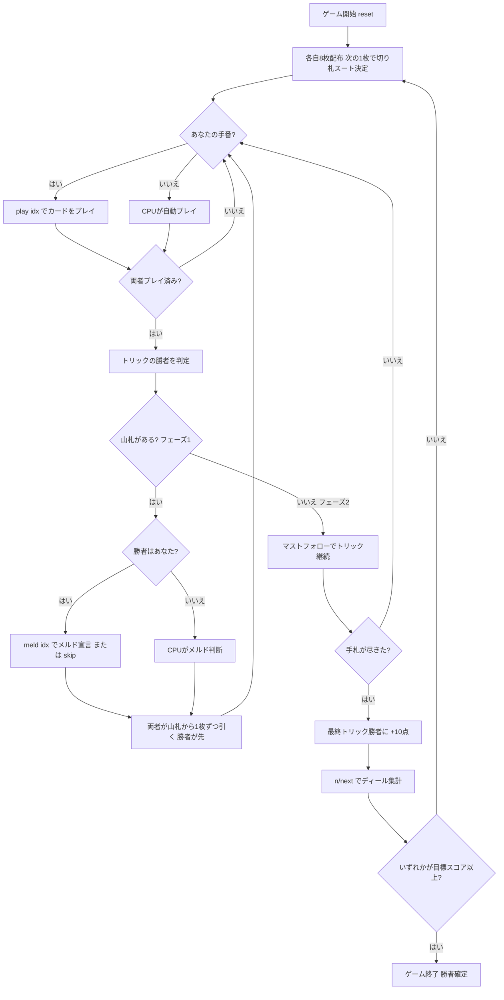

# ベジーク（CUI版）遊び方

## ゲーム概要

Bezique（ベジーク）はピノクルの直接の祖先にあたる2人用のフランス系トリックテイキングゲームです。**64枚のデッキ**（A,7,8,9,10,J,Q,K × 4スート × 2セット）を使い、各自8枚を持って戦います。山札がある間（フェーズ1）はトリックに勝つたびに**メルド（役）**を1つ宣言して得点でき、山札が尽きた後（フェーズ2）はマストフォローのトリック戦になります。スコアはディールをまたいで累積し、先に**目標スコア（既定1000点）**へ達したプレイヤーの勝利です。

## 起動方法

```sh
go run ./cmd/trumpcards bezique
go run ./cmd/trumpcards --lang en bezique  # 英語モード
```

## ルール

### デッキと配布

- **デッキ**: 64枚（A,7,8,9,10,J,Q,K × 4スート × 2セット）
- **プレイヤー**: 2人（あなた vs CPU）
- **配布**: 各プレイヤー8枚。残りは山札となり、次の1枚を表向きにして**切り札スート**を決めます。

### カードの強さ

トリック内での強さ（強い順）。切り札はすべての非切り札を上回ります。

| 強さ順 | カード |
|--------|--------|
| 1位 | A（エース） |
| 2位 | 10（テン） |
| 3位 | K（キング） |
| 4位 | Q（クイーン） |
| 5位 | J（ジャック） |
| 6位 | 9 |
| 7位 | 8 |
| 8位 | 7 |

### フェーズ1（山札がある間）

- **フォロー義務なし**: リードに対して任意のカードを出せます。
- トリックに勝つと、勝者は**メルドを1つ宣言**して得点できます（宣言しないことも選べます）。
- メルド宣言の後、両者が山札から1枚ずつ引きます（勝者が先に引きます）。

#### メルド（役）一覧

| メルド | 構成 | 得点 |
|--------|------|------|
| 結婚（Marriage） | 同じスートの K + Q | 20 |
| ロイヤル結婚（Royal Marriage） | 切り札の K + Q | 40 |
| ベジーク（Bezique） | ♠Q + ♦J | 40 |
| フォア・エース | A 4枚 | 100 |
| フォア・キング | K 4枚 | 80 |
| フォア・クイーン | Q 4枚 | 60 |
| フォア・ジャック | J 4枚 | 40 |

### フェーズ2（山札が尽きた後）

- **マストフォロー**: リードされたスートを持っていれば必ず出し、さらに勝てるなら勝たなければなりません。リードスートを持たない場合は切り札を出します。
- このフェーズでは**メルドは宣言できません**。
- **最終トリック**を取ったプレイヤーに **+10点** が加算されます。

### カードポイント（捕獲点）

トリックで取ったカードは以下の点になります。

| カード | 点 |
|--------|----|
| A | 11 |
| 10 | 10 |
| K | 4 |
| Q | 3 |
| J | 2 |
| 9 / 8 / 7 | 0 |

### 得点計算と勝利条件

- メルド得点・カードポイント・最終トリック+10点が累積します。
- スコアはディールをまたいで累積し、先に**目標スコア（既定1000点。古典では1500点）**へ達したプレイヤーが勝利します。

### CPU難易度

- **Easy（0）**: ランダムな合法手。
- **Normal（1）**: 基本戦略。
- **Hard（2）**: 高度なヒューリスティック。

## ゲームの流れ



## コマンド一覧

| コマンド | 短縮形 | 説明 |
|----------|--------|------|
| `play <idx>` | `p` | 手札のidx番目のカードを出す（プレイフェーズ） |
| `meld <idx>` | `m` | リスト番号idxのメルドを宣言する（メルドフェーズ、トリックの勝者のみ） |
| `skip` | `s` | メルドを宣言しない |
| `next` | `n` / `nextround` | 次のトリック／次のディールへ進む |
| `setdifficulty <0-2>` | `sd` | CPU難易度設定（0=Easy, 1=Normal, 2=Hard） |
| `settarget <n>` | `st` | 目標スコア設定 |
| `hint` | `h` | ヒント表示 |
| `log` | `l` | アクションログを表示 |
| `reset` | `r` | 新しいゲームを開始（設定保持） |
| `quit` | `q` | ゲーム終了 |
| `help` | `?` | コマンド一覧を表示 |

## 画面の見方

```
==========
Bezique (ベジーク)
==========
ディール: 1
スコア: あなた=0  CPU=0
切り札: ♥  山札: 47枚
----------
フェーズ: PLAY
あなたの手番です。カードを出してください。
[0]A♠ [1]10♥ [2]K♥ [3]Q♥ [4]Q♠ [5]J♦ [6]9♣ [7]7♠
play <idx>

==========
ディール: 1
スコア: あなた=40  CPU=0
切り札: ♥  山札: 45枚
----------
フェーズ: MELD
あなたがトリックに勝ちました。メルドを宣言できます。
[0] ロイヤル結婚 (K♥+Q♥) = 40
[1] ベジーク (♠Q+♦J) = 40
meld <idx>  または  skip
```

- **フェーズ: PLAY**: トリックフェーズ。フェーズ1はフォロー義務なし、フェーズ2はマストフォロー。
- **フェーズ: MELD**: メルド宣言フェーズ（トリックの勝者のみ、フェーズ1限定）。
- **切り札行**: 表向きカードで決まった切り札スートと、山札の残り枚数を表示。
- **スコア行**: 両プレイヤーの累積スコア。
- **`[n]`付き行**: あなたの手札、または宣言可能なメルド（インデックス付き）。

## 遊び方のコツ

- **ベジークと役を狙う**: ♠Q と ♦J を揃えるベジーク（40点）、A4枚（100点）など高得点メルドはゲームを大きく動かします。トリックに勝った後の宣言を意識して手札を温存しましょう。
- **切り札の温存**: 序盤は切り札を温存し、相手が出した得点の高いカード（A や 10）を切り札で奪う展開を狙いましょう。
- **メルド材料を捨てない**: フェーズ1ではフォロー義務がないため、K・Q・A・♠Q・♦J などメルドに使えるカードは安易に捨てないようにします。
- **フェーズ2の最終トリック**: 山札が尽きた後はマストフォロー。最終トリックの +10点は接戦で効くので、終盤の切り札管理が重要です。
- **目標スコアを意識**: 既定の目標は1000点。高得点メルドを1回決めるだけで大きく前進できるため、役の完成を最優先に組み立てましょう。
