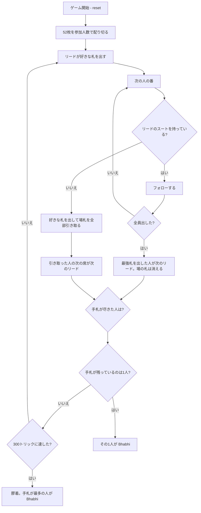

# バービー（CUI版）遊び方

## ゲーム概要

インド・パキスタンの家庭で遊ばれる**回避型**カードゲーム。52枚を3〜7人で配り切り、リードのスートに**フォローできなかった人が場に出ている札を全部手札に引き取ります**。手札を出し切った人から抜けていき、**最後に手札が残った1人が Bhabhi（敗者）**。勝者を決めるのではなく敗者を決めるゲームです。

## 起動方法

```sh
go run ./cmd/trumpcards bhabhi
go run ./cmd/trumpcards --lang en bhabhi  # 英語モード
```

## ルール

### 配り

52枚を参加人数で配り切ります。**山札は残りません。** 52は3・5・6・7人では割り切れないので、手札枚数は最大1枚差になります。

### フォローと引き取り

1. 最初の人が好きな札をリードする
2. 以降の人は**リードのスートを持っていればそれを出さなければならない**
3. 持っていなければ**何を出してもよく、そのかわり場の札を全部（自分がいま出した1枚も含めて）手札に引き取る**
4. 全員がフォローできたら、**その札は場から消えます**（引き取りではありません）。いちばん強い札を出した人が次のリード

**切り札はありません。** 別スートの A を出してもトリックは取れません。強さは A > K > Q > J > 10 > … > 2 です。

### 引き取った人は次のリードを取らない

**引き取った人ではなく、その次の席がリードします。** 引き取った人にリードさせると、あるスートが場に1枚しか残っていないときにその札が2人のあいだを往復し続け、ゲームが終わらなくなるためです。

### 勝敗

手札を出し切った人から抜けます。**最後に1人だけ手札が残ったら、その人が Bhabhi（敗者）。** 何番目に抜けたかに優劣はありません——残らなければ全員同じです。

### 膠着（引き分けの打ち切り）

**このゲームは必ず終わるとは限りません。** 場から札が消えるのは全員がフォローできたトリックだけなので、札が4つのスートに散って常に誰かがフォローできない配置になると、引き取りだけが延々と続きます。そのため**300トリックに達したら打ち切り、手札がいちばん多い人を Bhabhi とします**（CPU同士で各人数400局を回した実測では、決着する局のトリック数は中央値22〜41・最大86でした）。

## ゲームの流れ



## コマンド一覧

| コマンド | 短縮形 | 説明 |
|----------|--------|------|
| `play <idx>` | `p` | 手札の `<idx>` 番目のカードを出す |
| `hint` | `h` | 打つべき札を提示する |
| `giveup` | `g` | 投了する（投了した人が Bhabhi） |
| `log` | `l` | 棋譜（アクションログ）を表示する |
| `reset` | `r` | 最初からやり直す |
| `quit` | `q` | 終了する |
| `help` | `?` | コマンド一覧を表示 |

**次のハンドへ進むコマンドはありません。** 配り切りの1ゲームで最後の1人が決まるまで続きます。

## 画面の見方

```
==========
Bhabhi (バービー)
==========
トリック: 6  参加: 4人  残り: 3人
目的は勝つことではなく Bhabhi にならないこと。フォローできないと場札を全部引き取ります。手札を出し切った人から抜け、最後に残った1人が Bhabhi（敗者）です。
リード: ハート（場に 2 枚。フォローできないと全部引き取ります）
 あなた: 手札7枚  引き取り1回
  [0]♠2 [1]♠7 [2]♠K [3]♣4 [4]♥A [5]♥K [6]♦10
 CPU1: 3番目に上がり  引き取り0回
>CPU2: 手札5枚  引き取り2回
 CPU3: 手札9枚  引き取り3回
----------
場: CPU1:♥5  CPU2:♥9
直前に CPU3 が 4 枚引き取りました。
手番: CPU2
play <idx>・・・カードを出す
```

- **リード行**: 場に何枚積まれているか。**フォローできないとこれを全部引き取ります**
- **`>`**: 現在の手番
- **`n番目に上がり`**: 手札を出し切って抜けた人。**順位に優劣はありません**
- **`引き取りn回`**: フォローできなかった回数。多いほど苦しい展開
- **`[n]`**: `play <n>` で指定する手札の番号

## 遊び方のコツ

- **短いスートを早めに使い切る。** 1枚しかないスートを抱えていると、そこをリードされたときに引き取ります
- **リードは枚数の多いスートから。** 全員がフォローできれば札が場から消え、手札が減ります
- **フォローできないと分かったら高い札を落とす。** どのみち場札は引き取るので、抱えたくない A や K をそこで処分するのが得です
- **場が厚いときは慎重に。** 3人が出したあとの4枚目でフォローできないと、一気に4枚増えます
- **他人の引き取り回数を見る。** 引き取りが多い人はスートが偏っているので、その人が弱いスートをリードすると押し付けられます
- **抜けるのに早いも遅いも無い。** 残らなければ全員同じなので、無理に飛ばさず確実に減らしましょう
