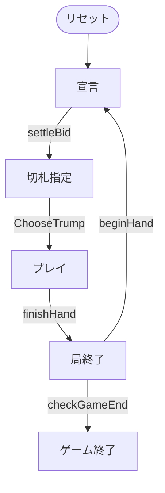
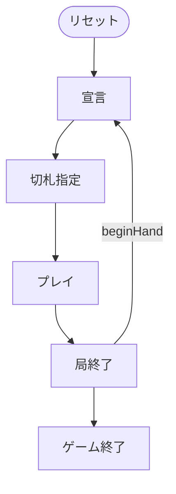

# ビッド・ユーカー（CUI版）遊び方

## ゲーム概要

ユーカーを 24 枚・4 人 2 対 2 に仕立てた競り付きのトリックテイキング。各スート **A K Q J 10 9** の 24 枚を、**4 人にちょうど 6 枚ずつ配り切ります**。

出典: [pagat.com: Bid Euchre](https://www.pagat.com/euchre/bideuch.html) ／ [Wikipedia: Bid Euchre](https://en.wikipedia.org/wiki/Bid_euchre)

## 起動方法

```sh
go run ./cmd/trumpcards bideuchre
go run ./cmd/trumpcards --lang en bideuchre   # 英語表示
```

## ルール

### 配り切り（**キティはありません**）

24 ÷ 4 = 6 で余りが出ません。したがって**キティも表向きカードも無く**、切札は競りに勝った人が口頭で指定します。ここが普通のユーカー（24 枚から 20 枚を配り、残り 4 枚がキティ）との最大の違いです。

### 競り

- **最低宣言は 3 トリック**、最高は 6 トリック（全トリック）
- 通常は**直前の宣言を上回らないと**宣言できません
- ただし **親（ディーラー）だけは同額でも奪えます**

親が最後に「同額で奪う」権利を持つので、親の直前に高く宣言しても安全とは限りません。

### 切札の指定（**ノートランプが 2 種類あります**）

落札者が次の 6 つから 1 つを選びます。

| 番号 | 宣言 | 序列 |
|---|---|---|
| 0 | ♠ | 切札あり |
| 1 | ♣ | 切札あり |
| 2 | ♦ | 切札あり |
| 3 | ♥ | 切札あり |
| 4 | NT ハイ | 切札なし、**A が最強** |
| 5 | NT ロー | 切札なし、**序列が逆転し 9 が最強** |

**NT ローでは A K Q J 10 9 の強弱がそっくり逆になります。**9 > 10 > J > Q > K > A です。

### ボワー（切札スート宣言のときだけ）

| 呼び名 | 札 | 強さ |
|---|---|---|
| ライト・ボワー | 切札スートの J | **最強** |
| レフト・ボワー | **同色**のもう一方の J | 2 番目 |

**レフト・ボワーは、追随の判定を含めてすべての場面で切札スートの札として扱います。**例えば切札が ♠ のとき、♣ の J は「♠ の札」です。♣ がリードされても追随には使えず、逆に ♠ がリードされたら出さなければなりません。

ノートランプ宣言ではボワーはありません。J はただの J です。

### 得点（**未達で失うのは宣言額**）

- **達成した場合**: 両チームが、**それぞれ取ったトリック数**を得点します
- **未達の場合**: 宣言側は **宣言額ぶん**を失います。**取ったトリック数ではありません**（5 宣言で 2 トリックなら −5 であって −2 ではない）
- **未達でも守備側は、自分が取ったトリック数を得点します**

### ゲームの終わり

**先に 32 点**に達したチームの勝ちです。同時に超えた場合は落札側の勝ちとします。



## ゲームの流れ

ゲームの進行は `internal/domain/BidEuchre.go` のフェーズ機械そのものです。各ノードは同ファイルの `BidEuchrePhase` 定数、矢印ラベルはその遷移を行うメソッド名です。



## コマンド一覧

| コマンド | 短縮形 | 説明 |
|----------|--------|------|
| `bid <3-6>` | `b` | 宣言する（**最低 3。親だけは同額でも奪えます**） |
| `pass` | `ps` | 宣言を見送る |
| `trump <0-5>` | `t` | 切札を指定する（**0=♠ 1=♣ 2=♦ 3=♥ 4=NT ハイ 5=NT ロー**） |
| `play <i>` | `p` | 手札 `i` を出す |
| `next` | `n` | 次の局へ進む |
| `log` | `l` | 棋譜を表示する |
| `reset` | `r` | ゲームごとリセットする |
| `quit` | `q` | 終了する |
| `help` | `?` | コマンド一覧を表示 |

## 画面の見方

```
局: 1  勝利点: 32点
チーム0: 0点 / チーム1: 0点
契約: 4トリック  切札: ♠
あなた(T0)[親]: トリック 2  手札: [0]♠1 [1]♠13 ...
CPU 1(T1)[宣言]: トリック 1  手札: 非公開 4枚
場: ♠1
----------
手番: あなた
出せる札: 0 1
p <i> ・・・手札 i を出す（追随は強制。左ボワーは切札スートの札として扱います）
```

- **`(T0)` `(T1)`** がチームです。**席 0 と 2、席 1 と 3 が味方**です
- **誰の手札も見えません。**キティが無いので、伏せられているのは他家の手札だけです
- **`出せる札`** を必ず確認してください。レフト・ボワーが切札扱いになるため、見た目のスートでは判断できません

## 遊び方のコツ

- **手札は 6 枚しかありません。**3 宣言は「半分取る」で、見た目より重い約束です
- **切札スート宣言ではボワー 2 枚が最上位に来ます。**つまり自分の切札スートは実質 7 枚、隣の同色スートは 5 枚です
- **親の同額奪取を勘定に入れてください。**親より前の席から高い宣言を出しても、同額で持っていかれます
- **NT ローは弱い手の逃げ道です。**9 と 10 ばかりでも最強札の束になります
- **未達は宣言額ぶん引かれます。**取れる見込みが薄いなら、無理に競り上げるより降りるほうが安いことが多いです
- **守備でもトリックは価値があります。**潰せなくても取った数がそのまま点になります
