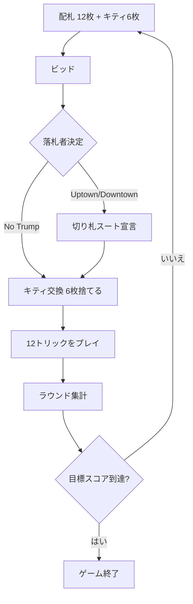

# ビッド・ホイスト（CUI版）遊び方

## ゲーム概要

Bid Whist（ビッド・ホイスト）は、アメリカで絶大な人気を誇る4人2チーム制のトリックテイキングゲームです。2枚のジョーカーを加えた54枚デッキを使い、オークション（ビッド）で「獲得目標トリック数」と「カードの強さの向き（Uptown=A最強 / Downtown=2最強 / No Trump）」を競います。落札者は切り札スートを宣言し、伏せられた6枚のキティと手札を交換します。先に既定のスコア（標準7点）に到達したチームの勝ちです。

## 起動方法

```sh
go run ./cmd/trumpcards bidwhist
go run ./cmd/trumpcards --lang en bidwhist   # 英語表示
```

インタラクティブモードからは `switch bidwhist` で切り替えられます。

## ルール

- **デッキ**: 54枚（標準52枚＋ジョーカー2枚）。ビッグジョーカー＞リトルジョーカーの順で最強の切り札になります。
- **配札**: 各12枚＋キティ6枚。
- **ビッド**: 目標トリック数1〜7 ×（Uptown / Downtown / No Trump）またはパス。1巡し、最高ビッダーが落札します。全員パスなら配り直し。
- **切り札宣言**: 落札者（Uptown/Downtownのみ）が切り札スートを宣言します。No Trumpでは切り札なし・ジョーカーは死札になります。
- **キティ交換**: 落札者がキティ6枚を加えて、不要な6枚を捨てます。
- **強さの向き**: Uptownは A＞K＞…＞2、Downtownは 2＞3＞…＞K＞A（逆順）。
- **得点**: ブック（6トリック）を超えた分を集計します。落札チームが「6＋ビッド」以上取れば獲得トリック−6点、未達ならビッド数のセット（減点）。守備チームは6を超えたトリック分を加点。先に目標スコアで勝利。

## ゲームの流れ



## コマンド一覧

| コマンド | 説明 |
|----------|------|
| `b <tricks> <dir>` | ビッド（tricks 1-7, dir 0=Uptown 1=Downtown 2=NoTrump） |
| `pa` | パス |
| `t <suit>` | 切り札スート宣言（1=♠ 2=♣ 3=♥ 4=♦） |
| `e <i1> <i2> <i3> <i4> <i5> <i6>` | キティ交換（捨てるカード6枚のインデックス） |
| `p <i>` | カードをプレイ |
| `n` | 次のトリックへ |
| `nr` | 次のラウンドへ |
| `sd <0-2>` | CPU難易度（0=Easy, 1=Normal, 2=Hard） |
| `st <n>` | 勝利スコア設定 |
| `h` | ヒント表示 |
| `l` / `log` | 棋譜表示 |
| `r` | リセット |
| `q` | 終了 |

## 画面の見方

- 先頭行にラウンド・トリック番号、続いてディーラー・契約・チームスコアを表示します。
- 各プレイヤーの行にチーム・獲得トリック数・手札枚数・ビッド状況（★落札者／パス）が出ます。
- 自分の手札はインデックス付きで表示され、`p <i>` の `<i>` に対応します。
- 区切り線の下に現在のトリックと、フェーズごとの操作案内を表示します。

## 遊び方のコツ

- 1つのスートが長く揃っているときは、そのスートを切り札にしたUptown/Downtownのビッドが有利です。
- 2枚のジョーカーは切り札契約で最強です。勝負所まで温存しましょう。
- 低い札（2,3,4）が多いときはDowntownが有効です。手札の向きを見極めてビッドしましょう。
- No Trumpではジョーカーが使えません。エース中心の高い札が揃っているときに選びます。
- 守備側はブック（6）を超えるトリックを取ると加点できます。確実に取れる札を活かしましょう。
