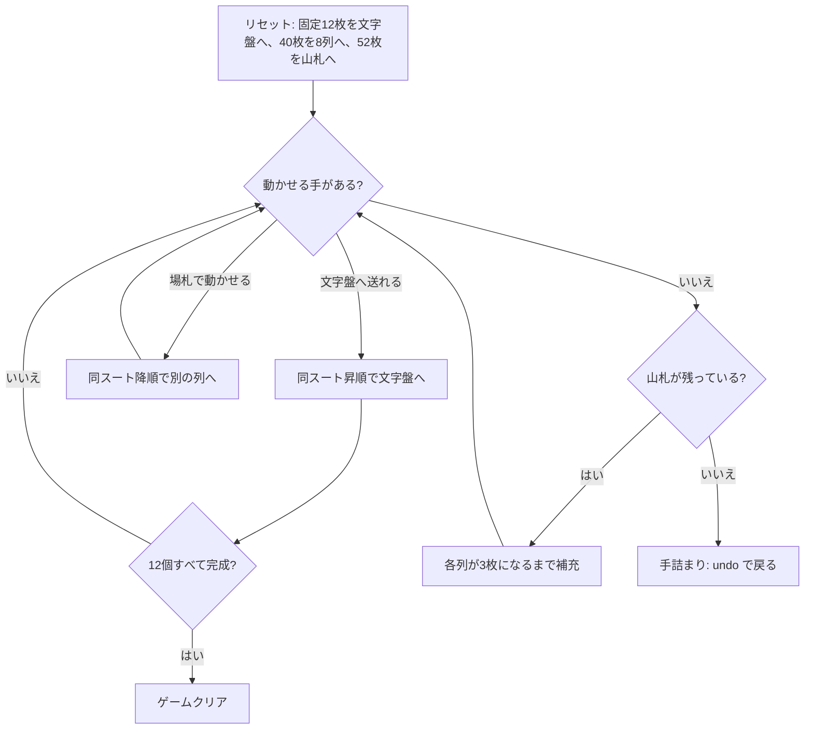

# ビッグ・ベン（CUI版）遊び方

## ゲーム概要

12 個の基礎札を時計の文字盤に見立てた 2 デッキのソリティア。**9 時の ♣2 から時計回り**に 1 ランクずつ上がってスートは ♣♥♠♦ を繰り返し、8 時の ♦K で一周する。各文字盤は「**その位置の時刻**」のランクで完成 — 9 時の文字盤は 9、12 時の文字盤は Q で止まる。

**枚数がちょうど閉じているのがこのゲームの美点。** 9〜12 時の 4 本が 8 枚、残り 8 本が 9 枚で 4×8 + 8×9 = 104。だから「全札が文字盤へ乗る」と「各文字盤が自分の時刻を表示する」は同じことを言っている。

## 起動方法

```sh
go run ./cmd/trumpcards bigben
go run ./cmd/trumpcards --lang en bigben   # 英語
```

## ルール

- 52 枚 2 組（104 枚）。固定の 12 枚を文字盤に置き、続く 40 枚を 8 列×5 枚のタブローへ、**残り 52 枚が山札**になる
- 文字盤は**同じスートで昇順**に積む。**K の次は A に折り返す**（1〜8 時の文字盤は折り返さないと目標に届かない）
- 各文字盤の目標ランクは**その時刻**: 添字 0 が 9 時→9、添字 3 が 12 時→Q、添字 4 が 1 時→A、添字 11 が 8 時→8
- **目標ランクに達した文字盤は完成**で、それ以上カードを受け付けない
- タブローは**同じスートで降順**に 1 枚ずつ重ねる。**空いた列は二度と埋められない**
- 手が尽きたら `d` で補充する。**各列が 3 枚になるまで**配り、すでに全列が 3 枚以上なら 1 巡だけ配る。**再配りは無い**
- 12 個すべての文字盤が目標ランクに達すればクリア。山札も尽きて動かせる札が無くなれば手詰まり

> 補足: 出典が割れる。Wikipedia は「12 山×3 枚 + 捨て札」と書くが、それだと「各山 3 枚になるまで補充」という規則が空振りになる。PySolFC の「8 山×5 枚・捨て札なし」を採用した（文字盤 12 + 40 = 52 が配られ、山札 52 で 104 に閉じる）。

## ゲームの流れ



## コマンド一覧

| コマンド | 短縮形 | 説明 |
|----------|--------|------|
| `deal` | `d` | 山札から補充する（各列 3 枚まで。全列 3 枚以上なら 1 巡） |
| `move <col> f <idx>` | `m` | 列 `<col>` の最上段を文字盤 `<idx>` (0..11) に置く |
| `move <fromCol> <toCol>` | `m` | 列 `<fromCol>` の最上段を列 `<toCol>` に重ねる |
| `hint` | `h` | ヒントを表示する |
| `autocomplete` | `ac` | 文字盤へ送れる札がなくなるまで自動で送る |
| `undo` | `u` | 1 手戻す |
| `giveup` | `g` | ギブアップ |
| `log` | `l` | 棋譜（アクションログ）を表示する |
| `reset` | `r` | 最初からやり直す |
| `quit` | `q` | 終了する |
| `help` | `?` | コマンド一覧を表示 |

**文字盤の番号は省略できない。** 12 個の文字盤には同じスートのものが複数あるため、送り先をカードのスートから決められない（他のソリティアと違う点）。

## 画面の見方

```
文字盤 (0=9時 … 11=8時):
[0] CLOVER 2 →9
[1] HEART 3 →10
...
[4] CLOVER 6 →1
[11] DIAMOND 13 →8 ✔完成
山札: 37枚
----------
列0: [0]SPADE 7 [1]DIAMOND 2 [2]CLOVER 9 [3]HEART 4 [4]SPADE 6
...
列7: [0]CLOVER 4 [1]DIAMOND 9 [2]SPADE 12 [3]HEART 2 [4]DIAMOND 5
----------
手数: 12
```

- `[n]` が文字盤の番号で、`m <col> f <n>` の `<n>` に対応する
- `→数字` がその文字盤の目標ランク。到達すると `✔完成` が付く
- 各列の `[n]` は列内のインデックス。動かせるのは常に一番右の 1 枚
- 手詰まりになると、脱出に必要なアンドゥ回数が表示される

## 遊び方のコツ

- **1〜8 時の文字盤は K→A の折り返しを通る。** A や 2 を安易に他へ使わず、折り返し先として残す
- **空けた列は戻らない。** このゲームの空き列は足場ではなく損失なので、狙って作るものではない
- **補充は各列 3 枚まで。** 浅い列があるほど 1 回の補充で多く引ける。手が尽きる前に浅い列を作っておくと、補充が厚くなる
- 文字盤は 12 個あるので、同じランクのカードでも行き先が複数ありうる。どの文字盤に送るかで後半の詰まり方が変わる
- `hint` は文字盤への手を優先して 1 つ返すだけで最善手ではない。詰まったら `undo` で分岐をやり直す
