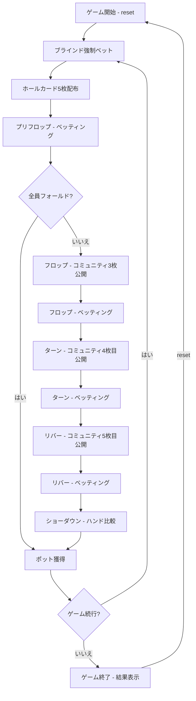

# 5カードオマハ (Big O)（CUI版）遊び方

## ゲーム概要

5カードオマハ（通称 Big O）です。オマハホールデムの派生ゲームで、各プレイヤーに**5枚**のホールカードが配られます（通常のオマハは4枚）。手札が1枚増えることでコンビネーションが C(4,2)=6 通りから C(5,2)=10 通りに増え、より強力なナッツが出やすく、ボラティリティの高いエキサイティングなゲームになります。テーブルサイズは4-max（デフォルト、1人+CPU 3人）、6-max（1人+CPU 5人）、9-max（1人+CPU 8人）から選択できます。各CPUは異なるプレイスタイル（TAG/LAP/TAP/LAG/GTO）を持ち、ブラフを含む戦略的なプレイをします。サイドポットにも対応しています。

HUD統計（VPIP%/PFR%/3Bet%/AF）が全プレイヤーに表示され、トーナメントモードではブラインドが自動上昇します。リバイとアドオンにも対応しています。

## 起動方法

```sh
go run ./cmd/trumpcards bigo
go run ./cmd/trumpcards --lang en bigo  # 英語モード
```

## ルール

### 基本ルール

- 52枚のトランプを使用
- 各プレイヤーに**5枚**のホールカード（手札）が配られる
- 場にコミュニティカード（共有カード）が最大5枚公開される
- **ホールカードから必ず2枚**、**コミュニティカードから必ず3枚**を使って5枚の役を作る（オマハと同じルール）
- 最も強い役を持つプレイヤーがポットを獲得する

### ゲームの進行

1. **ブラインド**: ディーラーの左隣がスモールブラインド（デフォルト5）、その左隣がビッグブラインド（デフォルト10）を強制ベット
2. **プリフロップ**: ホールカード5枚配布後、最初のベッティングラウンド
3. **フロップ**: コミュニティカード3枚公開後、ベッティングラウンド
4. **ターン**: コミュニティカード4枚目公開後、ベッティングラウンド
5. **リバー**: コミュニティカード5枚目公開後、最後のベッティングラウンド
6. **ショーダウン**: 残ったプレイヤーのハンドを比較

### ベッティングリミット

- **Fixed Limit** (0): レイズ額が固定
- **Pot Limit** (1): ポット額までレイズ可能（デフォルト）
- **No Limit** (2): 全チップまでレイズ可能

### ゲーム終了

- チップが0になったプレイヤーは脱落（トーナメントモードではリバイ可能）
- 最後の1人になったらゲーム終了

## ゲームの流れ



## コマンド一覧

| コマンド | 短縮形 | 説明 |
|----------|--------|------|
| `reset` | `r` | ゲームリセット（設定保持） |
| `fold` | `f` | フォールド |
| `check` | `ck` | チェック |
| `call` | `c` | コール |
| `bet <額>` | `b <額>` | ベット |
| `raise <額>` | `ra <額>` | レイズ |
| `allin` | `a` | オールイン |
| `muck` | `m` | マック（手札を伏せる） |
| `show` | `sh` | ショー（手札を公開する） |
| `rebuy` | `rb` | リバイ |
| `skiprebuy` | `sr` | リバイスキップ |
| `addon` | `ad` | アドオン |
| `skipaddon` | `sa` | アドオンスキップ |
| `bettinglimit <0-2>` | `bl <0-2>` | ベッティングリミット (0=Fixed, 1=PotLimit, 2=NoLimit) |
| `tournament <0-1>` | `tm <0-1>` | トーナメントモード切替 |
| `smallblind <額>` | `sb <額>` | スモールブラインド設定 |
| `bigblind <額>` | `bb <額>` | ビッグブラインド設定 |
| `levelhand <数>` | `lh <数>` | ブラインドレベルアップハンド数 |
| `tablesize <4\|6\|9>` | `ts <4\|6\|9>` | テーブルサイズ変更 |
| `metaai <0\|1>` | `mai <0\|1>` | メタAI切替 (CPUがプレイスタイルを学習) |
| `log` | `l` | 棋譜表示 |
| `quit` | `q` | ゲーム終了 |
| `help` | `?` | ヘルプ表示 |

### コマンド例

- `c` → コール
- `ra 100` → 100にレイズ
- `b 50` → 50をベット
- `a` → オールイン
- `ts 6` → テーブルサイズを6-maxに変更
- `bl 2` → ノーリミットに変更

## 画面の見方

```
==========
5 Card Omaha (Big O) (5カードオマハ)
==========
ハンド #5 | Pot Limit | ポット: 120
SB: 5 / BB: 10
----------
コミュニティ: [♠A] [♥K] [♣9] [??] [??]
フェーズ: フロップ
----------
[You] (1500チップ) [D]
  [♠Q] [♥J] [♣10] [♦8] [♣2]
  HUD: VPIP 45% / PFR 20% / 3Bet 8% / AF 1.5
CPU 1 (980チップ) [SB]
  HUD: VPIP 62% / PFR 15% / 3Bet 5% / AF 0.8
CPU 2 (1200チップ) [BB]
  HUD: VPIP 28% / PFR 22% / 3Bet 12% / AF 2.1
CPU 3 (820チップ)
  HUD: VPIP 55% / PFR 10% / 3Bet 3% / AF 0.6
----------
アクション: f/ck/c/b <額>/ra <額>/a
==========
```

- `ハンド #N`: 現在のハンド番号
- `Pot Limit`: ベッティングリミット
- `ポット: N`: 現在のポット額
- `SB/BB`: ブラインド額
- `コミュニティ`: 公開されたコミュニティカード
- `[D]/[SB]/[BB]`: ディーラー/スモールブラインド/ビッグブラインド位置
- `HUD`: 各プレイヤーの統計情報

## 遊び方のコツ

- オマハと同じく、**必ずホールカード2枚を使う**ルールに注意しましょう（手札5枚すべては使えません）
- 手札が5枚あるためダブルスーテッドやラップ（連続した数字の塊）が作りやすく、ナッツ同士のぶつかり合いが激しくなります
- ナッツが出やすい分、相手も強いハンドを持っている可能性が高い点に注意しましょう
- ナッツ（最強ハンド）を狙える状況でのみ大きくベットするのが安全です
- ポットリミットのため、テキサスホールデムよりもポットコントロールが重要です
