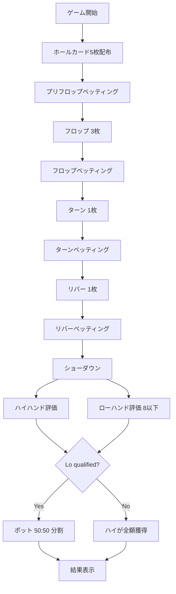

# 5カードオマハ ハイロー (Big O)（CUI版）遊び方

## ゲーム概要

5カードオマハ ハイロー（Big O Hi-Lo / 8 or Better）は、5カードオマハ（Big O）のバリアントで、ショーダウン時にハイハンドとローハンドでポットを分割するスプリットポットゲームです。基本進行（**5枚**のホールカード、フロップ／ターン／リバー、必ずホール2枚＋コミュニティ3枚で5枚を作る）は Big O と同一ですが、加えて 8 以下の数字のみで構成された有効なローハンド（A-2-3-4-5 の「ホイール」が最強）が成立した場合、ポットの半分がローの勝者へ渡ります。

ハイ／ロー双方を同一プレイヤーが取った場合は "scoop" となり、ポット全額を獲得します。qualified なローが存在しない場合はハイ側がポット全額を獲得します。手札が5枚あるため、ハイ・ローともに組み合わせが多く、scoop も発生しやすい高ボラティリティなゲームです。

テーブルサイズ・CPUのプレイスタイル・トーナメント／リバイ／アドオン／メタAIなどの設定は Big O と共通です。

## 起動方法

```sh
go run ./cmd/trumpcards bigohilo
go run ./cmd/trumpcards --lang en bigohilo  # 英語モード
```

## ルール

### 基本ルール

- 52枚のトランプを使用
- 各プレイヤーに**5枚**のホールカードを配布
- フロップ（3枚）、ターン（1枚）、リバー（1枚）の合計5枚のコミュニティカードを共有
- **ハイハンド**：ホールカードから必ず2枚、コミュニティカードから必ず3枚で5枚を作り、最強の役を競う（通常の Big O と同じ）
- **ローハンド**：ホールカードから必ず2枚、コミュニティカードから必ず3枚で5枚を作り、すべて 8 以下（A=1）かつランクの重複が無い場合のみ qualified。最も "高いカード" が低い手が勝つ（A-5 ローボール、ストレート・フラッシュは無視）
- ホールから 2 枚／コミュニティから 3 枚という制約は、ハイとローで **別々の組み合わせ** を選んで構わない
- 各サイドポットを ハイ：ロー = 50：50 で分配（奇数チップは Hi 側に寄る）。qualified なローが居なければハイが全額獲得

### ローの強さ

最強のロー: A-2-3-4-5（"ホイール"）
最弱の qualified ロー: 8-7-6-5-4

ハイ側の判定（ロイヤルストレートフラッシュ〜ハイカード）と役名は通常のオマハと同一。

### スプリットポット例

ポット 100 / プレイヤー A がハイ最強・プレイヤー B が qualified ロー最強：
- A: 50 (Hi)
- B: 50 (Lo)

ポット 101 / 同上（奇数チップは Hi 側）：
- A: 51 (Hi)
- B: 50 (Lo)

ポット 100 / プレイヤー A がハイもローも最強（"scoop"）：
- A: 100

ポット 100 / qualified なローが居ない：
- ハイ勝者が 100

## ゲームの流れ



## コマンド一覧

| コマンド | 別名 | 説明 |
|---------|------|------|
| `f` | `fold` | フォールド |
| `ck` | `check` | チェック |
| `c` | `call` | コール |
| `b <amount>` | `bet <amount>` | ベット |
| `ra <amount>` | `raise <amount>` | レイズ |
| `a` | `allin` | オールイン |
| `m` | `muck` | マック（負け時に手札を伏せる） |
| `sh` | `show` | ショー（手札を公開） |
| `rb` | `rebuy` | リバイ |
| `sr` | `skiprebuy` | リバイ拒否 |
| `ad` | `addon` | アドオン |
| `sa` | `skipaddon` | アドオン拒否 |
| `bl <0-2>` | `bettinglimit` | リミット切替（0=Fixed/1=PotLimit/2=NoLimit） |
| `tm <0-1>` | `tournament` | トーナメントモード |
| `sb <amount>` | `smallblind` | スモールブラインド |
| `bb <amount>` | `bigblind` | ビッグブラインド |
| `ts <4\|6\|9>` | `tablesize` | テーブルサイズ |
| `r` | `reset` | ゲーム初期化 |
| `q` | `quit` / `exit` | 終了 |

## 画面の見方

```
==========
5 Card Omaha Hi-Lo (Big O) (8 or Better)
==========
テーブル: 4-max
ディーラー: Player 0
コミュニティ: 🂡 🂢 🂣 🂤 🂥
ポット: 200
リミット: No Limit
----------
Player 0 (You) [TAG] チップ:990 VPIP:50% PFR:25% 3Bet:0% AF:1.5
  手札: 🂡 🂢 🃓 🃎 🃔
Player 1 (CPU) [LAP] チップ:980 ベット:10
...
==========
[結果]
  Player 0 (You): Two Pair / Low: 🂡 🂢 🂣 🂤 🂥 → 100チップ獲得 (Hi:50 / Lo:50)
  Player 1 (CPU): One Pair → 0チップ獲得
```

`Low: ...` 表示は qualified なローが成立した場合のみ。獲得チップの内訳 `(Hi:50 / Lo:50)` でハイ／ロー両取り（scoop）か片方のみかが分かります。

## 遊び方のコツ

- **A-2 を含むホールカードは強力**：ホイール（A-2-3-4-5）の半分がすでに揃っている。ロー狙いの基本ハンド
- 手札が5枚あるため、ハイ・ローを両狙いできる組み合わせが作りやすく、scoop の機会が増えます
- **コミュニティに 8 以下が 3 枚出ない局面ではローは無効**：ハイ専用の局面と判断したら通常の Big O 戦略で OK
- **ペアボードはローの脅威が薄れる**：8 以下が出ていてもペアになっているとローは作りづらい
- **scoop を狙えるハンドにはより強くベット**：相手がハイかローのどちらかしか持っていない時、scoop の期待値が大きい
