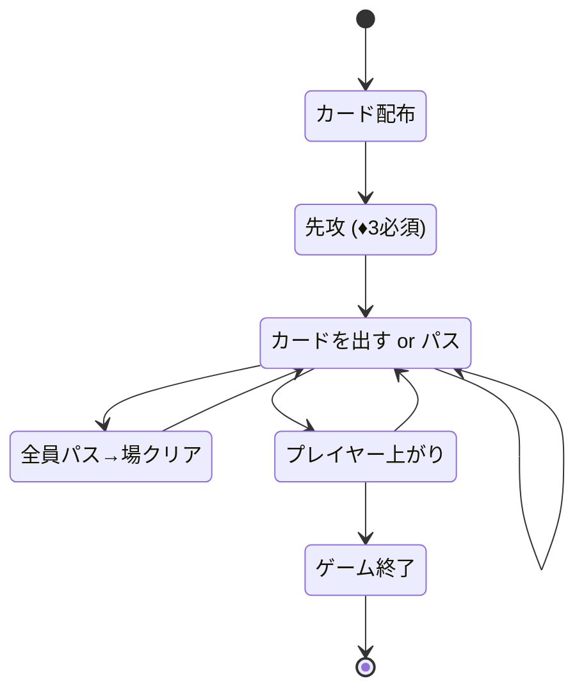

# 大老二（CUI版）遊び方

## ゲーム概要

大老二 (Big Two) は、4人で遊ぶトランプの手札消化 (シェディング) ゲームです。手札を最も早く出し切ったプレイヤーが勝者です。

## 起動方法

```sh
go run ./cmd/trumpcards bigtwo
go run ./cmd/trumpcards --lang en bigtwo  # 英語モード
```

## ルール

- **デッキ**: 52枚（ジョーカーなし）を4人に13枚ずつ配ります。
- **カードの強さ**: 数字 `3 < 4 < ... < K < A < 2`、スート `♦ < ♣ < ♥ < ♠`。
- **先攻**: ♦3を持つプレイヤーが先攻。最初のプレイに♦3を含める必要があります。
- **出し方**: 場と同じ枚数・種類で、より強いカードを出すかパス。
- **5枚役**: ストレート < フラッシュ < フルハウス < フォーカード < ストレートフラッシュ。
- **勝利条件**: 手札を最初に出し切ったプレイヤーが1位。

## ゲームの流れ



## コマンド一覧

| コマンド | 短縮形 | 説明 |
|----------|--------|------|
| `play <idx...>` | `p` | 指定インデックスのカードを出す（例: `p 0 2 4`） |
| `play` | `p` | パス（場が空でない場合） |
| `reset` | `r` | ゲームリセット |
| `setdifficulty <0-2>` | `sd` | CPU難易度変更 (0=Normal, 1=Easy, 2=Hard) |
| `log` | `l` | 棋譜表示 |
| `quit` | `q` | 終了 |
| `help` | `?` | コマンド一覧を表示 |

## 画面の見方

```
=== Big Two (大老二) ===
あなた: 13枚
  [0]♦3 [1]♣4 [2]♥5 ...
CPU 1: 13枚
CPU 2: 13枚
CPU 3: 13枚
----------
場: なし (自由に出せます)
あなたのターンです
```

場にカードが出ているときは、そのカードの役名が併記されます（Web GUI のバッジと同じ 8 種類）。

```
場: ♦3 ♣4 ♥5 ♦6 ♠7 [ストレート]
```

## 遊び方のコツ

- 弱いカードから順に出し、2やAは温存しましょう。
- ペアやトリプルでまとめて出すと相手が対応しにくくなります。
- 5枚役が組めるなら積極的に使いましょう。
