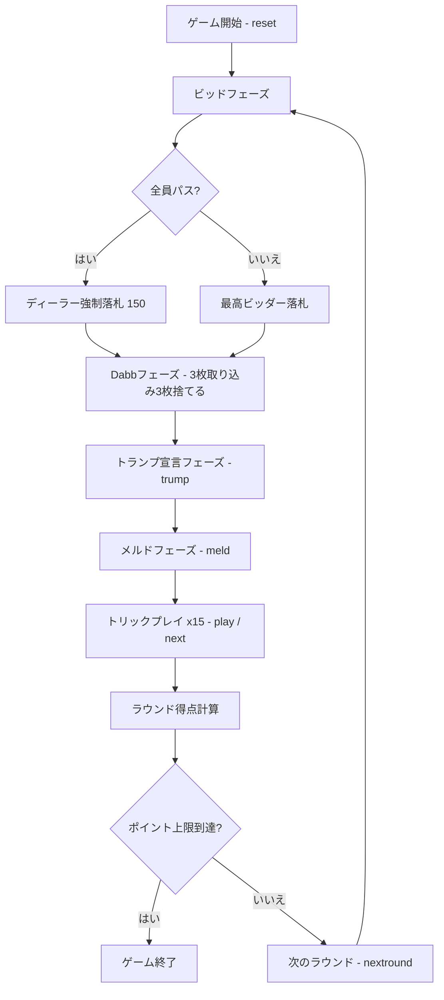

# ビノクル（CUI版）遊び方

## ゲーム概要

3人個人戦（プレイヤー vs CPU 2人）のトリックテイキング＋メルドゲーム。48枚の専用デッキ（各スート7, 10, J, Q, K, Aが2枚ずつ）を使用。ビッド、Dabb（伏せ札）交換、トランプ宣言、メルド（役の公開）、トリックプレイのフェーズで構成され、先にポイント上限（デフォルト1000点）に到達したプレイヤーが勝利。

## 起動方法

```sh
go run ./cmd/trumpcards binokel
go run ./cmd/trumpcards --lang en binokel  # 英語モード
```

## ルール

### デッキ

各スート（スペード、クラブ、ハート、ダイヤ）の7, 10, J, Q, K, Aが2枚ずつ、計48枚。

### カードランク

A > 10 > K > Q > J > 7（10がKより強い。最弱は7）

### カードポイント

- A = 11点
- 10 = 10点
- K = 4点
- Q = 3点
- J = 2点
- 7 = 0点
- 最終トリックボーナス = 10点
- ラウンド合計 = 250点

### 手札とDabb

各プレイヤーに15枚の手札が配られ、場に3枚の伏せ札（Dabb）が置かれます。

### ビッドフェーズ

ディーラーの左隣から順に、予想合計点（メルド点＋トリック点）をビッドします。
- 最低ビッドは150点、10点刻み。
- パスするか、現在の最高ビッドより10以上高くビッド。
- 全員がパスした場合は最後の発言者（ディーラー）が150点で強制落札。
- 最高ビッダーが落札者となります。

### Dabbフェーズ

落札者はDabbの伏せ札3枚を手札に取り込んで計18枚とし、不要なカード3枚を選んでDabbに捨てます（手札は15枚に戻ります）。
捨てた3枚のカードポイントは落札者のトリック獲得点に加算されます。

### トランプ宣言フェーズ

落札者が切り札スート（スペード/クラブ/ハート/ダイヤ）を宣言します。

### メルドフェーズ

全プレイヤーが手札のメルド（役）を公開します。

| メルド | ポイント | 構成 |
|--------|----------|------|
| ディクス (Dix) | 10 | 切り札の7 |
| コモンマリッジ (Common marriage) | 20 | 非切り札のK-Q |
| ロイヤルマリッジ (Royal marriage) | 40 | 切り札のK-Q |
| ビノクル (Binokel) | 40 | J♦ + Q♠ |
| ジャックアラウンド (Jacks around) | 40 | 各スートのJ各1枚 |
| クイーンアラウンド (Queens around) | 60 | 各スートのQ各1枚 |
| キングアラウンド (Kings around) | 80 | 各スートのK各1枚 |
| エースアラウンド (Aces around) | 100 | 各スートのA各1枚 |
| 非切り札ファミリー (Non-trump family / run) | 100 | 非切り札スートのA-10-K-Q-J |
| 切り札ファミリー (Trump family / run) | 150 | 切り札スートのA-10-K-Q-J |
| ルントガング (Rundgang) | 240 | 全4スートのK-Q（成立時は個々のマリッジを二重計上しない） |
| ダブルビノクル (Double binokel) | 300 | 2組のJ♦ + Q♠ |
| ダブルジャックアラウンド (Double jacks around) | 400 | 各スートのJ各2枚 |
| ダブルクイーンアラウンド (Double queens around) | 600 | 各スートのQ各2枚 |
| ダブルキングアラウンド (Double kings around) | 800 | 各スートのK各2枚 |
| ダブルエースアラウンド (Double aces around) | 1000 | 各スートのA各2枚 |
| ダブル非切り札ファミリー (Double non-trump family) | 1000 | 非切り札スートのA-10-K-Q-J各2組 |
| ダブル切り札ファミリー (Double trump family) | 1500 | 切り札スートのA-10-K-Q-J各2組 |

※同一スートのファミリー（Run）に含まれるK-Qはファミリーに包含されるため、個別のマリッジは重複加算されません。

### トリックフェーズ

手札15枚による計15トリック。以下のフォロー規則に従います:
1. **マストフォロー**: リードスートのカードを持っていれば必ず出す。
2. **マストウィン**: リードスートで現在勝っているカードよりも強いカードを持っていれば勝てるカードを出さなければならない。
3. **マストトランプ**: リードスートを持っておらず切り札を持っていれば必ず切り札を出す（すでに切り札が出ている場合はそれより強い切り札を出す）。
4. リードスートも切り札も持っていない場合は任意のカードを出せる。

### 得点計算

- **落札者**: メルド点＋トリック点（＋Dabb捨て札の点）の合計が入札額以上なら全得点を加算。届かなければ入札額分を減点（−入札額）。
- **落札者以外**: 自分のメルド点＋トリック点をそのまま加算。
- **ゲーム終了**: いずれかのプレイヤーの累計スコアがポイント上限（デフォルト1000点）に到達したラウンドで終了。最高スコアのプレイヤーが勝利（同点の場合は落札者が優先）。

### CPU難易度

- Easy (0): ランダム
- Normal (1): メルド評価によるビッド判断、基本戦略
- Hard (2): 積極的ビッド、高度なトリック管理

## ゲームの流れ



## コマンド一覧

| コマンド | 短縮形 | 説明 |
|----------|--------|------|
| `reset` | `r` | 新しいゲームを開始 |
| `bid <amount>` | `b <amount>` | ビッドする（150以上・10刻み） |
| `pass` | `pa` | ビッドをパスする |
| `discard <i> <j> <k>` | `d <i> <j> <k>` | Dabbへ手札からカード3枚を捨てる |
| `trump <suit>` | `t <suit>` | トランプスート宣言（1=スペード, 2=クラブ, 3=ハート, 4=ダイヤ） |
| `meld` | `m` | メルドを確認してプレイフェーズへ進む |
| `play <i>` | `p <i>` | 指定インデックスのカードをプレイ |
| `next` | `n` | 次のトリックへ進む |
| `nextround` | `nr` | 次のラウンドへ進む |
| `setdifficulty <0-2>` | `sd <0-2>` | CPU難易度設定（0: Easy, 1: Normal, 2: Hard） |
| `setlimit <n>` | `sl <n>` | ポイント上限設定（1以上） |
| `hint` | `h` | ヒントを表示 |
| `log` | `l` | 棋譜を表示 |
| `quit` | `q` | ゲーム終了 |
| `help` | `?` | コマンド一覧を表示 |

## 画面の見方

### 日本語モード

```
==========
Binokel (ビノクル)
==========
ラウンド: 1  トリック: 0
ディーラー: あなた
切り札: 未決定
最高ビッド: 150 (CPU 1)
累計スコア: あなた=0  CPU 1=0  CPU 2=0
あなた: スコア:0点 ビッド:未ビッド メルド:0点 トリック:0T/0点 15枚
[0]CLOVER 10  [1]CLOVER 1  [2]HEART 1  [3]DIAMOND 11  [4]HEART 13  [5]HEART 10  [6]DIAMOND 1  [7]DIAMOND 10  [8]CLOVER 13  [9]SPADE 13  [10]SPADE 11  [11]SPADE 12  [12]HEART 10  [13]SPADE 1  [14]SPADE 12
CPU 1: スコア:0点 ビッド:150 メルド:0点 トリック:0T/0点 15枚
CPU 2: スコア:0点 ビッド:パス メルド:0点 トリック:0T/0点 15枚
メルド早見表:
  ディクス 10 / コモンマリッジ 20 / ロイヤルマリッジ 40 / ビノクル 40 / ジャックアラウンド 40
  クイーンアラウンド 60 / キングアラウンド 80 / エースアラウンド 100 / 非切り札ファミリー 100 / 切り札ファミリー 150
  ルントガング 240 / ダブルビノクル 300 / ダブルジャックアラウンド 400 / ダブルクイーンアラウンド 600 / ダブルキングアラウンド 800
  ダブルエースアラウンド 1000 / ダブル非切り札ファミリー 1000 / ダブル切り札ファミリー 1500
あなたのビッド番です。(bid <n> / pass)
==========
```

### Dabbフェーズの例

落札すると場に伏せられていたDabb 3枚が手札に加わり（18枚）、不要な3枚を `discard <i> <j> <k>` で捨てます。

```
==========
Binokel (ビノクル)
==========
ラウンド: 1  トリック: 0
ディーラー: あなた
切り札: 未決定
最高ビッド: 400 (あなた)
累計スコア: あなた=0  CPU 1=0  CPU 2=0
Dabb: DIAMOND 10 DIAMOND 11 SPADE 7
あなた: スコア:0点 ビッド:400 メルド:0点 トリック:0T/0点 18枚
[0]HEART 11  [1]DIAMOND 12  [2]HEART 1  [3]SPADE 12  [4]CLOVER 10  [5]HEART 13  [6]SPADE 7  [7]CLOVER 13  [8]SPADE 10  [9]DIAMOND 13  [10]HEART 12  [11]CLOVER 12  [12]DIAMOND 1  [13]DIAMOND 7  [14]HEART 1  [15]DIAMOND 10  [16]DIAMOND 11  [17]SPADE 7
CPU 1: スコア:0点 ビッド:パス メルド:0点 トリック:0T/0点 15枚
CPU 2: スコア:0点 ビッド:パス メルド:0点 トリック:0T/0点 15枚
メルド早見表:
  ディクス 10 / コモンマリッジ 20 / ロイヤルマリッジ 40 / ビノクル 40 / ジャックアラウンド 40
  クイーンアラウンド 60 / キングアラウンド 80 / エースアラウンド 100 / 非切り札ファミリー 100 / 切り札ファミリー 150
  ルントガング 240 / ダブルビノクル 300 / ダブルジャックアラウンド 400 / ダブルクイーンアラウンド 600 / ダブルキングアラウンド 800
  ダブルエースアラウンド 1000 / ダブル非切り札ファミリー 1000 / ダブル切り札ファミリー 1500
あなたは Dabb へ捨てるカードを3枚選んでください。(discard <i> <j> <k>)
==========
```

### 英語モード (`--lang en`)

```
==========
Binokel
==========
Round: 1  Trick: 0
Dealer: You
Trump: undecided
Highest bid: 150 (CPU 2)
Scores: You=0  CPU 1=0  CPU 2=0
You: score:0pt bid:no bid meld:0pt tricks:0T/0pt 15 cards
[0]HEART 13  [1]DIAMOND 1  [2]HEART 1  [3]DIAMOND 12  [4]HEART 10  [5]DIAMOND 10  [6]CLOVER 11  [7]SPADE 11  [8]DIAMOND 1  [9]CLOVER 12  [10]SPADE 11  [11]HEART 12  [12]CLOVER 7  [13]SPADE 1  [14]HEART 13
CPU 1: score:0pt bid:pass meld:0pt tricks:0T/0pt 15 cards
CPU 2: score:0pt bid:150 meld:0pt tricks:0T/0pt 15 cards
Meld reference:
  Dix 10 / Common marriage 20 / Royal marriage 40 / Binokel 40 / Jacks around 40
  Queens around 60 / Kings around 80 / Aces around 100 / Non-trump family 100 / Trump family 150
  Rundgang 240 / Double binokel 300 / Double jacks around 400 / Double queens around 600 / Double kings around 800
  Double aces around 1000 / Double non-trump family 1000 / Double trump family 1500
You to bid. (bid <n> / pass)
==========
```

- **ラウンド / トリック**: 現在のラウンド数とトリック数
- **ディーラー / 切り札 / 最高ビッド**: 親、切り札スート、現在の最高ビッドと宣言者
- **累計スコア**: 各プレイヤーの現在スコア
- **手札**: `[0]` 始まりの0ベースインデックスでカード（スートとランク）を表示
- **メルド早見表**: 役とその点数一覧
- **合法手**: プレイフェーズでルール上出せる手札インデックス（例: `合法手: [0] [1] ...`）

## 遊び方のコツ

- 切り札ファミリー（150点）やルントガング（240点）など高得点メルドを狙えるスートを考慮してビッドする。
- Dabbの3枚で手札の不要牌を整理しつつ、高得点カード（Aや10）をDabbに捨てることで落札者の確定トリック点として安全に回収できる。
- 落札できなかった場合でも、自分のメルド点とトリック点はそのまま得点になるため、無理な高値ビッドは避けて相手の落札失敗（失点）を誘うのも有効。
- トリックではマストフォロー・マストウィン規則を意識し、相手の高得点カードを狩るタイミングを見極める。
