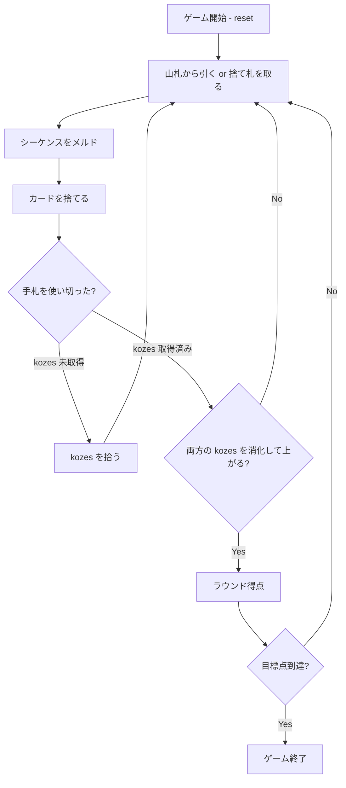

# ビリバ（CUI版）遊び方

## ゲーム概要

ビリバはギリシャで広く親しまれている、4人（2対2）のパートナーシップ制ラミーです。2組の標準52枚にジョーカー2枚を加えた106枚を使い、チームでシーケンスを作って得点を競います。

## 起動方法

```sh
go run ./cmd/trumpcards biriba
go run ./cmd/trumpcards --lang en biriba  # 英語モード
```

## ルール

### 基本ルール

- 各プレイヤーに11枚を配り、伏せた買い手札（kozes）を2組置きます。
- メルドは同じスートの連続したランクによるシーケンスです。ジョーカーと2はワイルドとして使えます。
- 最初の手札を使い切った側は、kozes を拾って新しい手札として続行します。
- 7枚以上でワイルドを1枚も使わないシーケンスは「純ビリバ」として高得点です。
- 両方の kozes を消化して上がると追加点を得ます。

### Burraco との違い

イタリアの Burraco は同ランクの組を作るゲームですが、Biriba は同じスートのシーケンスを作るゲームです。単なる別名ではありません。

## ゲームの流れ



## コマンド一覧

| コマンド | 短縮形 | 説明 |
|----------|--------|------|
| `reset` | `r` | 新しいゲームを開始 |
| `drawstock` | `ds` | 山札から引く |
| `drawdiscard` | `dd` | 捨て札を取る（自然札2枚のインデックスを指定） |
| `meld` | `m` | シーケンスをメルドする |
| `skipmeld` | `sm` | メルドをせずに進む |
| `discard` | `d` | カードを捨てる |
| `goout` | `go` | 条件を満たして上がる |
| `nextround` | `nr` | 次のラウンドへ進む |
| `hint` | `h` | 次の行動のヒントを表示 |
| `log` | `l` | 行動ログを表示 |
| `help` | `?` | コマンド一覧を表示 |
| `quit` | `q` | ゲームを終了 |

## 画面の見方

```
==============================
Biriba (ビリバ)
==============================
ラウンド: 1  山札: --枚  捨て札: --枚
kozes: 残り2組
You: 累積0点 11枚
  メルド[純ビリバ]: ♠4, ♠5, ♠6, ♠7, ♠8, ♠9, ♠10
手番: You (ドローフェーズ)
ds・・・山札から引く
==============================
```

## 遊び方のコツ

- ワイルドを温存し、純ビリバを狙うと得点を伸ばせます。
- kozes を拾うタイミングと、パートナーが作っているスートを意識しましょう。
