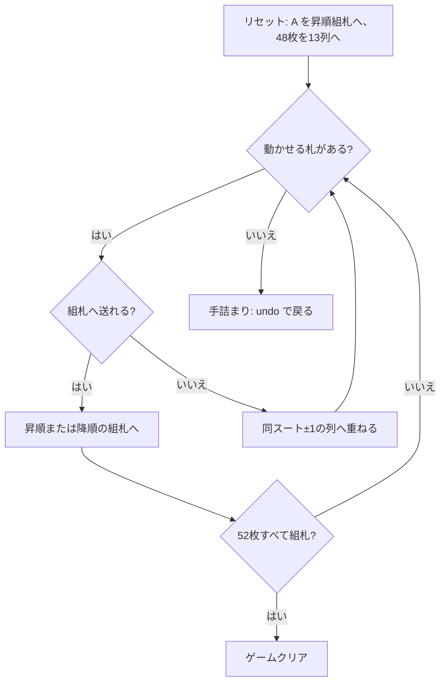

# ビズリー（CUI版）遊び方

## ゲーム概要

52 枚すべてが最初から表向きに並ぶオープンソリティア。組札が **2 組**あるのが最大の特徴で、4 枚の A は最初から場に置かれた昇順 (A→K) の組札、キングの組札は降順 (K→A) で、自分でキングを上げたときに開く。

情報が完全に公開されているので運の要素は配り方だけ。にもかかわらず、場札に重ねられるのが「同じスートでランクが 1 つ違う」札に限られるため、手順を読み切れないとすぐ手詰まりになる。

## 起動方法

```sh
go run ./cmd/trumpcards bisley
go run ./cmd/trumpcards --lang en bisley   # 英語
```

## ルール

- 52 枚 1 組。4 枚の A を抜いて昇順の組札に置き、残り 48 枚を 13 列に表向きで配る（4 列が 3 枚、9 列が 4 枚）
- 組札は 2 組
  - **昇順組札**（4 列）: 同じスートで A→2→…→K
  - **降順組札**（4 列）: 同じスートで K→Q→…→A。最初は空で、キングを上げたときに開く
- 動かせるのは各列の**最上段 1 枚だけ**
- 場札の上に重ねられるのは**同じスートでランクが 1 つ違う**札のみ（上下どちらでもよい）
- **空になった列は置き場として使えない。** ここを自由にすると任意の札を掘り出せてしまい、どの配牌も必ず解けてしまう
- 52 枚すべてが 2 組の組札に乗れば勝ち。組札にも場札にも動かせる札が 1 枚もなくなれば手詰まり

## ゲームの流れ



## コマンド一覧

| コマンド | 説明 |
|---------|------|
| `m <col> a` | 列 `<col>` の最上段を昇順組札 (A→K) に置く |
| `m <col> k` | 列 `<col>` の最上段を降順組札 (K→A) に置く |
| `m <fromCol> <toCol>` | 列 `<fromCol>` の最上段を列 `<toCol>` に重ねる（同スート±1） |
| `h`, `hint` | ヒントを表示する |
| `ac`, `autocomplete` | 組札へ送れる札がなくなるまで自動で送る |
| `u`, `undo` | 1 手戻す |
| `g`, `giveup` | ギブアップ |
| `l` | 棋譜（アクションログ）を表示する |
| `r`, `reset` | 最初からやり直す |
| `q`, `quit` | 終了する |

## 画面の見方

```
昇順基礎札 (A→K): ♠A | ♣A | ♥3 | ♦A     ← スート固定の 4 列
降順基礎札 (K→A): [空] | [空] | ♥K | [空]  ← キングを上げると開く
----------
列0: [0]♠7 [1]♦2 [2]♣9 [3]♥4          ← 動かせるのは一番右
列1: [0]♦J [1]♠3 [2]♥8
...
列12: [0]♣4 [1]♦9 [2]♠Q [3]♥2
----------
手数: 12
```

- 組札の列はスートで固定されているので、配り直しても同じ位置を見ればよい
- 各列の `[n]` は列内のインデックス。移動できるのは常に一番右の 1 枚
- 手詰まりになると、脱出に必要なアンドゥ回数が表示される

## 遊び方のコツ

- **どちらの組札に送るかを決め打ちしない。** ♥7 を昇順に送るか降順に送るかで、後半に残る札がまったく変わる
- 同じスートの札が縦に並んでいる列は掘りやすい。逆に、同じスートが 1 枚もない列は最後まで動かない
- 空き列を作っても得はしない（置き場にならない）。列を空にすること自体を目標にしない
- `hint` は組札へ送れる手を 1 つ返すだけで、最善手の保証はない。組札へ急ぐと下の札が塞がることもある
- 詰まったら `undo` で分岐をやり直す。全札が見えている以上、読み直せば必ず別の手順が見つかる
