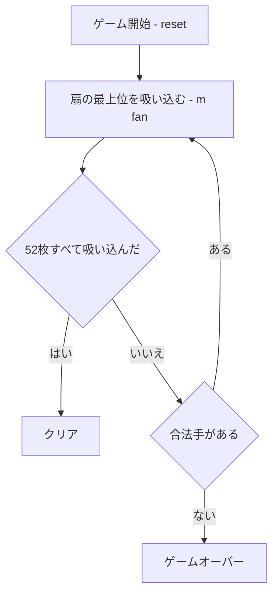

# ブラックホール（CUI版）遊び方

## ゲーム概要

ブラックホール（Black Hole）は、イギリスのゲームデザイナー David Parlett 考案の論理パズル系ソリティアです。標準 52 枚デッキの **♠A を中央のブラックホール** に固定し、残り **51 枚を 17 の 3 枚扇** に配ります。各扇の最上位カードを、ブラックホール最上位と **±1 ランク（スート不問・K と A はつながりなし）** ならブラックホールへ吸い込めます。**全 52 枚を吸い込めばクリア** です。

## 起動方法

```sh
go run ./cmd/trumpcards blackhole
go run ./cmd/trumpcards --lang en blackhole  # 英語モード
```

## ルール

1. **吸い込む**: `m <fan>` で扇 `fan` の最上位カードをブラックホールへ積みます。
2. **配置条件**: ブラックホール最上位とランクが ±1 のカードのみ積めます（スート不問）。K(13) と A(1) はラップしません。
3. **一方通行**: 一度ブラックホールへ積んだカードは戻せません。
4. **勝敗**: 全 52 枚を吸い込めばクリア、合法手がなくなれば失敗です。

## ゲームの流れ



## コマンド一覧

| コマンド | 短縮形 | 説明 |
|----------|--------|------|
| `m <fan>` | | 扇 fan の最上位をブラックホールへ積む |
| `undo` | `u` | 直近の手を取り消す |
| `giveup` | `g` | 投了する |
| `hint` | `h` | ヒントを表示 |
| `log` | `l` | 棋譜を表示 |
| `reset` | `r` | 新しいゲームを開始 |
| `quit` | `q` | ゲーム終了 |
| `help` | `?` | コマンド一覧を表示 |

## 画面の見方

```
==========
ブラックホール (Black Hole)
==========
ブラックホール: ♠A
扇0: ♥9 ♣6
扇1: ♦10
...
出せるランク: 2
残り合法手: 1
手数: 0
==========
```

- `ブラックホール` … 中央の積み上げ（右端が最上位）
- `扇0〜16` … 各扇のカード（右端が最上位）
- `出せるランク` … ブラックホール最上位の ±1（A・K は片側だけ。K↔A のラップはありません）
- `残り合法手` … いま積める扇の数。0 になると赤で表示され、手詰まりです

## 遊び方のコツ

- 全カードが見えています。ブラックホール最上位がどのランクへ伸びるか、複数手先まで読みましょう。
- 同じランクが複数の扇の下に埋まっていると手詰まりになりやすいので、早めに上のカードをほぐしましょう。
