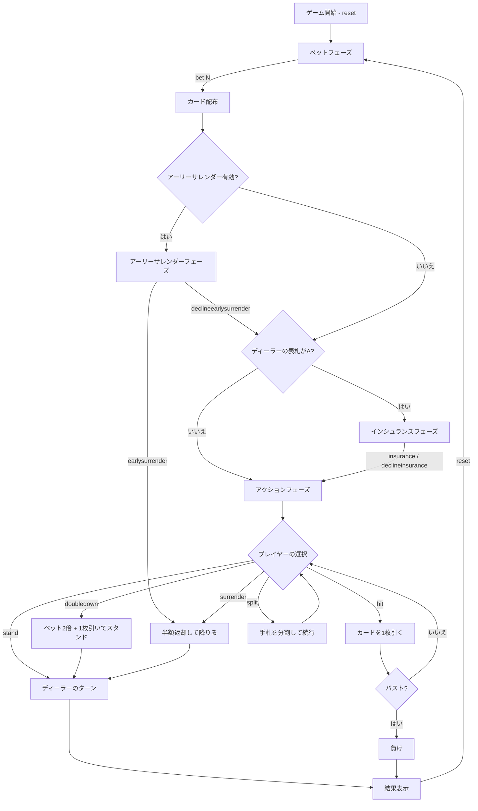

# ブラックジャック（CUI版）遊び方

## ゲーム概要

ディーラーとプレイヤーが1対1で対戦するカードゲームです。手札の合計値を21に近づけ、21を超えずにディーラーより高い点数を目指します。

## 起動方法

```sh
go run ./cmd/trumpcards blackjack
go run ./cmd/trumpcards --lang en blackjack  # 英語モード
```

## ルール

### カードの点数

| カード | 点数 |
|--------|------|
| 2〜10 | 数字どおり |
| J, Q, K | 10 |
| A | 11（合計が21を超える場合は1） |

### チップシステム

- 初期チップ: 1000
- 最低ベット: 10（10の倍数で指定）
- チップが10未満になると自動的に1000にリセットされます

### 勝敗判定

- プレイヤーの手札がディーラーより21に近ければ勝ち（賭け金と同額を獲得）
- ナチュラルブラックジャック（最初の2枚で21）の場合、3:2の配当
- バスト（21超過）した場合は即負け
- 引き分けの場合、賭け金はそのまま返却

## ゲームの流れ



## コマンド一覧

| コマンド | 短縮形 | 説明 |
|----------|--------|------|
| `reset` | `r` | 新しいラウンドを開始 |
| `bet N [PP] [T3] [HC]` | `b N [PP] [T3] [HC]` | N チップをベット。任意でサイドベット額とハンド数を指定（例: `b 100 10 20 2`） |
| `hit` | `h` | カードを1枚引く |
| `stand` | `s` | カードを引かずにターン終了 |
| `doubledown` | `d` | ベットを2倍にし、1枚だけ引いてスタンド |
| `split` | `sp` | 同じ点数の2枚の手札を分割（最大4ハンド） |
| `insurance` | `i` | インシュランスを購入（ベットの半額） |
| `declineinsurance` | `di` | インシュランスを辞退 |
| `surrender` | `sur` | サレンダー（最初の2枚のみ）: ベットの半額を返却してゲームを降りる |
| `togglehint` | `hint` | ベーシックストラテジーヒントのON/OFFを切り替える |
| `setdeckcount N` | `sd N` | シューのデッキ数を設定（有効値: 1/2/4/6/8）。BETフェーズのみ有効 |
| `togglesoft17` | `soft17` | ディーラーのソフト17ルールを切り替える（H17: ソフト17でヒット / S17: ソフト17でスタンド） |
| `togglecounting` | `counting` | カードカウンティング表示のON/OFFを切り替える |
| `setcountingsystem N` | `scs N` | カウンティングシステムを設定（0=Hi-Lo / 1=KO / 2=Zen Count / 3=Omega II） |
| `toggledas` | `das` | スプリット後のダブルダウン（DAS）許可のON/OFFを切り替える |
| `setpenetration N` | `pen N` | デッキペネトレーション率を設定（有効値: 50 / 75）。BETフェーズのみ有効 |
| `setcpucount N` | `scc N` | CPUプレイヤー数を設定（0〜3）。BETフェーズのみ有効 |
| `earlysurrender` | `es` | アーリーサレンダー（ディーラーのBJ確認前にサレンダー） |
| `declineearlysurrender` | `des` | アーリーサレンダーを辞退して通常プレイを続行 |
| `setsurrenderrule N` | `ssr N` | サレンダールールを設定（0=レイトサレンダー / 1=アーリーサレンダー / 2=サレンダー禁止） |
| `quit` | `q` | ゲーム終了 |
| `help` | `?` | コマンド一覧を表示 |

## 特殊ルール

### インシュランス

ディーラーの表向きカードがAの場合に提示されます。ベットの半額を支払い、ディーラーがブラックジャックなら2:1の配当を受け取ります。

### ダブルダウン

最初の2枚の状態でのみ選択可能です。ベットが2倍になり、カードを1枚だけ引いて自動的にスタンドします。

### スプリット

最初の2枚が同じブラックジャック点数（例: K と 10）の場合に選択可能です。手札を2つに分割し、それぞれに元のベットと同額が賭けられます。シングルハンド時は最大4ハンド、マルチハンド時は合計最大8ハンドまで分割できます。Aをスプリットした場合、各手札に1枚ずつ配られて自動スタンドとなります。

### サレンダー

アクションフェーズの最初の2枚の状態でのみ選択可能です。`surrender`（短縮形: `sur`）を入力するとベットの半額が返却され、そのハンドは終了します。

### サレンダールール設定

`setsurrenderrule N`（短縮形: `ssr N`）でサレンダールールを変更できます。

| 値 | ルール | 説明 |
|----|--------|------|
| 0 | レイトサレンダー（デフォルト） | ディーラーのBJ確認後にサレンダー可能 |
| 1 | アーリーサレンダー | ディーラーのBJ確認前にサレンダー可能（アーリーサレンダーフェーズが追加） |
| 2 | サレンダー禁止 | サレンダー不可 |

アーリーサレンダーが有効な場合、カード配布後にアーリーサレンダーフェーズ（`EARLY_SURRENDER`）が追加されます。このフェーズで `earlysurrender`（短縮形: `es`）を入力するとベットの半額が返却されゲームを降りることができます。`declineearlysurrender`（短縮形: `des`）を入力すると通常のプレイを続行します。設定はセッション内で維持されます。

### ベーシックストラテジーヒント

`togglehint`（短縮形: `hint`）でON/OFFを切り替えます。ONにすると、現在のハンドとディーラーのアップカードに基づいた最適アクションが `[HINT: ○○]` として表示されます。ヒントはセッション内で維持されます（`reset` してもON/OFFは変わりません）。

### デッキ数（シュー）設定

BETフェーズ中に `setdeckcount N`（短縮形: `sd N`）でシューのデッキ数を変更できます。有効な値は 1 / 2 / 4 / 6 / 8 です。次のラウンドの `reset` 時に新しいシューが使用されます。

### ソフト17ルールトグル

`togglesoft17`（短縮形: `soft17`）でディーラーのソフト17ルールを切り替えます。H17（ヒット）とS17（スタンド）を交互に切り替えます。H17ではディーラーはソフト17（Aを11と数えて合計17）でもう1枚引きます。S17ではソフト17でスタンドします。設定はセッション内で維持されます。

### カードカウンティング練習

`togglecounting`（短縮形: `counting`）でカードカウンティング表示のON/OFFを切り替えます。ONにするとランニングカウント（RC）とトゥルーカウント（TC）が表示されます。カウンティング練習モードとして、実際のカード配布に応じてカウントが更新されます。

`setcountingsystem N`（短縮形: `scs N`）でカウンティングシステムを変更できます。

| 値 | システム | タイプ |
|----|----------|--------|
| 0 | Hi-Lo | バランス型（TC表示あり） |
| 1 | KO | アンバランス型（TC=N/A） |
| 2 | Zen Count | バランス型（TC表示あり） |
| 3 | Omega II | バランス型（TC表示あり） |

KOシステムはアンバランス型のため、トゥルーカウント（TC）は表示されず `TC=N/A` となります。

### DAS（スプリット後のダブルダウン）

`toggledas`（短縮形: `das`）でスプリット後のダブルダウン（Double After Split）の許可/禁止を切り替えます。デフォルトはON（DAS許可）です。OFFにすると、スプリットで分割されたハンドではダブルダウンが選択できなくなります。設定はセッション内で維持されます。

### デッキペネトレーション設定

`setpenetration N`（短縮形: `pen N`）でデッキペネトレーション率（%）を設定します。有効な値は 50 / 75 です。デフォルトは75%です。75%ではカードの75%が使用された時点でシューが再構築されます。50%ではカードの50%が使用された時点で再構築されます。設定はセッション内で維持されます。

### マルチプレイヤーCPU席

`setcpucount N`（短縮形: `scc N`）で0〜3名のCPUプレイヤーを追加できます。BETフェーズ中に設定を変更すると、次の `reset` 時に反映されます。CPUプレイヤーはベーシックストラテジーに基づいて自動的にプレイします。

カウンティングが有効な場合、CPUプレイヤーはカードカウンティングAIを使用します:

- **ベットスプレッド**: カウント値に応じてベット額を変動させます（基本50チップ）

| カウント | 倍率 | ベット額 |
|----------|------|----------|
| <= 1 | 1x | 50 |
| 2 | 2x | 100 |
| 3 | 4x | 200 |
| 4 | 8x | 400 |
| >= 5 | 16x | 800 |

- **インシュランス判断**: カウント >= 3 のときインシュランスを取ります
- バランス型システム（Hi-Lo/Zen/Omega II）ではトゥルーカウント、KOではランニングカウントを使用します
- ベット額は所持チップを上限とし、BJMinBet（10）の倍数に丸められます

### サイドベット

メインベットと同時にサイドベットを賭けることができます。`bet N PP T3 HC` の形式で、PP（Perfect Pairs）、T3（ポーカー役ベット）のベット額、HC（ハンド数）を指定します（例: `b 100 10 20 2`）。省略した場合はそれぞれ0（賭けない）、1ハンドとして扱われます。サイドベットはカード配布直後に評価され、メインハンドとは独立に精算されます。サイドベットはハンド0のみに適用されます。

#### Perfect Pairs（プレイヤーの最初の2枚）

| 結果 | 条件 | 配当 |
|------|------|------|
| Perfect Pair | 同じスート・同じ値 | 25:1 |
| Colored Pair | 同じ色・同じ値 | 12:1 |
| Mixed Pair | 異なる色・同じ値 | 6:1 |

#### ポーカー役ベット（プレイヤーの2枚＋ディーラーのアップカード）

| 結果 | 条件 | 配当 |
|------|------|------|
| Suited Trips | 同じスート・同じ値 | 100:1 |
| Straight Flush | 同じスート・連続値 | 40:1 |
| Three of a Kind | 同じ値・異なるスート | 30:1 |
| Straight | 連続値 | 10:1 |
| Flush | 同じスート | 5:1 |

### マルチハンド

`bet N PP T3 HC` の4番目の引数でハンド数（1〜3）を指定できます（例: `b 100 0 0 2` で2ハンド）。省略時は1ハンドです。各ハンドに同額のベットが賭けられ、カードはインターリーブ方式（ハンド0-カード1、ハンド1-カード1、...、ディーラー-カード1、...）で配られます。

- 総コスト: `ベット額 × ハンド数 + サイドベット額`
- サイドベットはハンド0のみに適用
- インシュランスはハンド0のベット額に基づいて1回のみ
- ナチュラルBJ: ディーラーがBJなら即終了、全プレイヤーハンドがBJなら即終了、一部のみBJの場合はBJハンドを自動スタンドして続行
- スプリット上限: マルチハンド時は合計最大8ハンド
- マルチハンドで配られた初期ハンドでのBJは3:2配当（スプリットで生じたBJは1:1配当）
- CUI出力に `multi-hand: Nハンド` が表示されます（2ハンド以上の場合）

## 画面の見方

```
----------
chips: player=950 dealer=1000 decks=1 soft17=S17
count (Hi-Lo): RC=+3 TC=+1.5
phase: ACTION
dealer score
SPADE 10,
----------
cpu1 score 18 bet=50 chips=900
HEART 10,DIAMOND 8
----------
player (*) score 15 bet=50
HEART 8,DIAMOND 7
[HINT: HIT]
----------
```

- `chips`: プレイヤーとディーラーの所持チップ、デッキ数、ソフト17ルール
- `count (システム名): RC=N TC=N`: ランニングカウント / トゥルーカウント（カウンティングON時のみ、KOシステムでは `TC=N/A`）
- `phase`: 現在のフェーズ（BET / INSURANCE / ACTION / END / EARLY_SURRENDER）
- **配当表**: ベットフェーズのあいだだけ、ブラックジャック 3:2 / 通常勝利 1:1 / インシュランス 2:1 / プッシュ / サレンダー / バストの一覧が出ます（Web の配当表と同じ内容）。Spanish 21 ではボーナス配当（5・6・7 枚で 21、6-7-8、7-7-7）も並びます
- `dealer score`: ディーラーの手札（ゲーム中は裏札が非表示）
- `cpuN score N bet=M chips=C`: CPUプレイヤーの手札情報（CPUプレイヤーがいる場合のみ）
- `player (*) score N bet=M`: プレイヤーの手札情報（`(*)` はアクティブなハンド）
- ステータスタグ: `[DD]` ダブルダウン / `[BUST]` バスト / `[STAND]` スタンド / `[BJ]` ナチュラルBJ / `[SURRENDER]` サレンダー
- `[HINT: ○○]`: ベーシックストラテジーによる推奨アクション（ヒントON時のみ）
