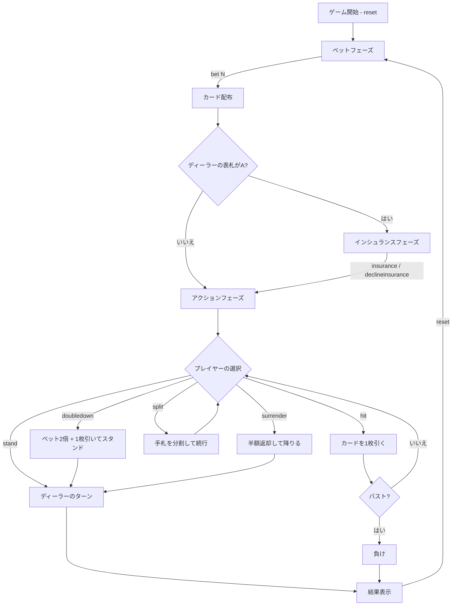

# ブラックジャック（CUI版）遊び方

## ゲーム概要

ディーラーとプレイヤーが1対1で対戦するカードゲームです。手札の合計値を21に近づけ、21を超えずにディーラーより高い点数を目指します。

## 起動方法

```sh
go run ./cmd/cli blackjack
```

## ルール

### カードの点数

| カード | 点数 |
|--------|------|
| 2〜10 | 数字どおり |
| J, Q, K | 10 |
| A | 11（合計が21を超える場合は1） |

### チップシステム

- 初期チップ: 1000
- 最低ベット: 10（10の倍数で指定）
- チップが10未満になると自動的に1000にリセットされます

### 勝敗判定

- プレイヤーの手札がディーラーより21に近ければ勝ち（賭け金と同額を獲得）
- ナチュラルブラックジャック（最初の2枚で21）の場合、3:2の配当
- バスト（21超過）した場合は即負け
- 引き分けの場合、賭け金はそのまま返却

## ゲームの流れ



## コマンド一覧

| コマンド | 短縮形 | 説明 |
|----------|--------|------|
| `reset` | `r` | 新しいラウンドを開始 |
| `bet N` | `b N` | N チップをベット（例: `b 100`） |
| `hit` | `h` | カードを1枚引く |
| `stand` | `s` | カードを引かずにターン終了 |
| `doubledown` | `d` | ベットを2倍にし、1枚だけ引いてスタンド |
| `split` | `sp` | 同じ点数の2枚の手札を分割（最大4ハンド） |
| `insurance` | `i` | インシュランスを購入（ベットの半額） |
| `declineinsurance` | `di` | インシュランスを辞退 |
| `surrender` | `sur` | サレンダー（最初の2枚のみ）: ベットの半額を返却してゲームを降りる |
| `togglehint` | `hint` | ベーシックストラテジーヒントのON/OFFを切り替える |
| `setdeckcount N` | `sd N` | シューのデッキ数を設定（有効値: 1/2/4/6/8）。BETフェーズのみ有効 |
| `quit` | `q` | ゲーム終了 |

## 特殊ルール

### インシュランス

ディーラーの表向きカードがAの場合に提示されます。ベットの半額を支払い、ディーラーがブラックジャックなら2:1の配当を受け取ります。

### ダブルダウン

最初の2枚の状態でのみ選択可能です。ベットが2倍になり、カードを1枚だけ引いて自動的にスタンドします。

### スプリット

最初の2枚が同じブラックジャック点数（例: K と 10）の場合に選択可能です。手札を2つに分割し、それぞれに元のベットと同額が賭けられます。最大4ハンドまで分割できます。Aをスプリットした場合、各手札に1枚ずつ配られて自動スタンドとなります。

### サレンダー

アクションフェーズの最初の2枚の状態でのみ選択可能です。`surrender`（短縮形: `sur`）を入力するとベットの半額が返却され、そのハンドは終了します。

### ベーシックストラテジーヒント

`togglehint`（短縮形: `hint`）でON/OFFを切り替えます。ONにすると、現在のハンドとディーラーのアップカードに基づいた最適アクションが `[HINT: ○○]` として表示されます。ヒントはセッション内で維持されます（`reset` してもON/OFFは変わりません）。

### デッキ数（シュー）設定

BETフェーズ中に `setdeckcount N`（短縮形: `sd N`）でシューのデッキ数を変更できます。有効な値は 1 / 2 / 4 / 6 / 8 です。次のラウンドの `reset` 時に新しいシューが使用されます。

## 画面の見方

```
----------
chips: player=950 dealer=1000 decks=1
phase: ACTION
dealer score
SPADE 10,
----------
player (*) score 15 bet=50
HEART 8,DIAMOND 7
[HINT: HIT]
----------
```

- `chips`: プレイヤーとディーラーの所持チップ、デッキ数
- `phase`: 現在のフェーズ（BET / INSURANCE / ACTION / END）
- `dealer score`: ディーラーの手札（ゲーム中は裏札が非表示）
- `player (*) score N bet=M`: プレイヤーの手札情報（`(*)` はアクティブなハンド）
- ステータスタグ: `[DD]` ダブルダウン / `[BUST]` バスト / `[STAND]` スタンド / `[BJ]` ナチュラルBJ / `[SURRENDER]` サレンダー
- `[HINT: ○○]`: ベーシックストラテジーによる推奨アクション（ヒントON時のみ）
