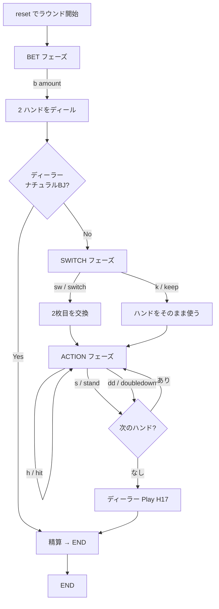

# ブラックジャック・スイッチ（CUI版）遊び方

## ゲーム概要

Blackjack Switch（ブラックジャック・スイッチ）は、プレイヤーが2つのハンドを同時にプレイする
ブラックジャックのバリアント。ディール直後に2枚目のカードを2ハンド間で交換できる「スイッチ」
アクションが追加されている代わりに、(1) ナチュラルブラックジャックの配当が 1:1（通常は 3:2）、
(2) ディーラーが22で終了した場合は（ナチュラルBJを除き）バーストではなく **プッシュ** 扱いと
なる。

## 起動方法

```sh
go run ./cmd/trumpcards blackjackswitch
go run ./cmd/trumpcards --lang en blackjackswitch
```

## ルール

### 基本ルール

- プレイヤーは常に 2ハンド をディールされる（1ハンドあたりのベット額 × 2 を消費）
- ディーラーは2枚（うち1枚はホールカード）を伏せて配る
- ディール直後、プレイヤーは「スイッチ」または「キープ」を選ぶ
- 以降は各ハンドを順にヒット/スタンド/ダブルダウンでプレイ
- スプリット・サレンダー・インシュランス・サイドベットは未実装（標準BJ実装に任せる）

### スイッチアクション

ハンド0とハンド1の **2枚目のカード** を相互交換する。
スイッチで作ったハンドもナチュラルBJ扱い（ただし配当は 1:1）。

### 特殊ルール

- **ディーラー22プッシュ**: ディーラーが22で終了した場合、ナチュラルBJ以外のプレイヤーハンドは
  すべてプッシュ（引き分け）。プレイヤーが2枚で21を持っている場合のみ、ディーラー22に勝てる。
- **ナチュラルBJ配当 1:1**: 通常BJの 3:2 配当ではなく、勝利時と同じ 1:1（ベット額の100%）。

### ディーラールール

ディーラーは標準的な H17（Hit Soft 17）で運用される: スコアが 17 未満ならヒット、ソフト17 でも
ヒット、ハード 17 以上でスタンド。

## ゲームの流れ



## コマンド一覧

| コマンド | 短縮形 | 説明 |
|----------|--------|------|
| `reset` | `r` | 新しいラウンドを開始 |
| `bet <amount>` | `b` | 1ハンドあたりのベット額を置く（合計 amount × 2 消費） |
| `switch` | `sw` | 2ハンドの2枚目を交換 |
| `keep` | `k` | スイッチを行わずアクションへ進む |
| `hit` | `h` | 現在のハンドをヒット |
| `stand` | `s` | 現在のハンドをスタンド |
| `doubledown` | `dd` | 現在のハンドをダブルダウン |
| `log` | `l` | 棋譜を表示 |
| `quit` | `q` | ゲーム終了 |

## 画面の見方

```
==========
Blackjack Switch (ブラックジャック・スイッチ)
==========
チップ: 800
フェーズ: SWITCH
ディーラー(10+?): SPADE 10,??
ハンド0(15): SPADE 10,CLOVER 5 / ベット: 100
ハンド1(16): HEART 6,DIAMOND 11 / ベット: 100
```

- `(10+?)` のように `+?` が付くのはディーラーのホールカードが伏せられているため
- アクションフェーズでは現在操作中のハンドの先頭に `>` が付く

## 遊び方のコツ

- スイッチは「両方のハンドを同時に良くする」ときに有利。例えば「20 / 11」を「11 / 20」に
  変えるのではなく「BJ + 17」のような組み合わせを目指す
- ナチュラルBJ配当は 1:1 なので、自然に21が完成する確率が高い手は積極的にスイッチで作る
- ディーラー22プッシュルールは強力な救済 — ディーラーバストへの依存度が下がる代わりに、
  プレイヤーが先にバーストするとプッシュも享受できないため、ハードな手はスタンド寄りに
