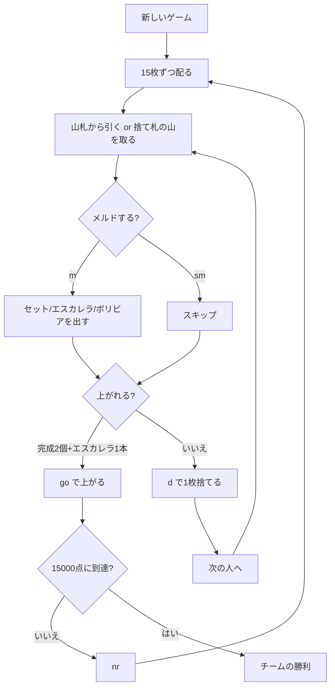

# ボリビア（CUI版）遊び方

## ゲーム概要

ボリビア（Bolivia）は南米で遊ばれるカナスタ系のパートナーシップゲームです。**4 人 2 組**（席 0・2 対 席 1・3）で、**3 組 + ジョーカー 6 枚（162 枚）**を使い、1 人 15 枚を配ります。

**独自のメルドが 2 つあります。**

- **ボリビア**: **ワイルド 7 枚**（2 とジョーカー、混ぜてよい）だけのメルド。**2500 点**でゲーム名の由来。
- **エスカレラ**: **ワイルドを含まない同スートの 7 枚連番**。**1500 点**。スペイン語で「梯子」。

## 起動方法

```sh
go run ./cmd/trumpcards bolivia
# または
go run ./cmd/trumpcards --lang en bolivia
```

## ルール

### メルドの種類

| 種類 | 中身 | 完成（7枚）の点 |
|------|------|-----|
| セット | 同ランク 3 枚以上（ワイルド可、ナチュラルが多いこと） | ナチュラル 500 / ミックス 300 |
| **エスカレラ** | **同スートの連番、ワイルド不可** | **1500** |
| **ボリビア** | **ワイルドだけ** | **2500** |

**ワイルドだけのメルドを認めるのがこの形式の要**です。完成したボリビアには**もうカードを足せません**。

### 3 の扱い

**3 はメルドの材料ではありません。**

- **赤 3**（♥3 / ♦3）は引いた時点で場に置かれ、1 枚 100 点（6 枚すべてで 800 点）。
- **黒 3**（♠3 / ♣3）はメルドできず、捨てると捨て札の山を凍らせます。

> **`escalera` は「3 だけで作るメルド」ではありません。** スペイン語の「梯子」＝連番のことで、3 とは無関係です。

### 上がり

**完成メルド 2 個以上、かつそのうち最低 1 本がエスカレラ**であることが必要です。**カナスタ 2 個では上がれません。** チームで数えるので、パートナーのエスカレラでも構いません。

### 勝敗

先に **15000 点**に到達したチームの勝ちです（サンバの 10000 ではありません）。

## ゲームの流れ



## コマンド一覧

| コマンド | 短縮形 | 説明 |
|----------|--------|------|
| `drawstock` | `ds` | 山札から引く |
| `drawdiscard <idx,idx>` | `dd` | 捨て札の山を取る（ナチュラルペアの番号） |
| `meld <idx,...;...>` | `m` | メルドを出す（`;` でグループ区切り） |
| `skipmeld` | `sm` | メルドせずにスキップ |
| `discard <idx>` | `d` | カードを捨てる |
| `goout` | `go` | 上がる（完成 2 個 + エスカレラ 1 本） |
| `nextround` | `nr` | 次のラウンドへ |
| `setdifficulty <0-2>` | `sd` | CPU 難易度 |
| `setlimit <n>` | `sl` | ポイント上限 |
| `log` | `l` | 行動ログを表示 |
| `reset` | `r` | ゲームをリセット |
| `quit` | `q` | 終了 |
| `help` | `?` | コマンド一覧を表示 |

## 画面の見方

```
ラウンド: 1  山札: 99枚  廃棄山: 1枚
チーム0: 0点  チーム1: 0点
捨て札: SPADE 10
あなた (チーム0): 累積0点 ラウンド0点 15枚
[0]SPADE 2  [1]SPADE 6  [2]SPADE 7  [3]SPADE 11 ...
CPU 1 (チーム1): 累積0点 ラウンド0点 15枚 赤3: 1枚
----------
手番: あなた (ドローフェーズ)
ds・・・山札から引く
dd <idx,idx>・・・捨て札の山を取る (ナチュラルペアのインデックス)
```

**席の後ろに付く印**がメルドの完成を教えます。

- `★カナスタ` … 同ランク 7 枚
- `★エスカレラ` … 同スート 7 枚連番（**上がりにはこれが要る**）
- `★ボリビア` … ワイルド 7 枚（**最も重い 2500 点**）

メルド行の `[シーケンス＝エスカレラ]` `[ワイルド＝ボリビア]` も同じ区別です。**7 枚に届く前は `＝` から後ろが付きません。**
