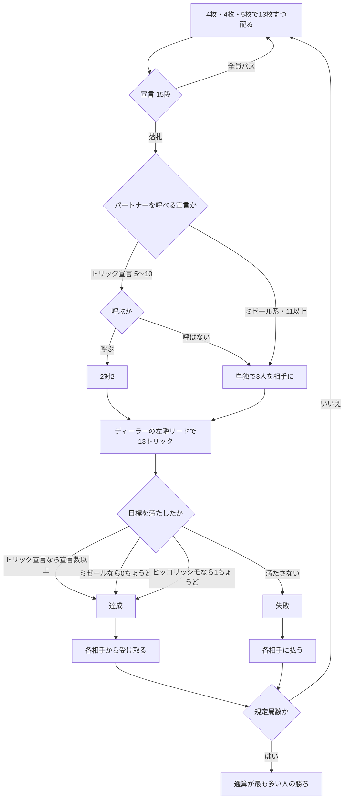

# ボストン (Boston) — CUI マニュアル

## ゲーム概要

18 世紀のホイストから派生したトリックゲーム。52 枚・4 人、各自 13 枚。**15 段の宣言表**があり、トリック数の宣言の**間にミゼールが挟まる**のが最大の特徴です。

出典: [Wikipedia: Boston (card game)](https://en.wikipedia.org/wiki/Boston_(card_game)) ／ [pagat.com: Boston Group](https://www.pagat.com/boston/)

## 起動方法

```sh
go run ./cmd/trumpcards boston
go run ./cmd/trumpcards --lang en boston   # 英語表示
```

## ルール

### 配り方

各自 **13 枚**。ただし一度に配らず、**4 枚・4 枚・5 枚**の 3 回に分けます。

### 宣言表（**ここが最重要**）

**トリック数の宣言の間にミゼールが挟まります。**「トリック宣言をひととおり並べたあとにミゼール」ではありません。

| 段 | 宣言 | 目標 | 切札 | 味方 |
|---|---|---|---|---|
| 1 | 5 トリック | 5 以上 | あり | 呼べる |
| 2 | 6 トリック | 6 以上 | あり | 呼べる |
| 3 | **リトル・ミゼール** | **0** | なし | 単独 |
| 4 | 7 トリック | 7 以上 | あり | 呼べる |
| 5 | **ピッコリッシモ** | **ちょうど 1** | なし | 単独 |
| 6 | 8 トリック | 8 以上 | あり | 呼べる |
| 7 | **グランド・ミゼール** | **0** | なし | 単独 |
| 8 | 9 トリック | 9 以上 | あり | 呼べる |
| 9 | **リトル・ミゼール（公開）** | **0** | なし | 単独 |
| 10 | 10 トリック | 10 以上 | あり | 呼べる |
| 11 | **グランド・ミゼール（公開）** | **0** | なし | 単独 |
| 12 | 11 トリック | 11 以上 | あり | 単独 |
| 13 | 12 トリック | 12 以上 | あり | 単独 |
| 14 | **シュレム**（13 トリック） | 13 | あり | 単独 |
| 15 | **シュレム（公開）** | 13 | あり | 単独 |

**リトル・ミゼールは 7 トリックより下**、**グランド・ミゼールは 9 トリックより下**です。

### ピッコリッシモ

**ちょうど 1 トリックだけ取る**という宣言です。**0 トリックでも失敗**します。ミゼール（0 ちょうど）ともトリック宣言（宣言以上）とも違う第 3 の型です。

### 「公開」の宣言

*on the Table* は「オプションで公開できる」のではなく、**それ自体が 1 つ上の独立した宣言**です。**第 1 トリックのあと**に落札者が手札を全部公開します。

### パートナー

**トリック数の宣言（5〜10）では、落札者はパートナーを 1 人指名できます。**指名すれば **2 対 2**、しなければ **1 対 3** です。ミゼール系・ピッコリッシモ・11 以上は**常に単独**です。

### プレイ

**追随は強制**、切札は強制ではありません。リードは**ディーラーの左隣**（落札者ではありません）。

### 精算

**達成なら各相手から受け取り、失敗なら各相手に払います。**額は宣言の段が高いほど大きくなります。パートナーがいる場合、パートナーは払いも受け取りもしません（相手 2 人とだけやり取りします）。

規定局数を終えた時点で通算が最も多い人の勝ちです。



## コマンド一覧

| コマンド | 説明 |
|---------|------|
| `b <段> [スート]` | 宣言する（**段の番号**で指定。切札ありの宣言のみスート 1〜4） |
| `ps` / `pass` | 宣言を見送る |
| `cp <席>` | パートナーを指名する（`cp -1` で単独） |
| `p <i>` | 手札 `i` を出す |
| `n` / `next` | 次の局へ進む |
| `l` / `log` | 棋譜を表示する |
| `r` | ゲームごとリセットする |
| `q` | 終了する |

**宣言はトリック数ではなく段の番号で指します。**ミゼールが間に挟まるため、トリック数だけでは一意に決まりません。

## 画面の見方

```
局: 1 / 8
契約: 7トリック  切札: ♥
あなた[親]: トリック 2  通算 0  手札: [0]♠1 [1]♠13 ...
CPU 1[宣言]: トリック 3  通算 0  手札: 非公開 10枚
場: ♠1 ♠5
----------
手番: あなた
出せる札: 0 1
p <i> ・・・手札 i を出す（追随は強制です）
```

- **`出せる札`** を必ず確認してください。追随が強制なので出せない札があります
- **`[宣言]`** が落札者、**`[味方]`** が指名されたパートナーです
- 公開宣言では、第 1 トリック後に落札者の手札が全員に見えます

## 遊び方のコツ

- **ミゼールの位置を覚えてください。**「6 トリックは通ったがリトル・ミゼールで被せられた」は起こりますが、「7 トリックにリトル・ミゼールで被せる」はできません
- **ピッコリッシモは 0 でも負けます。**弱すぎる手では成立しないので、確実に 1 つ取れる札が要ります
- **パートナーを呼ぶと配当の相手が 2 人に減ります。**取りやすくなる代わりに実入りも減ります
- **公開宣言は配当が跳ね上がります。**手札が読まれる不利と釣り合うかを見極めます
- **リードはディーラーの左隣です。**落札者が先手ではないので、宣言してもリードは選べません
