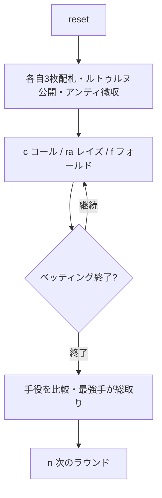

# ブイヨット（CUI版）遊び方

## ゲーム概要

ブイヨット（Bouillotte）は18世紀フランスで大流行した3枚ポーカーのポット・ヴァイイング（vying）ゲームです。各プレイヤーはアンティを支払って3枚の手札を受け取り、テーブル中央に共有カード「ルトゥルヌ（retourne）」が1枚表向きに置かれます。プレイヤーは順番にコール・レイズ（ヴィ）・フォールドを選んで賭け合い、ベッティングが終わると降りていないプレイヤーが手役を比べ、最強手がポットを総取りします。ルトゥルヌを含めて同じランクが3枚そろう「ブルラン（brelan）」が最強手です。

## 起動方法

```sh
go run ./cmd/trumpcards bouillotte
go run ./cmd/trumpcards --lang en bouillotte
```

## ルール

### 基本ルール

1. 全員がアンティを支払い、標準52枚デッキから各自3枚の手札が配られます。中央には共有の「ルトゥルヌ」カードが1枚表向きに置かれます。
2. 自分の3枚とルトゥルヌを見て、コール（現在のベットに合わせる）・レイズ（ヴィ、賭け金を上げる）・フォールド（降りる）を宣言します。CPU は手札の強さで自動判断します。
3. レイズは規定回数まで可能で、上限に達すると以降はコールかフォールドのみになります。
4. ベッティングが終わると、降りていないプレイヤー同士が手役を比較します。
   - **ブルラン**（ルトゥルヌを含めて同ランク3枚）はハイカードに勝ちます。
   - ブルラン同士はランクの高い方が勝ち。
   - ブルランがなければハイカード → キッカーの順で比較（A が最強）。
5. 最強手のプレイヤーがポットを総取りします。全員が降りた場合は最後に残ったプレイヤーがポットを獲得します。

### 停止条件

規定ラウンド数を消化するか、アンティを払えるプレイヤーが2人未満になるとゲーム終了。最終的にチップが最も多いプレイヤーが勝者です。

## ゲームの流れ



## コマンド一覧

| コマンド | 短縮形 | 説明 |
|----------|--------|------|
| `call` | `c` | コール（現在のベットに合わせる） |
| `raise` | `ra` / `v` | レイズ（ヴィ、賭け金を上げる） |
| `fold` | `f` | フォールド（降りる） |
| `nextround` | `n` / `nr` | 次のラウンドへ |
| `setplayers <n>` | `sp <n>` | プレイヤー数を設定（3-4） |
| `setante <n>` | `sa <n>` | アンティ額を設定 |
| `setchips <n>` | `sc <n>` | 初期チップを設定 |
| `setrounds <n>` | `st <n>` | 実施ラウンド数を設定 |
| `hint` | `h` | ヒントを表示 |
| `log` | `l` | 棋譜を表示 |
| `reset` | `r` | ゲームをリセット（設定は保持） |
| `quit` | `q` | ゲーム終了 |
| `help` | `?` | コマンド一覧を表示 |

## 画面の見方

```
----------
ラウンド: 1  ポット: 40  アンティ: 10  ベット: 10
ルトゥルヌ: CK
You  チップ 190  賭け 10  [参加中]
  S1, HK, C4
CPU 1  チップ 190  賭け 10  [勝者]
  DK, CK, HK  (ブルラン)
----------
```

- 1行目 — ラウンド番号・現在のポット・アンティ額・現在のベット
- 2行目 — 共有カード「ルトゥルヌ」
- 各プレイヤー行 — 名前・チップ・このラウンドの賭け累計・状態（参加中／降りた／脱落／勝者）
- カード行 — 手札（結果フェーズでは降りていないプレイヤーの手札と役名を公開）

## 遊び方のコツ

- ルトゥルヌと自分の手でブルランが完成する見込みがあれば、積極的にレイズ（ヴィ）で攻めましょう。
- ハイカードしかないときは、参加人数やベットの大きさを見てコールかフォールドを慎重に選びます。
- ポットが大きく膨らんでいるときのコールはリスクが高くなります。手役の強さと相談して宣言しましょう。
