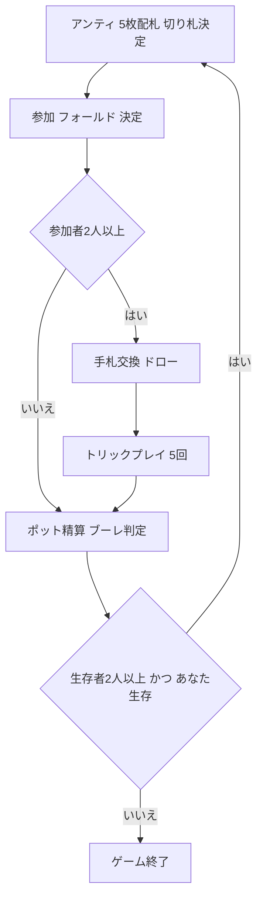

# ブーレ（CUI版）遊び方

## ゲーム概要

ブーレ (Bourré / Booray) は、アメリカ南部 (ルイジアナ州など) で古くから親しまれている、トリックテイキングとポーカーのベッティング (チップの賭け) を融合させたゲームです。各ラウンドでアンティを支払い、配られた5枚を見て参加かフォールドかを選び、参加者はカードを交換してから5回のトリックテイキングを行います。参加したのに1トリックも取れないと「ブーレ」となり、ポットと同額を支払います。

## 起動方法

```sh
go run ./cmd/trumpcards bourre
# 英語表示
go run ./cmd/trumpcards --lang en bourre
```

## ルール

- 5人 (あなた + CPU 4人)、各自100チップを持って開始。標準52枚を使用します。
- 各ハンドの流れ:
  1. 全員がアンティ (5チップ) をポットに入れ、5枚ずつ配ります。ディーラーの最後の1枚を表向きにして切り札スートを決定します。
  2. 各プレイヤーは参加するかフォールドするかを決めます。
  3. 参加者は不要なカードを捨てて山札から同数をドローできます。
  4. マストフォロー・マストトランプ (リードスートが無ければ切り札)・マストウィン (勝てるなら勝つ) のトリックを5回行います。
  5. 最多トリックのプレイヤーがポットを総取り。参加して0トリックは「ブーレ」となりポットと同額を次ポットへ。最多が同数ならポットは次ハンドへ繰り越し。
- チップが尽きると脱落。生存者が1人になるか、あなたが破産するとゲーム終了。最多チップのプレイヤーが勝者です。

## ゲームの流れ



## コマンド一覧

| コマンド | 説明 |
|----------|------|
| `d [0-1]` | 参加可否を決定 (1=参加, 0=フォールド) |
| `dr [idx...]` | 不要なカードを捨ててドロー (空 = 交換なし) |
| `p [idx]` | 指定インデックスのカードをプレイ |
| `n` | 次のハンドへ進む |
| `sd [0-2]` | CPU難易度設定 (0=通常, 1=簡単, 2=難しい) |
| `r` | 新しいゲーム |
| `log` / `l` | 棋譜を表示 |
| `q` | 終了 |

## 画面の見方

- 先頭行にフェーズ・切り札スート・ポット額 (+繰越) が表示されます。
- 各プレイヤー行にチップ残高・状態 (脱落 / フォールド / 獲得トリック数) と、ディーラーには `(D)` が表示されます。
- あなたの手札はインデックス付きで表示され、`p` / `dr` コマンドの番号に対応します。
- プレイフェーズでは現在のトリック (各プレイヤーが出したカード) が表示されます。

## 遊び方のコツ

- 切り札の高札やエースが乏しい弱い手はフォールドが無難です。
- ポットが大きいほどブーレのリスクも大きくなります。確実に1トリック取れる見込みを基準に参加を判断しましょう。
- 切り札のエース・キングは確実なトリック源。リードでは高札でトリックを取りにいきましょう。
- マストウィンにより勝てる札があれば出さねばなりません。残り札を読んで立ち回りましょう。
