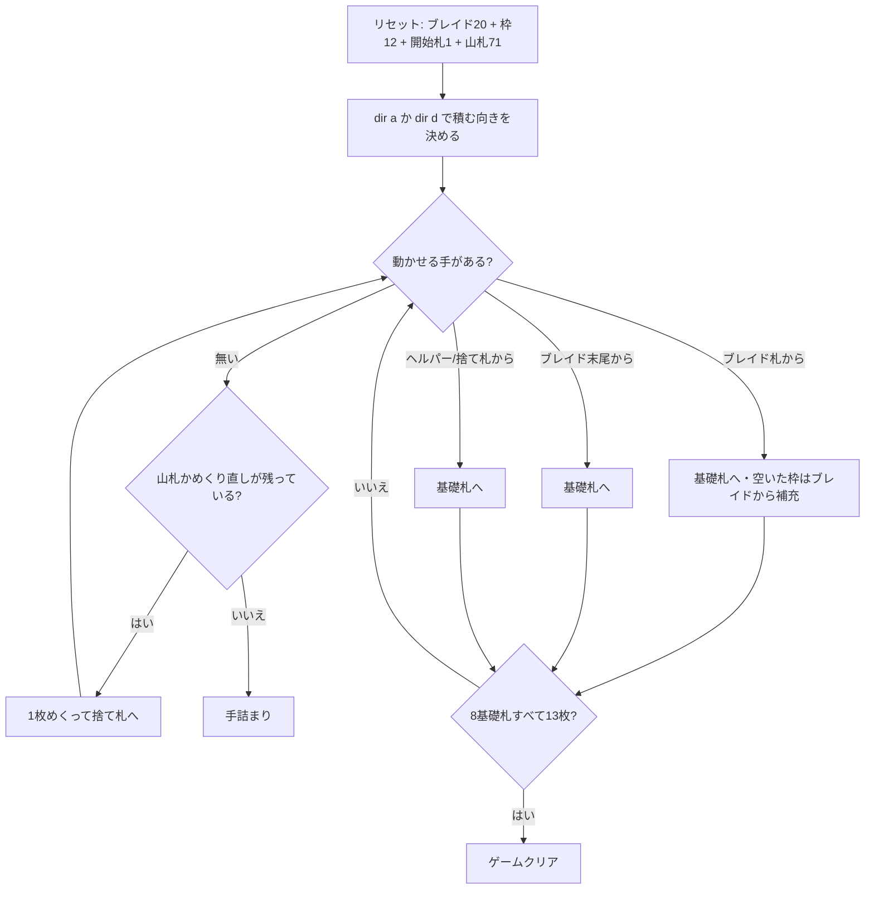

# ブレイド (Braid) — CUI マニュアル

## ゲーム概要

52 枚 2 組（104 枚）で遊ぶソリティア。**20 枚を三つ編み（ブレイド）状に重ねたリザーブ**を中央に置き、その周りに **4 つのブレイド札**と **8 つのヘルパー枠**を 1 枚ずつ並べる。さらに開始札 1 枚を基礎札に置き、残り 71 枚が山札になる。

このゲームの特徴は 3 つ:

1. **札の行き先は基礎札しかない。** 枠同士の移動も、ブレイド→ヘルパーも存在しない
2. **補充の規則が枠ごとに違う。** ブレイド札が空くと**ブレイドの末尾**から埋まり、ヘルパーは**捨て札からしか**埋められない
3. **積む向きを最初に一度だけ選ぶ。** 昇順か降順かを決めたら、8 つの基礎札すべてがその向きで揃う

## 起動方法

```sh
go run ./cmd/trumpcards braid
go run ./cmd/trumpcards --lang en braid   # 英語
```

## ルール

- 52 枚 2 組（104 枚）。ブレイド 20 枚、ブレイド札 4 枠、ヘルパー 8 枠、開始札 1 枚、残り 71 枚が山札
- **開始ランク**: 配り切った時点で置かれる開始札のランク。8 つすべての基礎札がこのランクから始まる
- **向き**: `dir a`（昇順）か `dir d`（降順）で**最初に一度だけ**決める。決めるまで基礎札には触れない
- **基礎札**: 8 つ。**同スート**で、選んだ向きに 1 つずつ 13 枚。K の次は A、A の次は K に折り返す。8×13 = 104 枚でクリア
- **ブレイド**: **末尾の 1 枚だけ**が使え、行き先は基礎札のみ
- **ブレイド札（4 枠）**: 基礎札へ出すと、空いた枠が**ブレイドの末尾から自動的に**埋まる。**ブレイドを掘れる唯一の経路**
- **ヘルパー（8 枠）**: 基礎札へ出せる。空いた枠は**捨て札からしか**埋められない（`m w hp <idx>`）。ブレイドからは埋まらない
- 山札は 1 枚ずつ捨て札へ。空になったら捨て札を戻して**めくり直せるが 2 回まで**（通算 3 巡）

> 補足: issue #4382 の仕様案とは 5 点異なるが、いずれも PySol と bvssolitaire の規則に合わせた。
> (1) 向きは「昇順・降順どちらの方向にも進められる」のではなく、**開始時に一方を選び、以後は全基礎札がその向き**。山ごとに向きが変わったり途中で反転したりはしない。
> (2) 枠は「供給札 8 枚」ではなく **ヘルパー 8 + ブレイド札 4 の計 12**。issue が落としている**ブレイド札こそがブレイドを消化する唯一の経路**で、これが無いとブレイドは末尾 1 枚しか動かせない。
> (3) **めくり直しが 2 回ある**（issue は触れていない）。
> (4) **カードは基礎札にしか動かせない**（issue は触れていないため、枠同士の移動を許すように読めてしまう）。
> (5) 基礎札は**同スート**で積む（issue は触れていない）。

## ゲームの流れ



## コマンド一覧

| コマンド | 説明 |
|---------|------|
| `d`, `draw` | 山札を 1 枚めくって捨て札へ送る（空ならめくり直す・2 回まで） |
| `dir a`, `dir d` | 基礎札を積む向きを決める（昇順 / 降順・最初に 1 度だけ） |
| `m br f` | ブレイドの末尾を基礎札へ |
| `m fd <idx> f` | ブレイド札を基礎札へ（空いた枠はブレイドから補充される） |
| `m hp <idx> f` | ヘルパーを基礎札へ |
| `m w f` | 捨て札を基礎札へ |
| `m w hp <idx>` | 捨て札を空のヘルパー枠へ退避する |
| `h`, `hint` | ヒントを表示する |
| `ac`, `autocomplete` | 基礎札へ送れる札がなくなるまで自動で送る |
| `u`, `undo` | 1 手戻す |
| `g`, `giveup` | ギブアップ |
| `l` | 棋譜（アクションログ）を表示する |
| `r`, `reset` | 最初からやり直す |
| `q`, `quit` | 終了する |

## 画面の見方

```
開始ランク: 5 (昇順)
基礎札: SPADE 5 | HEART 6 | [空] | [空] | [空] | [空] | [空] | [空]
ブレイド: CLOVER 3 (残り18枚・末尾のみ)
ブレイド札0:SPADE 2 ブレイド札1:HEART 7 ブレイド札2:[空] ブレイド札3:DIAMOND 10
ヘルパー0:CLOVER 4 ヘルパー1:[空] ... ヘルパー7:[空]
山札: 65枚 (めくり直し残り2回) 捨て札: HEART 9 (4枚)
----------
手数: 12
```

- 向きが未選択のうちは 1 行目が黄色の案内文に変わる
- ブレイドの行には残り枚数と「末尾のみ」が併記される
- 枠の `[空]` は詰められず番号が保たれる。ヒントの枠番号はこの表示と一致する

## 遊び方のコツ

- **ブレイドを削れるのはブレイド札の 4 枠だけ。** その 4 枠が基礎札に出せない札で埋まると、ブレイドは末尾 1 枚しか動かせなくなる。枠を回すことを最優先に考える
- **ヘルパーは捨て札からしか埋まらないので、埋めたら戻ってこない。** 基礎札に出せない札の置き場だが、8 枠は思ったより早く尽きる
- **向きの選択がゲーム全体を決める。** 決める前に何枚かめくって、ブレイドの上の方に開始ランクの前後どちらが多いかを見ておく
- 山札は 3 巡できるので、序盤は無理に枠を埋めず、めくって様子を見る手も有効
- 詰まったら `undo` で分岐をやり直す
